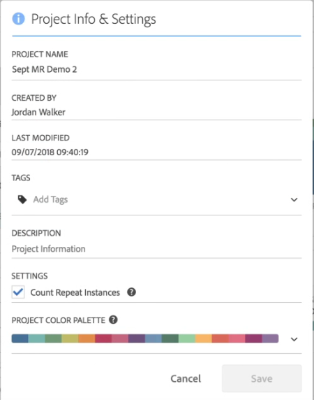

# Paleta de cores de visualização

>[!NOTE]
>
>Você está visualizando a documentação do Analysis Workspace no Customer Journey Analytics. Seu conjunto de recursos é ligeiramente diferente do [Analysis Workspace no Adobe Analytics](https://docs.adobe.com/content/help/pt-BR/analytics/analyze/analysis-workspace/home.html)tradicional. [Saiba mais...](/help/getting-started/cja-aa.md)

É possível alterar a paleta de cores da visualização usada no Workspace ao selecionar outra paleta de cores ou ao especificar sua própria paleta que poderia corresponder às cores da marca da sua empresa. Esse recurso afeta a maioria das visualizações no Workspace, mas **não** afeta o Resumo de alterações, a formatação condicional nas tabelas de Forma livre, nem a visualização de Mapa.

>[!NOTE]
>
>O suporte para a paleta de cores não está habilitado para o Internet Explorer 11.

Lembre-se:

* Há cinco paletas de cores predefinidas para sua escolha. A paleta padrão e a paleta abaixo foram otimizadas para obter o melhor contraste e são mais acessíveis para daltônicos.
* A terceira, a quarta e a quinta das paletas de cores abaixo, contando a partir das duas primeiras, foram otimizadas em termos de harmonia de cores.

## Para alterar a paleta de cores:

1. Navegue até **[!UICONTROL Workspace]** > **[!UICONTROL Projeto]** > **[!UICONTROL Informações e configurações do projeto]**.
1. No menu suspenso **[!UICONTROL Paleta de cores do projeto]** você pode escolher um dos cinco esquemas de cores predefinidos.

   

1. Para especificar sua própria paleta, selecione **[!UICONTROL Paleta personalizada]** abaixo das opções predefinidas.
1. Especifique até 16 valores hexadecimais separados por vírgula (por exemplo, #00a4e4) para as cores que pretende usar. Caso deseje usar somente quatro valores, por exemplo, essas cores serão repetidas automaticamente nas visualizações que apresentarem mais cores.

