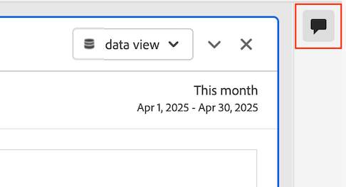

# Adicionar e gerenciar comentários em projetos {#comment-on-projects}

Os comentários no Analysis Workspace permitem compartilhar insights e fazer perguntas no contexto de um projeto do Analysis Workspace. Isso pode simplificar as discussões sobre os dados, mantendo conversas no contexto dos dados que estão sendo discutidos.

>[!NOTE]
>
>A capacidade de adicionar e gerenciar comentários em um projeto pode ser desativada no nível do projeto ou no nível da organização. Se não for possível adicionar ou gerenciar comentários conforme descrito nesta seção, o administrador do Customer Journey Analytics ou o proprietário do projeto desativou essa capacidade.
>
>* **Projeto:** o proprietário do projeto pode desabilitar esta funcionalidade para o projeto, conforme descrito em [Criar projetos](/help/analysis-workspace/build-workspace-project/create-projects.md).
>* **Organização:** o administrador do Customer Journey Analytics pode desabilitar esta funcionalidade para a organização, conforme descrito em [Preferências](/help/analysis-workspace/user-preferences.md).

## Exibir comentários

### Exibir comentários na área de comentários

Todos os comentários feitos em um projeto do Analysis Workspace ficam visíveis na área de comentários no painel direito.

1. Com o projeto aberto no Analysis Workspace, selecione o ícone da área de comentários no painel direito do Analysis Workspace.

   

   Cada comentário mostra um carimbo de data e hora do dia em que o comentário foi postado. Se o comentário foi postado no dia atual, a hora do dia será mostrada. Passe o mouse sobre o dia ou a hora para mostrar a data e a hora completas em que o comentário foi postado.

1. (Opcional) Para pesquisar a área de comentários, selecione o ícone de pesquisa  e digite uma palavra ou frase. A área de comentários é filtrada para conter apenas os comentários que incluem essa palavra ou frase.

### Exibir selos de comentário em um projeto

Os comentários feitos [em uma área específica do projeto](#comment-on-a-specific-area-of-the-project) têm uma **notificação de comentário**  que é exibida na área do projeto à qual o comentário pertence. Selecione uma medalha para exibir o comentário. Depois de selecionar o símbolo, você pode selecionar o próprio comentário para realçá-lo na área de comentários no painel direito.

Os números são exibidos em cada selo em um projeto e são ordenados na ordem em que foram criados. Se vários comentários forem colocados na mesma área de um projeto, o símbolo mostrará 3 pontos . Selecione o selo de 3 pontos para revelar todos os comentários nessa área.

<!-- Insert screeshot-->

Para ocultar todos os selos de comentário de um projeto:

1. Com o projeto aberto no Analysis Workspace, selecione o ícone da área de comentários  no painel direito do Analysis Workspace.

1. Na parte inferior da área de comentários, habilite a opção **[!UICONTROL Ocultar medalhas colocadas]**.

## Adicionar comentários

Você pode adicionar um comentário que faça referência a uma área específica do projeto ou pode adicionar um comentário geral.

### Comentário em uma área específica do projeto

Para comentar em uma área específica do projeto (como um valor de métrica em uma tabela de forma livre):

1. Com o projeto aberto no Analysis Workspace, clique com o botão direito do mouse na área do projeto em que deseja inserir o comentário.

   <!--add screenshot-->

1. Selecione **[!UICONTROL Adicionar comentário]**.

1. No campo **[!UICONTROL Novo comentário]**, especifique seu comentário.

   Os comentários podem ter até 15.000 caracteres e podem incluir marcação básica, hiperlinks, listas com marcadores e numeradas e emojis.

1. (Opcional) Notifique outra pessoa sobre seu comentário digitando o símbolo @ seguido pelo nome. Para obter mais informações sobre como usar o símbolo @ para notificar outros, consulte [Incluir outros em um comentário](#include-others-in-a-comment).

1. Selecione **[!UICONTROL Enviar]**.

   Um **selo de comentário**  é colocado na área do projeto do Workspace em que você adicionou o comentário, conforme descrito em [Exibir selos de comentário em um projeto](#view-comment-badges-in-a-project). O comentário também aparece na parte superior da área de comentários no painel direito.

### Adicionar um comentário geral sobre o projeto

Para adicionar comentários a um projeto no Analysis Workspace:

1. Com o projeto aberto no Analysis Workspace, selecione o ícone da área de comentários  no painel direito do Analysis Workspace. <!-- add screen shot -->

1. No campo **[!UICONTROL Novo comentário]**, especifique seu comentário.

   Os comentários podem ter até 15.000 caracteres e podem incluir marcação básica, hiperlinks, listas com marcadores e numeradas e emojis.

1. (Opcional) Notifique outra pessoa sobre seu comentário digitando o símbolo @ seguido pelo nome. Para obter mais informações sobre como usar o símbolo @ para notificar outros, consulte [Incluir outros em um comentário](#include-others-in-a-comment).

1. Selecione **[!UICONTROL Enviar]**.

   O comentário aparece na parte superior da área de comentários, conforme descrito em [Exibir comentários na área de comentários](#view-comments-in-the-comments-area).

## Incluir outros em um comentário

O recurso de comentário no Analysis Workspace facilita a colaboração com outras pessoas. Para incluir outra pessoa em seu comentário:

1. Digite o símbolo @ e comece a digitar o nome, sobrenome ou endereço de email da pessoa que deseja incluir.

1. Selecione o nome da pessoa quando ele for exibido no menu suspenso.

Considere o seguinte ao usar o símbolo @ para incluir pessoas em um comentário:

* As pessoas incluídas receberão uma notificação por email e uma notificação por Pulse.

* Você pode incluir qualquer pessoa em sua organização em um comentário, mas isso não concede a ela automaticamente acesso ao projeto. Somente as pessoas que já têm acesso ao projeto podem acessá-lo.

## Responder a um comentário

1. Com o projeto aberto no Analysis Workspace, selecione o ícone da área de comentários  no painel direito do Analysis Workspace.

1. Selecione **[!UICONTROL Responder]** ao lado do comentário ao qual deseja responder.

   Ou

   Se desejar que sua resposta inclua o texto do comentário ao qual você está respondendo, com o texto original envolvido em uma tag de citação, selecione o ícone de três pontos ao lado do comentário ou resposta específica à qual você deseja responder e selecione **[!UICONTROL Citar resposta]**. Uma resposta de citação é uma boa maneira de indicar claramente o comentário ou a resposta à qual ele se refere.

1. No campo **[!UICONTROL Novo comentário]**, especifique seu comentário.

   Os comentários podem ter até 15.000 caracteres e podem incluir marcação básica, hiperlinks, listas com marcadores e numeradas e emojis.

1. (Opcional) Notifique outra pessoa sobre seu comentário digitando o símbolo @ seguido pelo nome. Para obter mais informações sobre como usar o símbolo @ para notificar outros, consulte [Incluir outros em um comentário](#include-others-in-a-comment).

1. Selecione **[!UICONTROL Enviar]**.

## Copiar o link para um comentário

Você pode copiar o link para um comentário e compartilhá-lo com outras pessoas. Somente as pessoas que já têm acesso ao projeto podem acessá-lo com o link.

Para copiar o link para um comentário:

1. Com o projeto aberto no Analysis Workspace, selecione o ícone da área de comentários  no painel direito do Analysis Workspace.

1. Selecione o ícone de mais  ao lado do comentário cujo link você deseja copiar e selecione **[!UICONTROL Copiar link]**.

   O link é copiado para a área de transferência do sistema. Você pode colar o link em um email ou outro tipo de mensagem.

## Copiar o texto de um comentário

Você pode copiar o corpo de texto de um comentário e compartilhá-lo com outras pessoas.

Para copiar o corpo de texto de um comentário:

1. Com o projeto aberto no Analysis Workspace, selecione o ícone da área de comentários  no painel direito do Analysis Workspace.

1. Selecione o ícone de mais  ao lado do comentário que contém o texto que você deseja copiar e selecione **[!UICONTROL Copiar texto do corpo]**.

   O corpo de texto do comentário é copiado para a área de transferência do sistema.

## Curtir um comentário

1. Com o projeto aberto no Analysis Workspace, selecione o ícone da área de comentários  no painel direito do Analysis Workspace.

1. Selecione **[!UICONTROL Curtir]** abaixo do comentário que você deseja endossar.

## Excluir um comentário

Quando você exclui um comentário, o comentário original e quaisquer respostas ou anexos também são excluídos.

Comentários excluídos não podem ser recuperados.

Para excluir um comentário:

1. Com o projeto aberto no Analysis Workspace, selecione o ícone da área de comentários  no painel direito do Analysis Workspace.

1. Selecione o ícone de mais  ao lado do comentário que você deseja excluir e selecione **[!UICONTROL Excluir]**.

1. Selecione **[!UICONTROL Excluir]** novamente para confirmar a exclusão.

## Resolver um comentário

Ao resolver um comentário, ele é marcado como resolvido e oculto na área de comentários. Se o comentário tiver uma medalha associada a ele, a medalha será removida do projeto.

Para resolver um comentário:

1. Com o projeto aberto no Analysis Workspace, selecione o ícone da área de comentários  no painel direito do Analysis Workspace.

1. Selecione o ícone de mais  ao lado do comentário que você deseja resolver e selecione **[!UICONTROL Resolver]**.

1. Selecione **[!UICONTROL Resolver]** novamente para confirmar.

Por padrão, os comentários resolvidos ficam ocultos na área de comentários. Para mostrar comentários resolvidos:

1. Selecione o ícone de filtro na área de comentários e desmarque a opção **[!UICONTROL Ocultar comentários resolvidos]**.

## Inserir um selo para um comentário existente

Se um comentário estiver disponível na área comentários no painel direito, mas ainda não tiver uma medalha no projeto, você poderá adicionar a medalha.

1. Com o projeto aberto no Analysis Workspace, selecione o ícone da área de comentários  no painel direito do Analysis Workspace.

1. Selecione o ícone de mais  ao lado do comentário para o qual você deseja colocar uma medalha e selecione **[!UICONTROL Colocar medalha]**.

1. Selecione a área do projeto na qual você deseja colocar o selo do comentário existente.

   Uma **medalha de comentário**  é colocada na área do projeto Workspace selecionado. O comentário também aparece na parte superior da área de comentários no painel direito.

   Consulte [Exibir selos de comentário em um projeto](#view-comment-badges-in-a-project) para obter mais informações.

Para remover um selo:

1. Selecione o selo que deseja remover e selecione **[!UICONTROL Remover selo]**.

   O selo é removido, mas o comentário ainda está disponível na área de comentários no painel direito.

## Mover uma medalha para um comentário existente

Você pode mover um selo de comentário que já esteja posicionado para um comentário existente.

1. Com o projeto aberto no Analysis Workspace, localize o selo do comentário que você deseja mover.

1. Clique com o botão direito do mouse no selo e selecione **[!UICONTROL Mover posicionamento]**.

1. Selecione a área do projeto na qual você deseja colocar o selo.

<!-- add section about adding images to comments. will be available at GA. Include that "you can have a maximum of 5 images per comment, and each image can be up to 2 MB." -->

