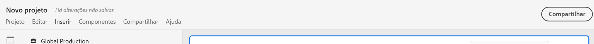
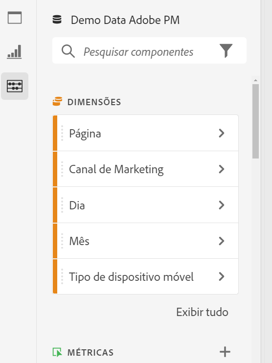
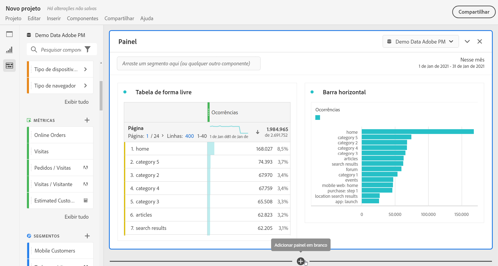
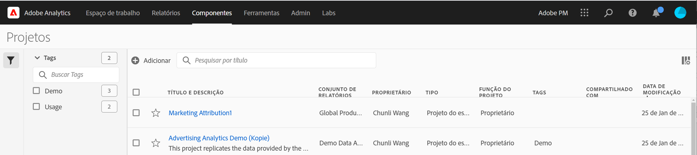

# Visão geral dos projetos

Os projetos do Workspace permitem combinar painéis, visualizações e componentes para criar e compartilhar a sua análise com qualquer pessoa da sua organização. Antes de iniciar o seu primeiro projeto, saiba como acessar, navegar e gerenciar os projetos.

Para acessar projetos no Customer Journey Analytics, selecione **[!UICONTROL Workspace]**.  O gerenciador de **[!UICONTROL Projetos]** lista todos os projetos que você possui ou que foram compartilhados com você. O gerenciador de projetos com a lista de projetos também é a página de destino padrão do Customer Journey Analytics, a menos que você tenha configurado outra em “Preferências”.

## Área de título

Na área de título ➊, você pode criar um projeto, criar uma pasta, editar as suas preferências e mostrar ou ocultar um painel com blocos adicionais.

* Para mostrar ou ocultar um painel esquerdo que permita selecionar entre **[!UICONTROL Projetos]** e **[!UICONTROL Aprendizagem]**, selecione .
* O título mostra os projetos, opcionalmente adicionados com um caminho para a pasta selecionada. Por exemplo, [!UICONTROL Projetos] > **[!UICONTROL Pasta da empresa]**. Você pode selecionar partes individuais da subpasta para ir diretamente à pasta específica.
* Para mostrar blocos de um [**[!UICONTROL Projeto em branco]**](create-projects.md), [**[!UICONTROL Cartão de pontuação móvel em branco]**](/help/mobile-app/create-scorecard.md), [**[!UICONTROL Análise guiada]**](/help/guided-analysis/overview.md), **[!UICONTROL Abrir a documentação]** e **[!UICONTROL Abrir as notas de versão]**, selecione  **[!UICONTROL Mostrar mais]**. Para ocultar a área com blocos, selecione  **[!UICONTROL Mostrar menos]**.
* Com base no que você escolher mostrar, usando o [Seletor de exibição](#show-selector), é possível editar preferências e realizar ações na pasta atual visível em **[!UICONTROL Projetos]**:

  | Ação | Descrição |
  |---|---|
  | **[!UICONTROL Criar projeto]** | Selecione para [criar um novo projeto](create-projects.md). |
  | **[!UICONTROL Criar pasta]** | Selecione para [criar uma nova pasta](workspace-folders/create-folders.md). |
  |  **[!UICONTROL Editar preferências]** | [Editar preferências](/help/analysis-workspace/user-preferences.md) de todos os seus projetos. Quando a navegação estrutural resulta em um espaço limitado, esta ação faz parte do submenu . |
  | **[!UICONTROL Adicionar projetos]** | Selecione para [adicionar projetos](workspace-folders/add-projects.md) à pasta atual. Quando a navegação estrutural resulta em um espaço limitado, esta ação faz parte do submenu . |
  | **[!UICONTROL Renomear pasta]** | [Renomeia](workspace-folders/manage-folders.md#rename-folders) a pasta atual. |
  | **[!UICONTROL Mover pasta]** | [Move](workspace-folders/manage-folders.md#move-folders) a pasta atual. |
  | **[!UICONTROL Excluir pasta]** | [Exclui](workspace-folders/manage-folders.md#delete-folders) a pasta atual. |

## Lista de projetos

A lista de projetos ➋ exibe todos os projetos que você possui e que foram compartilhados com você. A lista tem as seguintes colunas:

| Coluna | Descrição |
| --- | --- | 
|  | Quando um ou mais projetos são selecionados, uma barra de ação azul aparece na parte inferior da interface “Projeto”. Consulte [Ações](#actions) para mais detalhes. |
|  | Selecione  para adicionar ou  para remover um projeto dos favoritos. |
| **[!UICONTROL Título e descrição]** | Para editar o projeto, selecione o link do título, que abrirá o [projeto do Workspace](/help/analysis-workspace/home.md). Projetos compartilhados com você são indicados com . Selecione  para exibir um menu pop-up com mais detalhes sobre o projeto. Selecione  para abrir um menu de contexto com ações. Consulte [Ações](#actions) para mais detalhes. |
| **[!UICONTROL Tipo]** | Um projeto do Workspace, uma pasta  ou um [cartão de pontuação móvel](/help/mobile-app/home.md). |
| **[!UICONTROL Tags]** | As tags aplicadas ao projeto.  |
| **[!UICONTROL Programado]** | Se um projeto está agendado para ser enviado por email aos destinatários. As opções são  **[!UICONTROL Ativado]** ou  **[!UICONTROL Desativado]**. Consulte [Enviar dados do projeto a outras pessoas](/help/analysis-workspace/export/t-schedule-report.md). |
| **[!UICONTROL Link compartilhado (qualquer pessoa)]** | Se um projeto é compartilhado com alguém, mesmo com pessoas que não tenham acesso ao Analysis Workspace. As opções são  **[!UICONTROL Ativo]** ou  **[!UICONTROL Inativo]**. Consulte [Compartilhar um projeto com qualquer pessoa (sem necessidade de logon)](/help/analysis-workspace/curate-share/share-projects.md#share-a-project-with-anyone-no-login-required) em [Compartilhar projetos](/help/analysis-workspace/curate-share/share-projects.md) para mais informações. |
| **[!UICONTROL Função do projeto]** | A sua função no projeto. As opções são: editar, duplicar e exibir. Consulte [Funções do projeto](/help/analysis-workspace/curate-share/curate.md) para mais informações. |
| **[!UICONTROL Visualização de dados]** | A visualização de dados à qual o projeto está associado. |
| **[!UICONTROL Proprietário]** | A pessoa que criou o projeto (você ou alguém que compartilhou o projeto com você.) |
| **[!UICONTROL Compartilhado com]** | Usuários com os quais o projeto foi compartilhado. |
| **[!UICONTROL Última modificação]** | Data e hora em que o projeto foi modificado pela última vez. |
| **[!UICONTROL Aberto pela última vez]** | Data e hora da última vez que o projeto foi aberto. |
| **[!UICONTROL ID do projeto]** | O ID do projeto. |
| **[!UICONTROL Intervalo de datas mais longo]** | O intervalo de datas mais longo de qualquer um dos painéis ou visualizações do projeto. |
| **[!UICONTROL Número de consultas]** | A quantidade total de consultas contidas no projeto. |
| **[!UICONTROL Localização]** | A pasta na qual o projeto reside. |

Passe o mouse sobre qualquer cabeçalho de coluna para exibir  e selecione no menu de contexto:

* **[!UICONTROL Classificação crescente]**
* **[!UICONTROL Classificação decrescente]**
* **[!UICONTROL Redimensionar coluna]**. Uma linha azul aparece para ajudar a redimensionar a coluna.

### Ações

É possível realizar ações em um ou mais projetos por meio do menu de contexto  ou da barra de ação azul.

| Ícone | Ação | Descrição |
|:---:| ---|---|
|  | **[!UICONTROL *x *selecionado(s)]** | Desmarque os projetos e pastas selecionados, e remova a barra de ação azul. |
|  | **[!UICONTROL Excluir]** | Exclua um ou mais projetos ou pastas. Uma confirmação será solicitada.
Projetos que você exclui:
<ul><li>Não pode ser recuperado</li><li>São removidos da lista de projetos</li><li>Não pode mais ser acessado com o URL</li><li>Não estão mais incluídos em entregas agendadas (nos casos em que foram configurados anteriormente para entregas agendadas) Para obter informações sobre entregas agendadas, consulte [Projetos agendados](/help/components/scheduled-projects-manager.md).  
 |
|  | **[!UICONTROL Compartilhar]** | Compartilhar um projeto. Consulte [Compartilhar um projeto](/help/analysis-workspace/curate-share/share-projects.md) para mais informações. |
|  | **[!UICONTROL Renomear]** | Renomear um projeto. Abre uma caixa de diálogo **[!UICONTROL Renomear: *nome do projeto *]**. Digite o novo nome e selecione&#x200B;**[!UICONTROL Salvar &#x200B;]**. |
|  | **[!UICONTROL Copiar]** | Copiar um ou mais projetos. O projeto tem os mesmos nome e sufixo `(Copy)`. |
|  | **[!UICONTROL Fixar]** ou **[!UICONTROL Desafixar]** | Fixar ou desafixar um ou mais projetos ou pastas. Os projetos e pastas fixados aparecem na parte superior da lista, e ignoram a ordem de classificação especificada. |
|  | **[!UICONTROL Mover para cima]** | Mover um projeto ou uma pasta fixada para cima na lista de projetos. |
|  | **[!UICONTROL Mover para baixo]** | Mover um projeto ou uma pasta fixada para baixo na lista de projetos. |
|  | **[!UICONTROL Tag]** | Marcar um ou mais projetos ou pastas com tags. A caixa de diálogo **[!UICONTROL Componentes das tags]** aparece para seleção de uma ou mais tags. Clique em **[!UICONTROL Salvar]** para salvar as tags dos projetos ou pastas selecionadas. |
|  | **[!UICONTROL Aprovar]** ou **[!UICONTROL Desaprovar]** | Aprovar ou desaprovar um projeto. Somente administradores podem aprovar projetos. |
|  | **[!UICONTROL Exportar CSV]** | Exportar os projetos selecionados como um arquivo CSV com o nome `Project List.csv`. |
|  | **[!UICONTROL Adicionar projetos]** | Adicionar um ou mais projetos a uma pasta selecionada. Em **[!UICONTROL Adicionar projetos]**, é possível selecionar um ou mais projetos. Clique em **[!UICONTROL Adicionar]** para adicionar os projetos à pasta. Consulte [Adicionar projetos a pastas](workspace-folders/add-projects.md#from-inside-a-folder) para mais informações. |
|  | **[!UICONTROL Mover para]** | Mover um ou mais projetos selecionados para uma pasta. Em **[!UICONTROL Selecionar pasta]**, selecione a pasta para a qual deseja mover o projeto selecionado e clique em **[!UICONTROL Mover]**. Consulte [Adicionar projetos a pastas](workspace-folders/add-projects.md#from-the-project-list) para mais informações. |

## Seletor de exibição

É possível alternar a aparência da interface de projetos por meio dos seletores **[!UICONTROL Mostrar]** ➌. O seletor **[!UICONTROL Mostrar]** define quais opções estão disponíveis na [Área de título](#title-area) e quais colunas são exibidas na [Lista de projetos](#project-list).

* Para alterar as opções disponíveis para a [Área de título](#title-area), selecione **[!UICONTROL Mostrar]** **[!UICONTROL Todos os projetos]** ou **[!UICONTROL Mostrar]** **[!UICONTROL Pastas e projetos]**.

* Para definir quais colunas você quer exibir para a [Lista de projetos](#project-list), selecione  e, na caixa de diálogo **[!UICONTROL Personalizar tabela]**, marque ou desmarque colunas. Selecione **[!UICONTROL Aplicar]** para aplicar a personalização. Consulte [Lista de projetos](#project-list) para mais detalhes sobre as colunas.

## Painel de filtro

É possível filtrar os projetos e pastas da [Lista de projetos](#project-list) por meio do painel de filtros ➍. Para mostrar ou ocultar o painel de filtro, use .

O painel de filtro consiste nas seções a seguir.

### Tags

| Tags | Descrição |
|---|---|
| {width="300"} | A seção **[!UICONTROL Tags]** permite filtrar por tags. <ul><li>Utilize  *Pesquisar tags* para procurar as tags que deseja usar para filtrar.</li><li>É possível selecionar mais de uma tag. As tags disponíveis dependem das seleções feitas em outras seções no painel de filtro.</li><li>Os números indicam:<ul><li>**2︎⃣**: a quantidade de tags disponíveis para os projetos resultantes do filtro atual.</li><li>7︎⃣: a quantidade de projetos associados à tag específica.</li></ul></li></ul> |

### Visualização de dados

| Visualização de dados | Descrição |
|---|---|
| {width="300"} | A seção **[!UICONTROL Visualização de dados]** permite filtrar por visualizações de dados. <ul><li>Use  *Pesquisar visualizações de dados* para procurar as visualizações de dados que você deseja usar para filtrar.</li><li>É possível selecionar mais de uma visualização de dados. As visualizações de dados disponíveis dependem das seleções feitas em outras seções no painel de filtro.</li><li>Os números indicam:<ul><li>**3︎⃣**: a quantidade de visualizações de dados disponíveis para os projetos resultantes do filtro atual.</li><li>4︎⃣: a quantidade de projetos associados à visualização de dados específica.</li></ul></li></ul> |

### Proprietários

| Proprietário | Descrição |
|---|---|
| {width="300"} | A seção **[!UICONTROL Proprietário]** permite filtrar por proprietários. <ul><li>Use  *Pesquisar proprietários* para procurar os proprietários que deseja usar para filtrar.</li><li>É possível selecionar mais de um proprietário. Os proprietários disponíveis dependem das seleções feitas em outras seções no painel de filtro.</li><li>Os números indicam:<ul><li>**3︎⃣**: a quantidade de proprietários disponíveis para os projetos resultantes do filtro atual.</li><li>4︎⃣: a quantidade de projetos associados ao proprietário específico.</li></ul></li></ul> |

### Tipo

| Tipo | Descrição |
|---|---|
| {width="300"} | A seção **[!UICONTROL Tipo]** permite filtrar por tipo de projeto ou pasta.<ul><li>Você pode selecionar uma ou mais das seguintes opções:<ul><li> **[!UICONTROL pasta]**</li><li>**[!UICONTROL Projeto do Espaço de trabalho]**</li><li>**[!UICONTROL Cartão de pontuação para dispositivos móveis]**</li></ul> <li>É possível selecionar vários outros filtros. Os outros filtros disponíveis dependem das seleções feitas em outras seções no painel de filtros.</li><li>Os números indicam:<ul><li>**5︎⃣**: a quantidade de outros filtros disponíveis para os projetos resultantes do filtro atual.</li><li>4︎⃣: a quantidade de projetos associados ao outro filtro específico.</li></ul></li></ul> |

### Outros filtros

| Outros filtros | Descrição |
|---|---|
| {width="300"} | A seção **[!UICONTROL Outros filtros]** permite filtrar por outros filtros predefinidos.<ul><li>Você pode selecionar uma ou mais das seguintes opções:<ul><li> **[!UICONTROL Exibir tudo]**</li><li>**[!UICONTROL Compartilhado comigo]**</li><li>**[!UICONTROL Meu]**</li><li>**[!UICONTROL Aprovado]**</li><li>**[!UICONTROL Favoritos]**</li></ul> O que você pode selecionar depende da sua função e das suas permissões.</li><li>É possível selecionar vários outros filtros. Os outros filtros disponíveis dependem das seleções feitas em outras seções no painel de filtros.</li><li>Os números indicam:<ul><li>**5︎⃣**: a quantidade de outros filtros disponíveis para os projetos resultantes do filtro atual.</li><li>4︎⃣: a quantidade de projetos associados ao outro filtro específico.</li></ul></li></ul> |

## Pesquisar

Use a área de pesquisa ➎ para procurar projetos e pastas com o campo . Comece a digitar, e a [lista de projetos](#project-list) filtrará automaticamente conforme a sua pesquisa.

A área de pesquisa também mostra os filtros aplicados do painel de filtro.

* Para remover um filtro, selecione  no filtro.
* Para remover todos os conjuntos de dados selecionados, clique em “Limpar tudo”.

Se o espaço for limitado para exibir os filtros individuais, você verá **[!UICONTROL Segmentando com *x* filtros]**.

* Para remover um filtro:

   1. Use **[!UICONTROL *x *filtros]** para abrir um menu de contexto com os tipos de filtro e os filtros individuais.
   1. Selecione  para remover um filtro.

<!--

The Projects page contains the following information: 

>[!NOTE]
>
>Some columns are not displayed by default. To customize the columns you see, click the **Customize table** icon .

|  Element  | Description  |
|---|---|
| [Edit preferences](/help/analysis-workspace/user-preferences.md) | Manage settings for Analysis Workspace and its related components for all new projects or panels that you create.  |
| [Create folder](/help/analysis-workspace/build-workspace-project/workspace-folders/create-folders.md)  | Add a new folder or subfolder to the list of projects and folders. |
| [Create project](/help/analysis-workspace/build-workspace-project/create-projects.md)  | Start a new project from scratch.  |
|  Show more  |Reveals options for creating a blank project or mobile scorecard, [viewing training tutorials](https://experienceleague.adobe.com/docs/analytics-learn/tutorials/analysis-workspace/analysis-workspace-basics/analysis-workspace-introduction.html), or [viewing release notes](/help/release-notes/latest.md).  |
| Show Folders & Projects| Choose whether to show the folder structure of projects. For more information, see [About Folders in Analytics](/help/analysis-workspace/build-workspace-project/workspace-folders/about-folders.md). |
|  Customize table (icon)  | Allows you to customize the information that shows for each project on the Projects page.  |
|  Name  | Name of the Workspace project.  |
| Type | Indicates whether this is a Workspace Project, a folder, or a [Mobile Scorecard](https://experienceleague.adobe.com/docs/analytics/analyze/mobapp/home.html). |
|  Tags  |Tags that were applied to the project.  |
| Scheduled | Indicates whether projects are scheduled to be emailed to recipients on a schedule. See [Send project data to others](/help/analysis-workspace/export/t-schedule-report.md). |
| Shared link (anyone) | Projects can be shared with anyone--even with people who don't have access to Analysis Workspace. This column shows whether projects have been shared in this way. See [Share a project with anyone (no login required)](/help/analysis-workspace/curate-share/share-projects.md#share-public-link) in [Share projects](/help/analysis-workspace/curate-share/share-projects.md) for more information. |
| Data view | The data view that the project is associated with. |
| [Project Role](https://experienceleague.adobe.com/docs/analytics/analyze/analysis-workspace/curate-share/share-projects.html) | Indicates your role for the project - owners, edit, duplicate, view. |
|  Owner  | The person who created this project (either you or someone who shared the project with you.)  |
|  Shared with  | Users that the project has been shared with.  |
|  Last Modified  | Date and time when the project was last modified.  |
|  Last Opened  | Date and time when the project was last opened.  |
|  Project ID  | The ID of the project.  |
|  Longest Date Range  | The longest date range of the project.  |
|  Number of Queries  | The total number of queries contained in the project.  |
|  Location  | The folder where the project resides.  |

## Menu bar {#menu-bar}

Within a project, the menu provides options for managing your project, adding components, finding help, and more. Each menu option can also be accessed by keyboard [shortcuts](/help/analysis-workspace/build-workspace-project/fa-shortcut-keys.md).

|  Menu item  | Description  |
|---|---|
|  Project  | Includes common actions for project management, including New, Open, Save, and Save As. You can also refresh the entire project to retrieve the most recent data and definitions by clicking Refresh Project. [Download project data](/help/analysis-workspace/export/download-send.md) options enable you to export data from Workspace. **Project Info & Settings** (see below) offers many options for managing your project.  |
|  Edit  | Undo or redo your last action. Clear All will reset your project to a blank starting point. |
|  Insert  | Insert new panels or visualizations from this menu. You can also insert new panels and visualizations from the left panel.  |
|  [Components](/help/components/overview.md)  | Create new segments, calculated metric, date range, or alert components from your project. You can also create new components from the left panel. If your component definitions have recently changed, Refresh Components will retrieve the latest definitions. |
|  [Share](/help/analysis-workspace/curate-share/send-schedule-files.md)  | Curate, share and schedule PDF/CSV projects to recipients in your organization.  |
|  Help  | Access help documentation, videos, and the Analytics [Experience League community](https://experienceleaguecommunities.adobe.com/t5/adobe-analytics/ct-p/adobe-analytics-community). Manage the visibility of Workspace tips as well as the [debugger](https://experienceleague.adobe.com/en/docs/analytics-learn/tutorials/apis/using-analysis-workspace-to-build-api-2-requests). Find details about Workspace and factors that impact project [performance](/help/technotes/optimizing-performance.md).  |
|  Share button or Owner  | If you are in an Own or Edit for the project, the Share button in the top-right gives you one-click access to manage your project recipients. If you are in a Duplicate or View role for the project, you will see the project owner's name. |

### Project Info & Settings {#info-settings}

**[!UICONTROL Workspace]** > **[!UICONTROL Project]** > **[!UICONTROL Project info & settings]** provides project-level information on the currently active project.

Settings include:

|  Setting  | Description  |
|---|---|
|  Project Name  | The name given to the project. You can double-click the name to edit it.  |
|  Created By  | Project owner name  |
|  Last Modified  | Date of last modification to the project.  |
|  Tags  |Lists any tags applied to a project for easier categorization.  |
|  Description  | A description is useful for clarifying the purpose of a project. You can double-click the description to edit it.  |
|  Count repeat instances in project  | Specifies whether repeat instances are counted in reports. Note: this setting does not apply to Flow or Fallout visualizations.  |
|  [Project color palette](/help/analysis-workspace/build-workspace-project/color-palettes.md)  | You can change the categorical color palette used in Workspace, by choosing from out-of-the-box palettes that have been optimized for color blindness, or by specifying your custom palette. This feature affects many things in Workspace, including most visualizations.  |
| [View Density](/help/analysis-workspace/build-workspace-project/view-density.md) | Lets you see more data on the screen by reducing the vertical padding of the left panel, freeform tables and cohort tables. |

## Left panel

Within a project, various icons are available in the left panel, and each represents important parts of a project:

* [Panels](/help/analysis-workspace/c-panels/panels.md) 

* [Visualizations](/help/analysis-workspace/visualizations/freeform-analysis-visualizations.md)

* [Components](/help/components/overview.md)

* [Data dictionary](/help/components/data-dictionary/data-dictionary-overview.md)

* [Table of contents](/help/analysis-workspace/build-workspace-project/project-table-of-contents.md) 

Components (Dimensions, Metrics, Segments, Date Ranges) in the left panel relate to the active panel data view. The active panel is identified by the blue border that surrounds it, and the active data view is listed at the top of the component panel.

## Project canvas {#canvas}

The project canvas is where you bring together panels, tables, visualizations, and components to build your analysis. A project can contain many panels, and each panel can contain many tables and visualizations.

Panels are helpful when you want to organize your projects according to time periods, data views, or analysis use case. The active panel will have a blue border around it, and determines what components are available in the left panel.

Depending on the starting point you chose for your projects, you will either have a [freeform table](/help/analysis-workspace/visualizations/freeform-table/freeform-table.md) or a [blank panel](/help/analysis-workspace/c-panels/blank-panel.md) in the canvas to begin with. The quickest way to start analyzing is to select one or many components and simply drag & drop them into the project canvas. A table of data will automatically be rendered for you. [Learn more](/help/analysis-workspace/visualizations/freeform-table/freeform-table.md) about the different options for building a table, or leverage our [training tutorial](/help/analysis-workspace/home.md) for more guidance on building your first project.

## Project Manager {#manager}

Analysis Workspace projects can be managed under **Analytics > Components >  Projects**. The Project Manager shows the projects that a specific user created. You can transfer project ownership to a new user under Admin > Analytics Users & Assets > Transfer Assets.

In Projects Manager, you can add, tag, share, duplicate/copy, and more. Search for a project in the search bar or by using the filter options in the left panel. You can filter by tag, owners, project type and more.

The following are common actions in the Projects manager, and can be taken on one or many projects at once:

|  Action  | Description  |
|---|---|
|  Add  | Create a new project from scratch.  |
|  Tag or Approve  | Choose "Tag" or "Approve" to organize your projects and make them easier to search for.  |
|  [Share](/help/analysis-workspace/curate-share/share-projects.md)  | Make a project available to other Analysis Workspace users in your organization.  |
|  Delete  | Delete your project.  |
|  Rename  | Edit the name of your project.  |
|  Copy  | Create a duplicate copy of your project. This creates a new project and project ID. Any shares or schedules tied to the original project will not be copied. |
|  Export to CSV  | Download your project as a CSV file, which includes plain-text data.  |

-->

