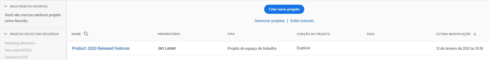

# Visão geral dos Projetos

Os projetos do Workspace permitem combinar componentes de dados, tabelas e visualizações para criar a análise e compartilhar com qualquer pessoa na organização. Antes de iniciar seu primeiro projeto, saiba como acessar, navegar e gerenciar os projetos.

## Lista de projetos {#project-list}

Ao acessar pela primeira vez o **[!UICONTROL Analytics]** > **[!UICONTROL Workspace]**, a página listará todos os projetos que você possui ou que foram compartilhados com você. Essa também é a página de aterrissagem do Adobe Analytics, a menos que você tenha definido uma página de aterrissagem personalizada anteriormente.

A página da lista de projeto do Espaço de trabalho contém as informações a seguir:

| Elemento | Descrição |
|---|---|
| [Criar novo projeto](/help/analysis-workspace/home.md) | Clique nesse link para criar um novo projeto a partir do zero. |
| Gerenciar projetos | Clicar nesse link o direciona para o Gerenciador de componentes de projetos (**[!UICONTROL Analytics]** > **[!UICONTROL Componentes]** > **[!UICONTROL Projetos]**), que lista todos os projetos e permite marcar, compartilhar, excluir, renomear, aprovar e exportar projetos para CSV. |
| Definir como página inicial | Transforma esta página em sua página inicial do Espaço de trabalho. |
| [Exibir tutoriais](/help/analysis-workspace/home.md) | Direciona você para os tutoriais em vídeo do Analysis Workspace. |
| Nome | Nome do projeto do Espaço de trabalho. |
| Proprietário | A pessoa que criou o projeto (você ou alguém que compartilhou o projeto com você.) |
| Tipo | Indica se é um projeto do Espaço de trabalho ou um [Scorecard móvel](/help/mobile-app/home.md). |
| [Função do projeto](/help/analysis-workspace/curate-share/share-projects.md) | Indica a função do projeto - proprietários, editar, duplicar, exibir. |
| Tags | Tags aplicadas ao projeto. |
| Última modificação | Data e hora em que o projeto foi modificado pela última vez. |
| Meus projetos favoritos | Para marcar um projeto como favorito, abra-o e clique na estrela ao lado do seu nome. Ele será exibido nessa lista na próxima vez que você abrir o Espaço de trabalho. |
| Projetos visualizados com frequência | Lista todos os projetos que você abre com frequência para facilitar o acesso. |

## Barra de menus {#menu-bar}

Em um projeto, o menu fornece opções para gerenciar o projeto, adicionar componentes, encontrar ajuda e muito mais. Cada opção de menu também pode ser acessada por atalhos do [teclado](/help/analysis-workspace/build-workspace-project/fa-shortcut-keys.md).

| Item de menu | Descrição |
|---|---|
| Projeto | Inclui ações comuns para o gerenciamento de projetos, incluindo Novo, Abrir, Salvar, Salvar como e Salvar como modelo. Você também pode atualizar o projeto inteiro para recuperar os dados e as definições mais recentes clicando em Atualizar projeto. A opção [Download de CSV e PDF](/help/analysis-workspace/curate-share/download-send.md) permite exportar dados do Espaço de trabalho. **Informações e configurações do projeto** (veja abaixo) oferece muitas opções para gerenciar seu projeto. |
| Editar | Desfazer ou refazer a última ação. Limpar tudo redefinirá seu projeto para um ponto de partida em branco. |
| Inserir | Insira novos painéis ou visualizações nesse menu. Você também pode inserir novos painéis e visualizações no painel esquerdo. |
| [Componentes](/help/components/overview.md) | Crie novos filtros, métricas calculadas, intervalo de datas ou componentes de alerta do seu projeto. Você também pode criar novos componentes no painel esquerdo. Se as definições de componente foram alteradas recentemente, Atualizar componentes recuperará as definições mais recentes. |
| [Compartilhar](/help/analysis-workspace/curate-share/send-schedule-files.md) | Prepare, compartilhe e agende projetos do PDF/CSV para os recipients em sua organização. |
| Ajuda | Acesse a documentação de ajuda, os vídeos e a comunidade da Experience League [do Analytics](https://experienceleaguecommunities.adobe.com/t5/adobe-analytics/ct-p/adobe-analytics-community?profile.language=pt). Gerencie a visibilidade das dicas do Espaço de trabalho, bem como do [depurador](https://www.adobe.io/apis/experiencecloud/analytics/docs.html#!AdobeDocs/analytics-2.0-apis/master/reporting-tricks.md). Encontre detalhes sobre o Espaço de trabalho e fatores que afetam o [desempenho](/help/analysis-workspace/workspace-faq/optimizing-performance.md) do projeto. |
| Botão Compartilhar ou Proprietário | Se você estiver em um projeto Próprio ou Editar, o botão Compartilhar na parte superior direita oferecerá acesso com um clique para gerenciar os recipients do projeto. Se você estiver em uma função Duplicar ou Exibir do projeto, verá o nome do proprietário do projeto. |

### Informações e configurações do projeto {#info-settings}

**[!UICONTROL Espaço de trabalho]** > **[!UICONTROL Projeto]** > **[!UICONTROL Configurações &amp; informações do projeto]** fornecem informações sobre o projeto ativo no momento.

As configurações incluem:

| Configuração | Descrição |
|---|---|
| Projeto Nome | O nome fornecido ao projeto. Você pode clicar duas vezes no nome para editá-lo. |
| Criado por | Nome do proprietário do projeto. |
| Última modificação | Data da última modificação do projeto. |
| Tags | Lista qualquer tag aplicada a um projeto para classificar com mais facilidade. |
| Descrição | Uma descrição é útil para esclarecer a finalidade de um projeto. Você pode clicar duas vezes na descrição para editá-la. |
| Contagem de instâncias repetidas no projeto | Especifica se as instâncias repetidas devem ser contadas nos relatórios. Observação: essa configuração não se aplica às visualizações de Fluxo ou Fallout. |
| [Paleta de cores do projeto](/help/analysis-workspace/build-workspace-project/color-palettes.md) | É possível alterar a paleta de cores categórica usada no Espaço de trabalho escolhendo entre paletas predefinidas que foram otimizadas para a cegueira de cores ou especificando a paleta personalizada. Esse recurso afeta muitas coisas no Espaço de trabalho, incluindo a maioria das visualizações. |
| [Exibir densidade](/help/analysis-workspace/build-workspace-project/view-density.md) | Permite ver mais dados na tela, ao reduzir o preenchimento vertical do painel à esquerda, em tabelas de forma livre e de coorte. |

## Painel esquerdo {#left-rail}

Em um projeto, [painéis](/help/analysis-workspace/c-panels/panels.md), tabelas, [visualizações](/help/analysis-workspace/visualizations/freeform-analysis-visualizations.md) e [componentes] são acessados pelo painel esquerdo. Estes são os componentes do projeto.

Também é possível acessar visualizações e painéis no [Painel em branco](/help/analysis-workspace/c-panels/blank-panel.md).

Os componentes (Dimension, Métricas, Filtros, Intervalos de datas) no painel à esquerda estão relacionados à visualização de dados do painel ativo. O painel ativo terá uma borda azul ao seu redor e a exibição de dados ativa será listada na parte superior do painel do componente.

## Tela do projeto {#canvas}

A tela do projeto é onde você reúne painéis, tabelas, visualizações e componentes para criar sua análise. Um projeto pode conter muitos painéis, e cada painel pode conter muitas tabelas e visualizações.

Os painéis são úteis quando você deseja organizar seus projetos de acordo com períodos, visualizações de dados ou casos de uso de análise. O painel principal terá uma borda azul ao seu redor e determina quais componentes estão disponíveis no painel esquerdo.

Dependendo do ponto de partida escolhido para seus projetos, você terá uma [tabela de forma livre](/help/analysis-workspace/visualizations/freeform-table/freeform-table.md) ou um [painel em branco](/help/analysis-workspace/c-panels/blank-panel.md) na tela para começar. A maneira mais rápida de começar a analisar é selecionar um ou vários componentes e simplesmente arrastá-los e soltá-los na tela do projeto. Uma tabela de dados será renderizada automaticamente para você. [Saiba mais](/help/analysis-workspace/visualizations/freeform-table/freeform-table.md) sobre as diferentes opções para criar uma tabela ou utilize nosso [tutorial de treinamento](/help/analysis-workspace/home.md) para obter mais orientações sobre como criar seu primeiro projeto.

## Gerente de projetos {#manager}

Os projetos do Analysis Workspace podem ser gerenciados em **Analytics > Componentes >  Projetos**. O Gerenciador de projetos mostra os itens criados por um usuário específico. A propriedade do projeto pode ser transferida para um novo usuário em Admin > Usuários e ativos do Analytics > Transferir ativos.

No Gerenciador de projetos, você pode adicionar, marcar, compartilhar, duplicar/copiar e muito mais. Procure um projeto na barra de pesquisa ou usando as opções de filtro no painel esquerdo. Você pode filtrar por tag, proprietários, tipo de projeto e muito mais.

As ações a seguir são comuns no Gerenciador de projetos e podem ser executadas em um ou vários projetos ao mesmo tempo:

| Ação | Descrição |
|---|---|
| Adicionar | Crie um novo projeto do zero. |
| Marcar ou aprovar | Escolha &quot;Marcar&quot; ou &quot;Aprovar&quot; para organizar os projetos e facilitar a pesquisa. |
| [Compartilhar](/help/analysis-workspace/curate-share/share-projects.md) | Disponibilize um projeto para outros usuários do Analysis Workspace em sua organização. |
| Excluir | Exclua o projeto. |
| Renomear | Edite o nome do projeto. |
| Copiar | Crie um duplicado do projeto. Isso cria uma nova ID de projeto. Qualquer compartilhamento ou programação vinculada ao projeto original não será copiada. |
| Exportar para CSV | Baixe o projeto como um arquivo CSV, que inclui dados de texto simples. |
