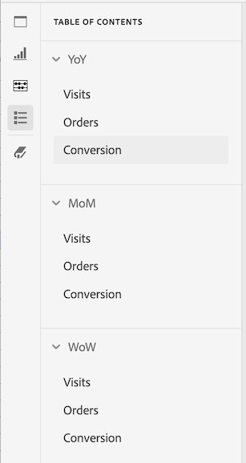

# Índice do projeto

Você pode exibir um índice em cada projeto no Analysis Workspace, permitindo mover-se rapidamente entre quaisquer painéis e visualizações existentes no projeto. Isso é especialmente útil ao visualizar projetos maiores que contêm muitos painéis e visualizações.

Veja a seguir uma demonstração em vídeo desse recurso:

>[!VIDEO](https://video.tv.adobe.com/v/3430412/?learn=on)

Para exibir o índice de um projeto:

1. No Analysis Workspace, vá para o projeto em que deseja exibir o índice.

1. Na navegação à esquerda, selecione o ícone de sumário .

   O índice do projeto é exibido e cada painel é expandido por padrão.

   

1. No índice, selecione uma visualização para acessá-la dentro do projeto.
