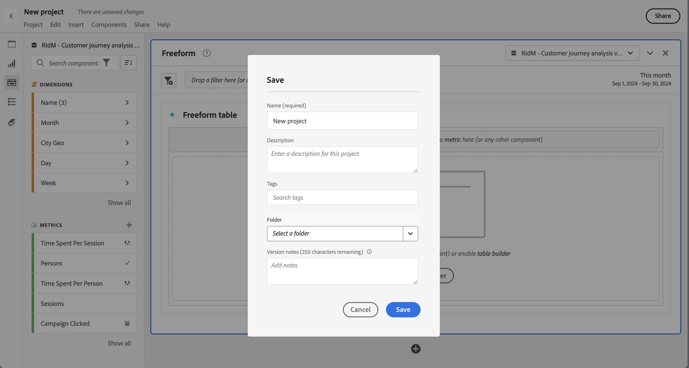

# Salvar projetos

Os projetos na Analysis Workspace são salvos automaticamente a cada 2 minutos. Você mesmo também pode salvar projetos, salvar um projeto como uma duplicata ou salvar um projeto com notas de versão.

## Salvar

Para salvar um projeto manualmente, com seu projeto aberto no Analysis Workspace, selecione **[!UICONTROL Projeto]** e escolha uma das seguintes opções:

* **[!UICONTROL Salvar]**

  Salve as alterações no seu projeto. Se o projeto for compartilhado, os recipients do projeto também verão as alterações.

  Quando você salva seu projeto pela primeira vez, uma caixa de diálogo **[!UICONTROL Salvar]** é exibida.

  

   1. Especifique o seguinte:

      * **[!UICONTROL Nome]** (obrigatório). nome do seu projeto.
      * **[!UICONTROL Descrição]**. Uma descrição do seu projeto.
      * **[!UICONTROL Marcas]**. Pesquise marcas no campo [!UICONTROL *Pesquisar marcas*] ou adicione novas marcas usando **[!UICONTROL ENTER]**.
      * **[!UICONTROL Pasta]**. Selecione uma pasta no menu suspenso [!UICONTROL *Selecionar uma pasta*]. Se você não especificar uma pasta, o projeto será salvo na pasta atual da qual você criou um novo projeto.
      * **[!UICONTROL Notas de versão]**. Adicionar notas de versão na área de texto *Adicionar notas*.

   1. Selecione **[!UICONTROL Salvar]** para salvar seu projeto.

  Salvar o projeto salva uma versão do projeto que é armazenada por 90 dias.

  Se você salvar um projeto compartilhado, uma caixa de diálogo de aviso **[!UICONTROL Salvar alterações no projeto compartilhado]** solicitará sua confirmação.

  

   * Selecione **[!UICONTROL Salvar]** para salvar o projeto.
   * Selecione **[!UICONTROL Salvar como]** para salvar o projeto como duplicado com um novo nome.

* **[!UICONTROL Salvar com notas]**

  

  Ao salvar o projeto, adicione observações sobre o que foi alterado nele. Na caixa de diálogo Salvar notas de versão:

   1. Insira suas **[!UICONTROL Notas de versão]** na área de texto **[!UICONTROL Adicionar notas]**.
   1. Selecione **[!UICONTROL Salvar]**.

  As notas são armazenadas com a versão do projeto e ficam disponíveis quando você [abre uma versão anterior](open-projects.md#open-previous-version) do projeto. Uma versão salva com notas é armazenada automaticamente por um ano.

* **[!UICONTROL Salvar como]**

  

  Crie uma duplicata do seu projeto com um novo nome. A caixa de diálogo Salvar como será exibida.

   1. Especifique o seguinte:

      * **[!UICONTROL Nome]** (obrigatório). nome do seu projeto.
      * **[!UICONTROL Descrição]**. Uma descrição do seu projeto.
      * **[!UICONTROL Marcas]**. Pesquise marcas no campo [!UICONTROL *Pesquisar marcas*] ou adicione novas marcas usando **[!UICONTROL ENTER]**.
      * **[!UICONTROL Pasta]**. Selecione uma pasta no menu suspenso [!UICONTROL *Selecionar uma pasta*]. Se você não especificar uma pasta, o projeto será salvo na pasta atual da qual você criou um novo projeto.
      * **[!UICONTROL Notas de versão]**. Adicionar notas de versão na área de texto *Adicionar notas*.

   1. Selecione **[!UICONTROL Salvar]** para salvar seu projeto.

  Você pode salvar o projeto em uma pasta diferente. O projeto original não é afetado.

<!-- Cannot find this option in CJA 
| **[!UICONTROL Save as template]** | Save your project as a [custom template](https://experienceleague.adobe.com/docs/analytics/analyze/analysis-workspace/build-workspace-project/starter-projects.html) that becomes available to your organization under **[!UICONTROL Project > New]** | 
-->

## Salvar automaticamente

>[!IMPORTANT]
>
>Embora os novos projetos sejam salvos automaticamente, você deve salvar manualmente cada novo projeto **primeiro** vez.
>

Todos os projetos no Analysis Workspace são salvos automaticamente a cada 2 minutos no computador local. Este salvamento automático inclui projetos recém-criados que ainda não foram salvos manualmente.

### Novos projetos

O Analysis Workspace solicita que você salve novos projetos manualmente ao alternar para outro projeto, fechar a guia do navegador e assim por diante.

Se, por qualquer motivo, você perder o acesso a um projeto recém-criado antes de salvá-lo manualmente, uma versão de recuperação do projeto será salva na página de aterrissagem do Analysis Workspace, em uma pasta chamada **[!UICONTROL Projetos recuperados (últimos 7 dias)]**. Restaure o projeto recuperado e salve-o manualmente no local desejado.

Para restaurar um projeto recuperado:

1. Vá para a pasta **[!UICONTROL Projetos recuperados (últimos 7 dias)]** na página de aterrissagem do Analysis Workspace.

<!-- 
     
  -->

1. Abra o projeto e salve-o no local desejado.

### Projetos existentes

Se, por qualquer motivo, você deixar um projeto com alterações que ainda não foram salvas automaticamente, a Analysis Workspace solicitará que você salve as alterações ou fornecerá uma mensagem de aviso.

Alguns cenários comuns:

#### Abrir outro projeto

Se você abrir outro projeto ao trabalhar em um projeto que contém alterações que ainda não foram salvas automaticamente, o Analysis Workspace solicitará que você salve o projeto atual.

As opções disponíveis são as seguintes:

* **[!UICONTROL Salvar]**: substitui a cópia local salva automaticamente mais recente do projeto pelas alterações mais recentes.
* **[!UICONTROL Descartar Alterações]**: Descarta as alterações mais recentes. O projeto retém a cópia local salva automaticamente mais recente.
* **[!UICONTROL Cancelar]**: cancele a ação para abrir outro projeto e mantenha o projeto existente aberto.

<!--  -->

#### Sair ou fechar uma guia

Se você sair da página ou fechar a guia do navegador enquanto visualiza um projeto com alterações que ainda não foram salvas automaticamente, o navegador avisará que as alterações não salvas serão perdidas. Você pode optar por sair ou cancelar. A forma como o navegador avisa depende do navegador usado.

### Falha do navegador ou tempo limite da sessão

Se o navegador travar ou se a sessão expirar, na próxima vez que você acessar o Analysis Workspace, será solicitado que você recupere todas as alterações no projeto que ainda não foram salvas automaticamente.

* Selecione **[!UICONTROL Sim]** para restaurar o projeto a partir da cópia salva automaticamente mais recente.

* Selecione **[!UICONTROL Não]** para excluir a cópia salva automaticamente e abrir a última versão salva pelo usuário do projeto.

<!---->

Para **novos** projetos que nunca foram salvos, as alterações não salvas não são recuperáveis.

<!-- Shouldn't this belong to another page?  Moved it to a new open projects page

## Open previously saved version

To open a previously saved version of a project:

1. Select **[!UICONTROL Open previous version]** from the **[!UICONTROL Project]** menu.

   

1. Review the list of previous versions available. You can switch between **[!UICONTROL All versions]** and **[!UICONTROL Only versions with notes]**.

   For each version, the list shows a timestamp
   [!UICONTROL Timestamp] and [!UICONTROL Editor] are shown, in addition to [!UICONTROL Notes] if they were added when the [!UICONTROL Editor] saved. Versions without notes are stored for 90 days; versions with notes are stored for 1 year.
1. Select a previous version and click **[!UICONTROL Load]**.
   The previous version then loads with a notification. The previous version does not become the current saved version of your project until you click **[!UICONTROL Save]**. If you navigate away from the loaded version, when you return, you will see the last saved version of the project.

-->
