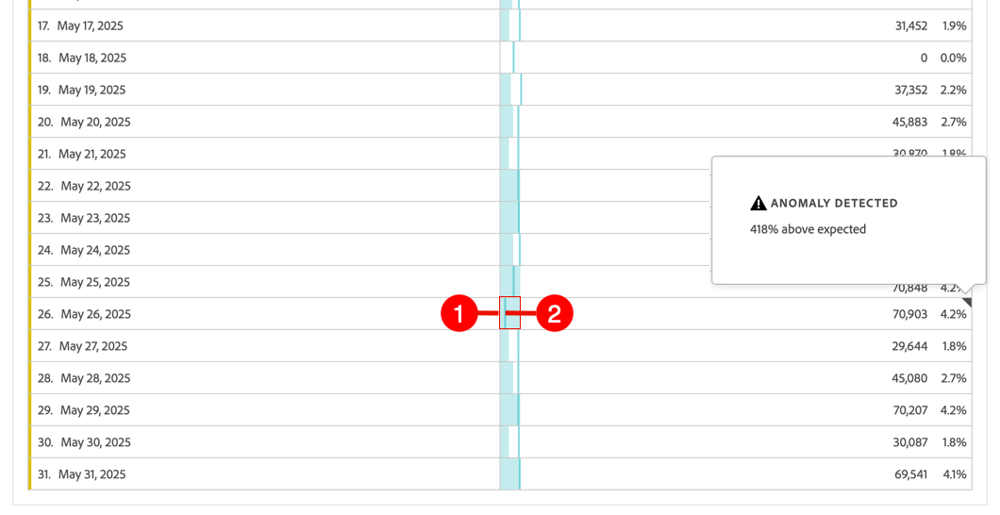

# Exibir anomalias

Você pode exibir anomalias no Analysis Workspace em uma tabela ou em um gráfico de linhas.

## Exibir anomalias em uma tabela {#section_869A87B92B574A38B017A980ED8A29C5}

É possível exibir anomalias em uma Tabela de forma livre da série de tempo.

1. Selecione a  no cabeçalho da coluna e verifique se a opção **[!UICONTROL Mostrar anomalias]** está selecionada na lista de opções. Para obter mais informações, consulte [Configurações de coluna](/help/analysis-workspace/visualizations/freeform-table/column-row-settings/column-settings.md).

1. As anomalias são mostradas na tabela como a seguir:

   

   Um ◥ é exibido no canto superior direito de cada linha em que uma anomalia de dados é detectada.

   A **linha vertical colorida** em cada linha ➋ indica o valor esperado. A **área sombreada colorida** em cada linha ➊ indica o valor real. A forma como a linha (valor esperado) se compara com a área sombreada (valor real) determina se há uma anomalia. (Uma observação é considerada anômala com base nas técnicas estatísticas avançadas descritas em [Técnicas estatísticas usadas na detecção de anomalias](/help/analysis-workspace/c-anomaly-detection/statistics-anomaly-detection.md).)

1. Selecione ◥ no canto superior direito de uma linha para ver os detalhes sobre a anomalia. Mostra a extensão (em percentagem) em que o valor real diverge acima ou abaixo do valor esperado.

## Exibir anomalias em um gráfico de linhas

Os gráficos de linha são a única visualização que permite visualizar anomalias.

Para exibir anomalias em um gráfico de linhas:

1. Selecione  no cabeçalho da visualização e certifique-se de que a opção [!UICONTROL **Mostrar anomalias**] esteja selecionada na lista de opções. Para obter mais informações, consulte [Linha](/help/analysis-workspace/visualizations/line.md).

1. (Opcional) Para permitir que o intervalo de confiança dimensione o gráfico, selecione  no cabeçalho da visualização e selecione a opção **[!UICONTROL Permitir que anomalias dimensionem o eixo Y]**.

   Essa opção não é selecionada por padrão porque, às vezes, pode tornar o gráfico menos legível.

   As anomalias são mostradas no gráfico de linhas da seguinte maneira:

   

   Um **ponto branco** aparece na linha sempre que uma anomalia de dados é detectada. (Uma observação é considerada anômala com base nas técnicas estatísticas avançadas descritas em [Técnicas estatísticas usadas na detecção de anomalias](/help/analysis-workspace/c-anomaly-detection/statistics-anomaly-detection.md).)

   A **área sombreada clara** é a faixa de confiança, ou o intervalo esperado, em que os valores devem ocorrer. Qualquer valor que não esteja nesse intervalo esperado é uma anomalia.

   Se você tiver várias métricas no gráfico de linhas, apenas as anomalias serão exibidas e você deverá passar o mouse sobre cada anomalia para ver a faixa de confiança dessa métrica.

   A **linha pontilhada** é o valor esperado exato.

1. Selecione uma anomalia (ponto branco) para exibir as seguintes informações:

   * A data em que a anomalia ocorreu.

   * O valor bruto da anomalia.

   * O valor percentual acima ou abaixo do valor esperado, que é representado pela linha verde sólida.

<!--
# View anomalies in Analysis Workspace

You can view anomalies in a table or in a line chart.

## View anomalies in a table {#table}

You can view anomalies in a time-series Freeform Table.

1. Select the column settings icon in the column header, then ensure that the [!UICONTROL **Anomalies**] option is selected in the list of options. For more information, see [Column settings](/help/analysis-workspace/visualizations/freeform-table/column-row-settings/column-settings.md).

1. Click away from the settings menu to view the updated table.

   

1. Anomalies are shown in the table as follows:

   A **dark gray triangle** appears in the upper-right corner of each row where a data anomaly is detected.

   The colored **vertical line** in each row indicates the expected value. The colored **shaded area** in each row indicates the actual value. How the line (expected value) compares with the shaded area (actual value) determines whether there is an anomaly. (An observation is considered anomolous based on the advanced statistical techniques described in [Statistical techniques used in anomaly detection](/help/analysis-workspace/c-anomaly-detection/statistics-anomaly-detection.md).)

1. Select the gray triangle in the upper-right corner of a row to view details about the anomaly. This shows the extent (as a percentage) to which the actual value diverges either above or below the expected value.

## View anomalies in a line chart {#line-chart}

A Line chart is the only visualization that allows you to view anomalies.

To view anomalies in a line chart:

1. Select the settings icon in the visualization header, then ensure that the [!UICONTROL **Show anomalies**] option is selected in the list of options. For more information, see [Line](/help/analysis-workspace/visualizations/line.md).

1. (Optional) To allow the confidence interval to scale the chart, select the settings icon in the visualization header, then select the option, **[!UICONTROL Allow anomalies to Scale Y-axis]**. 

   This option is not selected by default because it can sometimes make the chart less legible.
   
1. Click away from the settings menu to view the updated line chart.

      

   Anomalies are shown in the line chart as follows:
   
   A **white dot** appears on the line wherever a data anomaly is detected. (An observation is considered anomolous based on the advanced statistical techniques described in [Statistical techniques used in anomaly detection](/help/analysis-workspace/c-anomaly-detection/statistics-anomaly-detection.md).)

   The **light shaded area** is the confidence band, or expected range, where values should occur. Any value that falls outside of this expected range is an anomaly. 

   If you have multiple metrics in the line chart, only the anomalies are shown and you have to hover over each anomaly to see the confidence band for that metric. 

   The **dotted line** is the exact expected value.

1. Click an anomaly (white dot) to view the following information:

   * The date the anomaly occurred 
   
   * The raw value of the anomaly 
   
   * The percentage value above or below the expected value, which is represented by the solid green line.
   
-->
