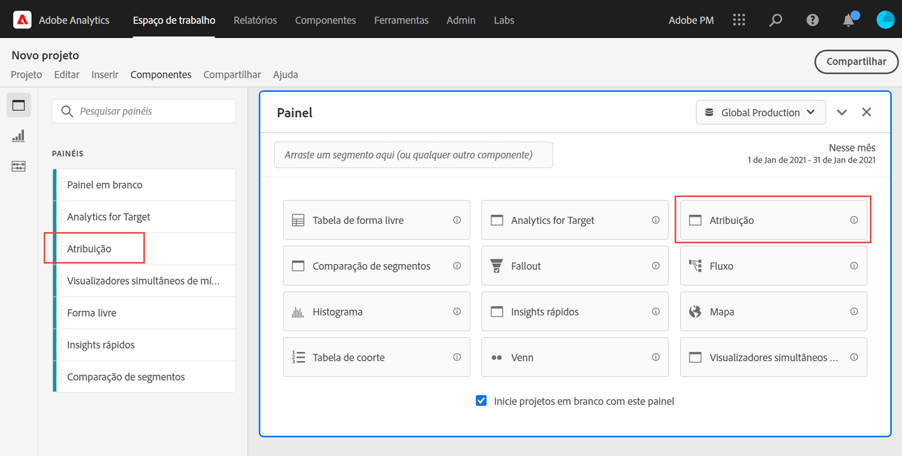
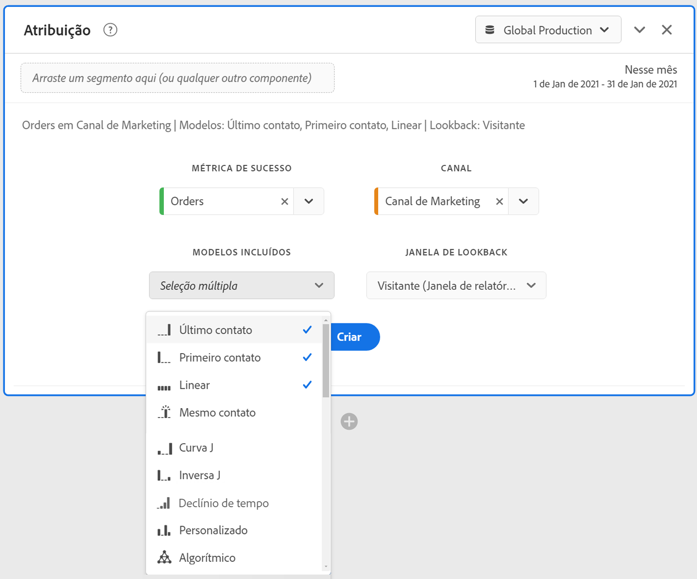

# Painel de atribuição

O painel [!UICONTROL Attribution] é uma maneira fácil de criar uma análise comparando vários modelos de atribuição. É um recurso no [Attribution IQ](../attribution/overview.md) que oferece um espaço de trabalho dedicado para usar e comparar modelos de atribuição.

## Criar um painel de atribuição

1. Clique no ícone do painel à esquerda.
1. Arraste o painel [!UICONTROL Attribution] até o Projeto do Analysis Workspace.

   

1. Adicione uma métrica que você deseja atribuir e adicione qualquer dimensão ao atributo. Os exemplos incluem Canais de marketing ou dimensões personalizadas, como promoções internas.

   

1. Selecione os [modelos de atribuição e a janela de pesquisa](../attribution/models.md) que você deseja comparar.

1. O painel Atribuição retorna um conjunto avançado de dados e visualizações que comparam a atribuição da dimensão e da métrica selecionadas.

   

## Visualizações de atribuição

* **Métrica total**: o número total de conversões que ocorreram ao longo da janela de tempo do relatório. Essas são as conversões atribuídas pela dimensão selecionada.
* **Barra** de comparação de atribuição: Compara visualmente as conversões atribuídas em cada um dos itens de dimensão da dimensão selecionada. Cada cor da barra representa um modelo de atribuição distinto.
* **Tabela** de comparação de atribuição: Mostra os mesmos dados que o gráfico de barras, representado como uma tabela. Selecionar diferentes colunas ou linhas nesta tabela filtra o gráfico de barras, bem como várias outras visualizações no painel. Essa tabela age de forma semelhante a qualquer outra Tabela de forma livre no Workspace - permitindo adicionar componentes como métricas, filtros ou detalhamentos.
* **Diagrama** de sobreposição: Um diagrama Venn mostrando os três principais itens de dimensão e a frequência com que eles participam em conjunto em uma conversão. Por exemplo, o tamanho da sobreposição entre as bolhas indica com que frequência as conversões ocorreram quando um visitante foi exposto a ambos os itens de dimensão. Selecionar outras linhas na tabela de Forma livre adjacente atualizará a visualização para refletir a seleção.
* **Detalhes** de desempenho: Permite comparar até três modelos de atribuição visualmente usando um gráfico de dispersão
* **Desempenho** com tendência: Mostra a tendência das conversões atribuídas para o item de dimensão principal. Selecionar outras linhas na tabela de Forma livre adjacente atualizará a visualização para refletir a seleção.
* **Fluxo**: Permite ver em quais canais há mais interação e em que ordem isso ocorre na jornada de um visitante.
