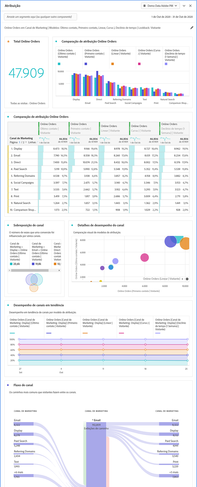

# Painel de atribuição {#attribution-panel}

<!-- markdownlint-disable MD034 -->

>[!CONTEXTUALHELP]
>id="workspace_attribution_button"
>title="Atribuição"
>abstract="Compare e visualize rapidamente qualquer número de modelos de atribuição usando métricas de sucesso, canal e janela de retrospectiva."
>additional-url="https://www.youtube.com/watch?v=Yu0hy2klzA0" text="Painel do Attribution IQ"

>[!CONTEXTUALHELP]
>id="workspace_attribution_panel"
>title="Painel de atribuição"
>abstract="Compare e visualize rapidamente qualquer número de modelos de atribuição para uma métrica de sucesso. Selecione o canal (dimensão), os modelos a serem incluídos e a janela de retrospectiva."
>additional-url="https://www.youtube.com/watch?v=Yu0hy2klzA0" text="Painel do Attribution IQ"

<!-- markdownlint-enable MD034 -->

>[!BEGINSHADEBOX]

_Este artigo documenta o Painel de atribuição no_  _**Customer Journey Analytics**_. _Consulte o [Painel de atribuição](https://experienceleague.adobe.com/pt-br/docs/analytics/analyze/analysis-workspace/panels/attribution) da versão_  _**Adobe Analytics** deste artigo._

>[!ENDSHADEBOX]

O painel **[!UICONTROL Atribuição]** é uma maneira fácil de criar uma análise comparando vários modelos de atribuição. O painel fornece um espaço de trabalho dedicado para usar e comparar modelos de atribuição.

O Customer Journey Analytics aprimora a atribuição ao permitir:

* Definir a atribuição além da mídia paga: qualquer dimensão, métrica, canal ou evento pode ser aplicado a modelos (por exemplo: pesquisa interna), não apenas campanhas de marketing.
* Use comparação ilimitada de modelos de atribuição: compare dinamicamente quantos modelos desejar.
* Evite alterações na implementação: com processamento em tempo de relatório e sessões com reconhecimento de contexto, o contexto da jornada do cliente pode ser incorporado e aplicado em tempo de execução.
* Construir a sessão que melhor corresponde ao seu cenário de atribuição.
* Detalhar atribuições por segmentos: compare facilmente o desempenho dos canais de marketing em segmentos importantes (por exemplo: novos clientes e clientes recorrentes, produto X e produto Y, nível de fidelidade ou CLV).
* Inspecionar canais cruzados e análises de multitoque: usando diagramas e histogramas de Venn e resultados de atribuição de tendência.
* Analisar visualmente as principais sequências de marketing: explore visualmente caminhos que levaram à conversão usando as visualizações de fluxo de múltiplos nós e de fallout.
* Criar métricas calculadas: use a quantidade de métodos de alocação de atribuição que desejar.

## Usar

Para usar um painel de **[!UICONTROL Atribuição]**:

1. Crie um painel de **[!UICONTROL Atribuição]**. Para obter informações sobre como criar um painel, consulte [Criar um painel](panels.md#create-a-panel).

1. Especifique a [entrada](#panel-input) do painel.

1. Observe a [saída](#panel-output) do painel.

### Entrada do painel

Você pode configurar o painel de Atribuição usando estas configurações de entrada:

1. Adicione uma **[!UICONTROL Métrica de sucesso]** e uma dimensão do **[!UICONTROL Canal]** que você deseja atribuir. Os exemplos incluem Canais de marketing ou dimensões personalizadas, como promoções internas.

   

1. Selecione um ou mais [modelos de atribuição](#attribution-models) de **[!UICONTROL modelos incluídos]**, o [contêiner](#container) de **[!UICONTROL Contêiner]** e uma [janela de pesquisa](#lookback-window) da **[!UICONTROL janela de pesquisa]** que você deseja usar para comparação.

1. Selecione **[!UICONTROL Criar]** para criar as visualizações no painel.

### Saída do painel

O painel **[!UICONTROL Atribuição]** retorna um rico conjunto de dados e visualizações que comparam a atribuição para a dimensão e métrica selecionadas.

### Visualizações de atribuição

As visualizações a seguir fazem parte do resultado do painel.

* **Métrica total**: o número total de conversões que ocorreram ao longo da janela de tempo do relatório e são atribuídas à dimensão selecionada.
* **Barra de comparação de atribuição**: compara visualmente as conversões atribuídas em cada um dos itens da dimensão selecionada. Cada cor da barra representa um modelo de atribuição distinto.
* **Tabela de comparação de atribuição**: mostra os mesmos dados que o gráfico de barras, mas representados como uma tabela. Selecionar diferentes colunas ou linhas nesta tabela segmenta o gráfico de barras, bem como várias outras visualizações no painel. Esta tabela atua de forma semelhante a qualquer outra tabela de forma livre no Workspace, permitindo adicionar componentes como métricas, segmentos ou detalhamentos.
* **Diagrama de sobreposição**: uma visualização de Venn exibindo os três principais itens de dimensão e a frequência com que participam em conjunto em uma conversão. Por exemplo, o tamanho da sobreposição entre as bolhas indica com que frequência as conversões ocorreram quando um visitante foi exposto a ambos os itens de dimensão. Selecionar outras linhas na tabela de Forma livre adjacente atualizará a visualização para refletir a seleção.
* **Detalhe de desempenho**: uma visualização de dispersão para comparar visualmente até três modelos de atribuição.
* **Desempenho com tendência**: mostra a tendência das conversões atribuídas para o item de dimensão principal. Selecionar outras linhas na tabela de forma livre adjacente atualizará a visualização para refletir a seleção.
* **Fluxo**: permite ver com quais canais a interação é mais comum e em que ordem isso acontece na jornada de uma pessoa.

## Modelo de atribuição

{{attribution-models-details}}

## Container

{{attribution-container}}

## Janela de retrospectiva

{{attribution-lookback-window}}

## Exemplo

{{attribution-example}}

>[!MORELIKETHIS]
>
> [Criar um painel](/help/analysis-workspace/c-panels/panels.md#create-a-panel)
>
