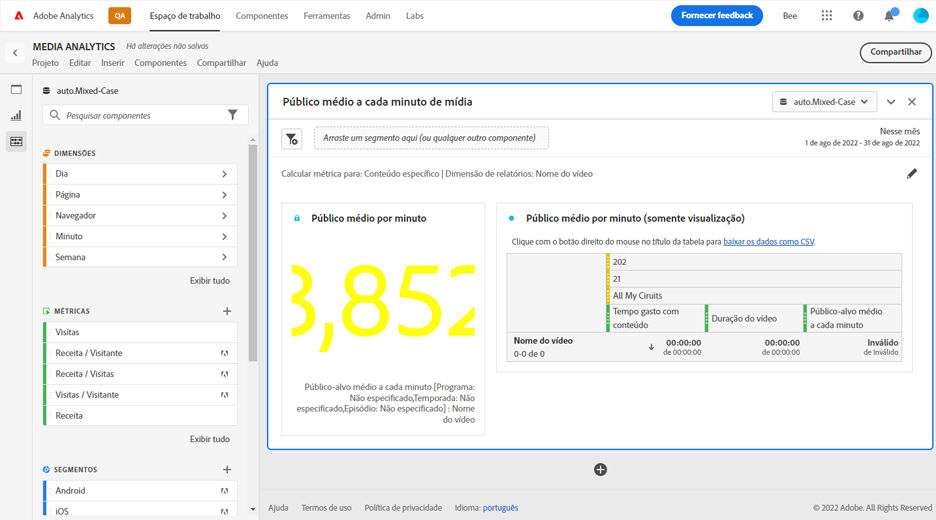

# Painel de audiência média por minuto de mídia {#media-average-minute-audience-panel}

<!-- markdownlint-disable MD034 -->

>[!CONTEXTUALHELP]
>id="workspace_mediaminuteaverageaudience_button"
>title="Média de público-alvo por minuto de mídia"
>abstract="Crie um painel para analisar a audiência média por minuto de um conteúdo específico ou ao longo de um período específico."

<!-- markdownlint-enable MD034 -->

<!-- markdownlint-disable MD034 -->

>[!CONTEXTUALHELP]
>id="workspace_mediaaverageminuteaudience_panel"
>title="Média de público-alvo por minuto de mídia"
>abstract="Mostra o desempenho de um conteúdo de mídia específico ou ao longo de um período personalizado. Especifique a dimensão de relatório e, opcionalmente, o conteúdo do segmento."

<!-- markdownlint-enable MD034 -->

>[!BEGINSHADEBOX]

_Este artigo documenta o painel Média de público-alvo por minuto de mídia no_  _&#x200B;**Customer Journey Analytics**&#x200B;_. _Consulte o painel [Média de público-alvo por minuto de mídia](https://experienceleague.adobe.com/pt-br/docs/analytics/analyze/analysis-workspace/panels/average-minute-audience-panel) para ver a versão do_  _&#x200B;**Adobe Analytics** deste artigo._

>[!ENDSHADEBOX]

>[!NOTE]
>
>O painel **[!UICONTROL Média de público-alvo por minuto de mídia]** está disponível somente para clientes que compraram a Coleção de mídia de transmissão para o Customer Journey Analytics.
>
>Entre em contato com o representante de vendas da Adobe ou com a equipe de conta da Adobe para obter mais informações.
>

No Analysis Workspace, a média de público-alvo por minuto pode fornecer informações sobre

* o tempo gasto visualizando um fluxo de mídia específico dividido pela duração do conteúdo, ou
* o tempo gasto visualizando durante um período personalizado com granularidade selecionada.

O painel Média de público-alvo por minuto de mídia permite compreender o consumo médio do conteúdo comparando programas de qualquer comprimento ou gênero. Por exemplo, você pode entender o consumo médio ao comparar um programa de comédia de 30 minutos com um evento esportivo de 3 horas.

Além disso, você pode usar o painel Média de público-alvo por minuto de mídia para comparar ou anexar essa média de público-alvo por minuto digital às métricas de média por minuto lineares da TV.

O painel Média de público-alvo por minuto de mídia oferece os seguintes benefícios em relação à métrica Média de público-alvo por minuto:

* Oferece suporte a períodos personalizados

* Permite atualizar a classificação de duração após o processamento das exibições (se a classificação de duração não estava presente ou precisa ser corrigida)

  Se você fizer essa atualização ao usar a métrica, a classificação de duração não existirá (se a classificação não estiver presente). Ou a classificação de duração está desatualizada (se a classificação estava presente, mas incorreta).

## Usar

Para usar um painel **[!UICONTROL Média de público-alvo por minuto de mídia]**:

1. Crie um painel **[!UICONTROL Média de público-alvo por minuto de mídia]**. Para obter informações sobre como criar um painel, consulte [Criar um painel](panels.md#create-a-panel).

1. Selecione uma exibição de dados para o painel que tenha componentes configurados da Coleção de mídia de transmissão.

1. Especifique a [entrada](#panel-input) do painel.

1. Observe a [saída](#panel-output) do painel.

### Entrada do painel

Use as configurações de entrada descritas nesta seção para configurar o painel Média de público-alvo por minuto de mídia.

1. Defina as seguintes configurações de entrada:

   | Configuração | Descrição |
   |---------|------------|
   | **Intervalo de datas do painel** | O intervalo de datas padrão do painel é [!UICONTROL **Este mês**]. Você pode editá-lo para exibir um único dia ou vários meses de uma vez.    Essa visualização é limitada a 1440 linhas de dados (por exemplo, 24 horas na granularidade no nível de minuto). Se um intervalo de datas e combinação de granularidade resultar em mais de 1440 linhas, a granularidade será atualizada automaticamente para acomodar todo o intervalo de datas. |
   | [!UICONTROL **Solte um segmento (ou qualquer outro componente) aqui.**] | Como outros painéis, essa configuração segmenta as seleções com base nos segmentos que você criou. Essa é uma ótima maneira de observar plataformas específicas, fluxos ao vivo ou outros segmentos de mídia comuns. |
   | [!UICONTROL **Calcular métrica para**] | Escolha se você deseja ver o público-alvo médio por minuto para [**[!UICONTROL Conteúdo específico]**](#specific-content). Ou se você quiser ver a média de público-alvo por minuto de um [**[!UICONTROL Período personalizado]**](#custom-time-period).  Selecione [!UICONTROL **Período personalizado**]: <ul><li>Se a duração não estiver disponível ou </li><li>se você quiser exibir a média de público-alvo por minuto de uma série temporal com vários conteúdos, ou</li><li>para conteúdo sem uma duração específica atribuída (como durante um transmissão ou evento ao vivo)</li></ul></li></li></ul> 
Essa configuração altera o fluxo de trabalho e a saída do relatório.
 |

1. Continue com [Conteúdo específico](#specific-content) ou [Período personalizado](#custom-time-period), dependendo da opção escolhida no menu suspenso [!UICONTROL **Calcular métrica para**].

#### Conteúdo específico

1. Se você selecionou [!UICONTROL **Conteúdo específico**] no menu suspenso [!UICONTROL **Calcular métrica para**] ao [configurar entradas do painel](#panel-inputs), especifique as seguintes opções de configuração:

   | Configuração | Descrição |
   |---------|------------|
   | [!UICONTROL **Dimensão de relatório**] | Ao selecionar um conteúdo específico, você pode selecionar a saída do relatório para usar os campos de nome do vídeo ou ID do conteúdo para mostrar o conteúdo e sua média de público-alvo por minuto associada. |
   | [!UICONTROL **Filtrar conteúdo por (opcional)**] | Escolha como filtrar o conteúdo específico, dependendo da visualização desejada ou da maneira como seus dados estão estruturados. <ul>[!UICONTROL **Programa, temporada, episódio**]: exibe os programas disponíveis no menu suspenso, que você pode filtrar usando uma pesquisa (ou arrastando e soltando o nome do programa da coluna da esquerda). Você pode terminar a seleção ali para ver todas as estações do programa, ou você pode filtrar por estações individuais e por episódios individuais. Esta configuração mostra os dados para esses programas, temporadas ou episódios do período selecionado.</li><li>[!UICONTROL **Dimensão personalizada**]: se o seu nome de exibição estiver em uma dimensão personalizada, você poderá encontrá-lo pesquisando no menu suspenso da dimensão (opcional) ou usando a pesquisa de coluna à esquerda. O item de dimensão é preenchido automaticamente com base nessa seleção e é tratado como um episódio.</li><li>[!UICONTROL **Nenhum**]: mostra todos os nomes de vídeos que têm dados de média de público-alvo por minuto para a seleção que você escolheu. (Essa opção está selecionada por padrão.)</li></ul> |

1. Continue com [Configurações avançadas de conteúdo específico](#specific-content-advanced-settings) para definir configurações avançadas.

#### Configurações avançadas de conteúdo específico

1. Com [!UICONTROL **Conteúdo específico**] selecionado no menu suspenso [!UICONTROL **Calcular métrica para**], selecione [!UICONTROL **Mostrar configurações avançadas**] e especifique as seguintes opções de configuração:

   | Opções | Descrição |
   |---------|------------|
   | **[!UICONTROL Configurações da tabela]** | A opção padrão **[!UICONTROL Mostrar valores de cálculo na tabela]** mostra o numerador e o denominador da média de público-alvo por minuto como as colunas anteriores na tabela. Desmarcar essa opção remove essas duas colunas. A coluna de média de público-alvo por minuto permanece na tabela ao lado do nome do vídeo ou da ID de conteúdo. |
   | **[!UICONTROL Métrica de tempo gasto]** | Você pode escolher a opção padrão **[!UICONTROL Tempo gasto com conteúdo]**, que inclui apenas o tempo de conteúdo. Ou você pode optar por usar **[!UICONTROL Tempo gasto com a mídia]**, que inclui conteúdo e tempo de anúncio juntos como o cálculo do numerador para a média de público-alvo por minuto. |

1. Selecione [!UICONTROL **Criar**] para concluir a criação do painel Média de público-alvo por minuto de mídia.

1. Continue com [Saída do painel](#panel-output) para obter informações sobre como usar o painel Média de público-alvo por minuto de mídia.

#### Período personalizado

1. Se você selecionou [!UICONTROL **Período personalizado**] no menu suspenso [!UICONTROL **Calcular métrica para**] ao [configurar entradas do painel](#panel-inputs), especifique as seguintes opções de configuração:

   | Opções | Descrição |
   |---------|------------|
   | **[!UICONTROL Granularidade]** | A granularidade padrão é [!UICONTROL **5 minutos**], mas você pode escolher qualquer uma das granularidades que são usadas como denominador para a série temporal no período selecionado. Por exemplo, selecionar 12h a 12h30 com uma granularidade de 5 minutos retorna a média de público-alvo por minuto durante a meia hora completa, bem como seis linhas com a média de público-alvo por minuto para cada período de 5 minutos. Essas linhas são usadas como pontos de dados para o gráfico de série temporal. |
   | [!UICONTROL **Filtrar conteúdo por (opcional)**] | Escolha como filtrar o conteúdo específico, dependendo da visualização desejada ou da maneira como seus dados estão estruturados. <ul>[!UICONTROL **Programa, temporada, episódio**]: exibe os programas disponíveis no menu suspenso, que você pode filtrar usando uma pesquisa (ou arrastando e soltando o nome do programa da coluna da esquerda). Você pode terminar a seleção ali para ver todas as estações do programa, ou você pode filtrar por estações individuais e por episódios individuais. Esta configuração mostra os dados para esses programas, temporadas ou episódios do período selecionado.</li><li>[!UICONTROL **Dimensão personalizada**]: se o seu nome de exibição estiver em uma dimensão personalizada, você poderá encontrá-lo pesquisando no menu de dimensão (opcional) ou usando a pesquisa de coluna à esquerda. O item de dimensão é preenchido automaticamente com base nessa seleção e é tratado como um episódio.</li><li>[!UICONTROL **Nenhum**]: mostra todos os nomes de vídeos que têm dados de média de público-alvo por minuto para a seleção que você escolheu. (Essa opção está selecionada por padrão.)</li></ul> |

1. Continue com as [configurações avançadas do período personalizado](#custom-time-period-advanced-settings) para definir as configurações avançadas.

#### Configurações avançadas do período personalizado

1. Com o [!UICONTROL **Período personalizado**] selecionado no menu suspenso [!UICONTROL **Calcular métrica para**], selecione [!UICONTROL **Mostrar configurações avançadas**] e especifique a seguinte opção de configuração:

   | Opção | Descrição |
   |---------|------------|
   | **[!UICONTROL Configurações da tabela]** | A configuração padrão mostra os valores de cálculo na tabela, que mostra o numerador e o denominador do público-alvo médio por minuto como as colunas anteriores na tabela. Desmarcar essa opção remove essas duas colunas, deixando somente o público-alvo médio por minuto ao lado do período. |

1. Selecione [!UICONTROL **Criar**] para concluir a criação do painel Média de público-alvo por minuto de mídia.

1. Continue com [Saída do painel](#panel-output) para obter informações sobre como usar o painel Média de público-alvo por minuto de mídia.

### Saída do painel

A saída do painel será diferente se você escolher [!UICONTROL **Conteúdo específico**] ou [!UICONTROL **Período personalizado**] no menu suspenso [!UICONTROL **Calcular métrica para**] ao [configurar entradas do painel](#panel-inputs).

#### Conteúdo específico

O painel Média de público-alvo por minuto retorna o seguinte:

* Público-alvo médio por minuto para toda a seleção
* Filtros e média de público-alvo por minuto para vídeos individuais exibidos em uma tabela
* Tempo gasto no conteúdo e duração do vídeo (duração) se essa configuração avançada tiver sido selecionada

Para editar e reconstruir o painel a qualquer momento, selecione  no canto superior direito.

#### Fonte de dados de conteúdo específico

O painel Média de público-alvo por minuto de mídia usa apenas a métrica de média de público-alvo por minuto para coletar dados. Detalhamentos ou outras métricas não podem ser usadas no painel.

| Métrica | Descrição |
|--------|-------------|
| **[!UICONTROL Média de público-alvo por minuto]** | O tempo gasto com a visualização do fluxo de mídia dividido pela duração do vídeo fornecido por Classificações. |

#### Período personalizado {#custom-time-period-output}

O painel Média de público-alvo por minuto retorna o seguinte:

* A média de público-alvo total por minuto para toda a seleção

* A média máxima e mínima de público-alvo por minuto

* O gráfico de séries de linhas mostra a média de público-alvo por minuto em toda a seleção.

* Uma tabela que mostra os filtros e a média de público-alvo por minuto para as granularidades, bem como o tempo de conteúdo gasto e a granularidade para cada período

  Esta tabela é exibida somente se a opção em configurações avançadas chamada [!UICONTROL **Mostrar valores de cálculo na tabela**] estiver selecionada.

Para editar e reconstruir o painel a qualquer momento, selecione  no canto superior direito.

#### Fonte de dados do período personalizado

O painel Média de público-alvo por minuto de mídia usa apenas a métrica de média de público-alvo por minuto para coletar dados. Detalhamentos ou outras métricas não podem ser usadas no painel.

| Métrica | Descrição |
|---|---|
| **[!UICONTROL Audiência média por minuto]** | O tempo gasto visualizando o fluxo de mídia dividido pela seleção total ou granularidade selecionada em minutos. |

>[!MORELIKETHIS]
>
> [Criar um painel](/help/analysis-workspace/c-panels/panels.md#create-a-panel)
> &#x200B;> [Painel de visualizadores simultâneos de mídia](media-concurrent-viewers.md)
> &#x200B;> [Painel de tempo gasto com a reprodução da mídia](media-playback-time-spent.md)
>