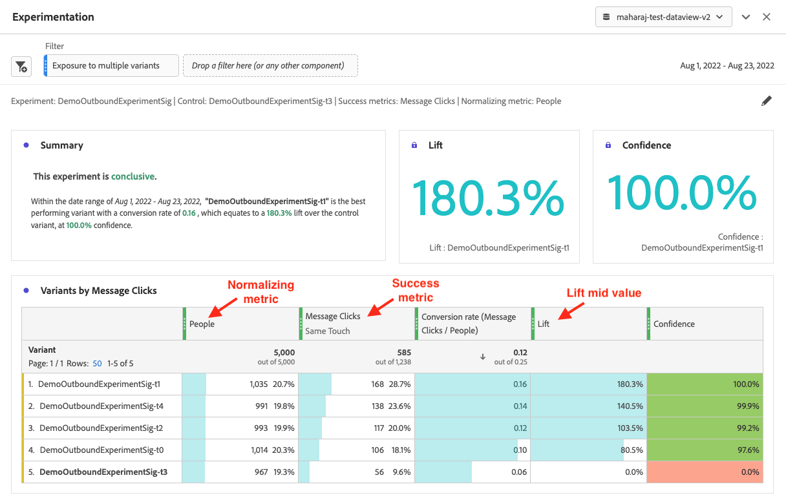
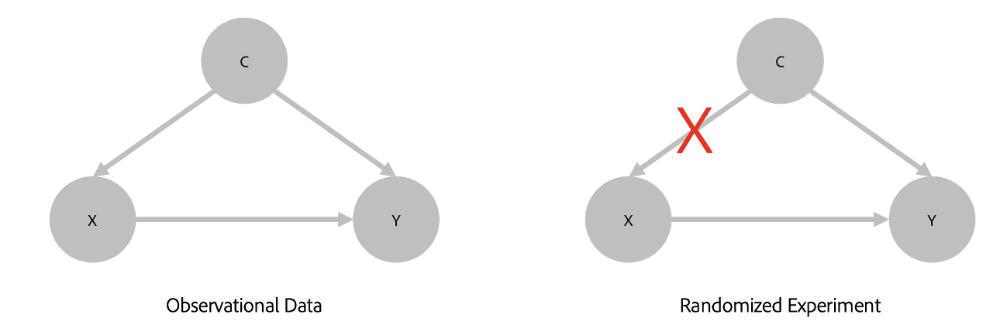

# Painel de experimentação

O painel **[!UICONTROL Experimentação]** permite que os analistas comparem diferentes variações de experiência do usuário, marketing ou mensagens para determinar qual é a melhor para gerar um resultado específico. Você pode avaliar o aumento e a confiança de qualquer experimento A/B de qualquer plataforma de experimentação — online, offline, de soluções de Adobe como Target ou Journey Optimizer e até mesmo dados BYO (traga os seus próprios).

Leia mais sobre a [integração entre o Adobe Customer Journey Analytics e o Adobe Target](https://experienceleague.adobe.com/pt-br/docs/target/using/integrate/cja/target-reporting-in-cja).

## Controle de acesso {#access}

O painel Experimentação está disponível para uso por todos os usuários do Customer Journey Analytics. Não são necessários direitos de administrador ou outras permissões. No entanto, a configuração (etapas 1 e 2 abaixo) requer ações que somente administradores podem executar.

## Novas funções em métricas calculadas {#functions}

Foram adicionadas duas novas funções avançadas: [!UICONTROL Aumento] e [!UICONTROL Confiança]. Para obter mais informações, consulte [Referência - funções avançadas](/help/components/calc-metrics/cm-adv-functions.md).

## Etapa 1: Criar uma conexão com conjuntos de dados de experimento {#connection}

O esquema de dados recomendado é um no qual os dados experimentais estejam em uma [Matriz de objetos](https://experienceleague.adobe.com/en/docs/experience-platform/xdm/ui/fields/array) que contém os dados de experimento e variante em duas dimensões separadas. Ambas as dimensões precisam estar em uma matriz de objetos **single**. Se você tiver seus dados de experimento em uma única dimensão (com os dados de experimento e variante em uma cadeia de caracteres delimitada), poderá usar a configuração [subcadeia de caracteres](/help/data-views/component-settings/substring.md) nas visualizações de dados para dividir a dimensão em duas partes para uso no painel.

Depois que seus dados de experimento tiverem sido [assimilados](https://experienceleague.adobe.com/en/docs/experience-platform/ingestion/home) na Adobe Experience Platform, [crie uma conexão em Customer Journey Analytics](/help/connections/create-connection.md) para um ou mais conjuntos de dados de experimento.

## Etapa 2: adicionar rótulos de contexto em visualizações de dados {#context-labels}

Nas configurações de visualizações de dados do Customer Journey Analytics, os administradores podem adicionar [rótulos de contexto](/help/data-views/component-settings/overview.md) a uma dimensão ou métrica, e serviços de Customer Journey Analytics como o painel [!UICONTROL Experimentação] podem usar esses rótulos para suas finalidades. Dois rótulos predefinidos são usados para o painel Experimentação:

* [!UICONTROL Experimento de experimentação]
* [!UICONTROL Variante de experimentação]

Na visualização de dados que contém dados de experimentação, escolha duas dimensões: uma com os dados de experimentação e outra com os dados da variante. Em seguida, rotule essas dimensões com os rótulos **[!UICONTROL Experimento]** e **[!UICONTROL Variante]**.

Sem a presença desses rótulos, o painel Experimento não funciona, pois não haverá experimentos com os quais trabalhar.

## Etapa 3: configurar o painel Experimentação {#configure}

1. No Analysis Workspace no Customer Journey Analytics, adicione o painel Experimentação a um projeto. Para obter mais informações sobre como adicionar painéis a um projeto, consulte [Adicionar painéis ao projeto](/help/analysis-workspace/build-workspace-project/create-projects.md#add-panels-to-the-project) em [Criar projetos](/help/analysis-workspace/build-workspace-project/create-projects.md).

   

   >[!IMPORTANT]
   >
   >Se a configuração necessária nas visualizações de dados de Customer Journey Analytics não tiver sido concluída, esta mensagem será exibida antes que você possa continuar: &quot;[!UICONTROL Configure as dimensões de experimento e variante nas Visualizações de Dados]&quot;.
   >

1. Defina as configurações de entrada do painel.

   | Configuração | Definição |
   | --- | --- |
   | **[!UICONTROL Experimento]** | Um conjunto de variações em uma experiência que foi exposto aos usuários finais para determinar qual é a melhor opção a ser mantida como permanente. Um experimento é composto por duas ou mais variantes, sendo uma delas considerada a variante de controle. Essa configuração é pré-preenchida com as dimensões que foram rotuladas com o rótulo **[!UICONTROL Experimento]** nas visualizações de dados e com os últimos 3 meses de dados experimentais. |
   | **[!UICONTROL Variante de controle]** | Uma de duas ou mais alterações na experiência de um usuário final que estão sendo comparadas com o objetivo de identificar a melhor alternativa. Uma variante deve ser selecionada como controle, e somente uma variante pode ser considerada como a variante de controle. Essa configuração é pré-preenchida com as dimensões que foram rotuladas com o rótulo **[!UICONTROL Variante]** nas visualizações de dados. Essa configuração extrai os dados de variantes associados a esse experimento. |
   | **[!UICONTROL Métricas de sucesso]** | A métrica, ou as métricas, com as quais um usuário está comparando variantes. A variante com o resultado mais desejável para a métrica de conversão (seja mais alta ou mais baixa) é declarada a “variante com melhor desempenho” de um experimento. Você pode adicionar até 5 métricas. 
Métricas calculadas que atendem aos critérios necessários também podem ser usadas. Para obter mais informações, consulte [Usar métricas calculadas no painel Experimentação](#use-calculated-metrics-in-the-experimentation-panel).
 |
   | **[!UICONTROL Normalizando métrica]** | A base ([!UICONTROL Pessoas], [!UICONTROL Sessões] ou [!UICONTROL Eventos]) em que um teste é executado. Por exemplo, um teste pode comparar as taxas de conversão de diversas variações, onde o **[!UICONTROL Índice de conversão]** é calculado como **[!UICONTROL Conversões por sessão]** ou **[!UICONTROL Conversões por pessoa]**. |
   | [!UICONTROL **Incluir limites superior/inferior de confiança**] |  |
   | **[!UICONTROL Intervalo de datas]** | O intervalo de datas é automaticamente definido com base no primeiro evento recebido em Customer Journey Analytics para o experimento selecionado. Você pode restringir ou expandir o intervalo de datas para um período mais específico, se necessário. |

1. Selecione **[!UICONTROL Criar]**.

## Etapa 4: visualizar a saída do painel {#view}

O painel Experimentação retorna um conjunto avançado de dados e visualizações para ajudá-lo a entender melhor o desempenho de seus experimentos. Na parte superior do painel, uma linha de resumo é fornecida para lembrar das configurações do painel que você selecionou. A qualquer momento, você pode editar o painel selecionando o lápis de edição na parte superior direita.

Você também recebe um resumo de texto que indica se o experimento é conclusivo ou não e resume o resultado. A conclusão baseia-se na significância estatística. (Consulte “Metodologia estatística” abaixo.) Você pode ver números de resumo para a variante de melhor desempenho, com o maior aumento e confiança.

Para cada métrica de sucesso selecionada, uma tabela de forma livre e uma tendência de taxa de conversão são mostradas.

O gráfico de [!UICONTROL Linha] fornece o desempenho do [!UICONTROL Controle] em comparação com a [!UICONTROL Variante de controle]:

>[!NOTE]
>
>No momento, esse painel não é compatível com a análise de testes A/A.

## Etapa 5: interpretar os resultados {#interpret}

1. **O experimento é conclusivo**: sempre que você exibe o relatório de experimentação, os dados acumulados no experimento até o momento são analisados. E declara um experimento como &quot;Conclusivo&quot; quando a confiança válida a qualquer momento ultrapassa um limite de 95% para *pelo menos uma* das variantes (com uma correção de Benjamini-Hochberg aplicada quando há mais de dois braços, para corrigir para testes de hipótese múltipla).

2. **Variante com melhor desempenho**: quando um experimento é declarado conclusivo, a variante com a maior taxa de conversão é rotulada como a “variante com melhor desempenho”. Observe que essa variante deve ser a variante de controle ou de linha de base, ou uma das variantes que cruzam o limite de confiança válido a qualquer momento de 95% (com as correções de Benjamini-Hochberg aplicadas).

3. **Taxa de conversão**: a taxa de conversão mostrada é uma relação do valor da métrica de sucesso com o valor da métrica de normalização. Observe que esse valor pode, às vezes, ser maior que 1 se a métrica não for binária (1 ou 0 para cada unidade no experimento)

4. **Aumento**: o resumo do relatório de Experimento mostra o aumento em relação à linha de base, que é uma medida da melhora da porcentagem no índice de conversão de uma determinada variante em relação à linha de base. Para definir com precisão, é a diferença no desempenho entre uma determinada variante e a linha de base, dividida pelo desempenho da linha de base expresso como uma porcentagem.

5. **Confiança**: a confiança válida a qualquer momento mostrada é uma medida probabilística de quanta evidência existe de que uma determinada variante é a mesma que a variante de controle. Uma confiança maior indica menos evidência para o pressuposto de que as variantes de controle e de não controle têm desempenho igual. Mais precisamente, a confiança exibida é uma probabilidade (expressa como uma porcentagem) que você teria observado uma diferença menor nos índices de conversão entre uma determinada variante e o controle, se na realidade não houver diferença nos verdadeiros índices de conversão subjacentes. Em termos de valores-*p*, a confiança exibida é de 1 - valor-*p*.

>[!NOTE]
>
>Uma descrição completa dos resultados deve considerar todas as evidências disponíveis (por exemplo, design do experimento, tamanhos das amostras, taxas de conversão, confiança e outras) e não apenas a declaração de conclusivo ou não. Mesmo quando um resultado ainda não for conclusivo, ainda poderão haver evidências convincentes de que uma variante seja diferente de outra (por exemplo, intervalos de confiança que quase não se sobrepõem). Idealmente, todas as evidências estatísticas, interpretadas em um espectro contínuo, devem informar a tomada de decisões.

## Metodologia estatística da Adobe {#statistics}

Para proporcionar uma inferência estatística fácil de interpretar e segura, a Adobe adotou uma metodologia estatística baseada em [Sequências de confiança válidas a qualquer momento](https://arxiv.org/abs/2103.06476).

Uma sequência de confiança é um análogo *sequencial* de um intervalo de confiança. Para entender o que é uma sequência de confiança, imagine repetir seus experimentos cem vezes e calcular uma estimativa da métrica média de negócios (por exemplo, a taxa de abertura de um email) e sua sequência associada de 95% de confiança para *cada novo usuário* que entra no experimento.

Uma sequência de confiança de 95% inclui o valor &quot;true&quot; da métrica de negócios em 95 dos 100 experimentos executados. (Um intervalo de confiança de 95% só pode ser calculado uma vez por experimento para dar a mesma garantia de cobertura de 95%; não com cada novo usuário). As sequências de confiança, portanto, permitem monitorar os experimentos continuamente, sem aumentar as taxas de erro falso positivo, ou seja, elas permitem &quot;espiar&quot; os resultados.

## Interpretar dimensões não aleatórias {#non-randomized}

O Customer Journey Analytics permite que os analistas selecionem qualquer dimensão como o &quot;experimento&quot;. Mas como você interpreta uma análise em que a dimensão escolhida como experimento não é aquela para a qual as pessoas são aleatórias?

Por exemplo, considere um anúncio que uma pessoa vê. Você pode estar interessado em medir a alteração em alguma métrica (por exemplo, receita média) se decidir mostrar às pessoas &quot;anúncio B&quot; em vez de &quot;anúncio A&quot;. O efeito causal de apresentar o anúncio B em vez do anúncio A é de importância fundamental para chegar à decisão de comercialização. Esse efeito causal pode ser medido como a receita média sobre toda a população, se você substituiu o status quo de mostrar o anúncio A pela estratégia alternativa de mostrar o anúncio B.

O teste A/B é o padrão ouro no setor para medir objetivamente os efeitos de tais intervenções. A razão crítica pela qual um teste A/B dá origem a uma estimativa causal é devido à aleatoriedade das pessoas para receberem uma das variantes possíveis.

Agora, considere uma dimensão que não é alcançada por aleatoriedade, por exemplo, o estado da pessoa nos EUA. Digamos que as pessoas vêm principalmente de dois estados, Nova York e Califórnia. A receita média das vendas de uma marca de roupas de inverno pode ser diferente nos dois estados devido às diferenças no clima regional. Em tal situação, o clima pode ser o verdadeiro fator causal por trás das vendas de roupas de inverno, e não o fato de os estados geográficos das pessoas serem diferentes.

O painel Experimentação no Customer Journey Analytics permite analisar dados como a diferença média de receita por estados das pessoas. Em tal situação, o resultado não tem uma interpretação causal. No entanto, essa análise pode ainda ser de interesse. Fornece uma estimativa (juntamente com medidas de incerteza) da diferença na receita média por estados das pessoas.  Esse valor também é chamado de &quot;Teste de hipótese estatística&quot;. O resultado dessa análise pode ser interessante, mas não necessariamente acionável, já que você não e, às vezes, não pode tornar pessoas aleatórias em um dos valores possíveis da dimensão.

A ilustração a seguir contrasta essas situações:

Quando você quiser medir o impacto da intervenção X no resultado Y, é possível que a causa real de ambos seja o fator de confusão C. Se os dados não são obtidos por pessoas randomizadas em X, o impacto é mais difícil de medir, e a análise explicitamente contabiliza C. A randomização quebra a dependência de X em C, permitindo-nos medir o efeito de X em Y sem ter que se preocupar com outras variáveis.

## Usar métricas calculadas em experimentação {#use-in-experimentation}

>[!NOTE]
>
>Para organizações que usam o Customer Journey Analytics e o Adobe Journey Optimizer, as informações desta seção também se aplicam aos recursos de experimentação no Journey Optimizer.

Nem todas as métricas calculadas são compatíveis com o painel Experimentação.

As métricas calculadas que incluem qualquer uma das seguintes métricas ou constantes não são compatíveis com o painel Experimentação:

* Métricas base de um conjunto de dados de resumo<!--add link to Rob's "Summary data" doc when it's published -->
* Métricas base que são divididas entre si ou multiplicadas juntas (por exemplo, `Revenue`/`Orders`)
* Constantes adicionadas ou subtraídas de uma métrica base (por exemplo, `Revenue+50`)
* Qualquer uma das seguintes métricas básicas:
   * Pessoas
   * (o que mais?)

As métricas calculadas que não são compatíveis com o painel Experimentação têm o valor [!UICONTROL **Em todos os lugares na Customer Journey Analytics (excluindo a experimentação)**] no campo [!UICONTROL **Compatibilidade de produto**] ao criar a métrica calculada. Para obter informações sobre como criar uma métrica calculada, consulte [Criar métricas](/help/components/calc-metrics/cm-workflow/cm-build-metrics.md).

## Usar métricas derivadas no painel Experimentação

Consulte esta publicação do blog para obter informações sobre [o uso de métricas derivadas no painel Experimentação](https://experienceleaguecommunities.adobe.com/t5/adobe-analytics-blogs/using-derived-metrics-in-cja-s-experimentation-panel/ba-p/593119).
