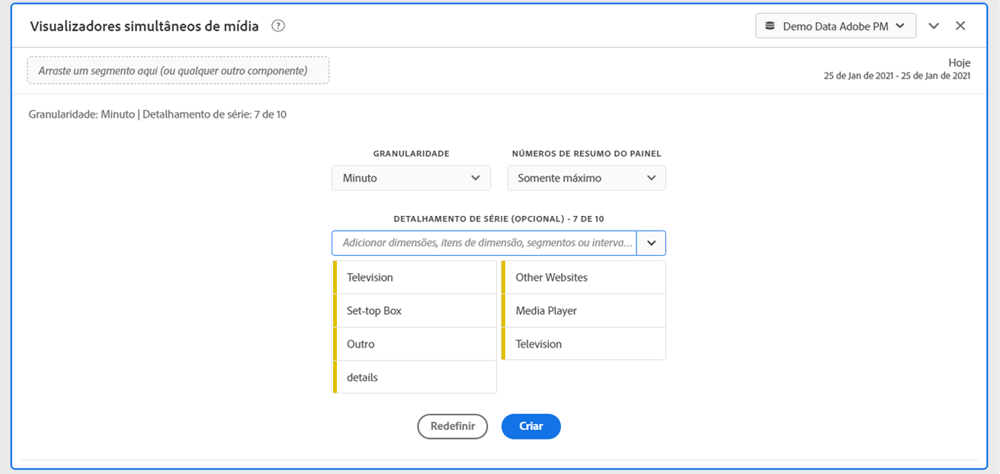
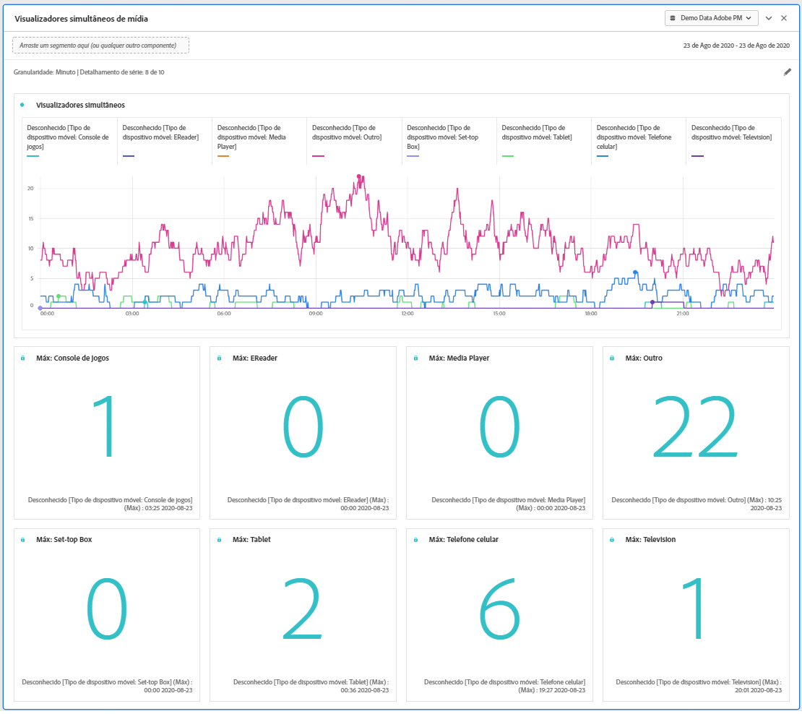
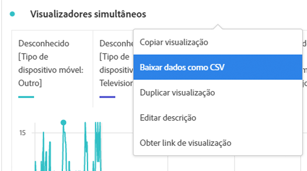

# Painel Visualizadores simultâneos de mídia {#media-concurrent-viewers-panel}

<!-- markdownlint-disable MD034 -->

>[!CONTEXTUALHELP]
>id="cja_workspace_mediaconcurrentviewers_button"
>title="Visualizadores simultâneos de mídia"
>abstract="Crie um painel para analisar o público-alvo médio por minuto de um conteúdo específico ou ao longo de um período específico."

<!-- markdownlint-enable MD034 -->

<!-- markdownlint-disable MD034 -->

>[!CONTEXTUALHELP]
>id="cja_workspace_mediaconcurrentviewers_panel"
>title="Visualizadores simultâneos de mídia"
>abstract="Analise visualizadores simultâneos ao longo do tempo, visualize o pico de simultaneidade ou analise e compare.  **Granularidade**: selecione o período pelo qual visualizar visualizadores simultâneos. **Números de resumo do painel**: Opção para mostrar números de resumo com detalhes de data ou hora para cada linha. Maximum mostrará detalhes para o pico de simultaneidade. O Mínimo mostrará detalhes para o vale. **Detalhamento por séries (opcional)**: analisar a visualização por segmentos, dimensões, itens de dimensão ou intervalos de datas. Exibir até 10 linhas por vez. Os detalhamentos são limitados a um único nível."

<!-- markdownlint-enable MD034 -->

>[!NOTE]
>
>O painel Público-alvo médio por minuto de mídia está disponível somente para clientes que compraram o complemento Coleção de mídia de transmissão para Customer Journey Analytics.
>
>Entre em contato com o representante de vendas da Adobe ou com a equipe de conta da Adobe para obter mais informações.
>

O painel **[!UICONTROL Visualizadores simultâneos de mídia]** permite a análise de visualizadores simultâneos ao longo do tempo, com detalhes sobre o pico de simultaneidade e a capacidade de detalhar e comparar.

Você pode analisar visualizadores simultâneos para entender onde ocorreu o pico de simultaneidade ou onde ocorreram quedas para fornecer insights valiosos sobre a qualidade do conteúdo e o envolvimento do visualizador. E para ajudar na solução de problemas ou no planejamento de volume ou escala.

No Analysis Workspace, a métrica Visualizadores simultâneos é o número de pessoas únicas que visualizam seus fluxos de mídia em um ponto específico do tempo, independentemente do número de sessões.

+++ Assista a uma demonstração em vídeo dessa funcionalidade.

>[!VIDEO](https://video.tv.adobe.com/v/330177/?quality=12)

{{videoaa}}

+++

## Use 

Para usar um painel **[!UICONTROL Visualizadores simultâneos de mídia]**:

1. Crie um painel **[!UICONTROL Visualizadores simultâneos de mídia]**. Para obter informações sobre como criar um painel, consulte [Criar um painel](panels.md#create-a-panel).

1. Selecione uma visualização de dados para o painel que tem componentes configurados no complemento Coleção de mídia de transmissão.

1. Especifique a [entrada](#panel-input) para o painel.

1. Observe a [saída](#panel-output) do painel.

### Entrada do painel

Você pode configurar o painel Visualizadores simultâneos de mídia usando estas configurações de entrada:

| Configuração | Descrição |
|---|---|
| **[!UICONTROL Intervalo de datas do painel]** | O padrão do intervalo de datas do painel é Hoje.  Você pode editá-lo para exibir um único dia ou muitos meses de cada vez.    Essa visualização é limitada a 1440 linhas de dados (por exemplo, 24 horas na granularidade no nível de minuto).  Se uma combinação de intervalo de datas e granularidade resultar em mais de 1440 linhas, a granularidade será atualizada automaticamente para ajustar o intervalo de datas completo. |
| **[!UICONTROL Granularidade]** | O padrão de granularidade é Minuto. Essa visualização é limitada a 1440 linhas de dados (por exemplo, 24 horas na granularidade no nível de minuto).  Se uma combinação de intervalo de datas e granularidade resultar em mais de 1440 linhas, a granularidade será atualizada automaticamente para ajustar o intervalo de datas completo. |
| **[!UICONTROL Números de resumo do painel]** | Para visualizar os detalhes de data ou hora de visualizadores simultâneos, um número de resumo está disponível. O Máximo mostra detalhes para a simultaneidade de pico. **[!UICONTROL Mínimo]** mostra detalhes para o vale.  O padrão do painel mostra somente Máximo, mas você pode alterá-lo para mostrar Mínimo ou Máximo e Mínimo.  Se você estiver usando detalhamentos, um número de resumo será exibido para cada um. |
| **[!UICONTROL Detalhamento por séries]** | Como opção, você pode detalhar sua visualização por filtros, dimensões, itens de dimensão ou intervalos de datas. Você pode exibir até 10 linhas por vez. Os detalhamentos são limitados a um único nível. Ao arrastar uma dimensão, os itens de dimensão principais são selecionados automaticamente com base no intervalo de datas do painel selecionado. Para comparar intervalos de datas, arraste dois ou mais intervalos de datas para o filtro de detalhamento por séries. |

Este é um exemplo do painel configurado para granularidade de **[!UICONTROL Minuto]**, com apenas **[!UICONTROL Máximo]** números de resumo. E detalhado por **[!UICONTROL Outros]**, **[!UICONTROL Tabela]**, **[!UICONTROL Celular]**, **[!UICONTROL Console de Jogos]**, **[!UICONTROL Player de Mídia]**, **[!UICONTROL Decodificador de Sinais]**, **[!UICONTROL Televisão]**.

### Saída do painel

O painel Visualizadores simultâneos de mídia retorna um gráfico de linha e números de resumo para incluir detalhes do máximo e/ou mínimo de visualizadores simultâneos.  Na parte superior do painel, uma linha de resumo é fornecida para lembrar das configurações do painel que você selecionou.

A qualquer momento, selecione  para editar e recriar o painel.

Se você selecionar um detalhamento por séries, uma linha no gráfico de linha e um número de resumo será exibida para cada:

### Fonte de dados

A única métrica que pode ser usada neste painel é **[!UICONTROL Visualizadores simultâneos]**:

| Métrica | Descrição |
|---|---|
| **[!UICONTROL Visualizadores simultâneos]** | O número de pessoas únicas que visualizam seus fluxos de mídia em um momento específico, independentemente do número de sessões. |

Uma tabela de forma livre não está disponível nessa visualização.  Para exibir a fonte de dados, você pode baixá-la no menu de contexto de visualização do gráfico de linha e selecionar **[!UICONTROL Baixar dados como CSV]**.  Os detalhamentos por séries estão incluídos.

## Perguntas frequentes

| Pergunta | Resposta |
|---|---|
| Onde está a tabela de forma livre? Como posso ver a fonte de dados? | A tabela de forma livre não está disponível nessa visualização.  Você pode baixar a fonte de dados no menu de contexto do gráfico de linhas e selecionar **[!UICONTROL Baixar dados como CSV]**. |
| Por que minha granularidade mudou? | Essa visualização é limitada a 1440 linhas de dados (por exemplo, 24 horas na granularidade no nível de minuto).  Se uma combinação de intervalo de datas e granularidade resultar em mais de 1440 linhas, a granularidade será atualizada automaticamente para ajustar o intervalo de datas completo.  Ao alterar de um intervalo de datas maior para menor, a granularidade é atualizada para o detalhe mais baixo permitido quando o intervalo de datas é alterado. Para exibir uma granularidade mais alta, edite o painel e recrie. |
| Como comparar nomes de vídeo, filtros, tipos de conteúdo e outros? | Para comparar esses itens em uma única visualização, arraste filtros, dimensões ou itens de dimensão específicos no filtro de detalhamento por séries.  A visualização é limitada a 10 detalhamentos.  Para exibir mais de 10, você deve usar vários painéis. |
| Como comparar intervalos de datas? | Para comparar intervalos de data em uma única visualização, use os detalhamentos por séries arrastando dois ou mais intervalos de datas.  Os intervalos de datas substituem o intervalo de datas do painel. |
| Como alterar o tipo de visualização? | Esse painel permite somente a visualização de linha para a série de tempo. |
| Posso executar a detecção de anomalias? | Não.  A detecção de anomalias não está disponível para esse painel. |
| Por que usar pessoas únicas em vez de sessões ativas? | Usar pessoas únicas permite a remoção de picos indesejados nos limites de exibição (em que as sessões estão terminando e começando ao mesmo tempo). |
| O que significa ter visualizadores simultâneos com maior granularidade do que um minuto? | Com uma granularidade maior que um minuto, visualizadores simultâneos é a soma de visualizadores simultâneos exclusivos para todos os minutos desse intervalo de tempo.  Por exemplo, visualizadores simultâneos de granularidade em nível de hora são a soma de visualizadores simultâneos exclusivos para todos os minutos da hora. |
| O painel Espaço de trabalho mostra as mesmas informações que o Relatório de visualizadores simultâneos? | Não.  No Analysis Workspace, a métrica Visualizadores simultâneos é definida como o número de pessoas únicas que visualizam seu fluxo de mídia em um ponto específico do tempo. Independentemente do número de sessões.  Essa métrica é diferente dos relatórios do Visualizador simultâneo na seção Relatórios, que usa Sessões ativas simultâneas. A utilização de contas de pessoas únicas para a remoção de picos indesejados nos limites de exibição (em que as sessões estão terminando e começando ao mesmo tempo). |

<!-- For more information about Media Concurrent Viewers, visit [MA doc page]( https://url). -->

>[!MORELIKETHIS]
>
>[Criar um painel](/help/analysis-workspace/c-panels/panels.md#create-a-panel)
>[Painel Tempo gasto com a reprodução da mídia](media-playback-time-spent.md)
>[Painel Audiência média por minuto da mídia](average-minute-audience-panel.md)
>