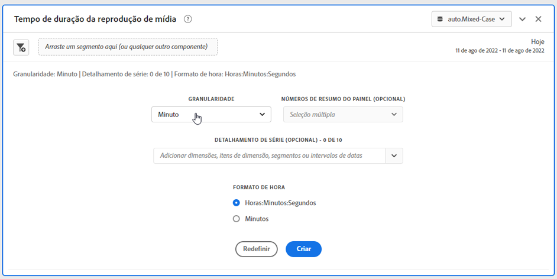
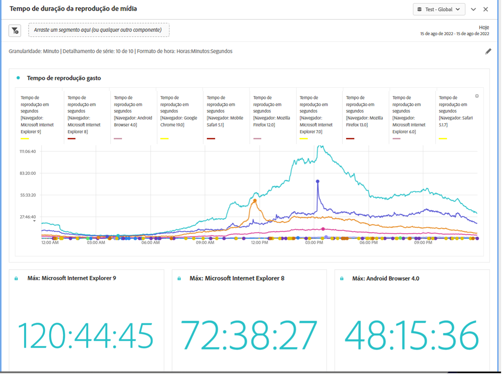

# Painel de tempo gasto com a reprodução da mídia {#media-playback-time-spent-panel}

<!-- markdownlint-disable MD034 -->

>[!CONTEXTUALHELP]
>id="workspace_mediaplaybacktimespent_button"
>title="Tempo gasto com a reprodução da mídia"
>abstract="Crie um painel para analisar o consumo de vídeo ao longo do tempo, com vários níveis de granularidade e a capacidade de detalhar e comparar."

<!-- markdownlint-enable MD034 -->

<!-- markdownlint-disable MD034 -->

>[!CONTEXTUALHELP]
>id="workspace_mediaplaybacktimespent_panel"
>title="Tempo gasto com a reprodução da mídia"
>abstract="Analise o consumo de vídeo ao longo do tempo, selecione várias granularidades e, opcionalmente, analise e compare usando filtros, dimensões, itens de dimensão ou intervalos de datas."

<!-- markdownlint-enable MD034 -->

>[!BEGINSHADEBOX]

_Este artigo documenta o painel Tempo gasto com a reprodução de mídia no_  _**Customer Journey Analytics**_. _Consulte o [painel Tempo gasto com a reprodução da mídia](https://experienceleague.adobe.com/en/docs/analytics/analyze/analysis-workspace/panels/media-playback-time-spent) da_ versão  _**Adobe Analytics** deste artigo._

>[!ENDSHADEBOX]

>[!NOTE]
>
>O painel Público-alvo médio por minuto de mídia está disponível somente para clientes que compraram o complemento Coleção de mídia de transmissão para o Customer Journey Analytics.
>Entre em contato com o representante de vendas da Adobe ou com a equipe de conta da Adobe para obter mais informações.
>

O painel **[!UICONTROL Tempo gasto com a reprodução da mídia]** permite a análise da reprodução ao longo do tempo, com detalhes sobre o pico de simultaneidade e a capacidade de detalhar e comparar.

No Analysis Workspace, o Tempo gasto com a reprodução é a quantidade de tempo gasto visualizando seus fluxos de mídia em um momento específico. Inclui pausa, buffer e hora de início.

Os clientes que compraram o complemento Coleção de mídia de transmissão podem analisar o tempo de reprodução gasto para obter insights valiosos sobre a qualidade do conteúdo e o envolvimento do visualizador. E para ajudar na solução de problemas ou no planejamento de volume ou escala.

O tempo gasto com a reprodução pode ajudá-lo a entender:

* Em que ocorreu o pico de simultaneidade.

* Onde ocorreram quedas.

>[!BEGINSHADEBOX]

Consulte  [Tempo gasto com a reprodução da mídia](https://video.tv.adobe.com/v/338699){target="_blank"} para ver um vídeo de demonstração.

{{videoaa}}

>[!ENDSHADEBOX]

## Usar

Para usar um painel **[!UICONTROL Tempo gasto com a reprodução da mídia]**:

1. Crie um painel **[!UICONTROL Tempo gasto com a reprodução da mídia]**. Para obter informações sobre como criar um painel, consulte [Criar um painel](panels.md#create-a-panel).

1. Selecione uma visualização de dados para o painel que tem componentes configurados na coleção de mídia de transmissão.

1. Especifique a [entrada](#panel-input) do painel.

1. Observe a [saída](#panel-output) do painel.

### Entrada do painel

Você pode configurar o painel Tempo gasto com a reprodução de mídia usando estas configurações de entrada:

| Configuração | Descrição |
|---|---|
| Intervalo de datas do painel | O padrão do intervalo de datas do painel é Hoje. Você pode editá-lo para exibir um único dia ou muitos meses de cada vez. Essa visualização é limitada a 1440 linhas de dados (por exemplo, 24 horas na granularidade no nível de minuto). Se uma combinação de intervalo de datas e granularidade resultar em mais de 1440 linhas, a granularidade será atualizada automaticamente para ajustar o intervalo de datas completo. |
| Granularidade | O padrão de granularidade é Minuto. Essa visualização é limitada a 1440 linhas de dados (por exemplo, 24 horas na granularidade no nível de minuto). Se uma combinação de intervalo de datas e granularidade resultar em mais de 1440 linhas, a granularidade será atualizada automaticamente para ajustar o intervalo de datas completo. |
| Números de resumo do painel | Para visualizar os detalhes de data ou hora do tempo gasto com a reprodução, um número de resumo está disponível. O Máximo mostra detalhes para a simultaneidade de pico. O Mínimo mostra detalhes para o vale. O total soma o tempo total gasto com a reprodução para a seleção. O padrão do painel mostra somente o Máximo, mas você pode alterá-lo para mostrar Mínimo, Total ou qualquer combinação dos três. Se você estiver usando detalhamentos, um número de resumo será exibido para cada um. |
| Detalhamento por séries | Como opção, você pode detalhar sua visualização por filtros, dimensões, itens de dimensão ou intervalos de datas.
- É possível exibir até 10 linhas por vez. Os detalhamentos são limitados a um único nível.

- Ao arrastar uma dimensão, os itens de dimensão principais são selecionados automaticamente com base no intervalo de datas do painel selecionado.
- Para comparar intervalos de datas, arraste dois ou mais intervalos de datas para o filtro de detalhamento por séries. |
| Formato de tempo | Você pode visualizar o tempo gasto com a reprodução em `Hours:Minutes:Seconds` (padrão) ou em `Minutes` (que é exibido em números inteiros, arredondados para 0,5). |
| Exibição da sequência de data | Se você tiver colocado pelo menos dois filtros de intervalo de datas como detalhamentos de séries, verá a opção de selecionar sobreposição (padrão) ou sequencial. Sobreposição exibe as linhas com um início comum do eixo x para que sejam executadas em paralelo, enquanto sequencial exibe as linhas com seu início específico do eixo x. Se os dados se alinharem (por exemplo, o filtro 1 termina às 20h44 e o filtro 2 começa às 20h45), as linhas serão exibidas em sequência. |

### Saída do painel

O painel Tempo gasto com a reprodução de mídia retorna um gráfico de linhas e números de resumo para incluir detalhes sobre o tempo máximo, mínimo e/ou a soma do tempo gasto com a reprodução. Na parte superior do painel, uma linha de resumo é fornecida para lembrar das configurações do painel que você selecionou.

A qualquer momento, selecione  para editar e recriar o painel.

Se você selecionar o detalhamento por séries, uma linha no gráfico de linhas e um número de resumo será exibida para cada:

### Fonte de dados

A única métrica que pode ser usada nesse painel é Tempo gasto com a reprodução.

| Métrica | Descrição |
|---|---|
| Tempo gasto com a reprodução | Total de `hours:minutes:seconds` (ou `minutes`) do conteúdo exibido durante a granularidade selecionada, incluindo pausa, buffer e tempo para iniciar. |

## Perguntas frequentes

| Pergunta | Resposta |
|---|---|
| Onde está a tabela de forma livre? Como posso ver a fonte de dados? | 

A tabela de forma livre não está disponível nessa visualização. Para baixar a fonte de dados, no menu de contexto no gráfico de linhas, selecione a opção para baixar o arquivo CSV.
 |
| 
Por que minha granularidade mudou?
 | 
Essa visualização é limitada a 1440 linhas de dados (por exemplo, 24 horas na granularidade no nível de minuto). Se uma combinação de intervalo de datas e granularidade resultar em mais de 1440 linhas, a granularidade será atualizada automaticamente para ajustar o intervalo de datas completo.

Ao alterar de um intervalo de datas maior para menor, a granularidade é atualizada para o detalhe mais baixo permitido quando o intervalo de datas é alterado. Para exibir uma granularidade mais alta, edite o painel e recrie.
 |
| 

Como comparar nomes de vídeo, filtros, tipos de conteúdo e muito mais?
 | 
Para compará-los em uma única visualização, arraste filtros, dimensões ou itens de dimensão específicos no filtro de detalhamento por séries.

A visualização é limitada a 10 detalhamentos. Para exibir mais de 10, você deve usar vários painéis.
 |
| Como comparar intervalos de datas? | Para comparar intervalos de data em uma única visualização, use os detalhamentos por séries arrastando dois ou mais intervalos de datas. Esses intervalos de datas substituem o intervalo de datas do painel. |
| Como alterar o tipo de visualização? | 

Esse painel permite somente a visualização de linha para a série de tempo.
 |
| Posso executar a detecção de anomalias? | 

Não. A detecção de anomalias não está disponível para esse painel.
 |

>[!MORELIKETHIS]
>
>[Criar um painel](/help/analysis-workspace/c-panels/panels.md#create-a-panel)
>[Painel Audiência média por minuto da mídia](average-minute-audience-panel.md)
>[Painel de visualizadores simultâneos de mídia](media-concurrent-viewers.md)
>
