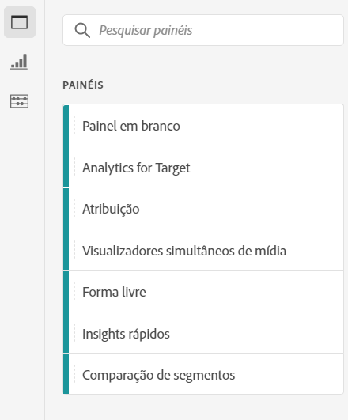
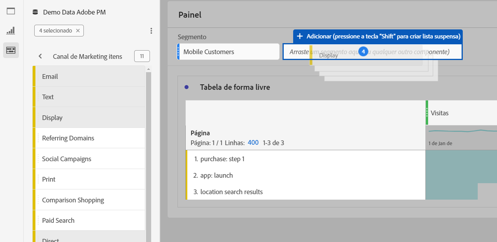

# Visão geral dos painéis

Um [!UICONTROL painel] é uma coleção de tabelas e visualizações. Você pode acessar os painéis por meio do ícone superior esquerdo no Workspace ou um [painel em branco](/help/analysis-workspace/c-panels/blank-panel.md). Os painéis são úteis quando você deseja organizar seus projetos de acordo com períodos, visualizações de dados ou casos de uso de análise.

## Tipos de painel

Os seguintes tipos de painel estão disponíveis no Analysis Workspace para o [!UICONTROL Customer Journey Analytics]:

| Nome do painel | Descrição |
| --- | --- |
| [Painel em branco](/help/analysis-workspace/c-panels/blank-panel.md) | Escolha entre os painéis e visualizações disponíveis para iniciar a análise. |
| [Painel do Quick Insights](quickinsight.md) | Crie rapidamente uma tabela de forma livre e uma visualização de acompanhamento para analisar e descobrir insights mais rapidamente. |
| [Painel de atribuição](attribution.md) | Compare e visualize modelos de atribuição rapidamente usando qualquer dimensão e métrica de conversão. |
| [Painel de forma livre](freeform-panel.md) | Realize comparações e detalhamentos ilimitados e, em seguida, adicione visualizações para obter uma visão ampla dos dados. |
| [Painel de visualizadores simultâneos de mídia](media-concurrent-viewers.md) | Analise os visualizadores simultâneos ao longo do tempo, com detalhes sobre o pico de simultaneidade e a capacidade de analisar e comparar. |
| [Painel Tempo gasto com a reprodução de mídia](/help/analysis-workspace/c-panels/media-playback-time-spent.md) | Analise o tempo de reprodução gasto para entender onde ocorreu o pico de simultaneidade ou onde ocorreram desistências. |

Os painéis [!UICONTROL Quick Insights], [!UICONTROL Em branco] e [!UICONTROL Forma livre] são excelentes locais para iniciar a análise, enquanto que o [!UICONTROL Attribution IQ] é recomendado para análises mais avançadas. Um botão `"+"` está disponível nos projetos para que você possa adicionar painéis em branco a qualquer momento.

O painel inicial padrão é o painel [!UICONTROL Forma livre], mas você também pode definir o [painel em branco](/help/analysis-workspace/c-panels/blank-panel.md) como padrão.

## Calendário {#calendar}

O calendário do painel controla o intervalo de relatórios para tabelas e visualizações dentro de um painel.

Observação: se um componente de intervalo de datas (roxo) for usado em uma tabela, uma visualização ou uma zona suspensa do painel, ele substituirá o calendário do painel.

Você pode aplicar um intervalo de datas com detalhamento de minutos nas configurações avançadas do calendário do painel. Se você estiver emitindo relatórios em um intervalo de datas que abrange muitos dias, a hora de início se aplica ao primeiro dia e a hora de término se aplica ao último dia do intervalo.

## Zona suspensa {#dropzone}

A zona de destino do painel permite aplicar filtros simples e filtros suspensos em todas as tabelas e visualizações de um painel. Você pode aplicar um ou vários filtros a um painel. O título acima de cada filtro pode ser modificado clicando no lápis de edição ou você pode clicar com o botão direito do mouse para removê-lo completamente.

### Filtros

Arraste e solte quaisquer Filtros do painel esquerdo na área de lançamento do painel para começar a filtrá-lo.

### Filtros ad hoc

Os componentes que não são de filtros também podem ser arrastados diretamente para a zona de destino para criar filtros ad hoc, poupando o tempo e esforço de ter que ir até o Construtor de filtros. Os filtros criados dessa maneira são definidos automaticamente como filtros de nível de evento. Essa definição pode ser modificada clicando no ícone de informações (i) ao lado do filtro e, em seguida, no ícone de edição em forma de lápis e editando-a no Construtor de filtros.

Os filtros ad hoc são um tipo de filtro rápido e são locais ao projeto. Elas não aparecem no painel esquerdo, a menos que você as torne públicas.

Para obter mais informações, consulte [Filtros rápidos](/help/components/filters/quick-filters.md).

### Filtros suspensos estáticos

Os filtros suspensos permitem que você interaja com os dados de forma controlada. Por exemplo, é possível adicionar um filtro suspenso de Tipos de dispositivo móvel para que você possa filtrar o painel por Tablet, Celular ou Desktop.

Filtros suspensos também podem ser usados para consolidar vários projetos em um único. Por exemplo, se você tiver muitas versões do mesmo projeto com diferentes filtros de País aplicados, é possível consolidar todas as versões em um único projeto e adicionar um filtro suspenso de País.

Para criar um filtro suspenso estático:

* Para filtros suspensos usando itens de dimensão, clique no ícone de seta para a direita ao lado da dimensão desejada no painel esquerdo. Essa ação expõe todos os itens de dimensão disponíveis. Selecione vários itens de dimensão dessa lista usando `[Shift + Click]` ou `[Ctrl + Click]`, em seguida, solte-os na área suspensa do painel **ao manter`[Shift]`**.
* Para filtros suspensos usando outros componentes, como métricas, filtros ou intervalos de datas, selecione vários componentes usando `[Shift + Click]` ou `[Ctrl + Click]`. Solte a seleção na área suspensa do painel **ao manter`[Shift]`**. Todos os tipos de componentes são tratados como filtros neste contexto.
* Um único filtro suspenso só pode conter um único tipo de componente. Se você incluir vários tipos de componentes na seleção, um filtro suspenso separado será criado por tipo de componente. Por exemplo, se você incluir métricas e itens de dimensão na seleção, dois filtros suspensos separados serão criados. Um filtro suspenso inclui itens de dimensão e o outro inclui métricas.

Selecione uma das opções na lista suspensa para alterar os dados no painel. Também é possível optar por não filtrar os dados do painel ao selecionar **[!UICONTROL Sem filtro]**.

Clicar com o botão direito em um filtro suspenso fornece as seguintes opções:

* **[!UICONTROL Adicionar rótulo]**: quando você adiciona um filtro suspenso a um projeto, um rótulo é automaticamente definido para o nome do componente. Se você excluir o rótulo, poderá adicioná-lo novamente com essa opção.
* **[!UICONTROL Excluir rótulo]**: remova o texto acima de um filtro suspenso.
* **[!UICONTROL Excluir filtro suspenso]**: remove o filtro suspenso do painel.

[Assista ao vídeo](https://experienceleague.adobe.com/docs/analytics-learn/tutorials/analysis-workspace/using-panels/using-panels-to-organize-your-analysis-workspace-projects.html?lang=pt-BR) para saber mais sobre como adicionar filtros suspensos ao seu projeto.

### Filtros suspensos dinâmicos

Os filtros suspensos dinâmicos permitem determinar os valores disponíveis com base nos dados dentro do intervalo de relatórios do painel e nos valores em outros filtros suspensos. Por exemplo, você pode criar dois menus suspensos dinâmicos usando uma dimensão Países e uma dimensão Cidades. Quando você seleciona um país na lista suspensa Países UICONTROL, a lista suspensa Cidades se ajusta dinamicamente para mostrar apenas as cidades nesse país.

Esse mesmo conceito se aplica a todas as dimensões; somente os itens de dimensão que aparecem dentro do intervalo de datas do painel e filtros selecionados são visíveis. Os itens de Dimension selecionados nos filtros suspensos estáticos afetam os valores disponíveis nos filtros suspensos dinâmicos. No entanto, o inverso não é verdadeiro; os itens de Dimension selecionados em filtros suspensos dinâmicos não afetam os valores disponíveis em filtros suspensos estáticos.

A seleção manual de itens de dimensão estará disponível se você antecipar que um determinado item de dimensão será coletado no futuro. Também é possível limpar um filtro suspenso dinâmico para que ele não contenha um valor, permitindo que outros filtros suspensos dinâmicos contenham mais valores. Selecionar **[!UICONTROL Redefinir tudo]** para limpar a seleção de todos os filtros suspensos desse painel.

Para criar um filtro suspenso dinâmico:

* Arraste e solte uma única dimensão na área suspensa do painel **ao manter`[Shift]`**.
* Os filtros suspensos dinâmicos não estão disponíveis para métricas, filtros ou intervalos de datas.
* Clique com o botão direito em um filtro suspenso e selecione **[!UICONTROL Excluir filtro]** para excluí-lo.

Clicar com o botão direito em um filtro suspenso dinâmico fornece as mesmas opções que os filtros suspensos estáticos.

## Clique com o botão direito do mouse no menu {#right-click}

A funcionalidade adicional para um painel está disponível clicando com o botão direito do mouse no cabeçalho do painel.

As seguintes configurações estão disponíveis:

| Configuração | Descrição |
| --- | --- |
| [!UICONTROL Inserir visualização/painel copiado] | Permite colar (&quot;inserir&quot;) um painel ou visualização copiada em outro lugar no projeto ou em um projeto diferente. |
| [!UICONTROL Copiar painel] | Permite clicar com o botão direito do mouse e copiar um painel, para que você possa inseri-lo em outro lugar no projeto ou em um projeto diferente. |
| [!UICONTROL Duplicar o painel] | Cria uma duplicata exata do painel atual, que você pode modificar. |
| [!UICONTROL Recolher/expandir todos os painéis] | Recolhe e expande todos os painéis do projeto. |
| [!UICONTROL Recolher/Expandir todas as visualizações no painel] | Recolhe e expande todas as visualizações no painel atual. |
| [!UICONTROL Editar descrição] | Adicione (ou edite) uma descrição de texto para o painel. |
| [!UICONTROL Obter link do painel] | Permite direcionar alguém a um painel específico em um projeto. Quando o link for clicado, o destinatário será solicitado a fazer logon antes de ser direcionado para o painel exato que está vinculado. |
