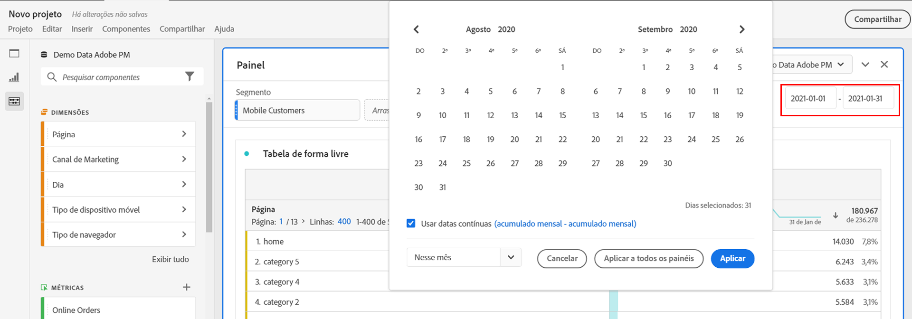
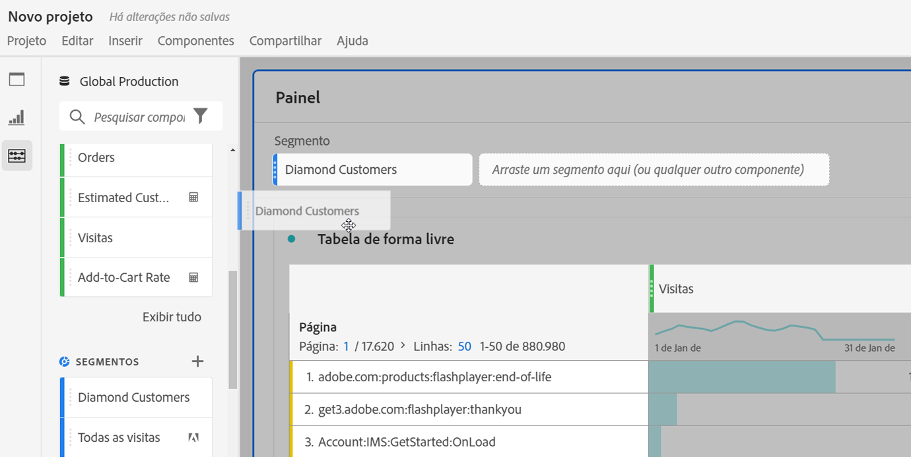
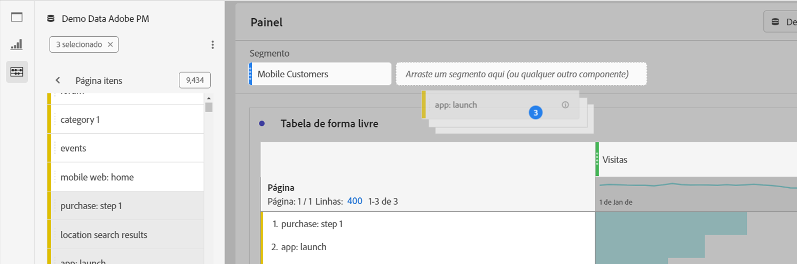
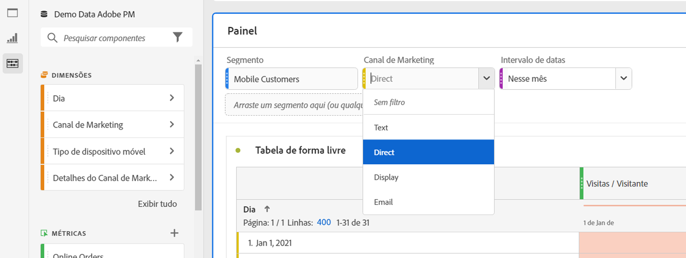
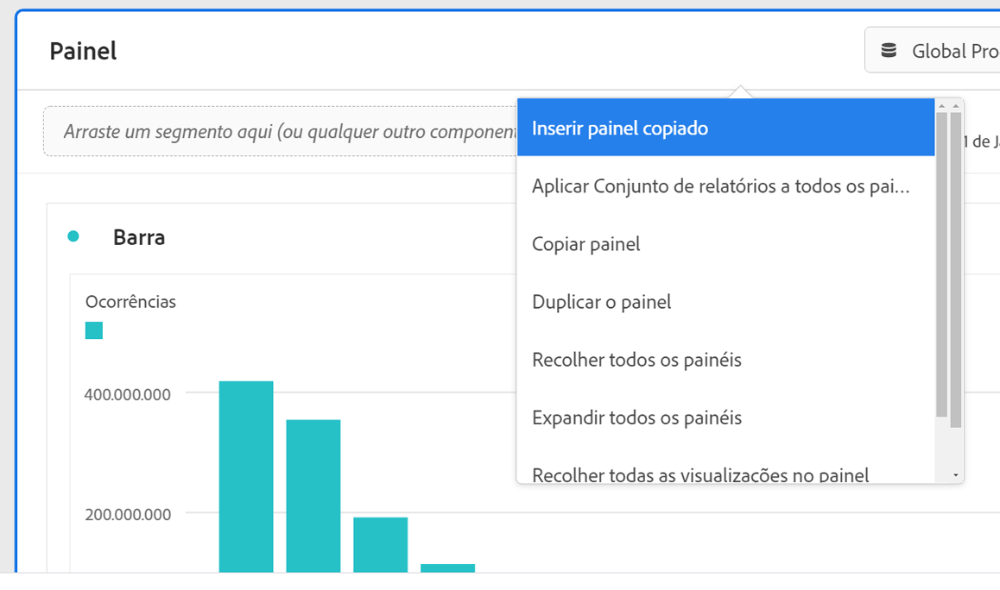

# Visão geral dos painéis

Um [!UICONTROL painel] é uma coleção de tabelas e visualizações. Você pode acessar os painéis utilizando o ícone no canto superior esquerdo do espaço de trabalho ou por meio de um [painel em branco](/help/analysis-workspace/c-panels/blank-panel.md). Os painéis são úteis quando você deseja organizar seus projetos de acordo com períodos, visualizações de dados ou casos de uso de análise.

## Tipos de painel

Os seguintes tipos de painel estão disponíveis no Analysis Workspace para o [!UICONTROL Customer Journey Analytics]:

| Nome do painel | Descrição |
| --- | --- |
| [Painel em branco](/help/analysis-workspace/c-panels/blank-panel.md) | Escolha entre os painéis e visualizações disponíveis para iniciar a análise. |
| [Atribuição](attribution.md) | Compare e visualize modelos de atribuição rapidamente usando qualquer dimensão e métrica de conversão. |
| [Experimentação](experimentation.md) | Compare diferentes variações de experiências de usuário, marketing ou mensagens para determinar a opção ideal para gerar um resultado específico. |
| [Forma livre](freeform-panel.md) | Realize comparações e detalhamentos ilimitados e, em seguida, adicione visualizações para obter uma visão ampla dos dados. |
| [Público médio a cada minuto de mídia](average-minute-audience-panel.md) | Analise o público médio por minuto de um conteúdo específico ou ao longo de um período personalizado. |
| [Visualizadores simultâneos de mídia](media-concurrent-viewers.md) | Analise os visualizadores simultâneos ao longo do tempo, com detalhes sobre o pico de simultaneidade e a capacidade de criar um detalhamento e comparar. |
| [Tempo gasto com a reprodução da mídia](/help/analysis-workspace/c-panels/media-playback-time-spent.md) | Analise o tempo de reprodução gasto para entender onde ocorrem os picos de simultaneidade ou as desistências. |
| [Próximo item ou anterior](next-previous.md) | Mostra as páginas seguintes ou anteriores que as pessoas acessam. |
| [Insights rápidos](quickinsight.md) | Crie rapidamente uma tabela de forma livre e uma visualização de acompanhamento para analisar e descobrir insights mais rapidamente. |

Os painéis [!UICONTROL Insights rápidos], [!UICONTROL Em branco] e [!UICONTROL Forma livre] são ótimos lugares para começar a análise, enquanto que o painel [!UICONTROL Atribuição] é recomendado para análises mais avançadas. Um  está disponível na parte inferior da tela para que você possa adicionar painéis em branco a qualquer momento.

O painel inicial padrão é o de [!UICONTROL Forma livre], mas você também pode definir o [Painel em branco](/help/analysis-workspace/c-panels/blank-panel.md) ou [Insights rápidos](/help/analysis-workspace/c-panels/quickinsight.md) como padrão. Consulte [Preferências de projetos e análise](/help/analysis-workspace/user-preferences.md#projects--analyses-preferences).

## Criar um painel

Para criar um painel:

* Arraste e solte um painel do menu esquerdo **[!UICONTROL Painéis]** sobre a tela.
* Selecione um painel no [Painel em branco](blank-panel.md).
* Use o menu **[!UICONTROL Inserir]** no espaço de trabalho e selecione seu painel. Você também pode usar qualquer um dos [atalhos](../build-workspace-project/fa-shortcut-keys.md) para inserir um painel.

  

É possível:

* Selecione  **em** qualquer painel para adicionar outra visualização. Isso exibe um pop-up que permite selecionar uma visualização.

  

  | Selecione. | Para criar um(a)... |
  |---|---|
  |  | [Tabela de forma livre](/help/analysis-workspace/visualizations/freeform-table/freeform-table.md) |
  |  | [Linha](/help/analysis-workspace/visualizations/line.md) |
  |  | [Barra](/help/analysis-workspace/visualizations/bar.md) |
  |  | [Número do resumo](/help/analysis-workspace/visualizations/summary-number-change.md) |
  |  | [Texto](/help/analysis-workspace/visualizations/text.md) |
  |  | [Fallout](/help/analysis-workspace/visualizations/fallout/fallout-flow.md) |
  |  | [Fluxo](/help/analysis-workspace/visualizations/c-flow/flow.md) |
  |  | [Área empilhada](/help/analysis-workspace/visualizations/area.md) |
  |  | [Tabela de coorte](/help/analysis-workspace/visualizations/cohort-table/t-cohort.md) |
  |  | [Marcador](/help/analysis-workspace/visualizations/bullet-graph.md) |
  |  | [Rosca](/help/analysis-workspace/visualizations/donut.md) |
  |  | [Alteração de resumo](/help/analysis-workspace/visualizations/summary-number-change.md) |
  |  | [Histograma](/help/analysis-workspace/visualizations/histogram.md) |
  |  | [Dispersão](/help/analysis-workspace/visualizations/scatterplot.md) |
  |  | [Venn](/help/analysis-workspace/visualizations/venn.md) |
  |  | [Mapas de árvore](/help/analysis-workspace/visualizations/treemap.md) |

* Selecione  **fora** do último painel no espaço de trabalho para adicionar outro [painel em branco](blank-panel.md).

## Visualização de dados

Cada painel é associado a uma [visualização de dados](/help/data-views/data-views.md), identificada pelo nome  **[!UICONTROL *da visualização de dados *]**no menu suspenso no canto superior direito do painel.

Ao criar um projeto em branco no espaço de trabalho, a visualização de dados padrão do painel inicial é a visualização de dados na qual você trabalhou pela última vez no Customer Journey Analytics.

Ao criar um novo painel, a visualização de dados padrão se baseia na visualização de dados do painel em que você trabalhou pela última vez no projeto do espaço de trabalho.

>[!IMPORTANT]
>
>A visualização de dados selecionada determina quais dimensões, métricas e segmentos estão disponíveis para criar visualizações em um painel.
>
>
>Ao alternar a visualização de dados de um painel, alguns dos componentes podem não estar disponíveis nessa nova visualização de dados. Essa alteração pode fazer com que a visualização não seja renderizada corretamente. Você poderá ver avisos como:
>
>* Esse painel contém componentes que não estão habilitados na visualização de dados selecionada. Altere a visualização de dados ou habilite os componentes necessários na visualização de dados.
>* Não é possível renderizar a visualização: verifique as colunas e linhas para garantir que elas contenham componentes válidos.
>

## Calendário

O calendário do painel controla o intervalo de datas de relatórios para tabelas e visualizações em um painel.

>[!NOTE]
>
>Se um componente de intervalo de datas  for usado em uma visualização ou painel (por exemplo, como um segmento), esse componente substituirá o calendário do painel.
>

1. Selecione um intervalo de datas escolhendo primeiro a data inicial e, em seguida, a data final.
Também é possível selecionar uma **[!UICONTROL predefinição]** no menu suspenso [!UICONTROL *Selecionar uma predefinição*].

1. Ou selecione **[!UICONTROL Mostrar configurações avançadas]** para:

   * Especificar uma **[!UICONTROL Hora de início]** e **[!UICONTROL Hora de término]** diferentes das opções padrão `12:00 AM` (`0:00`) e `11:59 PM` (`23:59`). Os horários de término sempre incluem 59 segundos. No caso de um intervalo de datas que abrange muitos dias, a hora inicial se aplica ao primeiro dia do intervalo de datas, e a hora final se aplica ao último dia do intervalo de datas. Use **[!UICONTROL (Redefinir valores de tempo)]** para redefinir os valores padrão de hora inicial e final.
   * **[!UICONTROL Tornar os componentes do intervalo de datas relativos ao calendário do painel]**. Se essa opção estiver desabilitada, os componentes de intervalo de datas usados no painel serão relativos à hora atual. Se habilitada, os componentes de intervalo de datas usados no painel serão relativos ao calendário do painel.
   * **[!UICONTROL Usar datas contínuas]**. Se habilitada, os intervalos de datas predefinidos como **[!UICONTROL Últimos 7 dias completos]** são atualizados dinamicamente de acordo com a data e hora atuais. Se desabilitada, essas predefinições não são atualizadas depois de aplicadas.

     

     É possível selecionar o texto entre parênteses (por exemplo, **[!UICONTROL início fixo - acumulado diário]**) para estender o painel e especificar detalhes para **[!UICONTROL Início]** e **[!UICONTROL Fim]**.

      1. Selecione **[!UICONTROL Início de]**, **[!UICONTROL Fim de]** ou **[!UICONTROL Dia fixo]**.
      1. Ao selecionar **[!UICONTROL Início de]** ou **[!UICONTROL Fim de]**, você pode criar uma expressão completa. Por exemplo: **[!UICONTROL Fim do]** **[!UICONTROL ano atual]** **[!UICONTROL mais]** `1` **[!UICONTROL dia]**. Escolha o valor apropriado para cada parte individual da expressão.
         * Selecione um valor para o atual. Por exemplo, **[!UICONTROL ano atual]**.
         * Selecione um valor para o cálculo adicional. Por exemplo, **[!UICONTROL mais]**.
         * Ao definir um cálculo adicional, especifique um valor. Por exemplo, `1`.
         * Depois de especificar o cálculo adicional, selecione o período a ser usado para o cálculo. Por exemplo, **[!UICONTROL dia]**.

     Selecione **[!UICONTROL Ocultar detalhes]** para ocultar os detalhes do cálculo de datas contínuas.

1. Selecione **[!UICONTROL Aplicar]** para aplicar o intervalo de datas ao painel no qual você abriu o calendário.
Selecione **[!UICONTROL Aplicar a todos os painéis]** para aplicar o intervalo de datas a todos os painéis no projeto do espaço de trabalho.

## Área de arrastar e soltar {#dropzone}

A área de destino do painel permite aplicar segmentos e segmentos suspensos a todas as tabelas e visualizações em um painel. É possível aplicar um ou mais segmentos a um painel.

### Filtros

Arraste e solte os segmentos do painel à esquerda na área de destino do painel para começar a segmentá-lo. Repita esse processo para adicionar mais segmentos ao painel. Os filtros aparecem lado a lado na parte superior do painel.

#### Segmentos rápidos

Além dos segmentos, também é possível arrastar outros tipos de componentes diretamente para a zona de destino para criar segmentos rápidos, economizando o tempo e esforço de usar o [Construtor de segmentos](/help/components/filters/filter-builder.md). Os filtros criados dessa maneira são definidos automaticamente como segmentos de nível de evento. Para modificar rapidamente essa definição, selecione  ao lado do nome do segmento.

Para obter mais informações consulte [Segmentos rápidos](/help/components/filters/quick-filters.md).

### Filtros suspensos

>[!BEGINSHADEBOX]

Consulte  [Filtros suspensos](https://video.tv.adobe.com/v/23877?quality=12&learn=on){target="_blank"} para assistir a um vídeo de demonstração.

{{videoaa}}

>[!ENDSHADEBOX]

#### Segmentos suspensos estáticos

Os segmentos suspensos estáticos permitem interagir com os dados de forma controlada. Por exemplo, é possível adicionar um segmento suspenso para Tipos de dispositivo móvel para segmentar o painel por Tablet, Celular ou Desktop.

Segmentos suspensos estáticos também podem ser usados para consolidar vários projetos em um único. Por exemplo, se você tiver muitas versões do mesmo projeto com diferentes segmentos de País aplicados, é possível consolidar todas as versões em um único projeto e adicionar um segmento suspenso de País.

##### Criar segmentos suspensos estáticos

* Para segmentos suspensos que usam itens de dimensão, selecione uma única dimensão no painel esquerdo e solte-a na área de destino do painel enquanto mantém pressionada a tecla ⇧ (*Shift*). Essa ação cria um segmento suspenso com todos os itens de dimensão que estão associados a essa dimensão.

  Ou, se quiser que o segmento suspenso inclua apenas itens de dimensão específicos associados a uma dimensão, clique no ícone de seta para a direita ao lado da dimensão desejada no painel esquerdo. Essa ação expõe todos os itens de dimensão disponíveis. Selecione vários itens de dimensão desta lista usando ⇧+ (*shift* + *selecionar*) ou ^+ (*control* + *selecionar*), depois solte-os na área de destino do painel **enquanto mantém pressionada a tecla** ⇧. 

* Para segmentos suspensos que usam um único tipo de componente (por exemplo, somente dimensões, somente segmentos ou somente métricas), selecione vários itens do mesmo tipo no painel esquerdo usando ⇧+ ou ^+. Em seguida, solte os itens na área de destino do painel **enquanto mantém pressionada a tecla** ⇧.

  Um único segmento suspenso será criado com os componentes selecionados.

* Para segmentos suspensos que usam uma mistura de tipos de componentes (como 2 métricas e 3 segmentos), selecione vários componentes usando ⇧+ ou ^+. Solte a seleção na área de destino do painel **enquanto mantém pressionada a tecla** ⇧. Nesse contexto, todos os tipos de componentes são tratados como segmentos suspensos separados. Por exemplo, se você incluir métricas e itens de dimensão na seleção, dois segmentos suspensos separados serão criados: um segmento suspenso que inclui itens de dimensão e outro que inclui métricas.

Um segmento suspenso fornece as seguintes opções no menu de contexto:

* **[!UICONTROL Excluir item suspenso]**: remove o segmento suspenso do painel.
* **[!UICONTROL Excluir rótulo]**: remove o texto exibido acima de um segmento suspenso. Para modificar o rótulo, passe o mouse sobre ele e selecione .
* **[!UICONTROL Adicionar rótulo]**: ao adicionar um segmento suspenso a um projeto, um rótulo é definido automaticamente para o nome do componente. Se você excluir o rótulo, poderá adicioná-lo novamente com essa opção.
* **[!UICONTROL Exigir seleção]**: torna obrigatória a definição de um segmento no painel.

##### Usar segmentos suspensos estáticos

É possível usar o menu suspenso de segmento de qualquer uma das seguintes maneiras para segmentar o painel:

* Aplicar um único segmento ao painel selecionando o segmento na lista de segmentos suspensos.

* Aplicar vários segmentos ao painel selecionando mais de um segmento na lista de segmentos suspensos. O painel é segmentado para incluir qualquer um dos segmentos selecionados.

#### Segmentos suspensos dinâmicos

Os segmentos suspensos dinâmicos permitem determinar os valores disponíveis com base nos dados dentro do intervalo de relatórios do painel e nos valores de outros segmentos suspensos. Por exemplo, você pode criar dois menus suspensos dinâmicos usando uma dimensão Países e uma dimensão Cidades. Ao selecionar um país na lista suspensa **[!UICONTROL Países]**, a lista suspensa **[!UICONTROL Cidades]** se ajusta dinamicamente para mostrar apenas cidades desse país.

Esse mesmo conceito se aplica a todas as dimensões: somente os itens de dimensão que aparecem dentro do intervalo de datas do painel e dos segmentos selecionados são visíveis. Os itens de dimensão selecionados em segmentos suspensos estáticos afetam os valores disponíveis nos segmentos suspensos dinâmicos. No entanto, o inverso não é verdadeiro: os itens de dimensão selecionados em segmentos suspensos dinâmicos não afetam os valores disponíveis nos segmentos suspensos estáticos.

A seleção manual de itens de dimensão estará disponível se você antecipar que um determinado item de dimensão será coletado no futuro. Também é possível limpar um segmento suspenso dinâmico para que ele não contenha um valor, permitindo que outros segmentos suspensos dinâmicos contenham mais valores. Selecione **[!UICONTROL Redefinir tudo]** para limpar a seleção de todos os segmentos suspensos desse painel.

Para criar um segmento suspenso dinâmico:

* Arraste e solte uma única dimensão na área de destino do painel **enquanto mantém pressionada a tecla** ⇧.

Observe que os segmentos suspensos dinâmicos não estão disponíveis para métricas, segmentos ou intervalos de datas.

Um segmento suspenso dinâmico fornece as mesmas opções de menu de contexto que os segmentos suspensos estáticos.

## Menu de contexto

Outras funcionalidades do painel estão disponíveis por meio do menu de contexto (clique com o botão direito) no cabeçalho do painel.

Estas são as opções disponíveis:

| Opção | Descrição |
| --- | --- |
| **[!UICONTROL Inserir painel copiado]** | Permite colar um painel copiado em outro lugar dentro do projeto ou em um projeto diferente. |
| **[!UICONTROL Inserir visualização copiada]** | Cola uma visualização copiada em outro lugar dentro do painel, projeto ou em um projeto diferente. |
| **[!UICONTROL Aplicar visualização de dados a todos os painéis]** | Aplica a visualização de dados desse painel a todos os outros painéis no projeto. |
| **[!UICONTROL Copiar painel]** | Copia um painel para que você possa inseri-lo em outro lugar dentro do projeto ou em um projeto diferente. |
| **[!UICONTROL Duplicar o painel]** | Cria uma duplicata exata do painel atual, a qual você pode modificar. |
| **[!UICONTROL Recolher todos os painéis]** | Recolhe todos os painéis do projeto. |
| **[!UICONTROL Expandir todos os painéis]** | Expande todos os painéis do projeto. |
| **[!UICONTROL Recolher todas as visualizações no painel]** | Recolhe todas as visualizações no painel atual. |
| **[!UICONTROL Expandir todas as visualizações no painel]** | Expande todas as visualizações no painel atual. |
| **[!UICONTROL Editar descrição]** | Adicione (ou edite) uma descrição de texto para o painel. |
| **[!UICONTROL Obter link do painel]** | Direciona alguém para um painel específico dentro de um projeto. Ao clicar no link, o destinatário deverá fazer logon antes de acessar o painel exato vinculado. |

## Configuração

Alguns painéis (como [!UICONTROL Atribuição], [!UICONTROL Experimentação], [!UICONTROL Público médio por minuto de mídia] e outros) têm uma caixa de diálogo de configuração para ajudar você a criar a visualização. Use a opção  na parte superior do painel para acessar e alterar a configuração.

