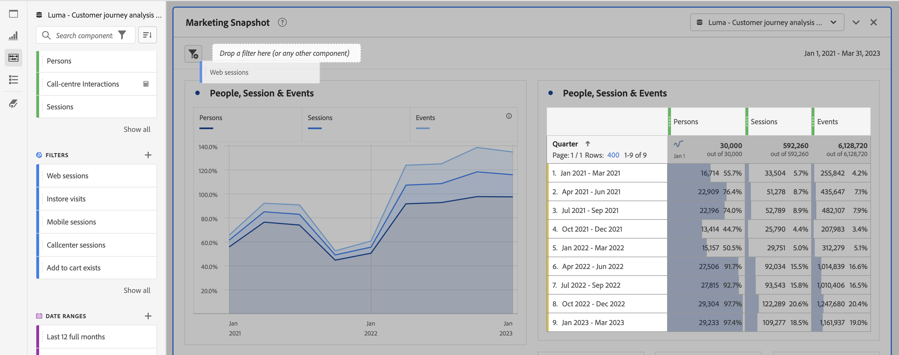

# Visão geral dos painéis

Um [!UICONTROL painel] é uma coleção de tabelas e visualizações. Você pode acessar os painéis por meio do ícone superior esquerdo no Workspace ou um [painel em branco](/help/analysis-workspace/c-panels/blank-panel.md). Painéis são úteis quando você deseja organizar seus projetos de acordo com períodos de tempo, visualizações de dados ou caso de uso de análise.

## Tipos de painel

Os seguintes tipos de painel estão disponíveis no Analysis Workspace para [!UICONTROL Customer Journey Analytics]:

| Nome do painel | Descrição |
| --- | --- |
| [Painel em branco](/help/analysis-workspace/c-panels/blank-panel.md) | Escolha entre os painéis e visualizações disponíveis para iniciar a análise. |
| [Painel do Quick Insights](quickinsight.md) | Crie rapidamente uma tabela de forma livre e uma visualização de acompanhamento para analisar e descobrir insights mais rapidamente. |
| [Painel de atribuição](attribution.md) | Compare e visualize modelos de atribuição rapidamente usando qualquer dimensão e métrica de conversão. |
| [Painel de forma livre](freeform-panel.md) | Realize comparações e detalhamentos ilimitados e, em seguida, adicione visualizações para obter uma visão ampla dos dados. |

[!UICONTROL Quick Insights], [!UICONTROL Em branco] e [!UICONTROL Forma livre] painéis são excelentes locais para iniciar a análise, enquanto [!UICONTROL Attribution IQ] se presta a análises mais avançadas. Um botão `"+"` está disponível nos projetos para que você possa adicionar painéis em branco a qualquer momento.

O painel inicial padrão é o painel [!UICONTROL Forma livre], mas você também pode definir o [painel em branco](/help/analysis-workspace/c-panels/blank-panel.md) como padrão.

## Calendário {#calendar}

O calendário do painel controla o intervalo de relatórios para tabelas e visualizações em um painel.

Observação: se um componente de intervalo de datas (roxo) for usado em uma tabela, uma visualização ou uma zona suspensa do painel, ele substituirá o calendário do painel.

Você pode aplicar um intervalo de datas de minuto sob as configurações avançadas do calendário do painel. Se você estiver relatando um intervalo de datas que abrange muitos dias, a hora inicial se aplica ao primeiro dia e a hora final se aplica ao último dia do intervalo.

## Zona suspensa {#dropzone}

A área de soltar do painel permite aplicar filtros e filtros suspensos a todas as tabelas e visualizações em um painel. Você pode aplicar um ou vários filtros a um painel. O título acima de cada filtro pode ser modificado clicando no lápis de edição ou você pode clicar com o botão direito do mouse para removê-lo completamente.

### Filtros

Arraste e solte quaisquer Filtros do painel esquerdo na área de soltar do painel para começar a filtrar o painel.

### Filtros ad hoc

Os componentes não filtros também podem ser arrastados diretamente para a área suspensa para criar filtros ad-hoc, economizando tempo e esforço de ir para o Construtor de filtros. Os filtros criados dessa forma são definidos automaticamente como filtros de nível de ocorrência. Essa definição pode ser modificada ao clicar no ícone de informações (i) ao lado do filtro, em seguida no ícone de edição em forma de lápis e editá-lo no Construtor de filtros.

Filtros ad-hoc são locais para o projeto e não serão exibidos no painel esquerdo, a menos que você os torne públicos.

### Filtros suspensos {#dropdown-filter}

Além dos filtros, os filtros suspensos permitem interagir com os dados de forma controlada. Por exemplo, você pode adicionar um filtro suspenso para Tipos de dispositivo móvel para filtrar o painel por Tablet, Telefone móvel ou Desktop.

Filtros suspensos também podem ser usados para consolidar vários projetos em um único. Por exemplo, se você tiver muitas versões do mesmo projeto com filtros de País diferentes aplicados, é possível consolidar todas as versões em um único projeto e adicionar um filtro suspenso País .

Para criar filtros suspensos:

1. Para criar um filtro suspenso usando [!UICONTROL itens de Dimension], como valores dentro da dimensão [!UICONTROL Canal de marketing], clique no ícone de seta para a direita ao lado da dimensão no painel esquerdo. Essa ação expõe todos os itens disponíveis. Selecione um ou vários itens do componente no painel esquerdo e solte-os na área suspensa do painel **enquanto mantém pressionada a tecla Shift**. Isso os transformará em um filtro suspenso, em vez de em um único filtro.
1. Para criar um filtro suspenso usando outro componente, como métricas, filtros ou intervalos de datas, selecione de um tipo de componente no painel à esquerda e solte na área de soltar do painel **mantendo a tecla Shift pressionada**.
1. Selecione uma das opções na lista suspensa para alterar os dados no painel. Também é possível optar por não filtrar os dados do painel ao selecionar **[!UICONTROL Nenhum filtro]**.

[Assista ao vídeo](https://experienceleague.adobe.com/docs/analytics-learn/tutorials/analysis-workspace/using-panels/using-panels-to-organize-your-analysis-workspace-projects.html?lang=pt-BR) para saber mais sobre como adicionar filtros suspensos ao seu projeto.

## Clique com o botão direito do mouse no menu {#right-click}

A funcionalidade adicional para um painel está disponível clicando com o botão direito do mouse no cabeçalho do painel.

As seguintes configurações estão disponíveis:

| Configuração | Descrição |
| --- | --- |
| [!UICONTROL Inserir visualização/painel copiado] | Permite colar (“inserir”) um painel ou visualização copiada em outro lugar no projeto ou em outro projeto completamente diferente. |
| [!UICONTROL Copiar painel] | Permite clicar com o botão direito do mouse e copiar um painel, para que você possa inseri-lo em outro lugar no projeto ou em um projeto completamente diferente. |
| [!UICONTROL Duplicar o painel] | Cria uma duplicata exata do painel atual, que você pode modificar. |
| [!UICONTROL Recolher/expandir todos os painéis] | Recolhe e expande todos os painéis do projeto. |
| [!UICONTROL Recolher/Expandir todas as visualizações no painel] | Recolhe e expande todas as visualizações no painel atual. |
| [!UICONTROL Editar descrição] | Adicione (ou edite) uma descrição de texto para o painel. |
| [!UICONTROL Obter link do painel] | Permite direcionar alguém a um painel específico em um projeto. Quando o link for clicado, o destinatário será solicitado a fazer logon antes de ser direcionado para o painel exato que está vinculado. |
