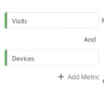
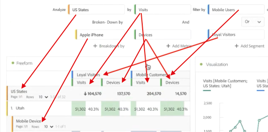

# Painel do Insights rápidos

O painel do [!UICONTROL Insights rápidos] fornece orientação para não analistas e novos usuários do [!UICONTROL Analysis Workspace] para saber como responder a perguntas comerciais de forma rápida e fácil. É também uma excelente ferramenta para usuários avançados que desejam responder rapidamente a uma pergunta simples sem precisar criar uma tabela.

Ao usar o [!UICONTROL Analysis Workspace] pela primeira vez, você pode se perguntar quais visualizações são mais úteis, quais dimensões e métricas podem promover insights, onde arrastar e soltar itens, onde criar um filtro, etc.

Para ajudar nisso, e com base no uso de componentes de dados da sua própria empresa no [!UICONTROL Analysis Workspace], o [!UICONTROL Insights rápidos] utiliza um algoritmo que apresentará as dimensões, as métricas, os filtros e os intervalos de datas mais usados pela sua empresa. Na verdade, você verá dimensões, métricas e filtros marcados como [!UICONTROL Popular] na lista suspensa, como mostrado aqui:

O [!UICONTROL Insights rápidos] ajuda a

* Criar corretamente uma tabela de dados e uma visualização que a acompanha no [!UICONTROL Analysis Workspace].
* Aprender a terminologia e o vocabulário de componentes básicos e pedaços do [!UICONTROL Analysis Workspace].
* Faça detalhamentos simples de dimensões, adicione várias métricas ou compare filtros facilmente em uma [!UICONTROL tabela de forma livre].
* Alterar ou experimentar vários tipos de visualização para encontrar a ferramenta para sua análise de forma rápida e intuitiva.

## Terminologia básica

A seguir, estão alguns dos termos básicos que você precisa conhecer. Cada tabela de dados consiste em 2 ou mais elementos (componentes) que você usa para contar sua história de dados.

| Elemento (Componente) | Definição |
|---|---|
| [!UICONTROL Dimensão] | Dimensões são descrições ou características de dados de métricas que podem ser visualizadas, analisadas e comparadas em um projeto. São valores não numéricos e datas que se dividem em itens de dimensão. Por exemplo, &quot;navegador&quot; ou &quot;página&quot; são dimensões. |
| [!UICONTROL Item de dimensão] | Os itens de dimensão são valores individuais para uma dimensão. Por exemplo, os itens de dimensão para a dimensão do navegador seriam &quot;Chrome&quot;, &quot;Firefox&quot;, &quot;Edge&quot; etc. |
| [!UICONTROL Métrica] | Métricas são informações quantitativas sobre a atividade da pessoa, como exibições, click-throughs, recarregamentos, tempo médio gasto, unidades, pedidos, receita e assim por diante. |
| [!UICONTROL Visualização] | O Workspace oferece [várias visualizações](/help/analysis-workspace/visualizations/freeform-analysis-visualizations.md) para criar representações visuais de seus dados, como gráficos de barras, gráficos de rosca, histogramas, gráficos de linhas, mapas, gráficos de dispersão e outros. |
| [!UICONTROL Detalhamento de dimensão] | Um detalhamento de dimensão é uma forma de detalhar literalmente uma dimensão por outras dimensões. Em nosso exemplo, você pode dividir os Estados Unidos por dispositivos móveis para obter as visitas de dispositivos móveis por estado, ou pode dividir os dispositivos móveis por tipos de dispositivos móveis, por regiões, por campanhas internas, etc. |
| [!UICONTROL filtro] | filtros permitem identificar subconjuntos de pessoas com base em características ou interações no site. Por exemplo, você pode criar filtros de [!UICONTROL Visitante] com base em atributos (tipo de navegador, dispositivo, número de visitas, país, gênero), com base em interações (campanhas, pesquisas por palavra-chave, mecanismo de pesquisa), com base em saídas e entradas (pessoas do Facebook, uma página de destino definida, um domínio de referência) ou com base em variáveis personalizadas (campo de formulário, categorias definidas, ID do cliente). |

## Introdução ao Insights rápidos

1. Faça logon no Customer Journey Analytics usando as credenciais fornecidas.
1. Vá para o [!UICONTROL Workspace], clique em **[!UICONTROL Criar novo projeto]** e depois em **[!UICONTROL Insights rápidos]**. (Você também pode acessar esse painel no menu **[!UICONTROL Painel]** no painel esquerdo.)

   

   

1. Ao iniciar pela primeira vez, confira o breve tutorial que aborda as noções básicas do [!UICONTROL painel do Insights rápidos]. Ou clique em **[!UICONTROL Ignorar tutorial]**.
1. Selecione os elementos (também conhecidos como componentes): dimensões (laranja), métricas (verde), filtros (azul) ou intervalos de datas (roxo). É necessário selecionar pelo menos uma dimensão e uma métrica para que uma tabela seja criada automaticamente.

   

   Há três maneiras de selecionar os elementos:
   * Arraste e solte-os do painel esquerdo.
   * Se você souber o que está procurando: comece a digitar e o [!UICONTROL Insights rápidos] preencherá os espaços em branco para você.
   * Clique na lista suspensa e pesquise a lista.

1. Quando você tiver adicionado pelo menos uma dimensão e uma métrica, o seguinte será criado:

   * Uma tabela de forma livre com a dimensão (aqui, Estados dos EUA) verticalmente e a métrica (aqui, Visitas) horizontalmente na parte superior. Confira esta tabela:

   

   * Uma visualização complementar, neste caso um [gráfico de barras](/help/analysis-workspace/visualizations/bar.md). A visualização gerada tem como base o tipo de dados que você adicionou à tabela. Todos os dados com base no tempo (como [!UICONTROL Visitas] por dia/mês) assumem o padrão de um gráfico de [!UICONTROL Linha]. Todos os dados não baseados em tempo (como [!UICONTROL Visitas] por [!UICONTROL dispositivo]) assumem o padrão de um gráfico de [!UICONTROL Barra]. Você pode alterar o tipo de visualização clicando na seta suspensa ao lado do tipo de visualização.

1. (Opcional) Detalhe as dimensões e veja os itens de dimensão clicando na seta > direita ao lado da dimensão.

1. Tente adicionar mais detalhes conforme descrito abaixo em &quot;Mais dicas&quot;.

1. Salve o projeto clicando em **[!UICONTROL Projeto > Salvar]**.

## Mais dicas

Outras dicas úteis aparecerão no [!UICONTROL Construtor do Insights rápidos], algumas delas dependendo da última ação.

* Primeiro, siga o tutorial **[!UICONTROL Mais dicas]**: acesse-o por meio da Ajuda (?) ícone ao lado do título [!UICONTROL Insights rápidos]. Esse tutorial é exibido 24 horas após você ter criado um projeto com pelo menos uma dimensão e uma métrica.

  

* **Detalhamento por**: você pode usar até três níveis de detalhamento em dimensões para detalhar os dados que realmente precisa.

  

* **Adicionar mais métricas**: você pode adicionar até mais duas métricas usando o operador AND para adicioná-las à tabela.

  

* **Adicionar mais filtros**: é possível adicionar até 2 filtros extras usando os operadores AND ou OR para adicioná-los à tabela. Observe o que acontece com a tabela quando você adiciona usuários móveis OR Visitantes leais. Eles ficam próximos um do outro, acima das métricas. Se você adicionasse usuários móveis E visitantes fidelizados, veria os resultados de ambos os filtros juntos e eles seriam empilhados um sobre o outro na tabela.

  

## Limitações conhecidas

Se você tentar editar diretamente na tabela, o painel do [!UICONTROL Insights rápidos] ficará fora de sincronia. Você pode restaurá-lo para as configurações anteriores do [!UICONTROL Insights rápidos] clicando em **[!UICONTROL Ressincronizar o construtor]** na parte superior direita do painel.

Você receberá um aviso antes de adicionar algo diretamente à tabela:

Caso contrário, criar diretamente fará com que a tabela se comporte como uma tabela de forma livre tradicional, sem os recursos úteis para novos usuários.
