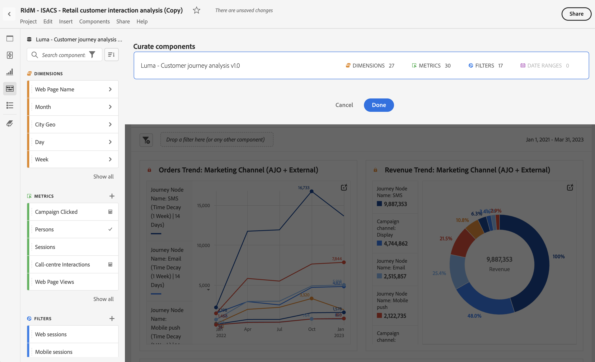

# Preparar projetos do

A preparação permite limitar os componentes (dimensões, métricas, segmentos, intervalos de datas) antes de compartilhar um projeto. Ao abrir o projeto, o destinatário verá um conjunto limitado de componentes que você preparou. A preparação é uma etapa opcional, mas recomendada, antes de compartilhar um projeto.

>[!NOTE]
> Os perfis de produto são o principal mecanismo que controla os componentes que um usuário pode ver. Eles são gerenciados por meio do [CX Enterprise Admin Console](https://experienceleague.adobe.com/pt-br/docs/core-services/interface/administration/admin-tool-experience-cloud). A preparação é um segmento secundário.

## Aplicar preparação de projeto

1. Clique em **[!UICONTROL Compartilhar]** > **[!UICONTROL Preparar dados do projeto]**.
Os componentes usados no projeto serão adicionados automaticamente.
Se um projeto tiver várias visualizações de dados, você verá um destino de preparação para cada visualização de dados do projeto.
1. (Opcional) Para adicionar outros componentes, arraste os que deseja compartilhar do painel esquerdo até a zona de destino **[!UICONTROL Preparar componentes]** da visualização de dados.
1. Selecione **[!UICONTROL Concluído]**.

<!--
Curation can also be applied from the [!UICONTROL Share] menu by selecting **[!UICONTROL Curate and Share]**. This option automatically curates the project to the components in use in the project. You can add additional components following the steps above.
-->

Ao abrir um projeto preparado, o destinatário verá apenas o conjunto preparado de componentes que você definiu:

## Remover preparação do projeto

Para remover a curadoria do projeto e restaurar o conjunto completo de componentes no painel esquerdo:

1. Clique em **[!UICONTROL Compartilhar]** > **[!UICONTROL Preparar dados do projeto]**.
1. Clique em **[!UICONTROL Remover preparação]**.
1. Selecione **[!UICONTROL Concluído]**.

## Opções de preparação de componentes

Em um projeto preparado, o destinatário terá a opção de **[!UICONTROL Mostrar todos]** os componentes no painel esquerdo. [!UICONTROL Mostrar tudo] revela conjuntos diferentes de componentes, dependendo dos seguintes fatores:

* O nível de permissão do usuário (administrador ou não)
* Função do projeto (proprietário/editor ou não)
* Tipo de curadoria aplicada (no nível do projeto)

| Tipo de curadoria | O administrador pode visualizar | O proprietário não administrador do projeto (ou com função de edição) pode visualizar | O usuário não administrador com função duplicada pode visualizar |
| --- | --- | --- | --- |
| **Componentes *ocultos* de uma visualização de dados** | Todos os componentes da visualização de dados estão disponíveis para geração de relatórios (componentes ocultos exigem a seleção da opção **[!UICONTROL Mostrar todos]**) | Não disponível para relatório | Não disponível para relatório |
| **Componentes adicionados ou removidos de uma visualização de dados** | Somente componentes adicionados à visualização de dados (ocultos ou não ocultos). Admins não podem criar relatórios sobre campos ou componentes que não tenham sido definidos na visualização de dados. | Somente componentes adicionados à visualização de dados ou componentes de propriedade ou compartilhados com o usuário. Componentes ocultos não estão disponíveis (como curadoria de conjunto de relatórios virtuais). | Somente componentes adicionados à visualização de dados não ficam ocultos e são incluídos na preparação do projeto. |
| **Componentes preparados em um projeto** | Todos os componentes da visualização de dados que estão disponíveis para geração de relatórios (componentes ocultos exigem a seleção da opção **[!UICONTROL Mostrar todos]**) | Todos os componentes de visualização de dados não ocultos (exige que se clique em &quot;mostrar tudo&quot;) | Somente componentes preparados, além de quaisquer componentes de propriedade ou compartilhados com o usuário |
| **Projeto preparado usando uma visualização de dados com componentes ocultos** | Todos os componentes de dados que estão disponíveis para geração de relatórios (componentes ocultos e não preparados exigem a seleção da opção **[!UICONTROL Mostrar todos]**) | Todos os componentes de projeto não preparados, todos os componentes de visualização de dados não ocultos e quaisquer componentes de propriedade do usuário ou compartilhados com o usuário | Somente componentes preparados, além de quaisquer componentes de propriedade do usuário ou compartilhados com o usuário |
