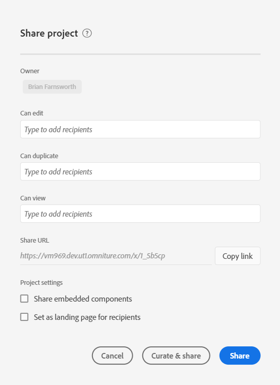

# Compartilhar projetos {#share-projects}

>[!CONTEXTUALHELP]
>id="workspace_shareprojects"
>title="Compartilhar projetos"
>abstract="Você pode compartilhar qualquer uma dessas funções de projeto com outros usuários em sua organização."

É possível compartilhar um projeto do Analysis Workspace com os seguintes tipos de pessoas:

* Usuários e grupos da sua organização que têm acesso ao Customer Journey Analytics

  Você pode compartilhar o acesso a edição, duplicação ou exibição

* Usuários e grupos da sua organização que não têm acesso ao Customer Journey Analytics

  Destinatários possuem acesso de somente leitura

* Pessoas de fora da organização

  Destinatários possuem acesso de somente leitura

Qualquer [preparação](curate.md) feita antes do compartilhamento será refletida quando os destinatários abrirem o projeto.

>[!BEGINSHADEBOX]

Consulte  [Compartilhamento de projetos no Analysis Workspace](https://experienceleague.adobe.com/pt-br/docs/customer-journey-analytics-learn/tutorials/analysis-workspace/curate-and-share/share-with-anyone-in-analysis-workspace){target="_blank"} para assistir a um vídeo de demonstração.

>[!ENDSHADEBOX]

## Compartilhar com usuários e grupos da sua organização {#Add}

É possível compartilhar um projeto com usuários ou grupos do Adobe Analytics em sua organização. Ao compartilhar um projeto conforme descrito nesta seção, os usuários com os quais você compartilha já devem ter uma conta do Customer Journey Analytics.

Você pode compartilhar uma função específica com usuários ou grupos ou compartilhar um link.

* [Compartilhar uma função de projeto específica](#share-a-specific-project-role)

* [Compartilhar um link de um projeto](#share-a-link-to-a-project)

## Compartilhar uma função de projeto específica

Ao compartilhar uma função de projeto específica com usuários e grupos em sua organização, considere o seguinte:

* As funções do projeto (**[!UICONTROL Editar original]**, **[!UICONTROL Editar cópia]** e **[!UICONTROL Somente leitura]**) estão vinculadas ao usuário e à ID específica do projeto. As funções do projeto são independentes das permissões de usuário gerenciadas no [CX Enterprise Admin Console](https://experienceleague.adobe.com/pt-br/docs/core-services/interface/administration/admin-getting-started).

* No Customer Journey Analytics, os grupos são definidos por perfis de produtos no [CX Enterprise Admin Console](https://experienceleague.adobe.com/pt-br/docs/core-services/interface/administration/admin-getting-started). Os administradores podem compartilhar com qualquer grupo, incluindo *Todos*. Quem não é administrador pode compartilhar com qualquer grupo em que seja membro, exceto *Todos*.

* Um usuário que é colocado em várias funções sempre obtém a melhor experiência. Isso pode ocorrer se um usuário for adicionado como pessoa e como parte de um grupo. Por exemplo, se for dada a um usuário a função **[!UICONTROL Editar original]** como pessoa e a função **[!UICONTROL Somente leitura]** como membro de um grupo, o usuário receberá uma experiência de projeto **[!UICONTROL Editar original]**.

* Administradores colocados na função **[!UICONTROL Editar cópia]** ou de **[!UICONTROL Somente leitura]** recebem essas experiências limitadas quando abrem um projeto. Administradores podem alterar suas funções para **[!UICONTROL Editar original]** compartilhando o projeto com eles mesmos e concedendo a função Editar, conforme descrito no procedimento a seguir.

* Se vários projetos forem selecionados para compartilhamento, os destinatários serão adicionados à lista existente de destinatários para cada projeto.

  Por exemplo, o Projeto A já foi compartilhado com os destinatários 1, 2 e 3, enquanto o Projeto B foi compartilhado com os destinatários 4, 5 e 6.

  Os projetos A e B são então compartilhados com os destinatários 4 e 7. A nova lista de compartilhamento do Projeto A agora é 1, 2, 3, 4 e 7, enquanto a nova lista de compartilhamento do Projeto B é 4, 5, 6 e 7.

Para compartilhar uma função de projeto específica com usuários ou grupos na organização:

1. No Customer Journey Analytics, clique na guia [!UICONTROL **Workspace**] e selecione [!UICONTROL **Projetos**] no painel esquerdo.

1. Marque a caixa de seleção ao lado de um ou mais projetos que você deseja compartilhar e clique em [!UICONTROL **Compartilhar**].

   Ou

   Para compartilhar somente um projeto individual, abra o projeto que deseja compartilhar e clique em **[!UICONTROL Compartilhar]** > **[!UICONTROL Compartilhar com usuários do Espaço de trabalho]**.Se houver alterações não salvas, será solicitado que salve o projeto primeiro.

   A caixa de diálogo Compartilhar projeto é exibida. As seções [!UICONTROL **Compartilhar por link**] e [!UICONTROL **Configurações**] da caixa de diálogo estão visíveis somente ao compartilhar um único projeto.

   

1. Adicione destinatários ou grupos de destinatários em um dos campos de função fornecidos:

   **Editar original:** os destinatários podem **[!UICONTROL Salvar]** alterações em um projeto e atuar como coproprietários. Essa função é útil se você quiser gerenciar um projeto em conjunto com outros colegas. Essa função inclui editar, excluir e modificar listas de destinatários para um projeto compartilhado.  Observação: no momento, o Analysis Workspace não oferece suporte à colaboração ao vivo, portanto, recomenda-se que somente um usuário edite um projeto em um determinado momento. Se os projetos são salvos ao mesmo tempo, a versão mais recente é mantida.

   **Editar cópia:** os destinatários podem **[!UICONTROL Salvar como]** e têm acesso ao painel esquerdo. As interações entre projetos não são limitadas a essa função. Essa função é útil se você deseja compartilhar um projeto com usuários que entendem os dados de sua organização e como usar o Analysis Workspace, mas não quer que eles modifiquem o projeto.

   **Somente leitura:** os destinatários não podem **[!UICONTROL Salvar]** nem **[!UICONTROL Salvar como]**, e não têm acesso ao painel esquerdo. As interações do projeto também são limitadas. Esta função é útil se você quiser compartilhar um projeto com usuários que estão menos familiarizados com a estrutura de dados da sua organização, o Analysis Workspace ou o Customer Journey Analytics em geral. No entanto, você ainda deseja que eles consumam dados e insights em um ambiente seguro. Saiba mais sobre a [experiência de projeto de somente leitura](/help/analysis-workspace/curate-share/view-only-projects.md).

1. (Condicional) Se você estiver compartilhando um único projeto, escolha se deseja habilitar as seguintes opções ao compartilhar o projeto:

   * **Compartilhar componentes de projeto incorporados:** compartilha segmentos, métricas calculadas e intervalos de data com todos os destinatários. Após compartilhados, esses componentes aparecerão no menu suspenso Componentes do Espaço de trabalho do destinatário. Essa configuração não é persistente: é uma ação única para a ocasião do compartilhamento.

   * **Definir como página de destino para os destinatários:** define esta página como a página de destino dos destinatários. Essa configuração não é persistente: é uma ação única para a ocasião do compartilhamento.

1. Clique em **[!UICONTROL Compartilhar]**. (Se o projeto já foi compartilhado, clique em [!UICONTROL **Atualizar**].)

   Ou

   Clique em **[!UICONTROL Preparar e compartilhar]** para fazer a preparação do projeto automaticamente. (Se o projeto já tiver sido compartilhado, selecione **[!UICONTROL Preparar e atualizar]**.) Saiba mais sobre [curadoria de projeto](curate.md).

## Compartilhar um link de um projeto

Ao compartilhar um link conforme descrito nesta seção, considere o seguinte:

* Os destinatários que usam o link precisam fazer logon no Customer Journey Analytics antes de obter acesso ao projeto.

* Se um destinatário não tiver sido atribuído a uma função e receber um [link compartilhável](/help/analysis-workspace/curate-share/shareable-links.md) para o projeto (**[!UICONTROL Compartilhar] > [!UICONTROL Obter link do projeto]**), ele(a) receberá uma função por padrão. Administradores recebem **[!UICONTROL Editar original]** e os não administradores recebem **[!UICONTROL Editar cópia]**.

Para compartilhar o link do projeto com os usuários em sua organização:

1. Salve o projeto. Se houver alterações não salvas, você será solicitado a salvar o projeto antes de compartilhar um link.

1. Selecione **[!UICONTROL Compartilhar]** > **[!UICONTROL Compartilhar com usuários do Workspace]** e selecione **[!UICONTROL Copiar]** ao lado do campo **[!UICONTROL Compartilhar por link]**.

   

1. Compartilhe o link com usuários em sua organização. Por exemplo, você pode colá-lo em um email, em um site interno e assim por diante.

## Compartilhar um projeto com qualquer pessoa (sem necessidade de fazer logon) {#share-public-link}

>[!CONTEXTUALHELP]
>id="workspace_share_with_anyone_require_aec_authentication"
>title="Exigir autenticação da CX Enterprise"
>abstract="Sua organização exige que os usuários façam logon na CX Enterprise para usar esse link."

É possível conceder [acesso somente de leitura](/help/analysis-workspace/curate-share/view-only-projects.md) a projetos do Analysis Workspace a pessoas que não têm acesso ao Customer Journey Analytics. Esse acesso concedido pode incluir:

* Pessoas de fora da organização

* Pessoas da sua organização que não têm acesso ao Customer Journey Analytics

>[!NOTE]
>
>Considere o seguinte ao compartilhar um projeto do Analysis Workspace com pessoas que não têm acesso ao Customer Journey Analytics:
>
>* A possibilidade de compartilhar um projeto dessa maneira pode ser desabilitada pelo administrador do Customer Journey Analytics, conforme descrito em [Preferências](/help/analysis-workspace/user-preferences.md). Se você não puder compartilhar um projeto conforme descrito nesta seção, isso significa que o seu administrador do Customer Journey Analytics desabilitou esse recurso.
>
>* Projetos com mais de 50 visualizações expandidas só podem ser compartilhados com pessoas que têm acesso ao Customer Journey Analytics.
>
>* Os usuários com quem você compartilha podem visualizar quaisquer segmentos aplicados ao projeto durante a [preparação](curate.md).
> 
>* Usuários com os quais você compartilha podem alterar o intervalo de datas do projeto. O intervalo de datas definido para o projeto é exibido por padrão.
>
>* Um projeto pode se tornar inacessível se muitos usuários tentarem acessar um determinado link ao mesmo tempo. Por padrão, mais de 190 pessoas podem acessar um único link a cada 5 minutos. Se sua organização atingir esse limite, aguarde 5 minutos e tente acessar o link novamente.
>
>* Para as licenças [!DNL Healthcare Shield] e [!DNL Privacy & Security Shield], o recurso [!UICONTROL Compartilhar com qualquer pessoa] requer a autenticação do CX Enterprise. Para [!DNL Healthcare Shield] clientes, um aviso de &quot;conformidade com a HIPAA&quot; é exibido, mas você ainda pode usar esse recurso após a autenticação no CX Enterprise.

>[!BEGINSHADEBOX]

Consulte  [Compartilhar com qualquer pessoa](https://experienceleague.adobe.com/pt-br/docs/customer-journey-analytics-learn/tutorials/analysis-workspace/curate-and-share/share-with-anyone-in-analysis-workspace){target="_blank"} para assistir a um vídeo de demonstração.

>[!ENDSHADEBOX]

Para compartilhar um projeto do Analysis Workspace com qualquer pessoa:

1. Abra o projeto do Analysis Workspace que deseja compartilhar.

1. Clique em **[!UICONTROL Compartilhar]** > **[!UICONTROL Compartilhar com qualquer pessoa]**.

   Se houver alterações não salvas, será solicitado que você salve o projeto primeiro.

   <!-- Add screen shot of new modal -->

1. Habilite a opção **[!UICONTROL O link está ativo]** se ela ainda não estiver habilitada.

   Selecionar essa opção cria um link para o projeto que pode ser compartilhado com qualquer pessoa. Você pode desabilitar o acesso ao projeto a qualquer momento desativando essa opção.

   O proprietário do projeto também é o proprietário deste link. A propriedade do link pode ser transferida para outro usuário somente quando a propriedade do projeto é transferida, conforme descrito em [Transferir ativos](/help/tools/asset-transfer/transfer-assets.md), no guia do administrador do Analytics.

1. Escolha se deseja habilitar a seguinte opção de segurança (esta opção pode ser controlada pelo administrador do Customer Journey Analytics):

   * **[!UICONTROL Exigir autenticação da Experience Cloud]:**

     Quando essa opção está habilitada, os únicos usuários que podem acessar o projeto são aqueles que podem fazer logon na organização da CX Enterprise (Experience Cloud) em que o projeto que você está compartilhando foi criado. No entanto, usuários com os quais você compartilha não precisam ter acesso ao Customer Journey Analytics.

     Os administradores do Customer Journey Analytics podem configurar essa preferência para a empresa, conforme descrito em [Preferências](/help/analysis-workspace/user-preferences.md). É possível encontrar os seguintes cenários, dependendo de como a administração configurou essa opção:

      * Se essa opção não estiver visível, a administração do Customer Journey Analytics não habilitou esse recurso.

      * Se essa opção estiver ativada e você não puder desativá-la, a opção bloqueada significa que o administrador do Customer Journey Analytics requer a autenticação do CX Enterprise para qualquer pessoa que acessar os projetos da Analysis Workspace. Esse é sempre o caso de organizações que adquirem uma licença do Healthcare Shield.

1. Ao lado do campo **[!UICONTROL Compartilhar com qualquer pessoa (sem necessidade de fazer logon)]**, clique no ícone  para copiar o link para a área de transferência do seu sistema.

1. Compartilhe o link com as pessoas que você deseja que tenham acesso ao projeto. Por exemplo, você pode colar o link em um email.

   Qualquer pessoa com a qual você compartilha o link pode visualizar o projeto do Analysis Workspace.

1. (Opcional) É possível selecionar  para remover o acesso de usuários que receberam um link para o projeto anteriormente. É gerado um novo link que você pode compartilhar com os usuários que deseja que acessem o projeto.

1. Selecione **[!UICONTROL Fechar]** para fechar a caixa de diálogo compartilhar. Suas alterações são salvas automaticamente.

## Exibir projetos compartilhados com você

Quando alguém compartilha um projeto com você por [compartilhar uma função específica do projeto](#share-a-specific-project-role), é possível acessar os projetos compartilhados na [guia Projetos da página de destino do Analytics](/help/getting-started/landing.md#navigate-the-projects-tab).

Quando alguém compartilha um projeto com você por meio de um link (a partir da [guia Compartilhar projeto](#share-a-link-to-a-project) ou com um [link Compartilhar com qualquer pessoa](#share-a-project-with-anyone-no-login-required)), é necessário usar o link compartilhado para acessar o projeto. Por exemplo, o link pode ter sido compartilhado por email, um site interno e assim por diante.

## Compartilhar componentes integrados

Você pode compartilhar os componentes integrados que fazem parte do seu projeto.

>[!BEGINSHADEBOX]

Consulte  [Compartilhar componentes integrados no Analysis Workspace](https://experienceleague.adobe.com/pt-br/docs/customer-journey-analytics-learn/tutorials/analysis-workspace/curate-and-share/share-with-anyone-in-analysis-workspace){target="_blank"} para assistir a um vídeo de demonstração.

>[!ENDSHADEBOX]

## Perguntas frequentes {#FAQs}

| Pergunta | Resposta |
|---|---|
| O que acontece se dois editores salvam um projeto ao mesmo tempo? | As alterações não são mescladas e a última versão do projeto salva será mantida. Atualmente, o Analysis Workspace não oferece suporte à colaboração em tempo real. |
| Como administrador, que experiência de projeto verei? | Administradores colocados na função **[!UICONTROL Editar cópia]** ou **[!UICONTROL Somente leitura]** recebem essas experiências limitadas quando abrem um projeto. Se desejar, um administrador pode aumentar sua função para **[!UICONTROL Editar original]** a qualquer momento em **[!UICONTROL Componentes] > [!UICONTROL Projetos]**. |
| O que acontece se um destinatário é colocado em uma função como pessoa e outra como membro de um grupo? | Se um destinatário for colocado em várias funções, sempre receberá a experiência superior. Por exemplo, se for dada a um destinatário a função **[!UICONTROL Editar original]** como pessoa e a função **[!UICONTROL Pode visualizar]** como membro de um grupo, o usuário receberá uma experiência de projeto **[!UICONTROL Editar original]**. |
| Que experiência um destinatário obtém se abrir um link de projeto? | Os destinatários recebem a função na qual foram colocados no modal de compartilhamento. Se um destinatário não receber uma função e receber um link para o projeto (**[!UICONTROL Compartilhar]** > **[!UICONTROL Compartilhar com usuários do Workspace]**, e **[!UICONTROL Copiar]** ao lado do campo **[!UICONTROL Compartilhar por link]**), será colocado em uma função padrão. Administradores recebem a função **[!UICONTROL Editar original]** e não administradores recebem a função **[!UICONTROL Editar cópia]**. |
