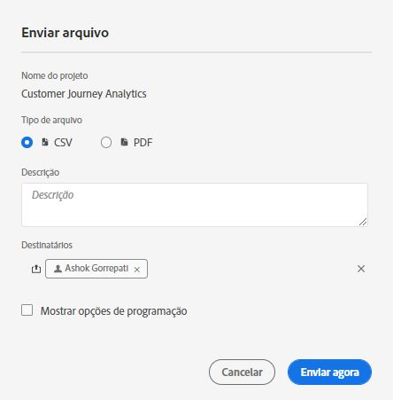
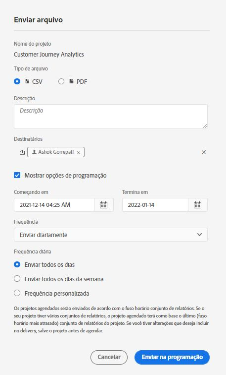

# Agendar projetos

No Espaço de trabalho **[!UICONTROL Compartilhar]** , você pode enviar projetos Analysis Workspace por email para recipients selecionados. Os arquivos podem ser enviados no formato CSV ou PDF.

## Enviar arquivo agora {#now}

Para enviar um arquivo imediatamente aos recipients por email:

1. Clique em **[!UICONTROL Compartilhar] > [!UICONTROL Exportar arquivo]**.
1. Especifique o tipo de arquivo:
   * [!UICONTROL **CSV**]: escolha essa opção se desejar dados de texto simples.
   * [!UICONTROL **PDF**]: escolha essa opção se desejar que o arquivo baixado contenha todas as tabelas e visualizações exibidas (visíveis) no projeto.
1. (Opcional) Adicione uma descrição a ser incluída no email para explicar o arquivo que está sendo recebido.
1. Adicione recipients ou grupos. Endereços de email também podem ser inseridos.
1. (Somente para clientes do Healthcare Shield) Forneça uma senha. Consulte a seção Proteger com senha um relatório agendado.
1. Clique em **[!UICONTROL Enviar agora]**.
1. (Opcional) Clique em **[!UICONTROL Mostrar opções de agendamento]** para especificar um agendamento de delivery.

## Enviar arquivo agendado {#schedule}

Para enviar um arquivo por email de acordo com uma programação recorrente a recipients:

1. Clique em **[!UICONTROL Compartilhar] > [!UICONTROL Programar exportação de arquivo]**.
1. Especifique o tipo de arquivo (CSV ou PDF).
1. (Opcional) Adicione uma descrição que será incluída no email para o arquivo que está sendo recebido.
1. Adicione recipients ou grupos. Endereços de email também podem ser inseridos.
1. (Somente para clientes do Healthcare Shield) Forneça uma senha. Consulte a seção Proteger com senha um relatório agendado.
1. Especifique o intervalo ao longo do qual a programação deve ser entregue, modificando as entradas Início e Término. A data de término deve estar no prazo de um ano a partir do dia em que a programação foi criada ou modificada.
1. Especifique a frequência do delivery. Cada frequência permite personalizações diferentes.
1. Clique em **[!UICONTROL Enviar de acordo com a programação]**.

## Gerenciador de projetos programados {#manager}

Os projetos agendados do Analysis Workspace podem ser gerenciados em **[!UICONTROL Analytics] > [!UICONTROL Componentes] > [!UICONTROL Projetos Agendados]**.

Para obter mais informações, consulte [Projetos agendados](/help/components/scheduled-projects-manager.md)

## Proteger com senha um projeto agendado {#password}

>[!NOTE]
>
>A opção de proteger com senha um projeto agendado aparece somente para clientes do Customer Journey Analytics que compraram o [Healthcare Shield](https://business.adobe.com/br/solutions/experience-cloud-for-healthcare.html) produto complementar.

A Adobe usa a senha para criptografar projetos agendados, sejam eles enviados nos formatos .pdf ou .csv.

Depois que sua empresa comprou o SKU do Healthcare Shield e foi habilitada para ele, o prompt para criar uma senha para um projeto agendado aparece em duas circunstâncias:

* Quando alguém cria um novo projeto agendado.

* Quando um projeto agendado existente estiver prestes a ser enviado. O projeto agendado no momento será desativado até que a proteção por senha esteja em vigor. O proprietário do projeto agendado receberá um email para esse efeito.

### Requisitos de senha

Os requisitos de senha estão em conformidade com o padrão da Adobe, exigindo no mínimo 8 caracteres com pelo menos um número e um caractere especial.

### Proteger com senha um novo projeto agendado

1. Depois de salvar o projeto, acesse **[!UICONTROL Compartilhar]** > **[!UICONTROL Enviar arquivo agora]** ou [!UICONTROL Compartilhar] > **[!UICONTROL Enviar arquivo agendado]**.
1. Siga as instruções acima, em [Enviar arquivo agora](https://experienceleague.adobe.com/docs/analytics-platform/using/cja-workspace/curate-share/t-schedule-report.html?lang=pt-BR#now) ou [Enviar arquivo agendado](https://experienceleague.adobe.com/docs/analytics-platform/using/cja-workspace/curate-share/t-schedule-report.html?lang=pt-BR#schedule).

### Proteger por senha um projeto agendado existente

Antes do horário agendado para um projeto, o proprietário do projeto receberá um email semelhante a este:

1. Faça logon no Customer Journey Analytics.
1. Clique em **[!UICONTROL Exibir projeto agendado]**.
1. Na caixa de diálogo **[!UICONTROL Editar projeto agendado]**, digite e digite novamente uma senha.
1. Informe (somente) os destinatários do projeto agendado sobre essa senha.

