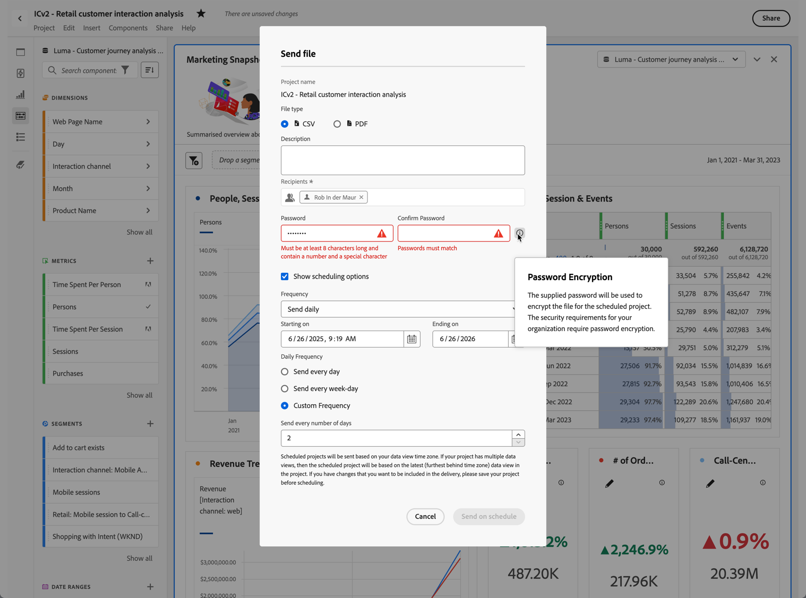

# Envio de arquivo - agendamento do envio de um projeto

>[!NOTE] Você está visualizando a documentação do Analysis Workspace no Customer Journey Analytics. Seu conjunto de recursos é ligeiramente diferente do [Analysis Workspace no Adobe Analytics](https://docs.adobe.com/content/help/pt-BR/analytics/analyze/analysis-workspace/home.html)tradicional. [Saiba mais...](/help/getting-started/cja-aa.md)

Envie um projeto do Analysis Workspace por email ou agende o seu envio.

1. [Crie um projeto do Analysis Workspace](https://docs.adobe.com/content/help/en/analytics/analyze/analysis-workspace/build-workspace-project/t-freeform-project.html) e salve-o.
1. Clique em **[!UICONTROL Compartilhar]** > **[!UICONTROL Enviar arquivo agendado]**.

   

1. Na página [!UICONTROL Enviar arquivo], especifique o tipo de arquivo (CSV ou PDF).

   

1. Adicione destinatários e endereços de email ou nomes, depois clique em **[!UICONTROL Enviar agora]**.
1. (Opcional) Clique em **[!UICONTROL Exibir opções de agendamento]** para especificar um agendamento de envio, depois clique em **[!UICONTROL Enviar conforme agendado]**.
1. Gerencie projetos agendados em **[!UICONTROL Componentes]** > [Projetos agendados](/help/analysis-workspace/curate-share/schedule-projects.md).
