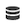

# Exportar relatórios de Customer Journey Analytics para a nuvem

{{release-limited-testing}}

Você pode exportar tabelas completas do Espaço de trabalho do Customer Journey Analytics e enviar exportações para destinos de nuvem designados.

Outros métodos de exportação de relatórios de Customer Journey Analytics também estão disponíveis, conforme descrito em [Visão geral da exportação](/help/analysis-workspace/export/export-project-overview.md).

## Entender a exportação de tabela completa

Você pode exportar tabelas completas do Analysis Workspace para provedores de nuvem, como Google, Azure, Amazon e Adobe.

[Vantagens de exportar tabelas completas para a nuvem](#advantages-of-exporting-to-the-cloud) inclua a capacidade de exportar milhões de linhas, inclua métricas calculadas, estrutura de saída de dados em valores concatenados e muito mais.

Ao exportar tabelas completas, considere o seguinte:

* Antes de exportar para a nuvem, verifique se as tabelas, o ambiente e as permissões atendem aos [requisitos de exportação](#export-requirements).

* Alguns [recursos](#unsupported-features) e [componentes](#unsupported-components) não são compatíveis ao exportar tabelas completas para a nuvem.

Use o processo a seguir ao exportar tabelas completas para a nuvem:

1. [Configurar uma conta na nuvem](/help/components/exports/cloud-export-accounts.md)

1. [Configurar um local na conta](/help/components/exports/cloud-export-locations.md)

1. [Exportar uma tabela completa do Workspace](#export-full-tables-from-analysis-workspace)

1. [Acessar dados na nuvem](#view-exported-data-and-manifest-file) e [Gerenciar exportações no Adobe](/help/components/exports/manage-exports.md)

## Exportar tabelas completas do Analysis Workspace

>[!NOTE]
>
>Antes de exportar os dados conforme descrito nesta seção, saiba mais sobre a exportação de tabela completa na [Entender a exportação de tabela completa](#understand-full-table-export) acima.

Para exportar tabelas completas do Analysis Workspace:

1. Caso ainda não o tenha feito, configure uma conta de exportação e um local, conforme descrito em [Configurar contas de exportação da nuvem](/help/components/exports/cloud-export-accounts.md).

1. No Analysis Workspace, clique com o botão direito do mouse na tabela de Forma livre que contém os dados que você deseja exportar.

1. Selecionar [!UICONTROL **Exportar tabela inteira**].

   

1. No [!UICONTROL **Nova exportação de tabela completa**] especifique as seguintes informações:

   | Nome do campo | Função |
   |---------|----------|
   | Nome | Especifique um nome para a exportação. Esse nome é exibido na lista de exportações. |
   | Tags | É possível aplicar uma tag existente à exportação ou criar uma nova tag e aplicá-la. 
Para aplicar uma tag existente à exportação, selecione qualquer tag no menu suspenso. Todas as tags na sua empresa estão disponíveis para aplicação<!-- double-check this -->.
 
Para criar uma nova tag, digite o nome da nova tag e pressione Enter.

Considere o seguinte ao aplicar tags a uma exportação: <ul><li>As tags aplicadas podem ser filtradas ou pesquisadas na tabela de exportações.</li> <li>As tags aplicadas a um projeto não são aplicadas automaticamente ao exportar uma tabela completa, conforme descrito em &quot;Configurar colunas na página de exportações&quot; em [Gerenciar exportações](/help/components/exports/manage-exports.md). (Em alternativa, quando [agendamento de um projeto completo para exportação](/help/analysis-workspace/export/t-schedule-report.md), todas as tags aplicadas ao projeto serão automaticamente aplicadas à exportação.)  <!-- Right now we don't have a column for them on the exports table, so this isn't true. Jaden is adding the column. --></li></ul> |
   | Descrição | Adicione uma descrição à exportação. Você pode optar por exibir descrições como uma coluna na [Página Exportações](/help/components/exports/manage-exports.md) ao exibir exportações. |
   | Visualização de dados | Selecione a visualização de dados que contém os componentes que você deseja incluir na exportação. O menu suspenso Visualização de dados está localizado no canto superior esquerdo da caixa de diálogo e pode ser identificado pelo ícone de Visualização de dados.  
**Nota:** Se você escolher uma visualização de dados que não contenha componentes que já estejam incluídos na tabela de dados, será solicitado que você limpe a tabela de dados e recrie-a usando componentes incluídos na visualização de dados selecionada. 
 |
   | Janela de lookback | Selecione o período de relatório que será incluído em cada arquivo de exportação. As opções incluem [!UICONTROL **Hoje**], [!UICONTROL **Ontem**], [!UICONTROL **Últimos 7 dias**], [!UICONTROL **Últimos 30 dias**], [!UICONTROL **Esta semana**], e [!UICONTROL **Este mês**]. 
Essa opção não é exibida quando a variável [!UICONTROL **Frequência de exportação**] está definida como [!UICONTROL **Enviar agora (único)**]. |
   | Tabela de dados | Exibe a tabela de forma livre que você está exportando. Você pode modificar a tabela de dados arrastando componentes do painel esquerdo para a tabela. A tabela é atualizada dinamicamente à medida que você adiciona componentes à tela.  
Quaisquer segmentos aplicados à tabela completa no projeto aparecem na parte superior de cada coluna individual na tabela.
 |
   | Limpar | Limpa o conteúdo da tabela de dados. Isso permite que você comece a criar uma nova tabela diretamente na caixa de diálogo de exportação Nova tabela completa. |
   | Frequência de exportação | Defina o cronograma para a frequência com que a exportação deve ocorrer. 
Você pode escolher [!UICONTROL **Enviar agora (uma vez)**] para enviar a exportação apenas uma vez. Ao selecionar essa opção, a exportação é iniciada imediatamente.
Ou você pode optar por enviar a exportação de acordo com uma programação definida. Ao enviar de acordo com uma programação, as opções incluem [!UICONTROL **Diariamente**], [!UICONTROL **Semanalmente**], [!UICONTROL **Mensalmente por dia da semana**], [!UICONTROL **Mensalmente por dia do mês**], [!UICONTROL **Anualmente, por dia do mês**], e [!UICONTROL **Anualmente por data específica**]. 

Ao selecionar uma frequência de exportação, considere o seguinte:
<ul><li>As opções no campo [!UICONTROL **Janela de pesquisa**] O campo muda dependendo do que você selecionar aqui.<!-- if they're doing Daily, then we might not let them look back to the last year... --></li><li>Campos de configuração adicionais são exibidos dependendo da opção escolhida.</li></ul> |
   | Começando em | O dia e a hora em que a exportação programada deve começar. 
Essa opção está disponível somente ao escolher uma frequência de exportação programada.
 |
   | Termina em | O dia e a hora em que a exportação agendada expira. A exportação agendada não será mais executada após a data e a hora que você definiu. 
Essa opção está disponível somente ao escolher uma frequência de exportação programada.
 |
   | Formato de arquivo | Escolha se os dados exportados devem estar no formato .csv ou .json. |
   | Conta | Selecione a conta de exportação da nuvem para a qual deseja enviar os dados. 
Para obter mais informações, consulte [Configurar contas de exportação da nuvem](/help/components/exports/cloud-export-accounts.md).
 |
   | Nome do local | Selecione o local na conta para onde deseja que os dados de exportação sejam enviados. 
Para obter mais informações, consulte [Configurar locais de exportação da nuvem](/help/components/exports/cloud-export-locations.md).

É possível selecionar a variável [!UICONTROL **Adicionar nova localização**] botão para criar um novo local para uma conta de exportação existente. |

   {style="table-layout:auto"}

1. Selecionar [!UICONTROL **Salvar**] para salvar a exportação.

   Os dados são enviados para a conta de nuvem especificada com a frequência especificada.

1. (Opcional) Após criar a exportação, independentemente de você optar por enviá-la agora ou em um agendamento definido, é possível visualizá-la e gerenciá-la no [Página Exportações](/help/components/exports/manage-exports.md) e visualize-o no [Exportar logs](/help/components/exports/manage-export-logs.md).

## Gerenciar exportações

Depois que os dados forem exportados do Analysis Workspace, você poderá editar, reexportar, duplicar, marcar ou excluir exportações existentes, conforme descrito em [Gerenciar exportações](/help/components/exports/manage-exports.md).

## Exibir dados exportados e arquivo de manifesto

### Dados exportados

Os dados exportados estão disponíveis como um arquivo compactado no destino de nuvem que você configurou, conforme descrito em [Configurar contas de exportação da nuvem](/help/components/exports/cloud-export-accounts.md) e [Configurar locais de exportação da nuvem](/help/components/exports/cloud-export-locations.md).

O nome do arquivo compactado é o seguinte, dependendo se você escolheu CSV ou JSON como o formato de arquivo:

* `cja-export-{reportInstanceId}-{idx}.csv.gz`

* `cja-export-{reportInstanceId}-{idx}.json.gz`

>[!NOTE]
>
>Você escolhe o formato de arquivo nas [!UICONTROL **Formato de arquivo**] ao exportar a tabela, conforme descrito em [Exportar tabelas completas do Analysis Workspace](#export-full-tables-from-analysis-workspace).

### Arquivo manifest

Um arquivo de manifesto com o nome de `cja-export-{reportInstanceId}-{idx}.json.gz` está incluído em qualquer delivery de exportação bem-sucedida que contenha pelo menos um arquivo. O arquivo de manifesto permite confirmar se todos os arquivos foram entregues com êxito. Ele inclui as seguintes informações:

* Uma lista de todos os arquivos que foram entregues

* A soma de verificação MD5 de cada arquivo

<!-- add in  what the file name, structure, and file format will be -->

## Vantagens de exportar para a nuvem

A exportação de dados do Customer Journey Analytics para a nuvem permite:

* Exporte para um local compartilhado, como Zona de aterrissagem de dados da Adobe Experience Platform, Plataforma da Google Cloud, Microsoft Azure, Amazon S3 ou Snowflake.

* Armazene grandes quantidades de dados históricos.

  Esse tipo de dado pode ser usado para detectar tendências de longo prazo para obter inteligência comercial e, em última análise, levar a uma melhor tomada de decisões de negócios.

* Exporte tabelas completas que contenham milhares ou milhões de linhas (3 milhões, 30 milhões, 150 milhões ou 300 milhões de linhas, dependendo do tipo de licença). Outros métodos de exportação permitem no máximo 50.000 linhas.

* Incluir métricas calculadas nos dados de Customer Journey Analytics exportados.

* Saída de dados de estrutura como valores concatenados.

* Exporte ad hoc ou de acordo com um agendamento. (Também disponível com [outras opções de exportação](/help/analysis-workspace/export/export-project-overview.md).)

* Exporte arquivos no formato CSV ou JSON. (Também disponível com [outras opções de exportação](/help/analysis-workspace/export/export-project-overview.md).)

* Exportar tabelas que incluam várias dimensões.

## Requisitos de exportação {#export-requirements}

### Requisitos mínimos

Verifique se as tabelas, o ambiente e as permissões atendem aos seguintes requisitos:

* **Tabelas:** Todas as tabelas devem incluir pelo menos uma dimensão na linha e uma métrica em cada coluna para serem compatíveis com uma exportação de tabela completa.

* **Ambiente:** Os administradores devem garantir que os endereços IP listados no [Endereços IP usados pelo Customer Journey Analytics](/help/admin/ip-addresses.md) estão incluídos na inclui na lista de permissões de firewall.

* **Permissões:** No Adobe Admin Console, os usuários devem receber um perfil de produto que tenha a [!UICONTROL **Exportação de tabela completa**] permissão atribuída a ele para exportar tabelas completas. Para obter informações sobre como atribuir uma permissão a um perfil de produto no Admin Console, consulte [Permissão de Customer Journey Analytics no Admin Console](https://experienceleague.adobe.com/docs/analytics-platform/using/cja-admin/cja-access-control.html?lang=en#customer-journey-analytics-permissions-in-admin-console) in [Controle de acesso Customer Journey Analytics](https://experienceleague.adobe.com/docs/analytics-platform/using/cja-admin/cja-access-control.html).

### Recursos incompatíveis

Os seguintes recursos não são compatíveis e são removidos automaticamente das exportações de tabela completa:

* Porcentagens
* Totais
* Filtragem de pesquisa
* Linhas estáticas
* Alinhamento de data
* Dimensões dinâmicas

  Para obter mais informações, consulte [Itens de dimensão dinâmicos vs estáticos em tabelas de forma livre](/help/analysis-workspace/visualizations/freeform-table/column-row-settings/manual-vs-dynamic-rows.md).
* os Dimension na primeira divisão são convertidos e adicionados como uma dimensão secundária na linha da tabela exportada; quaisquer outros detalhamentos não são incluídos na tabela
* A classificação não é suportada para a maioria dos conjuntos de dados; os dados podem ser classificados para pequenos conjuntos de dados

### Componentes incompatíveis

Os seguintes componentes não são suportados, e o Analysis Workspace solicita que você os remova da tabela ao executar uma exportação de tabela completa:

* Métricas calculadas que usam funções básicas ou avançadas na definição da métrica (consulte [Funções básicas](/help/components/calc-metrics/cm-functions.md) e [Funções avançadas](/help/components/calc-metrics/cm-adv-functions.md) para obter mais informações)
* Componentes que foram impedidos por um administrador de serem exportados (consulte a *Filtrar as políticas de governança de dados nas visualizações de dados* seção em [Rótulos e políticas](/help/data-views/data-governance.md) para obter mais informações)
* Mais de 5 dimensões e 5 métricas por relatório (até 5 dimensões e 5 métricas são compatíveis)
* Nas colunas da tabela:
   * Intervalos de datas
   * Dimensões
* Nas linhas da tabela:
   * Métricas calculadas 
   * Métricas
   * Intervalos de data
   * Filtros

### Comportamento de atribuição

A exportação de tabela completa suporta métricas calculadas que usam um modelo de atribuição não padrão (conforme descrito na seção *Usar modelo de atribuição não-padrão* seção em [Configurações de coluna](/help/analysis-workspace/visualizations/freeform-table/column-row-settings/column-settings.md)).

Se um modelo de atribuição não padrão estiver sendo usado em um relatório, o modelo de alocação que está sendo usado no relatório será ignorado ou retido, dependendo se o relatório tiver uma única dimensão ou várias dimensões:

* **Para relatórios que incluem atribuição de métrica em uma única dimensão:** [Atribuição de métrica](/help/data-views/component-settings/attribution.md) substitui a [modelo de alocação](/help/data-views/component-settings/persistence.md) como normalmente é feito ao usar a atribuição de métrica.

  Por exemplo, uma atribuição de métrica de &quot;primeiro contato&quot; substitui uma alocação de dimensão &quot;mais recente&quot;.

* **Para relatórios que incluem atribuição de métrica em várias dimensões ao mesmo tempo:** [Atribuição de métrica](/help/data-views/component-settings/attribution.md) é aplicado além da dimensão [modelo de alocação](/help/data-views/component-settings/persistence.md).

  Por exemplo, uma atribuição de métrica de &quot;primeiro contato&quot; é aplicada, além de uma alocação de dimensão &quot;mais recente&quot;. Além disso, a atribuição de métrica será aplicada aos pares de itens de dimensão pós-alocados como se fossem itens de dimensão únicos, em vez de ser aplicada a cada item de dimensão independentemente, como normalmente é feito em uma tabela de forma livre.

  >[!NOTE]
  >
  >Relatórios multidimensionais são suportados somente ao exportar dados para a nuvem, conforme descrito neste artigo.

## Comparação da exportação completa da tabela (em Customer Journey Analytics) para o Data Warehouse (no Adobe Analytics)

Se você tiver usado o Data Warehouse anteriormente para exportar dados do Adobe Analytics, a tabela a seguir poderá ajudá-lo a entender as diferenças entre exportar tabelas completas no Customer Journey Analytics e exportar dados com o Data Warehouse no Adobe Analytics.

| Recurso | Exportação de tabela completa no Customer Journey Analytics | Data Warehouse no Adobe Analytics |
|---------|----------|---------|
| Criar um relatório personalizado | Sim | Sim |
| Métricas calculadas  | Sim | Não |
| Segmentos | Sim | Limitado |
| Dimensões | Limite de 5 | Ilimitado |
| Métricas | Limite de 5 | Ilimitado |
| Linhas de relatório | Limite de 3 milhões, 30 milhões, 150 milhões ou 300 milhões, dependendo do nível | Ilimitado |
| Número de relatórios | Ilimitado | Ilimitado |
| Entrega ad hoc | Sim | Sim |
| Agendar entrega recorrente | Sim | Sim |
| Entrega de email | Não | Sim |
| FTP/SFTP | Não | Suporte herdado |
| Azure | Sim | Sim |
| Amazon S3 | Sim | Sim |
| Google Cloud Platform | Sim | Sim |
| Snowflake | Sim | Não |
| Frequência de entrega | Diariamente | Por hora |
