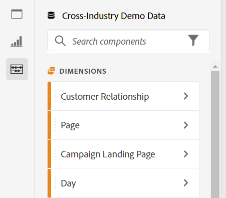

# Visão geral do Analysis Workspace

O Analysis Workspace é uma ferramenta de navegador flexível que permite criar análises e compartilhar insights rapidamente. Usando a interface de arrastar e soltar, você pode criar a análise, adicionar visualizações para dar vida aos dados, preparar um conjunto de dados, compartilhar e agendar projetos com qualquer pessoa em sua organização.

Se você tiver apenas alguns minutos, assista a esta breve visão geral para ver o que é possível.

>[!VIDEO](https://video.tv.adobe.com/v/26266/?quality=12)

## Fazer logon no Customer Journey Analytics {#login}

Para começar a usar o Analysis Workspace, faça logon no Customer Journey Analytics acessando [experience.adobe.com/analytics](https://experience.adobe.com/analytics). Você será direcionado para a página Projetos se um projeto específico não tiver sido selecionado anteriormente para você.

## Usar o modelo de Tutorial de treinamento {#training-tutorial}

Depois de conectado, sua primeira parada pode ser o modelo de Tutorial de treinamento do Analysis Workspace, que orienta você pela terminologia e etapas comuns para a criação da sua primeira análise no Workspace. Para iniciar o tutorial,

1. Clique em **[!UICONTROL Aprendizado]** à esquerda.
1. Clique em **[!UICONTROL Abrir tutorial]**.

## Criar um novo projeto {#new-project}

Após concluir o tutorial, você está pronto para começar a criar o primeiro projeto. No [!UICONTROL Projetos] , você pode optar por começar com

* [!UICONTROL Projeto em branco] se planeja compartilhar sua análise do navegador ou
* [[!UICONTROL Cartão de pontuação para dispositivos móveis em branco]](/help/mobile-app/curator.md), se você planeja compartilhar sua análise do aplicativo móvel de painéis do Customer Journey Analytics.

## Crie sua análise {#analysis}

No projeto do Espaço de trabalho, **painéis, tabelas, visualizações e componentes** são acessados pelo painel esquerdo. Estes são os componentes do projeto.

### Componentes

**Componentes** são dimensões, métricas, filtros ou intervalos de datas que podem ser combinados em uma **[!UICONTROL Tabela de forma livre]** para começar a responder às suas perguntas empresariais. Familiarize-se com cada [tipo de componente](/help/components/overview.md) antes de mergulhar na análise. Depois de dominar a terminologia do componente, você pode começar a arrastar e soltar para [criar a análise](/help/analysis-workspace/build-workspace-project/freeform-overview.md) em uma **[!UICONTROL tabela de forma livre]**.

### Visualizações

**Visualizações**, como um gráfico de barras ou de linhas, são adicionadas sobre os dados para dar vida visualmente a eles. No painel à esquerda, selecione o ícone do meio de **[!UICONTROL Visualizações]** para ver a lista completa de [visualizações](/help/analysis-workspace/visualizations/freeform-analysis-visualizations.md) disponíveis.

### Painéis

**Painéis** são usados para organizar a análise em um projeto e podem conter muitas tabelas e visualizações. Muitos dos painéis fornecidos no Analysis Workspace geram um conjunto completo de análises com base em algumas entradas do usuário. No painel à esquerda, selecione o ícone **[!UICONTROL Painéis]** superior para ver uma lista completa de [painéis](/help/analysis-workspace/c-panels/panels.md) disponíveis.

## Recursos adicionais {#resources}

* A Adobe oferece centenas de [tutoriais de treinamento em vídeo do Analytics](https://experienceleague.adobe.com/docs/analytics-learn/tutorials/overview.html?lang=pt-BR).
