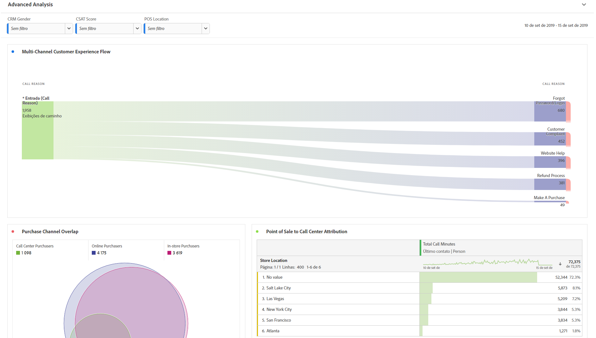
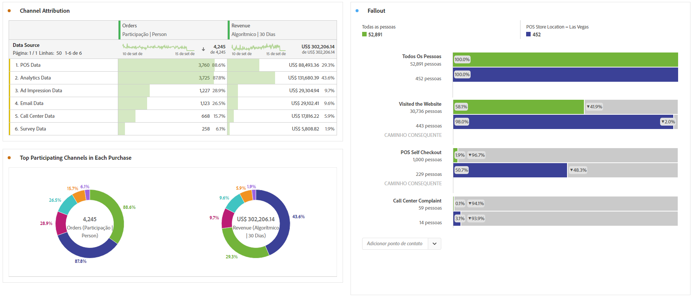

# Realizar análise avançada

Antes de começar a criar relatórios e visualizações de análise avançada, conforme descrito abaixo, certifique-se de que entenda os [conceitos básicos de análise](/help/analysis-workspace/perform-basic-analysis.md).

A análise avançada aproveita recursos como os diagramas de [Fluxo](/help/analysis-workspace/visualizations/c-flow/flow.md), [Atribuição](/help/analysis-workspace/c-panels/attribution.md), diagramas de [Fallout](/help/analysis-workspace/visualizations/fallout/fallout-flow.md) e [detalhamentos de dimensões](/help/components/dimensions/t-breakdown-fa.md).

