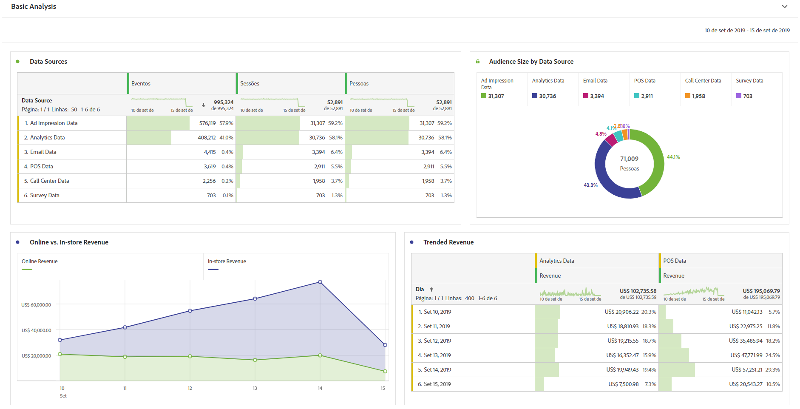
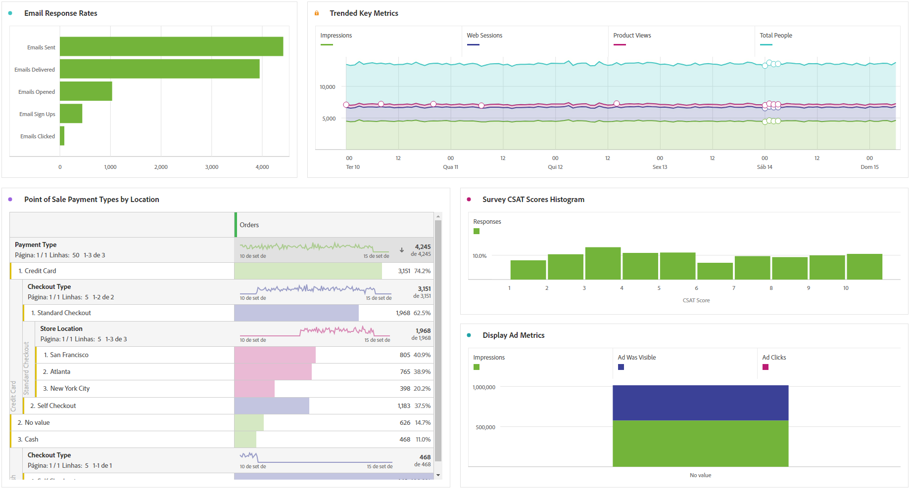

# Realizar análise básica

O Customer Journey Analytics permite analisar dados usando a potência e a flexibilidade do Analysis Workspace.

>[!TIP]
>
>Se nenhum dado estiver disponível no Analysis Workspace, verifique se você seguiu as [processo de assimilação de dados](/help/data-ingestion/data-ingestion.md), que inclui:<ul><li>[Criar uma conexão](/help/connections/create-connection.md#create-and-configure-the-connection)  Verifique se a conexão está configurada para importar novos dados, dados de preenchimento retroativo ou ambos.</li><li>[Adicionar conjuntos de dados](/help/connections/create-connection.md#add-and-configure-datasets)</li><li>[Criar visualizações de dados](/help/data-views/create-dataview.md)</li></ul>

Experimente e arraste dimensões e métricas, altere configurações de atribuição de dimensões e métricas, nomes amigáveis, fuso horário, configurações de sessão etc.

Esta é uma amostra de visualizações básicas no Espaço de trabalho. Por exemplo, você pode

* Criar um relatório classificado de quais fontes de dados mostram mais eventos, sessões e pessoas.

* Criar um relatório de tendências de receita online versus na loja que compare as duas fontes de dados ao longo do tempo.

* Detalhe o tamanho do público-alvo por fontes de dados, como dados de impressão de anúncio, dados do Customer Journey Analytics, dados de email, dados de PDV, dados da central de atendimento e dados de pesquisa.

