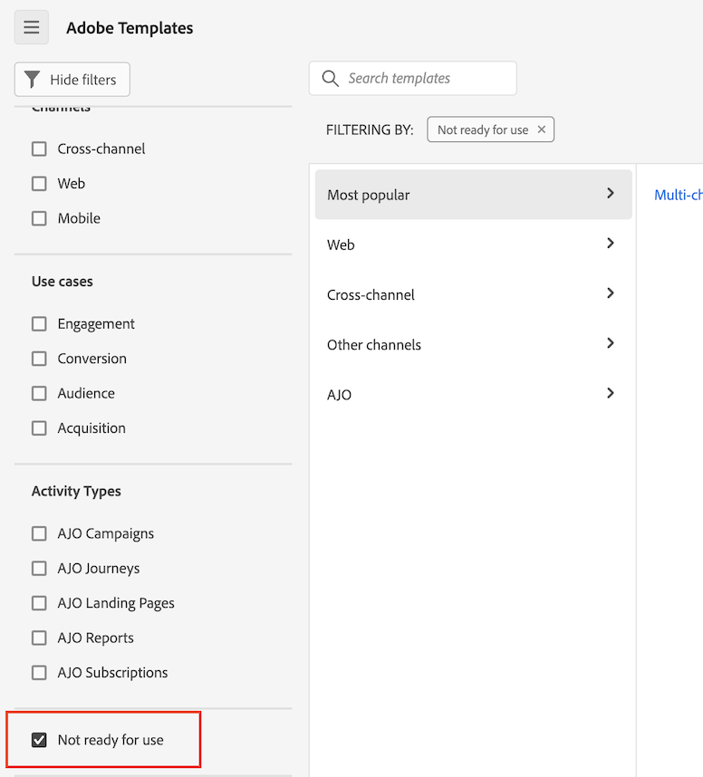

# Usar modelos

Os modelos (ou modelos da empresa) do Analysis Workspace fornecem insights rápidos sobre os casos de relatórios mais comuns. Confira abaixo alguns exemplos de perguntas às quais você pode responder com modelos:

* Quantas pessoas visitam seu site
* Quantos desses visitantes são visitantes únicos (contados apenas uma vez)
* Como eles chegaram ao site (como se eles seguissem um link ou chegassem lá diretamente)
* Quais palavras-chave os visitantes usaram para pesquisar o conteúdo do site
* Por quanto tempo os visitantes permaneceram em uma determinada página ou em todo o site
* Quais links os visitantes clicaram e quando saíram do site
* Quais canais de marketing são mais eficazes para gerar receita ou eventos de conversão
* Quanto tempo eles gastaram assistindo a um vídeo
* Quais navegadores e dispositivos eles usaram para visitar seu site

As informações a seguir descrevem como acessar e utilizar modelos a partir da guia [!UICONTROL Modelos] do Analysis Workspace.

## Acessar e executar um modelo

1. No Adobe Analytics, selecione a guia [!UICONTROL **Espaço de trabalho**].

   

1. Na seção [!UICONTROL **Modelos**], selecione uma das guias a seguir:

   * **[!UICONTROL Modelos da Adobe]**: mostra todos os modelos fornecidos pela Adobe.

   * Modelos da **[!UICONTROL _login_company_name _]**: mostra todos os modelos da empresa que foram criados para a sua organização.

     Somente administradores podem criar modelos da empresa. Para mais informações sobre como criar um modelo da empresa, consulte [Criar e gerenciar modelos](/help/analysis-workspace/templates/create-templates.md).

1. Use uma das opções a seguir para alterar a exibição dos modelos disponíveis:

   * Escolha se deseja exibir modelos em uma visualização em colunas ou em uma visualização em cartões, selecionando o ícone de visualização em colunas  ou visualização em cartões .

   * Ao usar a visualização em cartões , escolha entre as seguintes ordens de classificação: **[!UICONTROL Usado mais recentemente]**, **[!UICONTROL Mais popular]**, **[!UICONTROL Alfabético]**, **[!UICONTROL Categórico]**.

1. No campo de pesquisa, comece a digitar o nome do modelo que deseja localizar e, em seguida, selecione-o na lista de modelos. 

   Ou

   Selecione a categoria do modelo que deseja exibir e, em seguida, selecione o modelo na lista de modelos.

   >[!TIP]
   >
   >Para navegar no menu utilizando as teclas de seta, pressione a tecla Barra (/) e, em seguida, pressione a tecla Seta para baixo. Pressione Enter para carregar o modelo selecionado.

   Para obter uma lista de modelos disponíveis, consulte a seção [Modelos disponíveis](#available-templates) abaixo.

1. (Opcional) É possível visualizar modelos que contêm componentes que não estão disponíveis na visualização de dados. (Por padrão, os modelos serão exibidos somente se usarem componentes disponíveis na visualização de dados.)

   >[!NOTE]
   >
   >Antes de usar esses modelos, um administrador deve primeiro adicionar os rótulos de contexto necessários para esses componentes ausentes à visualização de dados. Para mais informações, consulte [Adicionar componentes ausentes à visualização de dados para um determinado modelo](/help/analysis-workspace/templates/create-templates.md#add-missing-components-to-the-data-view-for-a-given-template) em [Usar modelos](/help/analysis-workspace/templates/create-templates.md).
   >
   >Para mais informações sobre rótulos de contexto, consulte [Configurações de componentes](/help/data-views/component-settings/overview.md).

   1. Clique no ícone de segmento.

   1. Selecione **[!UICONTROL Não está pronto para uso]** para mostrar modelos que precisam de componentes adicionais.

      

1. Selecione o modelo para criar um relatório com base no modelo escolhido.

1. (Condicional) Se o modelo contiver componentes indisponíveis na visualização de dados, a caixa de diálogo “Visualização de dados incompatível” será exibida, dizendo que a visualização de dados é incompatível com o modelo e mostrando quais componentes estão ausentes.

   Realize uma das seguintes ações:

   * Escolha uma visualização de dados diferente no menu suspenso **[!UICONTROL Alterar visualização de dados]**.

   * Selecione **[!UICONTROL Continuar mesmo assim]** para exibir o modelo com os componentes ausentes.

## Criar um projeto com base em um modelo {#use-reports}

Um modelo pode não suprir exatamente as suas necessidades, mas pode chegar perto. Nesses casos, você pode usar o modelo como ponto de partida para o seu projeto e personalizá-lo para atender melhor às suas finalidades específicas.

Se você sair de um modelo depois de fazer alterações, será solicitado que salve ou descarte as alterações. Salvar as alterações feitas em um modelo salva-o como um novo projeto.

Para personalizar um modelo e salvá-lo como um projeto:

1. No Customer Journey Analytics, selecione a guia [!UICONTROL **Workspace**].

1. Selecione a guia [!UICONTROL **Modelos**].

1. Selecione o modelo que deseja exibir. Por exemplo, em [!UICONTROL **Mais popular**], selecione o modelo [!UICONTROL **Páginas**].

   O modelo “Páginas”, conforme exibido no Analysis Workspace, mostra duas [visualizações](/help/analysis-workspace/visualizations/freeform-analysis-visualizations.md) ([Gráfico de barras](/help/analysis-workspace/visualizations/bar.md) e [Número do resumo](/help/analysis-workspace/visualizations/summary-number-change.md)) e uma [Tabela de forma livre](/help/analysis-workspace/visualizations/freeform-table/freeform-table.md). A métrica usada é Ocorrências.

   <!--update screenshot. The following is AA -->

   

1. Siga um destes procedimentos:

   * Visualize o modelo.
   * Arraste um ou mais segmentos para a zona de destino Segmentos na parte superior. Por exemplo, arraste o segmento [!UICONTROL **Clientes móveis**] e veja os resultados.
   * Altere o intervalo de datas acessando o calendário no canto superior direito.
   * Adicione detalhes de dimensões, traga outras métricas e faça personalizações gerais no modelo de acordo com as suas necessidades.

1. (Opcional) Salve o modelo como um projeto, selecionando [!UICONTROL **Projeto**] > [!UICONTROL **Salvar**].

   O modelo é salvo como um novo projeto e não modifica o modelo existente. Para mais informações sobre como salvar projetos, consulte [Salvar projetos](/help/analysis-workspace/build-workspace-project/save-projects.md).

## Modelos disponíveis

Para acessar todos os modelos pré-criados disponíveis:

1. No Adobe Analytics, clique na guia [!UICONTROL **Workspace**] e selecione a guia [!UICONTROL **Modelos**].

   Os modelos pré-criados são organizados por categoria.

   <!--add screenshot-->

1. Selecione uma categoria para exibir os modelos contidos nela.

   As seções a seguir correspondem às categorias disponíveis e fornecem informações sobre cada modelo.

   * **[[!UICONTROL Mais popular]](#most-popular)**

   * **[[!UICONTROL Web]** > **[!UICONTROL Engajamento]](#engagement)**

   * **[[!UICONTROL Web]** > **[!UICONTROL Conversão]](#web-conversion)**

   * **[[!UICONTROL Web]** > **[!UICONTROL Público-alvo]](#web-audience)**

   * **[[!UICONTROL Web]** > **[!UICONTROL Aquisição]](#web-acquisition)**

   * **[[!UICONTROL Dispositivos móveis]** > **[!UICONTROL Aplicativo móvel]](#mobile-mobile-app)**

   * **[[!UICONTROL Dispositivos móveis]** > **[!UICONTROL Informações do dispositivo móvel]](#mobile-mobile-device-information)**

   * **[[!UICONTROL Partição de tempo]](#time-parting)**

   * **[[!UICONTROL Entre canais]](#cross-channel)**

   * **[[!UICONTROL Outros canais]](#other-channels)**

   * **[[!UICONTROL AJO]](#ajo)**

### Mais popular {#most-popular}

<!--AA only-->

>[!CONTEXTUALHELP]
>id="aa-template--unitsOvertimeReport"
>title="Visualize o número total de unidades compradas em todos os pedidos. Os dados são mostrados durante um período e comparados com períodos anteriores."
>abstract="**Isso pode ajudar** a entender melhor como as vendas de unidades estão aumentando ou diminuindo com o tempo. Você pode aplicar um segmento para saber quais clientes ou regiões geográficas estão comprando a maior parte das unidades e quais são as tendências dessas vendas ao longo do tempo. **Com base no que aprender, você poderá** fazer várias coisas, como avaliar a eficácia de uma campanha de marketing iniciada recentemente ao comparar as vendas de unidades antes e depois do início da campanha. É possível também comparar as vendas de unidades durante feriados a cada ano. Este modelo usa a dimensão “Dia” e a métrica “Unidades”."

<!--both AA and CJA-->

>[!CONTEXTUALHELP]
>id="template--training"
>title="Modelo do tutorial de treinamento"
>abstract="Saiba mais sobre a terminologia e as etapas comuns do Analysis Workspace para criar a sua primeira análise."

>[!CONTEXTUALHELP]
>id="template--pagesRankedReport"
>title="Identifique as páginas mais e menos populares."
>abstract="**Isso pode ajudar** a entender melhor o seu público-alvo e o tipo de informação em que estão mais interessados(as). **Com base no que aprender, você poderá** fazer várias coisas, como ajustar metadados para aumentar a visibilidade de páginas menos visualizadas ou aprimorar o conteúdo das suas páginas mais visualizadas. Este modelo usa a dimensão “Página” e a métrica “Exibições da página”."

>[!CONTEXTUALHELP]
>id="template--pageViewsOvertimeReport"
>title="Veja o número total de exibições da página. Os dados são mostrados durante um período e comparados com períodos anteriores. "
>abstract="**Isso pode ajudar** a entender melhor como o tráfego no site pode estar aumentando ou diminuindo com o tempo. **Com base no que aprender, você poderá** fazer várias coisas, como avaliar a eficácia de uma campanha de marketing iniciada recentemente por comparar o tráfego do site antes e depois do início da campanha. Ou você pode comparar o tráfego em feriados de ano a ano. Este modelo usa a dimensão “Dia” e a métrica “Exibições da página”."

>[!CONTEXTUALHELP]
>id="template--visitsOvertimeReport"
>title="Veja o número total de visitas. Os dados são mostrados durante um período e comparados com períodos anteriores."
>abstract="**Isso pode ajudar** a entender melhor como o tráfego no site pode estar aumentando ou diminuindo com o tempo. **Com base no que aprender, você poderá** fazer várias coisas, como avaliar a eficácia de uma campanha de marketing iniciada recentemente por comparar o tráfego do site antes e depois do início da campanha. Ou você pode comparar o tráfego em feriados de ano a ano. Este modelo usa a dimensão “Dia” e a métrica “Visitas”."

>[!CONTEXTUALHELP]
>id="template--visitorsOvertimeReport"
>title="Veja o número total de visitantes únicos. Os dados são mostrados durante um período e comparados com períodos anteriores. "
>abstract="**Isso pode ajudar** a entender melhor como o alcance e o tamanho do público-alvo do seu site estão aumentando ou diminuindo com o tempo ou em comparação com um período anterior. **Com base no que aprender, você poderá** fazer várias coisas, como avaliar se uma campanha de marketing iniciada recentemente teve êxito ao atrair novas pessoas para o site, comparando o número de visitantes únicos antes e depois do início da campanha. Ou você pode comparar o número de pessoas que visitam o site durante os feriados a cada ano. Este modelo usa a dimensão “Dia” e a métrica “Visitantes únicos”. "

>[!CONTEXTUALHELP]
>id="template--keyMetricsReport"
>title="Visualize um relatório que mostra as métricas de exibições da página, visitas e visitantes únicos lado a lado. Os dados são mostrados durante um período e comparados com períodos anteriores."
>abstract="**Isso pode ajudar** a comparar essas métricas importantes para obter uma visão mais completa do número de pessoas únicas que visitam o site, o número de vezes que as páginas foram visitadas e o número de sessões. **Com base no que aprender, você poderá** fazer várias coisas, como avaliar o número médio de páginas que cada pessoa visualizou ao visitar o site em uma determinada semana ou mês, e como isso mudou durante certos períodos do ano ou antes e depois que as campanhas de marketing foram executadas.  Este modelo usa a dimensão “Dia” e as métricas “Exibições da página”, “Visitas” e “Visitantes únicos”."

>[!CONTEXTUALHELP]
>id="template--siteSectionRankedReport"
>title="Veja as seções mais populares ou de maior desempenho do seu site."
>abstract="**Isso pode ajudar** a entender melhor quais seções do site são mais visitadas. **Com base no que aprender, você poderá** fazer várias coisas, como avaliar quais produtos ou serviços fornecidos geram mais interesse. Este modelo usa a dimensão “Seção do site” e a métrica “Visitas”."

>[!CONTEXTUALHELP]
>id="template--next-page-report"
>title="Veja os lugares mais comuns que as pessoas acessam imediatamente após a visita de uma determinada página."
>abstract="**Isso pode ajudar** a entender melhor o comportamento dos usuários após a visita de uma determinada página. **Com base no que aprender, você poderá** fazer várias coisas, como avaliar se o design ou layout da página pode ser otimizado para direcionar as pessoas a páginas mais desejáveis, como uma página para fazer uma compra ou deixar uma avaliação. Este modelo usa a dimensão “Página” e a métrica “Eventos”."

>[!CONTEXTUALHELP]
>id="template--previous-page-report"
>title="Veja os lugares mais comuns que as pessoas acessam imediatamente antes de visitar uma determinada página."
>abstract="**Isso pode ajudar** a entender melhor quais páginas direcionam mais tráfego para uma determinada página. **Com base no que aprender, você poderá** fazer várias coisas, como avaliar se as páginas que não estão aparecendo como páginas anteriores precisam de links mais evidentes para a página atual."

>[!CONTEXTUALHELP]
>id="template--campaignRankedReport"
>title="Veja os links que obtiveram mais êxito em gerar tráfego para o seu site."
>abstract="**Isso pode ajudar** a entender melhor quais códigos de rastreamento (e os links aos quais estão associados) foram os mais usados para acessar o seu site. **Com base no que aprender, você poderá** fazer várias coisas, como ajustar a sua estratégia para adicionar links para o seu site. Este modelo usa a dimensão “Código de rastreamento” e a métrica “Visitas”."

>[!CONTEXTUALHELP]
>id="template--productsRankedReport"
>title="Veja o número de pedidos por produto. Os dados representam um determinado período."
>abstract="**Isso pode ajudar** a entender quais produtos têm a maior ou menor demanda. **Com base no que aprender, você poderá** fazer várias coisas, como ajustar as estratégias de marketing para promover produtos de alto desempenho ou para melhorar ou descontinuar produtos de baixo desempenho. Você também pode ajustar o inventário de produtos com base na análise dos dados. Este modelo usa a dimensão “Produto” e a métrica “Pedidos”."

>[!CONTEXTUALHELP]
>id="template--lastTouchChannelRankedReport"
>title="Veja os canais de marketing mais recentes utilizados por visitantes durante o período de engajamento (30 dias por padrão)."
>abstract="**Isso pode ajudar** a entender quais canais de marketing foram mais eficazes para trazer pessoas ao site que resultou em conversões. **Com base no que aprender, você poderá** fazer várias coisas, como alocar mais recursos a canais de alto desempenho ou reduzir a alocação de recursos para canais de baixo desempenho. Este modelo usa a dimensão “Canal de último contato” e a métrica “Visitantes únicos”."

>[!CONTEXTUALHELP]
>id="template--lastTouchChannelDetailRankedReport"
>title="Veja os detalhes dos canais de marketing mais recentes utilizados por visitantes durante o período de engajamento (30 dias por padrão)."
>abstract="**Isso pode ajudar** a entender quais canais de marketing foram mais eficazes para trazer pessoas ao site que resultou em conversões, bem como os detalhes desses canais de marketing. Por exemplo, se um visitante chegasse ao seu site e correspondesse ao canal de marketing &quot;Pesquisa paga”, você poderia usar os detalhes do canal para ver qual mecanismo de pesquisa foi usado ou qual palavra-chave foi pesquisada. **Com base no que aprender, você poderá** fazer várias coisas, como alocar mais recursos a canais de alto desempenho ou reduzir a alocação de recursos para canais de baixo desempenho. Este modelo usa a dimensão “Detalhes do canal de último contato” e a métrica “Visitantes únicos”. "

>[!CONTEXTUALHELP]
>id="template--revenueOvertimeReport"
>title="Veja o valor monetário dos produtos comprados em todos os pedidos. Os dados são mostrados durante um período e comparados com períodos anteriores."
>abstract="**Isso pode ajudar** a entender como a receita está aumentando ou diminuindo com o tempo. É possível combinar essa métrica com qualquer dimensão para saber quais itens de dimensão contribuíram para a receita. **Com base no que aprender, você poderá** fazer várias coisas, como projetar a receita futura com base nas tendências anteriores. Também é possível adicionar outra dimensão, como a dimensão “Código de rastreamento”, para saber quais campanhas estão gerando mais receita. Este modelo usa a dimensão “Dia” e a métrica “Receita”."

>[!CONTEXTUALHELP]
>id="template--ordersOvertimeReport"
>title="Veja o número total de eventos de compra. Os dados são mostrados durante um período e comparados com períodos anteriores."
>abstract="**Isso pode ajudar** a entender melhor como o interesse pelos seus produtos e serviços está aumentando ou diminuindo com o tempo. Você pode aplicar um segmento para saber quais clientes ou regiões geográficas estão fazendo mais pedidos, e quais são as tendências desses pedidos ao longo do tempo. **Com base no que aprender, você poderá** fazer várias coisas, como avaliar a eficácia de uma campanha de marketing iniciada recentemente por comparar os pedidos antes e depois do início da campanha. Ou você pode comparar os pedidos feitos durante feriados a cada ano. Este modelo usa a dimensão “Dia” e a métrica “Pedidos”."

Estes são os modelos disponíveis:

| Nome do modelo | Por que usar este modelo <!-- What do you do with it? What can it help you learn? and What are the potential actions? --> |
| --- | --- |
| [!UICONTROL **Tutorial de treinamento**] | Saiba mais sobre a terminologia e as etapas comuns do Analysis Workspace para criar a sua primeira análise |
| [!UICONTROL **Páginas**] | <!--duplicated in Engagement section--> Identifique as páginas mais e menos populares. 
**Isso pode ajudar** a entender melhor o seu público-alvo e o tipo de informação em que estão mais interessados(as).

**Com base no que aprender, você poderá** fazer várias coisas, como ajustar metadados para aumentar a visibilidade de páginas menos visualizadas ou aprimorar o conteúdo das suas páginas mais visualizadas.

Este modelo usa a dimensão “Página” e a métrica “Exibições da página”.
 |
| [!UICONTROL **Exibições de página**] | <!--duplicated in Engagement section--> Veja o número total de exibições da página. Os dados são mostrados durante um período e comparados com períodos anteriores. 
**Isso pode ajudar** a entender melhor como o tráfego no site pode estar aumentando ou diminuindo com o tempo.

**Com base no que aprender, você poderá** fazer várias coisas, como avaliar a eficácia de uma campanha de marketing iniciada recentemente por comparar o tráfego do site antes e depois do início da campanha. Ou você pode comparar o tráfego em feriados de ano a ano.

Este modelo usa a dimensão “Dia” e a métrica “Exibições da página”.
 |
| [!UICONTROL **Visitas da web**] | <!--duplicated in Engagement section--> Veja o número total de visitas. Os dados são mostrados durante um período e comparados com períodos anteriores. 
**Isso pode ajudar** a entender melhor como o tráfego no site pode estar aumentando ou diminuindo com o tempo.

**Com base no que aprender, você poderá** fazer várias coisas, como avaliar a eficácia de uma campanha de marketing iniciada recentemente por comparar o tráfego do site antes e depois do início da campanha. Ou você pode comparar o tráfego em feriados de ano a ano.

Este modelo usa a dimensão “Dia” e a métrica “Visitas”.
 |
| [!UICONTROL **Visitantes da web**] | <!--duplicated in Engagement section--> Veja o número total de visitantes únicos. Os dados são mostrados durante um período e comparados com períodos anteriores. 
**Isso pode ajudar** a entender melhor como o alcance e o tamanho do público-alvo do seu site estão aumentando ou diminuindo com o tempo ou em comparação com um período anterior.

**Com base no que aprender, você poderá** fazer várias coisas, como avaliar se uma campanha de marketing iniciada recentemente teve êxito ao atrair novas pessoas para o site, comparando o número de visitantes únicos antes e depois do início da campanha. Ou você pode comparar o número de pessoas que visitam o site durante os feriados a cada ano.

Este modelo usa a dimensão “Dia” e a métrica “Visitantes únicos”.
 |
| [!UICONTROL **Métricas principais**] | <!--duplicated in Engagement section--> Visualize um relatório que mostra as métricas de exibições da página, visitas e visitantes únicos lado a lado. Os dados são mostrados durante um período e comparados com períodos anteriores. 
**Isso pode ajudar** a comparar essas métricas importantes para obter uma visão mais completa do número de pessoas únicas que visitam o site, o número de vezes que as páginas foram visitadas e o número de sessões.

**Com base no que aprender, você poderá** fazer várias coisas, como avaliar a quantidade média de páginas que cada pessoa visualizou ao visitar o site em uma determinada semana ou mês, e como ela mudou durante certos períodos do ano ou antes e depois da execução das campanhas de marketing. 

Este modelo usa a dimensão “Dia” e as métricas “Exibições da página”, “Visitas” e “Visitantes únicos”.
 |
| [!UICONTROL **Seções do site**] | Veja as seções mais populares ou de maior desempenho do seu site. 
**Isso pode ajudar** a entender melhor quais seções do site são mais visitadas.

**Com base no que aprender, você poderá** fazer várias coisas, como avaliar quais produtos ou serviços fornecidos geram mais interesse.
 
Este modelo usa a dimensão “Seção do site” e a métrica “Visitas”.
 |
| [!UICONTROL **Próxima página**] | Veja os lugares mais comuns que as pessoas acessam imediatamente após a visita de uma determinada página. 
**Isso pode ajudar** a entender melhor o comportamento dos usuários após a visita de uma determinada página.

**Com base no que aprender, você poderá** fazer várias coisas, como avaliar se o design ou layout da página pode ser otimizado para direcionar as pessoas a páginas mais desejáveis, como uma página para fazer uma compra ou deixar uma avaliação.
 
Este modelo usa a dimensão “Página” e a métrica “Eventos”.
 |
| [!UICONTROL **Página anterior**] | Veja os lugares mais comuns que as pessoas acessam imediatamente antes de visitar uma determinada página. 
**Isso pode ajudar** a entender melhor quais páginas direcionam mais tráfego para uma determinada página.

**Com base no que aprender, você poderá** fazer várias coisas, como avaliar se as páginas que não estão aparecendo como páginas anteriores precisam de links mais evidentes para a página atual.

Este modelo usa a dimensão “Página” e a métrica “Eventos”.
 |
| [!UICONTROL **Código de rastreamento**] | Veja os links que obtiveram mais êxito em gerar tráfego para o seu site. 
**Isso pode ajudar** a entender melhor quais códigos de rastreamento (e os links aos quais estão associados) foram os mais usados para acessar o seu site.

**Com base no que aprender, você poderá** fazer várias coisas, como ajustar a sua estratégia para adicionar links para o seu site.

Este modelo usa a dimensão “Código de rastreamento” e a métrica “Visitas”.
 |
| [!UICONTROL **Produtos**] | Veja o número de pedidos por produto. Os dados representam um determinado período. 
**Isso pode ajudar** a entender quais produtos têm a maior ou menor demanda.

**Com base no que aprender, você poderá** fazer várias coisas, como ajustar as estratégias de marketing para promover produtos de alto desempenho ou para melhorar ou descontinuar produtos de baixo desempenho. Você também pode ajustar o inventário de produtos com base na análise dos dados.

Este modelo usa a dimensão “Produto” e a métrica “Pedidos”.
 |
| [!UICONTROL **Canal de último contato**] | Veja os canais de marketing mais recentes utilizados por visitantes durante o período de engajamento (30 dias por padrão).
**Isso pode ajudar** a entender quais canais de marketing foram mais eficazes para trazer pessoas ao site que resultou em conversões.

**Com base no que aprender, você poderá** fazer várias coisas, como alocar mais recursos a canais de alto desempenho ou reduzir a alocação de recursos para canais de baixo desempenho.

Este modelo usa a dimensão “Canal de último contato” e a métrica “Visitantes únicos”.
 |
| [!UICONTROL **Detalhes do canal de último contato**] | Veja os detalhes dos canais de marketing mais recentes utilizados por visitantes durante o período de engajamento (30 dias por padrão).
**Isso pode ajudar** a entender quais canais de marketing foram mais eficazes para trazer pessoas ao site que resultou em conversões, bem como os detalhes desses canais de marketing. Por exemplo, se um visitante chegasse ao seu site e correspondesse ao canal de marketing &quot;Pesquisa paga”, você poderia usar os detalhes do canal para ver qual mecanismo de pesquisa foi usado ou qual palavra-chave foi pesquisada.

**Com base no que aprender, você poderá** fazer várias coisas, como alocar mais recursos a canais de alto desempenho ou reduzir a alocação de recursos para canais de baixo desempenho.

Este modelo usa a dimensão “Detalhes do canal de último contato” e a métrica “Visitantes únicos”.
 |
| [!UICONTROL **Receita**] | <!--duplicated in Web Conversion section-->Veja o valor monetário dos produtos comprados em todos os pedidos. Os dados são mostrados durante um período e comparados com períodos anteriores.
**Isso pode ajudar** a entender como a receita está aumentando ou diminuindo com o tempo. É possível combinar essa métrica com qualquer dimensão para saber quais itens de dimensão contribuíram para a receita.

**Com base no que aprender, você poderá** fazer várias coisas, como projetar a receita futura com base nas tendências anteriores. Também é possível adicionar outra dimensão, como a dimensão “Código de rastreamento”, para saber quais campanhas estão gerando mais receita.

Este modelo usa a dimensão “Dia” e a métrica “Receita”.
 |
| [!UICONTROL **Pedidos**] | <!--duplicated in Web Conversion section-->Veja o número total de eventos de compra. Os dados são mostrados durante um período e comparados com períodos anteriores. 
**Isso pode ajudar** a entender melhor como o interesse pelos seus produtos e serviços está aumentando ou diminuindo com o tempo. Você pode aplicar um segmento para saber quais clientes ou regiões geográficas estão fazendo mais pedidos, e quais são as tendências desses pedidos ao longo do tempo.

**Com base no que aprender, você poderá** fazer várias coisas, como avaliar a eficácia de uma campanha de marketing iniciada recentemente por comparar os pedidos antes e depois do início da campanha. Ou você pode comparar os pedidos feitos durante feriados a cada ano.

Este modelo usa a dimensão “Dia” e a métrica “Pedidos”.
 |

### Web: engajamento {#web-engagement}

<!--AA only-->

>[!CONTEXTUALHELP]
>id="aa-template--real-time"
>title="Visualize as dimensões e métricas que estão sendo coletadas no site."
>abstract="**Isso pode ajudar** a entender melhor as tendências do site. **Com base no que aprender, você poderá** fazer várias coisas, como responder ao desempenho do conteúdo e das campanhas de marketing atuais e gerenciá-lo ativamente."

>[!CONTEXTUALHELP]
>id="aa-template--timeSpentVisitOvertimeReport"
>title="Visualize o tempo médio que os visitantes gastam no site durante cada visita. Os dados são mostrados durante um período e comparados com períodos anteriores."
>abstract="**Isso pode ajudar** a entender melhor os níveis de engajamento dos visitantes e quanto tempo estão gastando no site. **Com base no que aprender, você poderá** fazer várias coisas, como avaliar se as alterações no site resultam em visitantes permanecendo por mais tempo. Este modelo usa a dimensão &quot;Dia&quot; e a métrica &quot;Tempo gasto por visita&quot; (segundos)."

>[!CONTEXTUALHELP]
>id="aa-template--timePriorRankedReport"
>title="Visualize o tempo médio que os usuários gastam antes de um evento bem-sucedido."
>abstract="**Isso pode ajudar** a entender melhor quanto tempo leva para que os visitantes realizem uma ação desejada, como fazer uma compra. **Com base no que aprender, você poderá** fazer várias coisas, como avaliar se as alterações no site melhoram a possibilidade dos visitantes gerarem rapidamente um evento bem-sucedido. Este modelo usa a dimensão &quot;Tempo anterior ao evento&quot; e a métrica “Visitantes únicos”."

>[!CONTEXTUALHELP]
>id="aa-template--falloutReport"
>title="Visualize onde as pessoas saem ou continuam por uma sequência predefinida de páginas."
>abstract="**Isso pode ajudar** a entender melhor de onde as pessoas estão saindo da jornada do usuário. **Com base no que aprender, você poderá** fazer várias coisas, como analisar taxas de conversão por meio de processos específicos no site (como um processo de compra ou registro) ou analisar correlações entre eventos no site. (Por exemplo, que porcentagem das pessoas que observaram sua política de privacidade compraram um produto.) Você também pode usar esse modelo para fazer comparações lado a lado de dois segmentos diferentes no mesmo relatório. Este modelo usa a visualização de fallout."

>[!CONTEXTUALHELP]
>id="aa-template--cross-device-analysis"
>title="Visualize quais dispositivos as pessoas usaram em todos os pontos da jornada."
>abstract="**Isso pode ajudar** a entender melhor quantas pessoas interagem com a sua marca, os tipos de dispositivos que usam e como o uso dos vários dispositivos afeta a experiência. Por exemplo, com que frequência as pessoas iniciam uma tarefa em um dispositivo móvel e depois vão para o desktop para concluí-la? Quais são os caminhos mais comuns que os usuários fazem de um dispositivo para outro? Onde eles desistem? Onde são bem-sucedidas? E assim por diante. **Com base no que aprender, você poderá** fazer várias coisas, como otimizar certas partes da jornada do usuário para uma experiência móvel. Este modelo usa a Visualização de fluxo, a Visualização de fallout, a Análise de coorte, a métrica &quot;Pessoas&quot; e a métrica &quot;Dispositivos exclusivos&quot;."

>[!CONTEXTUALHELP]
>id="aa-template--web-retention"
>title="Veja quem são seus usuários fiéis e o que estão fazendo no site."
>abstract="**Isso pode ajudar** a entender melhor a quantidade de vezes que a pessoa média visita o site, a frequência com que retorna e o número de dias entre visitas recorrentes. **Com base no que aprender, você poderá** fazer várias coisas, como analisar qual conteúdo é mais eficaz em trazer pessoas de volta ao site. Este modelo usa a métrica &quot;Visitas&quot; e a métrica &quot;Visitantes únicos&quot;."

>[!CONTEXTUALHELP]
>id="aa-template--audio-consumption-template"
>title="Veja as tendências e as principais métricas de consumo de mídia de áudio em todos os dispositivos digitais."
>abstract="**Isso pode ajudar** a entender melhor como visitantes estão consumindo conteúdo de áudio no site. **Com base no que aprender, você poderá** fazer várias coisas, como analisar qual conteúdo é mais consumido. Este modelo usa a métrica &quot;Visitas&quot; e a métrica &quot;Visitantes únicos&quot;."

>[!CONTEXTUALHELP]
>id="aa-template--media-recency-frequency-loyalty"
>title="Veja as tendências e as principais métricas de consumo de mídia em todos os dispositivos digitais."
>abstract="**Isso pode ajudar** a entender melhor a quantidade de vezes que a pessoa média visita o site, a frequência com que retorna e o número de dias entre visitas recorrentes. **Com base no que aprender, você poderá** fazer várias coisas, como analisar qual conteúdo é mais eficaz em trazer pessoas de volta ao site. Este modelo usa a métrica &quot;Visitas&quot; e a métrica &quot;Visitantes únicos&quot;."

>[!CONTEXTUALHELP]
>id="aa-template--reloadsRankedReport"
>title="Visualize o número de vezes que um item de dimensão estava presente durante um recarregamento. A atualização do navegador por um visitante é a maneira mais comum de acionar um recarregamento."
>abstract="**Isso pode ajudar** a identificar em que momento podem estar ocorrendo problemas em uma determinada página que resultariam no recarregamento desta por visitantes. **Com base no que aprender, você poderá** fazer várias coisas, como avaliar quais páginas têm problemas que precisam ser resolvidos. Este modelo usa a métrica “Recarregamentos”."

>[!CONTEXTUALHELP]
>id="aa-template--timeSpentPageRankedReport"
>title="Visualize o tempo médio que os visitantes gastam no site durante cada visita. Os dados são mostrados durante um período e comparados com períodos anteriores."
>abstract="**Isso pode ajudar** a entender melhor os níveis de engajamento dos visitantes e quanto tempo estão gastando no site. **Com base no que aprender, você poderá** fazer várias coisas, como avaliar se as alterações no site resultam em visitantes permanecendo por mais tempo. Este modelo usa a dimensão &quot;Dia&quot; e a métrica &quot;Tempo gasto por visita&quot; (segundos)."

>[!CONTEXTUALHELP]
>id="aa-template--entryPageOriginalRankedReport"
>title="Veja as principais páginas que as pessoas acessam quando visitam o site pela primeira vez durante o tempo de vida de visitante."
>abstract="**Isso pode ajudar** a saber quais páginas estão gerando mais tráfego para o site ou entender melhor as primeiras impressões que visitantes têm sobre o site. **Com base no que aprender, você poderá** fazer várias coisas, como otimizar a experiência inicial que as pessoas têm no site ou garantir que as páginas que as pessoas veem ao entrar no site sejam acolhedoras e forneçam os links necessários para outras áreas do site. Este modelo usa a métrica “Sessões”. Ele também usa a visualização de barra e a visualização de tabela de forma livre."

>[!CONTEXTUALHELP]
>id="aa-template--singlePageVisitsRankedReport"
>title="Visualize o número de visitas que consistiram em uma única página."
>abstract="**Isso pode ajudar** a entender melhor os níveis de engajamento dos visitantes e quanto tempo estão gastando no site. **Com base no que aprender, você poderá** fazer várias coisas, como avaliar se as alterações no site resultam em visitantes permanecendo por mais tempo. Este modelo usa a dimensão &quot;Visitas de página única&quot;."

>[!CONTEXTUALHELP]
>id="aa-template--sitePerformanceOverview"
>title="Visualizar dados de desempenho do site do Adobe Experience Manager."
>abstract="**Isso pode ajudar** a entender melhor a realização de valores do Adobe Experience Manager. **Com base no que aprender, você poderá** fazer várias coisas, como otimizar as configurações do Experience Manager."

>[!CONTEXTUALHELP]
>id="aa-template--formsPerformanceOverview"
>title="Visualize dados de desempenho do Adobe Experience Manager Forms."
>abstract="**Isso pode ajudar** a entender melhor a realização de valores do Adobe Experience Manager. **Com base no que aprender, você poderá** fazer várias coisas, como otimizar as configurações do Experience Manager."

>[!CONTEXTUALHELP]
>id="aa-template--itp-impact"
>title="Visualize e analise os efeitos da Prevenção de Rastreamento Inteligente (ITP) na coleta de dados e nos relatórios."
>abstract="**Isso pode ajudar** a entender melhor a possível perda de dados devido a restrições de cookies impostas pela ITP. **Com base no que aprender, você poderá** fazer várias coisas, como adaptar a configuração de análise para minimizar o impacto da ITP."

<!--Both AA and CJA-->

>[!CONTEXTUALHELP]
>id="template_time_spent"
>title="Veja o tempo médio que os visitantes gastam no site durante cada visita, bem como o tempo médio que os usuários gastam na visita até gerar um evento bem-sucedido. Os dados são mostrados durante um período e comparados com períodos anteriores."
>abstract="**Isso pode ajudar** a entender melhor os níveis de engajamento dos visitantes e quanto tempo levam para executar a ação desejada, como fazer uma compra. **Com base no que aprender, você poderá** fazer várias coisas, como avaliar se as alterações no site melhoram a possibilidade dos visitantes gerarem rapidamente um evento bem-sucedido. Este modelo usa a dimensão “Dia” e a métrica “Tempo gasto por visita (segundos)”."

>[!CONTEXTUALHELP]
>id="template--web-content-consumption"
>title="Veja qual conteúdo da web é mais consumido e gera mais engajamento pelos usuários."
>abstract="**Isso pode ajudar** a entender melhor o que as pessoas acessam ao entrar pela primeira vez no site, quais seções do site são mais visitadas e quais páginas tendem a afastar as pessoas do site. **Com base no que aprender, você poderá** fazer várias coisas, como avaliar quais caminhos no site direcionam as pessoas às páginas mais importantes e quais páginas têm a maior probabilidade de afastá-las do site. Este modelo usa a dimensão “Página” e as métricas “Exibições da página”, “Visitas”, “Visitantes únicos”, “Taxa de entrada”, “Taxa de rejeição”, “Taxa de saída” e “Velocidade do conteúdo”. Ele também usa visualizações de fluxo para as seções de entrada, de saída e superior."

>[!CONTEXTUALHELP]
>id="template--media-content-consumption"
>title="Veja qual conteúdo de mídia é mais consumido e gera mais engajamento pelos usuários."
>abstract="**Isso pode ajudar** a entender melhor o que as pessoas acessam ao entrar pela primeira vez no site, quais seções do site são mais visitadas e quais páginas tendem a afastar as pessoas do site. **Com base no que aprender, você poderá** fazer várias coisas, como avaliar quais caminhos no site direcionam as pessoas às páginas mais importantes e quais páginas têm a maior probabilidade de afastá-las do site. Este modelo usa a dimensão “Página” e as métricas “Exibições da página”, “Visitas”, “Visitantes únicos”, “Taxa de entrada”, “Taxa de rejeição”, “Taxa de saída” e “Velocidade do conteúdo”. Ele também usa visualizações de fluxo para as seções de entrada, saída e a seção superior; uma visualização do gráfico de dispersão, que mostra as exibições das páginas mais comuns; uma visualização de barras, que mostra as exibições das páginas por tempo classificado; e uma visualização de linhas, que mostra uma exibição de tendências de tempo médio no site."

>[!CONTEXTUALHELP]
>id="template--flowreport"
>title="Veja os lugares mais comuns que as pessoas acessam imediatamente após ou antes de visitar um determinado lugar."
>abstract="**Isso pode ajudar** a entender como o tráfego passa de uma determinada página para outras partes do site e entender os caminhos que as pessoas percorrem para chegar a uma determinada página. **Com base no que aprender, você poderá** fazer várias coisas, como avaliar se o design ou layout da página pode ser otimizado para direcionar as pessoas a páginas mais desejáveis, como uma página para fazer uma compra ou deixar uma avaliação. Ou avaliar se as informações na página atual fornecem a orientação ou as ações que as pessoas necessitam após acessarem as páginas anteriores. Ou você pode avaliar se as páginas que não aparecem como páginas anteriores precisam de links mais evidentes para a página atual. Este modelo usa o painel “Item seguinte ou anterior”."

>[!CONTEXTUALHELP]
>id="template--page-summary-report"
>title="Veja as principais informações sobre qualquer página nas suas propriedades. Mostra as exibições da página, uma linha de tendências, uma visualização de fluxo e muito mais."
>abstract="**Isso pode ajudar** a entender melhor como as pessoas interagem com uma determinada página. **Com base no que aprender, você poderá** fazer várias coisas, como analisar o desempenho da página durante um período ou entender melhor o que gera tráfego para a página. Este modelo usa a métrica “Exibições da página”. Ele também usa a visualização de linha e a visualização de fluxo."

>[!CONTEXTUALHELP]
>id="template--entryPageRankedReport"
>title="Veja as principais páginas que as pessoas acessam quando visitam o site pela primeira vez."
>abstract="**Isso pode ajudar** a saber quais páginas estão gerando mais tráfego para o site ou entender melhor as primeiras impressões que visitantes têm sobre o site. **Com base no que aprender, você poderá** fazer várias coisas, como otimizar a experiência inicial que as pessoas têm no site ou garantir que as páginas que as pessoas veem ao entrar no site sejam acolhedoras e forneçam os links necessários para outras áreas do site. Este modelo usa a métrica “Sessões”. Ele também usa a visualização de barra e a visualização de tabela de forma livre."

>[!CONTEXTUALHELP]
>id="template--exitPageRankedReport"
>title="Confira as principais páginas que as pessoas acessam imediatamente antes de sair do site."
>abstract="**Isso pode ajudar** a entender melhor quais páginas estão afastando as pessoas do site.  **Com base no que aprender, você poderá** fazer várias coisas, como atualizar as páginas de saída comuns para otimizar a experiência que as pessoas têm antes de sair ou incluir conteúdo e links para incentivá-las a permanecerem no site. Este modelo usa a métrica “Sessões”. Ele também usa a visualização de barra e a visualização de tabela de forma livre."

>[!CONTEXTUALHELP]
>id="template--productUsageOverviewReport"
>title="Visualize como o produto Customer Journey Analytics é usado em sua organização."
>abstract="**Isso pode ajudar** a entender melhor quantas pessoas estão usando o Customer Journey Analytics, com que frequência o usam e as tendências de uso ao longo do tempo. Você também pode ver o número de projetos que estão sendo criados, detalhes sobre esses projetos (como quais componentes, visualizações e painéis são usados com mais frequência) e muitas outras estatísticas de uso. **Com base no que aprender, você poderá** fazer várias coisas, como excluir projetos ou componentes não utilizados ou fornecer treinamento a usuários para recursos populares."

>[!CONTEXTUALHELP]
>id="template--content-analytics"
>title="Saiba qual conteúdo e atributos de conteúdo apresentam melhor desempenho."
>abstract="**Isso pode ajudar você** a saber como seu conteúdo está se saindo em um nível granular. É possível analisar o desempenho de ativos individuais ou atributos específicos. O Content Analytics usa IA para gerar atributos automaticamente e marcar seu conteúdo com eles. <a href="https://experienceleague.adobe.com/pt-br/docs/analytics-platform/using/content-analytics/content-analytics" target="&quot;_blank&quot;">Saiba mais</a>. **Com base no que aprender, você poderá** fazer uma série de coisas, como promover ativos de alto desempenho na sua página inicial, personalizar conteúdo para segmentos específicos a fim de incluir atributos de alto desempenho ou eliminar conteúdo que está próximo de se tornar obsoleto."

Estes são os modelos disponíveis:

| Nome do modelo | Por que usar este modelo <!-- What do you do with it? What can it help you learn? and What are the potential actions? --> |
| --- | --- |
| [!UICONTROL **Métricas principais**] | <!--duplicated in Most popular section--> Visualize um relatório que mostra as métricas de exibições da página, visitas e visitantes únicos lado a lado. Os dados são mostrados durante um período e comparados com períodos anteriores. 
**Isso pode ajudar** a comparar essas métricas importantes para obter uma visão mais completa do número de pessoas únicas que visitam o site, o número de vezes que as páginas foram visitadas e o número de sessões.

**Com base no que aprender, você poderá** fazer várias coisas, como avaliar a quantidade média de páginas que cada pessoa visualizou ao visitar o site em uma determinada semana ou mês, e como ela mudou durante certos períodos do ano ou antes e depois da execução das campanhas de marketing. 

Este modelo usa a dimensão “Dia” e as métricas “Exibições da página”, “Visitas” e “Visitantes únicos”.
 |
| [!UICONTROL **Exibições de página**] | <!--duplicated in Most popular section-->Veja o número total de exibições da página. Os dados são mostrados durante um período e comparados com períodos anteriores. 
**Isso pode ajudar** a entender melhor como o tráfego no site pode estar aumentando ou diminuindo com o tempo.

**Com base no que aprender, você poderá** fazer várias coisas, como avaliar a eficácia de uma campanha de marketing iniciada recentemente por comparar o tráfego do site antes e depois do início da campanha. Ou você pode comparar o tráfego em feriados de ano a ano.

Este modelo usa a dimensão “Dia” e a métrica “Exibições da página”.
 |
| [!UICONTROL **Páginas**] | <!--duplicated in Most popular section-->Identifique as páginas mais e menos populares. 
**Isso pode ajudar** a entender melhor o seu público-alvo e o tipo de informação em que estão mais interessados(as).

**Com base no que aprender, você poderá** fazer várias coisas, como ajustar metadados para aumentar a visibilidade de páginas menos visualizadas ou aprimorar o conteúdo das suas páginas mais visualizadas.

Este modelo usa a dimensão “Página” e a métrica “Exibições da página”.
 |
| [!UICONTROL **Visitas**] | <!--duplicated in Most popular section-->Veja o número total de visitas. Os dados são mostrados durante um período e comparados com períodos anteriores. 
**Isso pode ajudar** a entender melhor como o tráfego no site pode estar aumentando ou diminuindo com o tempo.

**Com base no que aprender, você poderá** fazer várias coisas, como avaliar a eficácia de uma campanha de marketing iniciada recentemente por comparar o tráfego do site antes e depois do início da campanha. Ou você pode comparar o tráfego em feriados de ano a ano.

Este modelo usa a dimensão “Dia” e a métrica “Visitas”.
 |
| [!UICONTROL **Visitantes**] | <!--duplicated in Most popular section-->Veja o número total de visitantes únicos. Os dados são mostrados durante um período e comparados com períodos anteriores. 
**Isso pode ajudar** a entender melhor como o alcance e o tamanho do público-alvo do seu site estão aumentando ou diminuindo com o tempo ou em comparação com um período anterior.

**Com base no que aprender, você poderá** fazer várias coisas, como avaliar se uma campanha de marketing iniciada recentemente teve êxito ao atrair novas pessoas para o site, comparando o número de visitantes únicos antes e depois do início da campanha. Ou você pode comparar o número de pessoas que visitam o site durante os feriados a cada ano.

Este modelo usa a dimensão “Dia” e a métrica “Visitantes únicos”.
 |
| [!UICONTROL **Tempo gasto**] | Veja o tempo médio que os visitantes gastam no site durante cada visita, bem como o tempo médio que os usuários gastam na visita até gerar um evento bem-sucedido. Os dados são mostrados durante um período e comparados com períodos anteriores. 
**Isso pode ajudar** a entender melhor os níveis de engajamento dos visitantes e quanto tempo levam para executar a ação desejada, como fazer uma compra.

**Com base no que aprender, você poderá** fazer várias coisas, como avaliar se as alterações no site melhoram a possibilidade dos visitantes gerarem rapidamente um evento bem-sucedido.

Este modelo usa a dimensão “Dia” e a métrica “Tempo dedicado por visita (segundos)”.
 |
| [!UICONTROL **Seções do site**] | <!--duplicated in Most popular section-->Veja as seções mais populares ou de maior desempenho do seu site. 
**Isso pode ajudar** a entender melhor quais seções do site são mais visitadas.

**Com base no que aprender, você poderá** fazer várias coisas, como avaliar quais produtos ou serviços fornecidos geram mais interesse.
 
Este modelo usa a dimensão “Seção do site” e a métrica “Visitas”.
 |
| [!UICONTROL **Consumo de conteúdo da web**] | Veja qual conteúdo da web é mais consumido e gera mais engajamento pelos usuários.
**Isso pode ajudar** a entender melhor o que as pessoas acessam ao entrar pela primeira vez no site, quais seções do site são mais visitadas e quais páginas tendem a afastar as pessoas do site.

**Com base no que aprender, você poderá** fazer várias coisas, como avaliar quais caminhos no site direcionam as pessoas às páginas mais importantes e quais páginas têm a maior probabilidade de afastá-las do site.
 
Este modelo usa a dimensão “Página” e as métricas “Exibições da página”, “Visitas”, “Visitantes únicos”, “Taxa de entrada”, “Taxa de rejeição”, “Taxa de saída” e “Velocidade do conteúdo”. Ele também usa visualizações de fluxo para as seções de entrada, de saída e superior.
 |
| [!UICONTROL **Consumo de conteúdo de mídia**] | Veja qual conteúdo de mídia é mais consumido e gera mais engajamento pelos usuários.
**Isso pode ajudar** a entender melhor o que as pessoas acessam ao entrar pela primeira vez no site, quais seções do site são mais visitadas e quais páginas tendem a afastar as pessoas do site.

**Com base no que aprender, você poderá** fazer várias coisas, como avaliar quais caminhos no site direcionam as pessoas às páginas mais importantes e quais páginas têm a maior probabilidade de afastá-las do site <!-- not sure about these takeaways... -->.
 
Este modelo usa a dimensão “Página” e as métricas “Exibições da página”, “Visitas”, “Visitantes únicos”, “Taxa de entrada”, “Taxa de rejeição”, “Taxa de saída” e “Velocidade do conteúdo”. Ele também usa visualizações de fluxo para as seções de entrada, saída e a seção superior; uma visualização do gráfico de dispersão, que mostra as exibições das páginas mais comuns; uma visualização de barras, que mostra as exibições das páginas por tempo classificado; e uma visualização de linhas, que mostra uma exibição de tendências de tempo médio no site.
 |
| [!UICONTROL **Fluxo das páginas seguinte e anterior**] | Acesse uma visualização de fluxo dos lugares mais comuns que as pessoas acessam imediatamente após ou antes de visitar uma determinada página. 
**Isso pode ajudar** a entender como o tráfego passa de uma determinada página para outras partes do site e entender os caminhos que as pessoas percorrem para chegar a uma determinada página.

**Com base no que aprender, você poderá** fazer várias coisas, como avaliar se o design ou layout da página pode ser otimizado para direcionar as pessoas a páginas mais desejáveis, como uma página para fazer uma compra ou deixar uma avaliação. Ou avaliar se as informações na página atual fornecem a orientação ou as ações que as pessoas necessitam após acessarem as páginas anteriores. Ou você pode avaliar se as páginas que não aparecem como páginas anteriores precisam de links mais evidentes para a página atual.

Este modelo usa o painel “Item seguinte” ou “Item anterior”.
 |
| **Resumo da página** | Veja as principais informações sobre qualquer página nas suas propriedades. Mostra as exibições da página, uma linha de tendências, uma visualização de fluxo e muito mais.  
**Isso pode ajudar** a entender melhor como as pessoas interagem com uma determinada página.

**Com base no que aprender, você poderá** fazer várias coisas, como analisar o desempenho da página durante um período ou entender melhor o que gera tráfego para a página.

Este modelo usa a métrica “Exibições da página”. Ele também usa a visualização de linha e a visualização de fluxo.
 |
| **Páginas de entrada** | Veja as principais páginas que as pessoas acessam quando visitam o site pela primeira vez. 
**Isso pode ajudar** a saber quais páginas estão gerando mais tráfego para o site ou entender melhor as primeiras impressões que visitantes têm sobre o site.

**Com base no que aprender, você poderá** fazer várias coisas, como otimizar a experiência inicial que as pessoas têm no site ou garantir que as páginas que as pessoas veem ao entrar no site sejam acolhedoras e forneçam os links necessários para outras áreas do site.

Este modelo usa a métrica “Sessões”. Ele também usa a visualização de barras e a visualização de tabela de forma livre.
 |
| **Páginas de saída** | Confira as principais páginas que as pessoas acessam imediatamente antes de sair do site.
**Isso pode ajudar** a entender melhor quais páginas estão afastando as pessoas do site. 

**Com base no que aprender, você poderá** fazer várias coisas, como atualizar as páginas de saída comuns para otimizar a experiência que as pessoas têm antes de sair ou incluir conteúdo ou links para incentivar as pessoas a permanecerem no site.

Este modelo usa a métrica “Sessões”. Ele também usa a visualização de barras e a visualização de tabela de forma livre.
 |
| **Visão geral de uso do produto** | Visualize como o produto Customer Journey Analytics é usado em sua organização. 
**Isso pode ajudar** a entender melhor quantas pessoas estão usando o Customer Journey Analytics, com que frequência o usam e as tendências de uso ao longo do tempo. Você também pode ver o número de projetos que estão sendo criados, detalhes sobre esses projetos (como quais componentes, visualizações e painéis são usados com mais frequência) e muitas outras estatísticas de uso.

**Com base no que aprender, você poderá** fazer várias coisas, como excluir projetos ou componentes não utilizados ou fornecer treinamento a usuários para recursos populares.
 |
| **Content Analytics** | Saiba qual conteúdo e atributos de conteúdo apresentam melhor desempenho.
**Isso pode ajudar você** a saber como seu conteúdo está se saindo em um nível granular. É possível analisar o desempenho de ativos individuais ou atributos específicos. O Content Analytics usa IA para gerar atributos automaticamente e marcar seu conteúdo com eles. Consulte [Content Analytics](/help/content-analytics/content-analytics.md){target="_blank"} para mais informações.

**Com base no que aprender, você poderá** fazer uma série de coisas, como promover ativos de alto desempenho na sua página inicial, personalizar conteúdo para segmentos específicos a fim de incluir atributos de alto desempenho ou eliminar conteúdo que está próximo de se tornar obsoleto.
 |

### Web: conversão {#web-conversion}

<!--AA only-->

>[!CONTEXTUALHELP]
>id="aa-template--categoryRankedReport"
>title="Veja o número de visitas associado a cada categoria de produto no site. Isso é útil para implementações que usam a variável produtos e que desejam visualizar métricas sobre a categoria do produto. A dimensão que preenche este modelo pode ficar em branco se não houver produtos no site."
>abstract="**Isso pode ajudar** a entender melhor os produtos mais vendidos ou os mais vistos. &lt;/br/>**Com base no que aprender, você poderá** fazer várias coisas, como medir a eficácia de uma campanha de marketing para um determinado produto. Este modelo usa a dimensão “Categoria” e a métrica “Visitas”. "

>[!CONTEXTUALHELP]
>id="aa-template--commerce-and-marketing-management"
>title="Visualize insights pré-criados para varejistas em suas atividades comerciais para ajudar a melhorar as vendas. Isto é direcionado a usuários do Adobe Commerce, mas pode ser aproveitado por qualquer varejista online."
>abstract="**Isso pode ajudar** a entender melhor como suas atividades comerciais estão contribuindo para os números de vendas. **Com base no que aprender, você poderá** fazer várias coisas, como ajustar orçamentos para atividades que estão obtendo o maior ROI."

<!--Both AA and CJA-->

>[!CONTEXTUALHELP]
>id="template--productConversionReport"
>title="Visualize a conversão de produtos em uma visualização de funil que mostra carrinhos, check-outs e pedidos. É possível ver também porcentagens de conversão, médias de receita, médias de unidade e médias de pedido."
>abstract="**Isso pode ajudar** a entender melhor como as pessoas progridem e abandonam durante o processo de conversão. **Com base no que aprender, você poderá** fazer várias coisas, como aprimorar o site para facilitar um processo de check-out mais fluido."

>[!CONTEXTUALHELP]
>id="template--retail-products-template"
>title="Veja quais produtos têm o melhor desempenho."
>abstract="**Isso pode ajudar** a entender melhor quais produtos são mais bem-sucedidos. **Com base no que aprender, você poderá** fazer várias coisas, como aumentar os fundos destinados a produtos bem-sucedidos e diminuir os de produtos de menor sucesso. Este modelo usa as métricas “Exibições do produto”, “Adições ao carrinho”, “Pedidos”, “Receita” e “Unidades”. Ele também usa a dimensão Produto."

>[!CONTEXTUALHELP]
>id="template--cartConversionReport"
>title="Veja o número de vezes que as pessoas executam eventos importantes de check-out, como adicionar itens ao carrinho, visualizar o carrinho, remover itens do carrinho e concluir o pagamento."
>abstract="**Isso pode ajudar** a entender melhor quais partes do funil do processo de check-out levam à conversão e quais são mais propensos a abandono de carrinho. **Com base no que aprender, você poderá** fazer várias coisas, como reduzir o atrito em determinadas etapas do processo de check-out. Este modelo usa"

>[!CONTEXTUALHELP]
>id="template--cartsOvertimeReport"
>title="Veja o número de pessoas que adicionaram um produto ao carrinho."
>abstract="**Isso pode ajudar** a entender melhor o número de pessoas que adicionam um produto ao carrinho, em vez do número geral de produtos adicionados a um carrinho. **Com base no que aprender, você poderá** fazer várias coisas, como medir a eficácia das páginas dos seus produtos. Este modelo usa a métrica “Carrinhos”."

>[!CONTEXTUALHELP]
>id="template--cartViewsOvertimeReport"
>title="Veja o número de vezes que as pessoas visualizaram seus carrinhos de compras."
>abstract="**Isso pode ajudar** a entender melhor a experiência de check-out na tentativa de reduzir as taxas de abandono de carrinho ou analisar o tempo entre as adições ao carrinho e os check-outs de diferentes produtos. **Com base no que aprender, você poderá** fazer várias coisas, como oferecer promoções para produtos que permanecem mais tempo no carrinho e têm um risco maior de abandono. Este modelo usa a métrica “Exibições do carrinho”."

>[!CONTEXTUALHELP]
>id="template--cartAdditionsOvertimeReport"
>title="Veja o número de vezes que as pessoas adicionaram algo ao carrinho."
>abstract="**Isso pode ajudar** a entender melhor a parte do funil de conversão na qual o interesse de clientes em um produto é alto o suficiente para que o adicionem ao carrinho. **Com base no que aprender, você poderá** fazer várias coisas, como melhorar as recomendações de produto para clientes. Isso pode ser feito pela análise de quais produtos são adicionados com frequência aos mesmos carrinhos e pela sugestão de produtos relacionados com base em itens já presentes no carrinho."

>[!CONTEXTUALHELP]
>id="template--cartRemovalsOvertimeReport"
>title="Veja o número de vezes que as pessoas removeram algo do carrinho."
>abstract="**Isso pode ajudar** a entender melhor a parte do funil de conversão na qual clientes perdem o interesse no produto ou onde possam existir problemas no processo de check-out. **Com base no que aprender, você poderá** fazer várias coisas, como remover possíveis barreiras que possam existir no processo de check-out, como uma experiência de usuário complicada. Este modelo usa a métrica “Remoções do carrinho”."

>[!CONTEXTUALHELP]
>id="template--purchaseConversionReport"
>title="Visualize a conversão de compras em uma visualização de funil que mostra sessões, carrinhos e pedidos. É possível ver também porcentagens de conversão, médias de receita, médias de unidade e médias de pedido."
>abstract="**Isso pode ajudar** a entender melhor como as pessoas progridem e abandonam durante o processo de conversão. **Com base no que aprender, você poderá** fazer várias coisas, como aprimorar o site para facilitar um processo de check-out mais fluido."

Estes são os modelos disponíveis:

| Nome do modelo | Por que usar este modelo <!-- What do you do with it? What can it help you learn? and What are the potential actions? --> |
| --- | --- |
| [!UICONTROL **Funil de conversão de produtos**] | Visualize a conversão de produtos em uma visualização de funil que mostra carrinhos, check-outs e pedidos. É possível ver também porcentagens de conversão, médias de receita, médias de unidade e médias de pedido.
**Isso pode ajudar** a entender melhor como as pessoas progridem e abandonam durante o processo de conversão.

**Com base no que aprender, você poderá** fazer várias coisas, como aprimorar o site para facilitar um processo de check-out mais fluido.
 |
| **Produtos** | Confira quais produtos estão impulsionando as métricas principais, como os mais vendidos ou os mais visualizados. 
**Isso pode ajudar** a entender melhor quais produtos são mais bem-sucedidos.

**Com base no que aprender, você poderá** fazer várias coisas, como aumentar os fundos destinados a produtos bem-sucedidos e diminuir os de produtos de menor sucesso.

Este modelo usa a métrica “Pedidos” e a dimensão “Produto”. |
| **Desempenho do produto** | Veja quais produtos têm o melhor desempenho.
**Isso pode ajudar** a entender melhor quais produtos são mais bem-sucedidos.

**Com base no que aprender, você poderá** fazer várias coisas, como aumentar os fundos destinados a produtos bem-sucedidos e diminuir os de produtos de menor sucesso.

Este modelo usa as métricas “Exibições do produto”, “Adições ao carrinho”, “Pedidos”, “Receita” e “Unidades”. Ele também usa a dimensão “Produto”. |
| **Funil de conversão de carrinho** | Veja o número de vezes que as pessoas executam eventos importantes de check-out, como adicionar itens ao carrinho, visualizar o carrinho, remover itens do carrinho e concluir o pagamento. 
**Isso pode ajudar** a entender melhor quais partes do funil do processo de check-out levam à conversão e quais são mais propensos a abandono de carrinho.

**Com base no que aprender, você poderá** fazer várias coisas, como reduzir o atrito em determinadas etapas do processo de check-out.
 |
| **Carrinhos** | Veja o número de pessoas que adicionaram um produto ao carrinho.
**Isso pode ajudar** a entender melhor o número de pessoas que adicionam um produto ao carrinho, em vez do número geral de produtos adicionados a um carrinho.

**Com base no que aprender, você poderá** fazer várias coisas, como medir a eficácia das páginas dos seus produtos.

Este modelo usa a métrica “Carrinhos”. |
| **Visualizações do carrinho** | Veja o número de vezes que as pessoas visualizaram seus carrinhos de compras. 
**Isso pode ajudar** a entender melhor a experiência de check-out na tentativa de reduzir as taxas de abandono de carrinho ou analisar o tempo entre as adições ao carrinho e os check-outs de diferentes produtos.

**Com base no que aprender, você poderá** fazer várias coisas, como oferecer promoções para produtos que permanecem mais tempo no carrinho e têm um risco maior de abandono.

Este modelo usa a métrica “Exibições do carrinho”. |
| **Adições ao carrinho** | Veja o número de vezes que as pessoas adicionaram algo ao carrinho. 
**Isso pode ajudar** a entender melhor a parte do funil de conversão na qual o interesse de clientes em um produto é alto o suficiente para que o adicionem ao carrinho.

**Com base no que aprender, você poderá** fazer várias coisas, como melhorar as recomendações de produto para clientes. Para isso, é possível analisar quais produtos são adicionados com frequência aos mesmos carrinhos e sugerir produtos relacionados com base em itens já presentes no carrinho. |
| **Remoções do carrinho** | Veja o número de vezes que as pessoas removeram algo do carrinho.
**Isso pode ajudar** a entender melhor a parte do funil de conversão na qual clientes perdem o interesse no produto ou onde possam existir problemas no processo de check-out.

**Com base no que aprender, você poderá** fazer várias coisas, como remover possíveis barreiras que possam existir no processo de check-out, como uma experiência de usuário complicada.

Este modelo usa a métrica “Remoções do carrinho”. |
| **Funil de conversão de compras** | Visualize a conversão de compras em uma visualização de funil que mostra sessões, carrinhos e pedidos. É possível ver também porcentagens de conversão, médias de receita, médias de unidade e médias de pedido.
**Isso pode ajudar** a entender melhor como as pessoas progridem e abandonam durante o processo de conversão.

**Com base no que aprender, você poderá** fazer várias coisas, como aprimorar o site para facilitar um processo de check-out mais fluido.
 |
| **Receita** | <!--duplicated in Most popular section-->Veja o valor monetário dos produtos comprados em todos os pedidos. 
**Isso pode ajudar** a entender melhor quais itens de dimensão contribuíram para a receita, combinando a métrica “Receita” com qualquer dimensão. Por exemplo, você pode visualizar as campanhas principais (usando a dimensão “Código de rastreamento”) que contribuíram para a receita. 

**Com base no que aprendeu, você poderá** executar várias ações, como ajustar campanhas que não estão atingindo as metas de receita que você esperava.

Este modelo usa a métrica “Receita”. |
| **Pedidos** | <!--duplicated in Most popular section-->Confira a quantidade total de eventos de compra realizados no seu site.  
**Isso pode ajudar** a entender melhor quais itens de dimensão contribuíram para um pedido, combinando a métrica “Pedidos” com qualquer dimensão. Por exemplo, você pode visualizar as campanhas principais (usando a dimensão “Código de rastreamento”) que contribuíram para as compras.

**Com base no que aprendeu, você poderá** fazer várias coisas, como ajustar campanhas que não estão atingindo os objetivos de compra esperados. 

Este modelo usa a métrica “Pedidos”. |

### Web: público-alvo {#web-audience}

<!--CJA only-->

>[!CONTEXTUALHELP]
>id="template--audienceOverview"
>title="Visualize quais públicos-alvo são representados entre as pessoas que visitam seu site."
>abstract="**Isso pode ajudá-lo** a entender melhor as informações gerais sobre os públicos, onde eles se originaram (RTCDP, Customer Journey Analytics e assim por diante), a sobreposição de públicos e muito mais. **Com base no que você aprendeu, é possível** fazer várias coisas, como usar os dados para se concentrar nos esforços de marketing para esses públicos específicos ou criar experiências personalizadas para clientes que abrangem vários públicos. Este modelo usa as dimensões Nome do Público-Alvo, Origem do Público-Alvo, Nome do Público-Alvo Encerrado e Origem do Público-Alvo Encerrado."

<!--AA only-->

>[!CONTEXTUALHELP]
>id="template--people"
>title="Veja o número de pessoas que estão interagindo com a sua marca."
>abstract="**Isso pode ajudar** a entender melhor as tendências de uso do site. **Com base no que aprender, você poderá** fazer várias coisas, como medir a eficácia dos esforços recentes de marketing em gerar novos visitantes para o site."

>[!CONTEXTUALHELP]
>id="template--bots"
>title="Veja as visualizações de página e as tendências sobre o tráfego de bots no site."
>abstract="**Isso pode ajudar** a entender melhor o quanto do tráfego de bots está sendo filtrado nos relatórios, de acordo com as regras de bot configuradas. **Com base no que aprender, você poderá** fazer várias coisas, como continuar a monitorar atividades de bots para identificar novos padrões."

>[!CONTEXTUALHELP]
>id="template--firstvsrepeatvisitors"
>title="Veja uma comparação entre novos visitantes e visitantes recorrentes."
>abstract="**Isso pode ajudar** a entender melhor a eficácia do site na retenção da fidelidade do cliente ou a taxa com que você está adquirindo novos clientes. **Com base no que aprender, você poderá** fazer várias coisas, como oferecer incentivos para compras futuras a visitantes novos, incentivando o seu retorno."

>[!CONTEXTUALHELP]
>id="template--personid"
>title="Visualize o comportamento individual de usuários em vários canais."
>abstract="**Isso pode ajudar** a entender melhor a jornada completa do cliente e as interações em vários pontos de contato. **Com base no que aprender, você poderá** fazer várias coisas, como personalizar as campanhas de marketing para direcionar melhor as preferências dos usuários."

>[!CONTEXTUALHELP]
>id="aa-template--timeZoneRankedReport"
>title="Visualize os principais fusos horários dos visitantes que acessam o site."
>abstract="**Isso pode ajudar** a entender melhor em quais fusos horários estão os seus visitantes. **Com base no que aprender, você poderá** fazer várias coisas, como ajustar a manutenção do site para momentos em que um número menor de pessoas serão afetadas."

>[!CONTEXTUALHELP]
>id="aa-template--location"
>title="Tenha uma visão geral da localização do visitante em uma visualização de mapa."
>abstract="**Isso pode ajudar** a entender melhor onde visitantes que estão visitando o site estão localizados.  **Com base no que aprender, você poderá** fazer várias coisas, como concentrar os recursos de marketing nos locais em que observar maior interesse e oportunidades."

>[!CONTEXTUALHELP]
>id="aa-template--domainRankedReport"
>title="Visualize os principais domínios dos visitantes acessando o site."
>abstract="**Isso pode ajudar** a entender melhor de quais organizações seus visitantes vêm. **Com base no que aprender, você poderá** fazer várias coisas, como direcionar o conteúdo aos seus maiores clientes."

>[!CONTEXTUALHELP]
>id="aa-template--topLevelDomainRankedReport"
>title="Visualize os principais domínios dos visitantes acessando o site."
>abstract="**Isso pode ajudar** a entender melhor de quais organizações seus visitantes vêm. **Com base no que aprender, você poderá** fazer várias coisas, como direcionar o conteúdo aos seus maiores clientes."

>[!CONTEXTUALHELP]
>id="aa-template--browserWidthRankedReport"
>title="Visualize as principais larguras de navegador que as pessoas usam para acessar o site."
>abstract="**Isso pode ajudar** a entender melhor como o conteúdo é exibido para os visitantes. **Com base no que aprender, você poderá** fazer várias coisas, como melhorar a qualidade do site ao testar novas versões dele usando as larguras de navegador mais comuns. Isso pode maximizar ações de controle de qualidade. Este modelo usa a dimensão “Navegador”."

>[!CONTEXTUALHELP]
>id="aa-template--browserHeightRankedReport"
>title="Visualize as principais alturas de navegador que as pessoas usam para acessar o site."
>abstract="**Isso pode ajudar** a entender melhor como o conteúdo é exibido para os visitantes. **Com base no que aprender, você poderá** fazer várias coisas, como melhorar a qualidade do site ao testar novas versões dele usando as alturas de navegador mais comuns. Isso pode maximizar ações de controle de qualidade. Este modelo usa a dimensão “Navegador”. "

>[!CONTEXTUALHELP]
>id="aa-template--operatingSystemRankedReport"
>title="Visualize o nome dos sistemas operacionais e a versão que as pessoas usam para acessar o site."
>abstract="**Isso pode ajudar** a entender melhor os sistemas operacionais mais comuns e as versões que visitantes usam. **Com base no que aprender, você poderá** fazer várias coisas, como melhorar a qualidade do site ao testar novas versões dele usando os principais sistemas operacionais e versões. Isso pode maximizar ações de controle de qualidade."

>[!CONTEXTUALHELP]
>id="aa-template--operatingSystemTypeRankedReport"
>title="Visualize o nome dos sistemas operacionais que as pessoas usam para acessar o site."
>abstract="**Isso pode ajudar** a entender melhor os sistemas operacionais mais comuns que visitantes usam. **Com base no que aprender, você poderá** fazer várias coisas, como melhorar a qualidade do site ao testar novas versões dele usando os principais sistemas operacionais. Isso pode maximizar ações de controle de qualidade."

>[!CONTEXTUALHELP]
>id="aa-template--returnFrequencyRankedReport"
>title="Veja a empresa de telecomunicação que fornece conectividade de rede celular aos dispositivos móveis que as pessoas usam para acessar o seu site."
>abstract="**Isso pode ajudar** a entender melhor quais operadoras de celular são mais usadas pela sua base de usuários. **Com base no que aprender, você poderá** fazer várias coisas, como adaptar a entrega de conteúdo com base nos recursos de rede de diferentes operadoras para garantir uma experiência de usuário fluida. Este modelo usa a dimensão “Operadora de celular”."

>[!CONTEXTUALHELP]
>id="aa-template--returnVisitorsOvertimeReport"
>title="Veja a empresa de telecomunicação que fornece conectividade de rede celular aos dispositivos móveis que as pessoas usam para acessar o seu site."
>abstract="**Isso pode ajudar** a entender melhor quais operadoras de celular são mais usadas pela sua base de usuários. **Com base no que aprender, você poderá** fazer várias coisas, como adaptar a entrega de conteúdo com base nos recursos de rede de diferentes operadoras para garantir uma experiência de usuário fluida. Este modelo usa a dimensão “Operadora de celular”."

>[!CONTEXTUALHELP]
>id="aa-template--visitNumberRankedReport"
>title="Visualize quantas vezes um visitante visitou o site."
>abstract="**Isso pode ajudar** a entender melhor como os visitantes estão engajados ao retornar ao site. Ela se aplica ao tempo de vida do visitante, independentemente do intervalo de datas do projeto. **Com base no que aprender, você poderá** fazer várias coisas, como ajustar as campanhas de marketing para visitantes frequentes. Este modelo usa a dimensão &quot;Número da visita&quot;."

>[!CONTEXTUALHELP]
>id="aa-template--customerLoyaltyRankedReport"
>title="Veja o número de visitantes do site que fizeram 0 compras anteriores, 1 compra anterior, 2 compras anteriores ou mais de 3 compras anteriores."
>abstract="**Isso pode ajudar** a entender melhor como o site afeta o comportamento de compra. **Com base no que aprender, você poderá** fazer várias coisas, como concentrar-se em visitantes que retornam para fazer uma compra, a fim de incentivar comportamentos semelhantes em novos(as) visitantes. Este modelo usa a dimensão &quot;Fidelização do cliente&quot;."

>[!CONTEXTUALHELP]
>id="aa-template--daysBeforeFirstPurchaseRankedReport"
>title="Veja o número de dias que se passaram entre a primeira vez que um(a) visitante chega ao site e o momento em que realiza uma compra. Por exemplo, se um visitante efetua uma compra um dia após a primeira visita, qualquer visita ou evento subsequente pertence ao item de dimensão “1 dia”."
>abstract="**Isso pode ajudar** a entender melhor quanto tempo os visitantes levam para fazer uma compra. **Com base no que aprender, você poderá** fazer várias coisas, como atualizar o site para incentivar aquisições mais rápidas. Este modelo usa a dimensão &quot;Dias antes da primeira compra&quot;."

>[!CONTEXTUALHELP]
>id="aa-template--daysSinceLastPurchaseRankedReport"
>title="Visualize a quantidade de tempo decorrido entre a ocorrência atual do visitante e sua compra mais recente no momento."
>abstract="**Isso pode ajudar** a entender melhor o comportamento do visitante após comprar algo no site. **Com base no que aprender, você poderá** fazer várias coisas, como atualizar o site para incentivar compras subsequentes. Este modelo usa a dimensão &quot;Dias desde a última compra&quot;."

>[!CONTEXTUALHELP]
>id="aa-template--mobileScreenSizeRankedReport"
>title="Visualize os principais tamanhos de tela de dispositivos móveis que as pessoas usam para acessar o site."
>abstract="**Isso pode ajudar** a entender melhor como o conteúdo é exibido para visitantes. **Com base no que aprender, você poderá** fazer várias coisas, como melhorar a qualidade do site ao testar novas versões dele usando os tamanhos de tela de dispositivos móveis mais comuns. Isso pode maximizar ações de controle de qualidade."

>[!CONTEXTUALHELP]
>id="aa-template--mobileScreenHeightRankedReport"
>title="Visualize as principais alturas de tela de dispositivos móveis que as pessoas usam para acessar o site."
>abstract="**Isso pode ajudar** a entender melhor como o conteúdo é exibido para visitantes. **Com base no que aprender, você poderá** fazer várias coisas, como melhorar a qualidade do site ao testar novas versões dele usando as alturas de tela de dispositivos móveis mais comuns. Isso pode maximizar ações de controle de qualidade."

>[!CONTEXTUALHELP]
>id="aa-template--mobileScreenWidthRankedReport"
>title="Visualize as principais larguras de tela de dispositivos móveis que as pessoas usam para acessar o site."
>abstract="**Isso pode ajudar** a entender melhor como o conteúdo é exibido para visitantes. **Com base no que aprender, você poderá** fazer várias coisas, como melhorar a qualidade do site ao testar novas versões dele usando as larguras de tela de dispositivos móveis mais comuns. Isso pode maximizar ações de controle de qualidade."

<!--Both AA and CJA-->

>[!CONTEXTUALHELP]
>id="template--consentPolicyOverview"
>title="Veja o país de origem das pessoas que visitam o site."
>abstract="**Isso pode ajudar** a entender melhor quais são os principais países de origem de visitantes do site. **Com base no que aprender, você poderá** fazer várias coisas, como usar os dados para aumentar o foco das campanhas de marketing nesses países ou garantir que a experiência do site seja ideal em países com diferentes idiomas nativos. Este modelo usa a dimensão “Países”."

>[!CONTEXTUALHELP]
>id="template--countryGeoReport"
>title="Veja o país de origem das pessoas que visitam o site."
>abstract="**Isso pode ajudar** a entender melhor quais são os principais países de origem de visitantes do site. **Com base no que aprender, você poderá** fazer várias coisas, como usar os dados para aumentar o foco das campanhas de marketing nesses países ou garantir que a experiência do site seja ideal em países com diferentes idiomas nativos. Este modelo usa a dimensão “Países”."

>[!CONTEXTUALHELP]
>id="template--stateGeoReport"
>title="Veja o estado (nos Estados Unidos) de origem das pessoas que visitaram o site. Ele é semelhante ao modelo “Regiões geográficas”, exceto pelo fato de ser específico para os Estados Unidos."
>abstract="**Isso pode ajudar** a entender melhor os principais estados de origem dos usuários dos Estados Unidos que visitam o seu site. **Com base no que aprender, você poderá** fazer várias coisas, como usar os dados para aumentar o foco das campanhas de marketing nesses estados. Este modelo utiliza a dimensão “Estados dos EUA”."

>[!CONTEXTUALHELP]
>id="template--regionGeoReport"
>title="Veja a região geográfica de origem de visitantes do site. Uma região é uma área geográfica menor que um país, mas maior que uma cidade. Em alguns países, uma região é um estado, província ou distrito. Em outras áreas, é um país constituinte, departamento ou região metropolitana. "
>abstract="**Isso pode ajudar** a entender melhor as regiões de origem principais de visitantes do seu site. **Com base no que aprender, você poderá** fazer várias coisas, como usar os dados para aumentar o foco das campanhas de marketing nessas regiões ou verificar se a experiência do site é ideal em regiões com diferentes idiomas nativos.  Este modelo usa as dimensões “ID (variáveis/país geográfico)” e “Regiões”. "

>[!CONTEXTUALHELP]
>id="template--cityGeoReport"
>title="Veja a cidade de origem de visitantes do site."
>abstract="**Isso pode ajudar** a entender melhor as cidades de origem principais de visitantes do seu site. **Com base no que aprender, você poderá** fazer várias coisas, como usar os dados para aumentar o foco das campanhas de marketing nessas cidades.  Este modelo usa a dimensão “Cidades”"

>[!CONTEXTUALHELP]
>id="template--dmaGeoReport"
>title="Veja as áreas de marketing designadas (DMAs) de origem de visitantes do site nos Estados Unidos."
>abstract="**Isso pode ajudar** a entender melhor as regiões de origem principais de visitantes do seu site. **Com base no que aprender, você poderá** fazer várias coisas, como usar os dados para aumentar o foco das campanhas de marketing nas regiões mais bem-sucedidas. "

>[!CONTEXTUALHELP]
>id="template--languageRankedReport"
>title="Veja os principais idiomas nos quais visitantes preferem visualizar o conteúdo."
>abstract="**Isso pode ajudar** a entender melhor os idiomas preferidos de visitantes. **Com base no que aprender, você poderá** fazer várias coisas, como aumentar o foco das atividades de localização ou campanhas de marketing nos idiomas mais populares. Este modelo usa a dimensão “Idioma”."

>[!CONTEXTUALHELP]
>id="template--web-technology-template"
>title="Veja as informações relacionadas à tecnologia que as pessoas usam para acessar o seu site, como sistemas operacionais, navegadores e dispositivos."
>abstract="**Isso pode ajudar** a entender melhor quais tecnologias são usadas com mais frequência no acesso ao site. **Com base no que aprender, você poderá** fazer várias coisas, como otimizar o site para as tecnologias utilizadas."

>[!CONTEXTUALHELP]
>id="template--browserRankedReport"
>title="Veja o nome e a versão dos principais navegadores que as pessoas usam para acessar o seu site."
>abstract="**Isso pode ajudar** a entender melhor os navegadores mais comuns que visitantes usam. **Com base no que aprender, você poderá** fazer várias coisas, como melhorar a qualidade do site por testar novas versões dele nos principais navegadores. Isso pode maximizar ações de controle de qualidade. Este modelo usa a dimensão “Navegador”."

>[!CONTEXTUALHELP]
>id="template--browserTypeRankedReport"
>title="Veja os nomes das organizações que criaram os principais navegadores que as pessoas usam para acessar o seu site. Ele é diferente do modelo “Navegador”, pois não lista diferentes versões do mesmo navegador como itens de dimensão separados."
>abstract="**Isso pode ajudar** a entender melhor os navegadores mais comuns que visitantes usam  **Com base no que aprender, você poderá** fazer várias coisas, como melhorar a qualidade do site por testar novas versões dele nos principais navegadores. Isso pode maximizar os resultados do controle de qualidade.  Esse modelo utiliza a dimensão “Tipo de navegador”. "

Estes são os modelos disponíveis:

| Nome do modelo | Por que usar este modelo <!-- What do you do with it? What can it help you learn? and What are the potential actions? --> |
| --- | --- |
| **[!UICONTROL Visão geral do público-alvo]** | Visualize quais públicos-alvo são representados entre as pessoas que visitam seu site.
**Isso pode ajudá-lo** a entender melhor as informações gerais sobre os públicos, onde eles se originaram (RTCDP, Customer Journey Analytics e assim por diante), a sobreposição de públicos e muito mais.

**Com base no que você aprendeu, é possível** fazer várias coisas, como usar os dados para se concentrar nos esforços de marketing para esses públicos específicos ou criar experiências personalizadas para clientes que abrangem vários públicos.

Esse modelo usa as dimensões Nome do público-alvo, Origem do público-alvo, Nome do público-alvo encerrado e Origem do público-alvo encerrado.

Para obter mais informações, consulte [Analisar públicos-alvo da Experience Platform na Customer Journey Analytics](/help/connections/audience-analysis/analyze-audiences.md).
 |
| [!UICONTROL **Visitantes novos versus recorrentes**] | Veja uma comparação entre novos visitantes e visitantes recorrentes. 
**Isso pode ajudar** a entender melhor a eficácia do site na retenção da fidelidade do cliente ou a taxa com que você está adquirindo novos clientes.

**Com base no que aprender, você poderá** fazer várias coisas, como oferecer incentivos para compras futuras a visitantes novos, incentivando o seu retorno.
<!-- This template uses the --> |
| **ID de pessoa** | Visualize o comportamento individual de usuários em vários canais.
**Isso pode ajudar** a entender melhor a jornada completa do cliente e as interações em vários pontos de contato.

**Com base no que aprender, você poderá** fazer várias coisas, como personalizar as campanhas de marketing para direcionar melhor as preferências dos usuários.
<!-- This template uses the --> |
| **Países geográficos** | Veja o país de origem das pessoas que visitam o site.
**Isso pode ajudar** a entender melhor quais são os principais países de origem de visitantes do site.

**Com base no que aprender, você poderá** fazer várias coisas, como usar os dados para aumentar o foco das campanhas de marketing nesses países ou garantir que a experiência do site seja ideal em países com diferentes idiomas nativos.

Este modelo usa a dimensão “Países”. 
 |
| **Estados geográficos dos EUA** | Veja o estado (nos Estados Unidos) de origem das pessoas que visitaram o site. Ele é semelhante ao modelo “Regiões geográficas”, exceto pelo fato de ser específico para os Estados Unidos.
**Isso pode ajudar** a entender melhor os principais estados de origem dos usuários dos Estados Unidos que visitam o seu site.

**Com base no que aprender, você poderá** fazer várias coisas, como usar os dados para aumentar o foco das campanhas de marketing nesses estados.

Este modelo utiliza a dimensão “Estados dos EUA”. 
 |
| **Regiões geográficas** | Veja a região geográfica de origem de visitantes do site. Uma região é uma área geográfica menor que um país, mas maior que uma cidade. Em alguns países, uma região é um estado, província ou distrito. Em outras áreas, é um país constituinte, departamento ou região metropolitana. 
**Isso pode ajudar** a entender melhor as regiões de origem principais de visitantes do seu site.

**Com base no que aprendeu, você poderá** fazer várias coisas, como usar os dados para aumentar o foco das campanhas de marketing nessas regiões ou verificar se a experiência do site é ideal em regiões com diferentes idiomas nativos. 

Este modelo usa as dimensões “ID (variáveis/país geográfico)” e “Regiões”. 
 |
| **Cidades geográficas** | Veja a cidade de origem de visitantes do site. 
**Isso pode ajudar** a entender melhor as cidades de origem principais de visitantes do seu site.

**Com base no que aprendeu, você poderá** fazer várias coisas, como usar os dados para aumentar o foco das campanhas de marketing nessas cidades.  

Este modelo usa a dimensão “Cidades”. 
 |
| **DMA geográfica dos EUA** | Veja as áreas de marketing designadas (DMAs) de origem de visitantes do site nos Estados Unidos.
**Isso pode ajudar** a entender melhor as regiões de origem principais de visitantes do seu site.

**Com base no que aprender, você poderá** fazer várias coisas, como usar os dados para aumentar o foco das campanhas de marketing nas regiões mais bem-sucedidas. 
<!-- This template uses the --> |
| **Idiomas** | Veja os principais idiomas nos quais visitantes preferem visualizar o conteúdo. 
**Isso pode ajudar** a entender melhor os idiomas preferidos de visitantes.

**Com base no que aprender, você poderá** fazer várias coisas, como aumentar o foco das atividades de localização ou campanhas de marketing nos idiomas mais populares.

Este modelo usa a dimensão “Idioma”.
 |
| **Visão geral da tecnologia** | Confira informações relacionadas à tecnologia que as pessoas usam para acessar o seu site, como sistemas operacionais, navegadores e dispositivos. 
**Isso pode ajudar** a entender melhor quais tecnologias são usadas com mais frequência no acesso ao site.

**Com base no que aprender, você poderá** fazer várias coisas, como otimizar o site para as tecnologias utilizadas.
 |
| **Navegadores** | Veja o nome e a versão dos principais navegadores que as pessoas usam para acessar o seu site.
**Isso pode ajudar** a entender melhor os navegadores mais comuns que visitantes usam.

**Com base no que aprender, você poderá** fazer várias coisas, como melhorar a qualidade do site por testar novas versões dele nos principais navegadores. Isso pode maximizar ações de controle de qualidade.

Este modelo usa a dimensão “Navegador”. 
 |
| **Tipos de navegador** | Veja os nomes das organizações que criaram os principais navegadores que as pessoas usam para acessar o seu site. Ele é diferente do modelo “Navegador”, pois não lista diferentes versões do mesmo navegador como itens de dimensão separados.
**Isso pode ajudar** a entender melhor os navegadores mais comuns que os visitantes usam.

**Com base no que aprender, você poderá** fazer várias coisas, como melhorar a qualidade do site por testar novas versões dele nos principais navegadores. Isso pode maximizar ações de controle de qualidade. 

Este modelo utiliza a dimensão “Tipo de navegador”. 
 |

### Web: aquisição {#web-acquisition}

<!--AA only-->

>[!CONTEXTUALHELP]
>id="aa-template--mobile-app-acquisition-template"
>title="Visualize como o site obtém visitantes em dispositivos móveis."
>abstract="**Isso pode ajudar** a entender melhor os vários fatores que levam à aquisição, como palavras-chave de pesquisa, domínio de referência e assim por diante. **Com base no que aprender, você poderá** fazer várias coisas, como aumentar o foco das campanhas de marketing nos canais mais eficientes. Este modelo usa as métricas “Taxa de rejeição” e “Rejeições”. Ele também usa as dimensões Mecanismo de pesquisa, Palavra-chave de pesquisa, Página de entrada, Domínio referenciador, Código de rastreamento e Referenciador."

>[!CONTEXTUALHELP]
>id="aa-template--advertisingAnalyticsPaidSearch"
>title="Visualize todos os dados de pesquisa paga do Google e do Bing lado a lado."
>abstract="**Isso pode ajudar** a entender melhor a quantidade de tráfego que está sendo enviada para o site e se os clientes estão sendo convertidos. **Com base no que aprender, você poderá** fazer várias coisas, como estimar o custo/benefício de uma campanha publicitária."

>[!CONTEXTUALHELP]
>id="aa-template--searchEngineRankRankedReport"
>title="Veja em qual página dos resultados da pesquisa um(a) visitante clicou para acessar o site. Por exemplo, se o site for exibido na segunda página dos resultados de pesquisa de um mecanismo de pesquisa, o item de dimensão para essa variável será Página de pesquisa 2."
>abstract="**Isso pode ajudar** a entender melhor a classificação das suas páginas em resultados de pesquisa. **Com base no que aprender, você poderá** fazer várias coisas, como melhorar sua estratégia de SEO para garantir que o conteúdo apareça na primeira página dos resultados de pesquisa."

<!--Both AA and CJA-->

>[!CONTEXTUALHELP]
>id="template--marketing-channel-overview-template"
>title="Por meio da atribuição personalizada, este modelo mostra como visitantes chegam ao seu site."
>abstract="**Isso pode ajudar** a entender melhor quais dos seus canais de marketing são mais eficazes. **Com base no que aprender, você poderá** fazer várias coisas, como aumentar o investimento em canais de marketing eficazes e livrar-se de canais de marketing menos eficazes. Este modelo usa a dimensão “ID (variáveis/canal de marketing)” e a métrica “Receita”."

>[!CONTEXTUALHELP]
>id="template--firstouchChannelRankedReport"
>title="Veja o primeiro canal de marketing com o qual um visitante corresponde durante seu período de engajamento (30 dias, por padrão)."
>abstract="**Isso pode ajudar** a entender melhor quais canais de marketing geram o tráfego inicial para o seu site. **Com base no que aprender, você poderá** fazer várias coisas, como aumentar o foco das campanhas de marketing em áreas mais eficazes. Este modelo usa a dimensão “Canal de primeiro contato”."

>[!CONTEXTUALHELP]
>id="template--firstouchChannelDetailRankedReport"
>title="Veja os detalhes do primeiro canal de marketing que um(a) visitante utiliza durante o seu período de engajamento (30 dias por padrão)."
>abstract="**Isso pode ajudar** a entender melhor o que contribuiu para que a visita ocorresse por meio daquele canal de marketing. Por exemplo, se um visitante chegasse ao seu site e correspondesse ao canal de marketing &quot;Pesquisa paga”, você poderia usar os detalhes do canal para ver qual mecanismo de pesquisa foi usado ou qual palavra-chave foi pesquisada. **Com base no que aprender, você poderá** fazer várias coisas, como aumentar o foco das campanhas de marketing em áreas mais eficazes. Este modelo usa a dimensão “Detalhes do canal de primeiro contato”."

>[!CONTEXTUALHELP]
>id="template--campaignConversionReport"
>title="Veja o número de cliques e check-outs das suas campanhas."
>abstract="**Isso pode ajudar** a entender melhor como as campanhas de marketing estão impulsionando a conversão. **Com base no que aprender, você poderá** fazer várias coisas, como determinar quais campanhas de marketing estão gerando maior ROI."

>[!CONTEXTUALHELP]
>id="template--retail-campaign-performance-template"
>title="Veja os detalhes do desempenho das suas campanhas de marketing."
>abstract="**Isso pode ajudar** a entender melhor os vários indicadores de sucesso associados às campanhas, como receita, exibições de produtos, pedidos e assim por diante. **Com base no que aprender, você poderá** fazer várias coisas, como aumentar o foco das campanhas de marketing nas maiores fontes de receita.  Este modelo usa as métricas “Receita”, “Exibições do produto”, “Adições ao carrinho”, “Pedidos” e “Unidades”. Ele também usa a dimensão Código de rastreamento e Domínio referenciador."

>[!CONTEXTUALHELP]
>id="template--web-acquisition-template"
>title="Veja como o seu site obtém visitantes."
>abstract="**Isso pode ajudar** a entender melhor os vários fatores que levam à aquisição, como palavras-chave de pesquisa, domínio de referência e assim por diante. **Com base no que aprender, você poderá** fazer várias coisas, como aumentar o foco das campanhas de marketing nos canais mais eficientes. Este modelo usa as métricas “Taxa de rejeição” e “Rejeições”. Ele também usa as dimensões Mecanismo de pesquisa, Palavra-chave de pesquisa, Página de entrada, Domínio referenciador, Código de rastreamento e Referenciador."

>[!CONTEXTUALHELP]
>id="template--searchKeywordRankedReport"
>title="Confira as palavras-chave de pesquisa que os visitantes usam para acessar o seu site, sejam elas pagas ou naturais."
>abstract="**Isso pode ajudar** a entender melhor as palavras-chave que as pessoas usam em pesquisas que resultam no tráfego do site.  **Com base no que aprender, você poderá** fazer várias coisas, como identificar e preencher lacunas de SEO entre as palavras-chave usadas e as que estão gerando tráfego para o site.  Este modelo usa a dimensão “Palavra-chave de pesquisa”."

>[!CONTEXTUALHELP]
>id="template--searchPaidKeywordRankedReport"
>title="Veja as palavras-chave de pesquisa que visitantes usam para acessar o seu site que correspondem à detecção de pesquisa paga."
>abstract="**Isso pode ajudar** a entender melhor as palavras-chave que as pessoas usam em pesquisas que geram tráfego para o site. **Com base no que aprender, é possível** fazer várias coisas, como identificar e preencher lacunas de SEO entre as palavras-chave usadas e as que estão gerando tráfego para o site.  Este modelo usa a dimensão “Palavra-chave de pesquisa paga”. "

>[!CONTEXTUALHELP]
>id="template--searchNaturalKeywordRankedReport"
>title="Veja as palavras-chave de pesquisa que visitantes usam para acessar o seu site e que não correspondem à detecção de pesquisa paga."
>abstract="**Isso pode ajudar** a entender melhor as palavras-chave que as pessoas usam em pesquisas que geram tráfego para o site. **Com base no que aprender, é possível** fazer várias coisas, como identificar e preencher lacunas de SEO entre as palavras-chave usadas e as que estão gerando tráfego para o site.  Este modelo usa a dimensão “Palavra-chave de pesquisa natural”. "

>[!CONTEXTUALHELP]
>id="template--searchRankedReport"
>title="Confira os mecanismos de pesquisa que os visitantes usam para acessar o seu site, sejam eles pagos ou naturais."
>abstract="**Isso pode ajudar** a entender melhor os mecanismos de pesquisa usados pelas pessoas que resultam em tráfego para o site.  **Com base no que aprender, você poderá** fazer várias coisas, como aumentar o foco de SEO nos mecanismos de pesquisa que geram mais tráfego para o site. Este modelo usa a dimensão “Mecanismo de pesquisa”. "

>[!CONTEXTUALHELP]
>id="template--searchPaidRankedReport"
>title="Veja os mecanismos de pesquisa que visitantes usam para acessar o seu site e que correspondem à detecção de pesquisa paga."
>abstract="**Isso pode ajudar** a entender melhor os mecanismos de pesquisa usados pelas pessoas que resultam em tráfego para o site. **Com base no que aprender, você poderá** fazer várias coisas, como aumentar o foco de SEO nos mecanismos de pesquisa que geram mais tráfego para o site.  Este modelo usa a dimensão “Mecanismo de pesquisa paga”."

>[!CONTEXTUALHELP]
>id="template--searchNaturalRankedReport"
>title="Veja as palavras-chave de pesquisa que visitantes usam para acessar o seu site e que não correspondem à detecção de pesquisa paga."
>abstract="**Isso pode ajudar** a entender melhor os mecanismos de pesquisa usados pelas pessoas que resultam em tráfego para o site. **Com base no que aprender, você poderá** fazer várias coisas, como aumentar o foco de SEO nos mecanismos de pesquisa que geram mais tráfego para o site. Este modelo usa a dimensão “Mecanismo de pesquisa natural”."

>[!CONTEXTUALHELP]
>id="template--referringDomainRankedReport"
>title="Veja em quais domínios as pessoas clicam para acessar o seu site."
>abstract="**Isso pode ajudar** a entender quais sites de terceiros geram mais tráfego para o seu site. (Deve haver um link no site externo e o(a) visitante precisa clicar nele para que o item de dimensão seja exibido.) **Com base no que aprender, você poderá** fazer várias coisas, como criar ou ajustar o conteúdo para melhor se alinhar aos interesses de visitantes provenientes dos principais domínios referenciadores.  Este modelo usa a dimensão “Domínio referenciador”."

>[!CONTEXTUALHELP]
>id="template--referringDomainOriginalRankedReport"
>title="Veja o primeiro domínio referenciador no qual as pessoas clicam para acessar o seu site. (Depois de definido, ele mantém o mesmo valor por toda a vida útil da ID do(a) visitante em questão.)"
>abstract="**Isso pode ajudar** a entender melhor quais sites de terceiros originalmente geram tráfego para o seu site. **Com base no que aprender, você poderá** fazer várias coisas, como criar ou ajustar o conteúdo para melhor se alinhar aos interesses de visitantes provenientes dos principais domínios referenciadores originais.  Este modelo usa a dimensão “Domínio referenciador original”."

>[!CONTEXTUALHELP]
>id="template--referrerRankedReport"
>title="Veja em quais URLs os visitantes estavam quando clicaram para chegar ao site. (Deve haver um link no URL externo e o(a) visitante precisa clicar nele para que o item de dimensão seja exibido.)"
>abstract="**Isso pode ajudar** a entender quais URLs específicos geram mais tráfego para o seu site. **Com base no que aprender, você poderá** fazer várias coisas, como criar ou ajustar o conteúdo para melhor se alinhar aos interesses de visitantes provenientes dos principais URLs.  Este modelo usa a dimensão “Domínio referenciador”.
"

>[!CONTEXTUALHELP]
>id="template--referrerTypeRankedReport"
>title="Veja em quais canais genéricos os(as) visitantes clicaram para acessar o seu site. A Adobe mantém as regras de cada canal. Os possíveis canais incluem mecanismos de pesquisa, redes sociais, outros sites, disco rígido ou email."
>abstract="**Isso pode ajudar** a entender melhor qual tipo de referenciador gera mais tráfego para o site. **Com base no que aprender, você poderá** fazer várias coisas, como criar ou ajustar o conteúdo para melhor se alinhar aos interesses de visitantes provenientes de um determinado canal. Este modelo usa a dimensão “Tipo de referenciador”."

Estes são os modelos disponíveis:

| Nome do modelo | Por que usar este modelo <!-- What do you do with it? What can it help you learn? and What are the potential actions? --> |
| --- | --- |
| [!UICONTROL **Canais de marketing**] > [!UICONTROL **Relatório de visão geral do canal**] | Por meio da atribuição personalizada, este modelo mostra como visitantes chegam ao seu site.
**Isso pode ajudar** a entender melhor quais dos seus canais de marketing são mais eficazes.

**Com base no que aprender, você poderá** fazer várias coisas, como aumentar o investimento em canais de marketing eficazes e livrar-se de canais de marketing menos eficazes.

Este modelo usa a dimensão “ID (variáveis/canal de marketing)” e a métrica “Receita”.
 |
| [!UICONTROL **Canais de marketing**] > [!UICONTROL **Canal de primeiro contato**] | Veja o primeiro canal de marketing com o qual um visitante corresponde durante seu período de engajamento (30 dias, por padrão). 
**Isso pode ajudar** a entender melhor quais canais de marketing geram o tráfego inicial para o seu site.

**Com base no que aprender, você poderá** fazer várias coisas, como aumentar o foco das campanhas de marketing em áreas mais eficazes.

Este modelo usa a dimensão “Canal de primeiro contato”.
 |
| [!UICONTROL **Canais de marketing**] > [!UICONTROL **Detalhes do canal de primeiro contato**] | Veja os detalhes do primeiro canal de marketing que um(a) visitante utiliza durante o seu período de engajamento (30 dias por padrão).
**Isso pode ajudar** a entender melhor o que contribuiu para que a visita ocorresse por meio daquele canal de marketing. Por exemplo, se um visitante chegasse ao seu site e correspondesse ao canal de marketing &quot;Pesquisa paga”, você poderia usar os detalhes do canal para ver qual mecanismo de pesquisa foi usado ou qual palavra-chave foi pesquisada.

**Com base no que aprender, você poderá** fazer várias coisas, como aumentar o foco das campanhas de marketing em áreas mais eficazes.

Este modelo usa a dimensão “Detalhes do canal de primeiro contato”.
 |
| [!UICONTROL **Canais de marketing**] > [!UICONTROL **Canal de último contato**] | Confira o canal de marketing mais recente ao qual um visitante corresponde durante seu período de engajamento (30 dias, por padrão).
**Isso pode ajudar** a entender melhor quais canais de marketing geram o tráfego para o seu site que resulta em conversões.

**Com base no que aprender, você poderá** fazer várias coisas, como aumentar o foco das campanhas de marketing em áreas mais eficazes.

Este modelo usa a dimensão “Canal de último contato”.  
 |
| [!UICONTROL **Canais de marketing**] > [!UICONTROL **Detalhes do canal de último contato**] | Confira os detalhes do canal de marketing mais recente ao qual um visitante corresponde durante seu período de engajamento (30 dias, por padrão). 
**Isso pode ajudar** a entender melhor o que contribuiu para que a visita ocorresse por meio daquele canal de marketing. Por exemplo, se um visitante chegasse ao seu site e correspondesse ao canal de marketing &quot;Pesquisa paga”, você poderia usar os detalhes do canal para ver qual mecanismo de pesquisa foi usado ou qual palavra-chave foi pesquisada.

**Com base no que aprender, você poderá** fazer várias coisas, como aumentar o foco das campanhas de marketing em áreas mais eficazes. 

Este modelo usa a dimensão “Detalhes do canal de último contato”. 
 |
| [!UICONTROL **Campanhas**] > [!UICONTROL **Código de rastreamento**] | Confira os nomes dos códigos de rastreamento no seu site. Você pode colocar links com diferentes valores de parâmetros de strings de consulta em diferentes lugares na internet. 
**Isso pode ajudar** a entender melhor quais links foram os mais bem-sucedidos em termos de direcionar o tráfego para o seu site. Anexar strings de consulta de código de rastreamento é comum em emails, anúncios, publicações em redes sociais e outras atividades de marketing que a sua organização usa

**Com base no que aprendeu, você poderá** fazer várias coisas, como aumentar o foco das campanhas de marketing nas maiores fontes de receita.

Este modelo usa a dimensão “Código de rastreamento”. 
 |
| [!UICONTROL **Campanhas**] > [!UICONTROL **Funil de conversão de campanhas**] | Veja o número de cliques e check-outs das suas campanhas. 
**Isso pode ajudar** a entender melhor como as campanhas de marketing estão impulsionando a conversão.

**Com base no que aprender, você poderá** fazer várias coisas, como determinar quais campanhas de marketing estão gerando maior ROI.
 |
| [!UICONTROL **Campanhas**] > [!UICONTROL **Desempenho da campanha**] | Veja os detalhes do desempenho das suas campanhas de marketing.
**Isso pode ajudar** a entender melhor os vários indicadores de sucesso associados às campanhas, como receita, exibições de produtos, pedidos e assim por diante.

**Com base no que aprendeu, você poderá** fazer várias coisas, como aumentar o foco das campanhas de marketing nas maiores fontes de receita. 

Este modelo usa as métricas “Receita”, “Exibições do produto”, “Adições ao carrinho”, “Pedidos” e “Unidades”. Ele também usa as dimensões “Código de rastreamento” e “Domínio de referência”. 
 |
| **Aquisição na web** | Veja como o seu site obtém visitantes.
**Isso pode ajudar** a entender melhor os vários fatores que levam à aquisição, como palavras-chave de pesquisa, domínio de referência e assim por diante.

**Com base no que aprender, você poderá** fazer várias coisas, como aumentar o foco das campanhas de marketing nos canais mais eficientes.

Este modelo usa as métricas “Taxa de rejeição” e “Rejeições”. Ele também usa as dimensões “Mecanismo de pesquisa”, “Palavra-chave de pesquisa”, “Página de entrada”, “Domínio de referência”, “Código de rastreamento” e “Referenciador”.  
 |
| **Palavras-chave de pesquisa: todas** | Confira as palavras-chave de pesquisa que os visitantes usam para acessar o seu site, sejam elas pagas ou naturais. 
**Isso pode ajudar** a entender melhor as palavras-chave que as pessoas usam em pesquisas que geram tráfego para o site. 

**Com base no que aprender, é possível** fazer várias coisas, como identificar e preencher lacunas de SEO entre as palavras-chave usadas e as que estão gerando tráfego para o site. 

Este modelo usa a dimensão “Palavra-chave de pesquisa”. 
 |
| **Palavras-chave de pesquisa: pagas** | Veja as palavras-chave de pesquisa que visitantes usam para acessar o seu site que correspondem à detecção de pesquisa paga.
**Isso pode ajudar** a entender melhor as palavras-chave que as pessoas usam em pesquisas que geram tráfego para o site.

**Com base no que aprender, é possível** fazer várias coisas, como identificar e preencher lacunas de SEO entre as palavras-chave usadas e as que estão gerando tráfego para o site.  

Este modelo usa a dimensão “Palavra-chave de pesquisa: paga”. 
 |
| **Palavras-chave de pesquisa: naturais** | Veja as palavras-chave de pesquisa que visitantes usam para acessar o seu site e que não correspondem à detecção de pesquisa paga.
**Isso pode ajudar** a entender melhor as palavras-chave que as pessoas usam em pesquisas que geram tráfego para o site.

**Com base no que aprender, é possível** fazer várias coisas, como identificar e preencher lacunas de SEO entre as palavras-chave usadas e as que estão gerando tráfego para o site. 

Este modelo usa a dimensão “Palavra-chave de pesquisa: natural”. 
 |
| **Mecanismos de pesquisa: todos** | Confira os mecanismos de pesquisa que os visitantes usam para acessar o seu site, sejam eles pagos ou naturais. 
**Isso pode ajudar** a entender melhor os mecanismos de pesquisa usados pelas pessoas que resultam em tráfego para o site. 

**Com base no que aprender, você poderá** fazer várias coisas, como aumentar o foco de SEO nos mecanismos de pesquisa que geram mais tráfego para o site.

Este modelo usa a dimensão “Mecanismo de pesquisa”. 
 |
| **Mecanismos de pesquisa: pagos** | Veja os mecanismos de pesquisa que visitantes usam para acessar o seu site e que correspondem à detecção de pesquisa paga.
**Isso pode ajudar** a entender melhor os mecanismos de pesquisa usados pelas pessoas que resultam em tráfego para o site.

**Com base no que aprender, você poderá** fazer várias coisas, como aumentar o foco de SEO nos mecanismos de pesquisa que geram mais tráfego para o site. 

Este modelo usa a dimensão Mecanismo de pesquisa - pago. 
 |
| **Mecanismos de pesquisa - natural** | Veja as palavras-chave de pesquisa que visitantes usam para acessar o seu site e que não correspondem à detecção de pesquisa paga.
**Isso pode ajudar** a entender melhor os mecanismos de pesquisa usados pelas pessoas que resultam em tráfego para o site.

**Com base no que aprender, você poderá** fazer várias coisas, como aumentar o foco de SEO nos mecanismos de pesquisa que geram mais tráfego para o site.

Este modelo usa a dimensão Mecanismo de pesquisa - natural. 
 |
| **Domínios referenciadores** | Veja em quais domínios as pessoas clicam para acessar o seu site.
**Isso pode ajudar** a entender quais sites de terceiros geram mais tráfego para o seu site. (Deve haver um link no site externo e o(a) visitante precisa clicar nele para que o item de dimensão seja exibido.)

**Com base no que aprender, você poderá** fazer várias coisas, como criar ou ajustar o conteúdo para melhor se alinhar aos interesses de visitantes provenientes dos principais domínios referenciadores.  

Este modelo usa a dimensão Domínio referenciador. 
 |
| **Domínios referenciadores originais** | Veja o primeiro domínio referenciador no qual as pessoas clicam para acessar o seu site. (Depois de definido, ele mantém o mesmo valor por toda a vida útil da ID do(a) visitante em questão.)
**Isso pode ajudar** a entender melhor quais sites de terceiros originalmente geram tráfego para o seu site.

**Com base no que aprender, você poderá** fazer várias coisas, como criar ou ajustar o conteúdo para melhor se alinhar aos interesses de visitantes provenientes dos principais domínios referenciadores originais.  

Este modelo usa a dimensão Domínio referenciador original. 
 |
| **Referenciadores** | Veja em quais URLs os(as) visitantes estavam quando clicaram para acessar o seu site. (Deve haver um link no URL externo e o(a) visitante precisa clicar nele para que o item de dimensão seja exibido.)  
**Isso pode ajudar** a entender quais URLs específicos geram mais tráfego para o seu site.

**Com base no que aprender, você poderá** fazer várias coisas, como criar ou ajustar o conteúdo para melhor se alinhar aos interesses de visitantes provenientes dos principais URLs.  

Este modelo usa a dimensão Domínio referenciador. 

Este modelo usa a dimensão Referenciador. 
 |
| **Tipos de referenciador** | Veja em quais canais genéricos os(as) visitantes clicaram para acessar o seu site. A Adobe mantém as regras de cada canal. Os possíveis canais incluem mecanismos de pesquisa, redes sociais, outros sites, disco rígido ou email.
**Isso pode ajudar** a entender melhor qual tipo de referenciador gera mais tráfego para o site.

**Com base no que aprender, você poderá** fazer várias coisas, como criar ou ajustar o conteúdo para melhor se alinhar aos interesses de visitantes provenientes de um determinado canal.

Este modelo usa a dimensão Tipo de referenciador.
 |

### Dispositivos móveis: aplicativo móvel {#mobile-app}

>[!CONTEXTUALHELP]
>id="template--mobileappscreens"
>title="Visualize o número de eventos, sessões e pessoas associados a cada tela no aplicativo móvel."
>abstract="**Isso pode ajudar** a entender melhor quais telas do site são as mais visitadas. **Com base no que aprender, você poderá** fazer várias coisas, como aprimorar o conteúdo nas telas mais populares."

>[!CONTEXTUALHELP]
>id="template--mobileappactions"
>title="Confira as ações que as pessoas estão realizando no aplicativo móvel."
>abstract="**Isso pode ajudar** a entender melhor como as pessoas estão usando o seu aplicativo e o valor que estão obtendo com ele. **Com base no que aprender, você poderá** fazer várias coisas, como desenvolver recursos que complementem ou aprimorem as mais populares."

<!--CJA only-->

>[!CONTEXTUALHELP]
>id="template--mobile-lifecycle-metrics-app-usage-template"
>title="Visualize o número de usuários, inicializações e primeiras inicializações no seu aplicativo, bem como a duração média das sessões."
>abstract="**Isso pode ajudar** a entender melhor o quanto o aplicativo é usado.  **Com base no que aprender, você poderá** fazer várias coisas, como melhorar o desempenho do aplicativo para adequá-lo ao nível de uso."

>[!CONTEXTUALHELP]
>id="template--mobile-app-journeys"
>title="Veja os principais padrões de uso do aplicativo móvel."
>abstract="**Isso pode ajudar** a entender melhor como as pessoas usam o aplicativo.  **Com base no que aprender, você poderá** fazer várias coisas, como melhorar a transição de pessoas de uma tela à outra para direcionar os fluxos de trabalho mais comuns."

>[!CONTEXTUALHELP]
>id="template--mobile-app-key-metrics"
>title="Veja algumas das métricas mais comuns do aplicativo móvel."
>abstract="**Isso pode ajudar** a entender melhor o desempenho básico do aplicativo móvel. **Com base no que aprender, você poderá** fazer várias coisas, como avaliar a integridade e o desempenho geral do aplicativo."

>[!CONTEXTUALHELP]
>id="template--mobile-app-messaging"
>title="Visualize dados de desempenho de mensagens no aplicativo e por push."
>abstract="**Isso pode ajudar** a entender melhor como as pessoas usam os recursos de mensagem no aplicativo, bem como a eficiência com que as notificações por push direcionam tráfego para o aplicativo. **Com base no que aprender, você poderá** fazer várias coisas, como melhorar a experiência de notificações por push e mensagens no aplicativo."

>[!CONTEXTUALHELP]
>id="template--mobile-app-performance-template"
>title="Veja o desempenho do aplicativo e onde usuários estão com problemas."
>abstract="**Isso pode ajudar** a entender se as pessoas que usam o aplicativo estão encontrando lentidão ou desempenho degradado.  **Com base no que aprender, você poderá** fazer várias coisas, como corrigir problemas existentes ou melhorar o desempenho do aplicativo antes que eles ocorram."

>[!CONTEXTUALHELP]
>id="template--mobile-app-retention"
>title="Veja quais são os usuários mais fiéis do aplicativo e o que fazem nele."
>abstract="**Isso pode ajudar** a entender melhor como os usuários mais fiéis usam o aplicativo. **Com base no que aprender, é possível** fazer várias coisas, como aprimorar as campanhas de marketing para os recursos que seus usuários mais fiéis usam."

Estes são os modelos disponíveis:

| Nome do modelo | Por que usar este modelo <!-- What do you do with it? What can it help you learn? and What are the potential actions? --> |
| --- | --- |
| [!UICONTROL **Telas do aplicativo móvel**] | Visualize o número de eventos, sessões e pessoas associados a cada tela no aplicativo móvel.
**Isso pode ajudar** a entender melhor quais telas do site são as mais visitadas.

**Com base no que aprender, você poderá** fazer várias coisas, como aprimorar o conteúdo nas telas mais populares.

Este modelo usa as métricas “Eventos”, “Sessões”, “Pessoas” e “Alteração percentual”. Ele também usa a dimensão “Título da página”.
 |
| **Ações do aplicativo móvel** | Confira as ações que as pessoas estão realizando no aplicativo móvel. 
**Isso pode ajudar** a entender melhor como as pessoas usam seu aplicativo e o valor que elas obtêm dele.

**Com base no que aprendeu, você poderá** fazer várias coisas, como desenvolver recursos que complementem ou aprimorem os mais populares.

Este modelo usa as métricas “Eventos”, “Sessões”, “Pessoas” e “Alteração percentual”. |
| **Uso do aplicativo móvel** | Visualize o número de usuários, inicializações e primeiras inicializações no seu aplicativo, bem como a duração média das sessões.
**Isso pode ajudar** a entender melhor o quanto seu aplicativo é usado. 

**Com base no que aprender, poderá** fazer várias coisas, como melhorar o desempenho do aplicativo para que possa haver o dimensionamento de acordo com a quantidade de uso.
<!-- This template uses the --> |
| **Jornadas no aplicativo móvel** | Visualize os principais padrões de uso do seu aplicativo móvel. 
**Isso pode ajudar** a entender melhor como as pessoas usam seu aplicativo. 

**Com base no que aprender, você poderá** fazer várias coisas, como melhorar a forma como as pessoas podem passar de uma tela à outra para direcionar os fluxos de trabalho mais comuns. 
<!-- This template uses the --> |
| **Métricas do aplicativo móvel** | Visualize algumas das métricas mais comuns do aplicativo móvel. 
**Isso pode ajudar** a entender melhor o desempenho básico do aplicativo móvel.

**Com base no que aprender, você poderá** fazer várias coisas, como avaliar a integridade e o desempenho geral do aplicativo.
<!-- This template uses the --> |
| **Mensagens no aplicativo móvel** | Visualize dados de desempenho de mensagens no aplicativo e por push.
**Isso pode ajudar** a entender melhor como as pessoas usam os recursos de mensagem no aplicativo, bem como a eficiência com que as notificações por push direcionam tráfego para o aplicativo.

**Com base no que aprender, você poderá** fazer várias coisas, como melhorar a experiência de notificações por push e mensagens no aplicativo.
<!-- This template uses the --> |
| **Desempenho do aplicativo móvel** | Visualize o desempenho do aplicativo e onde os usuários estão com problemas. 
**Isso pode ajudar** a entender se as pessoas que usam o aplicativo estão encontrando lentidão ou um desempenho reduzido. 

**Com base no que aprender, poderá** fazer várias coisas, como corrigir problemas existentes ou melhorar o desempenho do aplicativo antes que eles ocorram.
<!-- This template uses the --> |
| **Retenção do aplicativo móvel** | Veja quais são os usuários mais fiéis do aplicativo e o que fazem nele. 
**Isso pode ajudar** a entender melhor como os usuários mais fiéis usam o aplicativo.

**Com base no que aprender, é possível** fazer várias coisas, como aprimorar as campanhas de marketing para os recursos que seus usuários mais fiéis usam.
<!-- This template uses the --> |

### Dispositivos móveis: informações sobre dispositivos móveis {#mobile-devices}

>[!CONTEXTUALHELP]
>id="template--mobileCarrierRankedReport"
>title="Veja a empresa de telecomunicação que fornece conectividade de rede celular aos dispositivos móveis que as pessoas usam para acessar o seu site."
>abstract="**Isso pode ajudar** a entender melhor quais operadoras de celular são mais usadas pela sua base de usuários. **Com base no que aprender, você poderá** fazer várias coisas, como adaptar a entrega de conteúdo com base nos recursos de rede de diferentes operadoras para garantir uma experiência de usuário fluida. Este modelo usa a dimensão “Operadora de celular”."

>[!CONTEXTUALHELP]
>id="template--mobileDeviceNameRankedReport"
>title="Veja a marca e o modelo dos dispositivos móveis que as pessoas usam para acessar o seu site."
>abstract="**Isso pode ajudar** a entender melhor quais dispositivos móveis são mais usados pela sua base de usuários. **Com base no que aprender, você poderá** fazer várias coisas, como otimizar a renderização do site para os dispositivos móveis mais comuns. Este modelo usa a dimensão “Nome do dispositivo móvel”."

>[!CONTEXTUALHELP]
>id="template--mobileDeviceTypeRankedReport"
>title="Veja os tipos de dispositivos móveis que as pessoas usam para acessar o site, como celulares e tablets."
>abstract="**Isso pode ajudar** a entender melhor os vários tipos de dispositivos móveis usados para acessar o site. **Com base no que aprender, você poderá** fazer várias coisas, como otimizar o site para os tipos de dispositivos móveis mais usados. Este modelo usa a dimensão “Tipo de dispositivo móvel”."

>[!CONTEXTUALHELP]
>id="template--mobileManufacturerRankedReport"
>title="Veja quais fabricantes produzem os dispositivos móveis que as pessoas usam para acessar o seu site, como Apple e Samsung."
>abstract="**Isso pode ajudar** a entender melhor quais fabricantes são mais usados pela sua base de usuários. **Com base no que aprender, você poderá** fazer várias coisas, como adaptar a entrega de conteúdo com base nos recursos de diferentes fabricantes para garantir uma experiência de usuário fluida. Este modelo usa a dimensão “Fabricante do dispositivo móvel”."

Estes são os modelos disponíveis:

| Nome do modelo | Por que usar este modelo <!-- What do you do with it? What can it help you learn? and What are the potential actions? --> |
| --- | --- |
| [!UICONTROL **Operadora de celular**] | Veja a empresa de telecomunicação que fornece conectividade de rede celular aos dispositivos móveis que as pessoas usam para acessar o seu site.
**Isso pode ajudar** a entender melhor quais operadoras de celular são mais usadas pela sua base de usuários.

**Com base no que aprender, você poderá** fazer várias coisas, como adaptar a entrega de conteúdo com base nos recursos de rede de diferentes operadoras para garantir uma experiência de usuário fluida.

Este modelo usa a dimensão “Operadora de celular”.
 |
| **Dispositivos** | Veja a marca e o modelo dos dispositivos móveis que as pessoas usam para acessar o seu site.
**Isso pode ajudar** a entender melhor quais dispositivos móveis são mais usados pela sua base de usuários.

**Com base no que aprender, você poderá** fazer várias coisas, como otimizar a renderização do site para os dispositivos móveis mais comuns.

Este modelo usa a dimensão “Nome do dispositivo móvel”.
 |
| **Tipo de dispositivo** | Veja os tipos de dispositivos móveis que as pessoas usam para acessar o site, como celulares e tablets.
**Isso pode ajudar** a entender melhor os vários tipos de dispositivos móveis usados para acessar o site.

**Com base no que aprender, você poderá** fazer várias coisas, como otimizar o site para os tipos de dispositivos móveis mais usados.

Este modelo usa a dimensão “Tipo de dispositivo móvel”.
 |
| **Fabricante** | Veja quais fabricantes produzem os dispositivos móveis que as pessoas usam para acessar o seu site, como Apple e Samsung.
**Isso pode ajudar** a entender melhor quais fabricantes são mais usados pela sua base de usuários.

**Com base no que aprender, você poderá** fazer várias coisas, como adaptar a entrega de conteúdo com base nos recursos de diferentes fabricantes para garantir uma experiência de usuário fluida.

Este modelo usa a dimensão “Fabricante do dispositivo móvel”.
 |

### Divisão de tempo {#time-parting}

<!--CJA only-->

>[!CONTEXTUALHELP]
>id="cja-template--minuteOfHour"
>title="Visualize o número de eventos, sessões e pessoas no site, com detalhamento por minuto. Por exemplo, se você tiver um relatório com um período de relatório de um único dia, o primeiro minuto de cada hora do dia será agrupado no mesmo item de dimensão."
>abstract="**Isso pode ajudar** a entender melhor as tendências em um nível detalhado. **Com base no que aprender, poderá** fazer várias coisas, como otimizar recursos para horários de pico, a cada minuto. Este modelo usa a dimensão &quot;Minuto da hora&quot;."

>[!CONTEXTUALHELP]
>id="cja-template--hourOfDay"
>title="Veja eventos, sessões e pessoas no site, divididos por hora do dia. Por exemplo, se você tiver um relatório que abrange de 1º de janeiro a 7 de janeiro, a primeira hora de cada dia será agrupada no mesmo item de dimensão."
>abstract="**Isso pode ajudar** a entender melhor os momentos do dia em que o site é visitado com maior e com menor frequência. **Com base no que aprender, poderá** fazer várias coisas, como atribuir mais recursos de computação ao site durante horas de alto tráfego. Este modelo usa a dimensão &quot;Hora do dia&quot;."

>[!CONTEXTUALHELP]
>id="cja-template--am-pm"
>title="Visualize eventos, sessões e pessoas no site, divididos por AM e PM. Por exemplo, se você tiver um relatório que abrange de 1º de janeiro a 7 de janeiro, as horas AM de cada dia serão agrupadas no mesmo item de dimensão."
>abstract="***Isso pode ajudar** a entender melhor os momentos do dia em que o site é visitado com maior e com menor frequência. **Com base no que aprender, você poderá** fazer várias coisas, como atribuir mais recursos de computação ao site durante horas de alto tráfego. Este modelo usa a dimensão &quot;AM/PM&quot;."

>[!CONTEXTUALHELP]
>id="cja-template--dayOfWeek"
>title="Visualize eventos, sessões e pessoas no site, divididos por dia da semana. Por exemplo, se você tiver um relatório que abrange o mês de janeiro, cada dia da semana será agrupado no mesmo item de dimensão."
>abstract="**Isso pode ajudar** a entender melhor quais os dias da semana em que o site é visitado com maior e com menor frequência. **Com base no que aprender, poderá** fazer várias coisas, como preparar a equipe da sua central de atendimento de forma mais adequada para dias de alto tráfego. Este modelo usa a dimensão &quot;Dia da semana&quot;."

>[!CONTEXTUALHELP]
>id="cja-template--dayOfMonth"
>title="Exibir eventos, sessões e pessoas no site, divididos por dia do mês. Por exemplo, se você tiver um relatório que abrange um ano inteiro, cada dia do mês será agrupado no mesmo item de dimensão."
>abstract="**Isso pode ajudar** a entender melhor quais dias de cada mês em que o site é visitado com maior e com menor frequência. **Com base no que aprender, poderá** fazer várias coisas, como preparar a equipe da sua central de atendimento de forma mais adequada para dias de alto tráfego. Este modelo usa a dimensão &quot;Dia do mês&quot;."

>[!CONTEXTUALHELP]
>id="cja-template--dayOfYear"
>title="Visualize eventos, sessões e pessoas no site, divididos por dia do ano. Por exemplo, se você tiver um relatório que abrange vários anos, cada dia do ano será agrupado no mesmo item de dimensão."
>abstract="**Isso pode ajudar** a entender melhor quais dias de cada ano em que o site é visitado com maior e com menor frequência. **Com base no que aprender, poderá** fazer várias coisas, como preparar a equipe da sua central de atendimento de forma mais adequada para dias de alto tráfego. Este modelo usa a dimensão &quot;Dia do ano&quot;."

>[!CONTEXTUALHELP]
>id="cja-template--weekdayWeekend"
>title="Visualize eventos, sessões e pessoas no site, divididos por dias da semana e fins de semana. Por exemplo, se você tiver um relatório que abrange o mês de janeiro, os dias da semana e os finais de semana serão agrupados em itens de dimensão separados."
>abstract="**Isso pode ajudar** a entender melhor as diferenças no tráfego do site entre os dias da semana e os fins de semana. **Com base no que aprender, poderá** fazer várias coisas, como aumentar a equipe da sua central de atendimento nos fins de semana, se o relatório indicar que os fins de semana possuem um tráfego mais alto do que os dias de semana. Este modelo usa a dimensão &quot;Dia da semana/Fim de semana&quot;."

>[!CONTEXTUALHELP]
>id="cja-template--weekOfYear"
>title="Visualize eventos, sessões e pessoas no site, divididos por semana do ano. Por exemplo, se você tiver um relatório que abrange vários anos, cada semana será agrupada no mesmo item de dimensão."
>abstract="**Isso pode ajudar** a entender melhor em quais semanas do ano o site é visitado com maior e com menor frequência. **Com base no que aprender, poderá** fazer várias coisas, como preparar a equipe da sua central de atendimento de forma mais adequada para semanas de alto tráfego, por exemplo, durante os feriados. Este modelo usa a dimensão &quot;Semana do ano&quot;."

>[!CONTEXTUALHELP]
>id="cja-template--monthOfYear"
>title="Visualize eventos, sessões e pessoas no site, divididos por mês do ano. Por exemplo, se você tiver um relatório que abrange vários anos, cada mês será agrupado no mesmo item de dimensão."
>abstract="**Isso pode ajudar** a entender melhor em quais meses o site é visitado com maior e com menor frequência. **Com base no que aprender, poderá** fazer várias coisas, como preparar a equipe da sua central de atendimento de forma mais adequada para meses de alto tráfego, por exemplo, durante os feriados. Este modelo usa a dimensão “Mês do ano”."

>[!CONTEXTUALHELP]
>id="cja-template--quarterOfYear"
>title="Visualize eventos, sessões e pessoas no site, divididos por trimestre do ano. Por exemplo, se você tiver um relatório que abrange vários anos, cada trimestre será agrupado no mesmo item de dimensão."
>abstract="**Isso pode ajudar** a entender melhor quais trimestres o site é visitado com maior e com menor frequência. **Com base no que aprender, você poderá** fazer várias coisas, como agendar o lançamento de produtos para impulsionar trimestres com histórico de baixo tráfego. Este modelo usa a dimensão &quot;Trimestre do ano&quot;."

Estes são os modelos disponíveis:

| Nome do modelo | Por que usar este modelo <!-- What do you do with it? What can it help you learn? and What are the potential actions? --> |
| --- | --- |
| [!UICONTROL **Minuto da hora**] | Visualize o número de eventos, sessões e pessoas no site, com detalhamento por minuto. Por exemplo, se você tiver um relatório com um período de relatório de um único dia, o primeiro minuto de cada hora do dia será agrupado no mesmo item de dimensão.
**Isso pode ajudar** a entender melhor as tendências em um nível detalhado.

**Com base no que aprender, poderá** fazer várias coisas, como otimizar recursos para horários de pico, a cada minuto.

Este modelo usa a dimensão “Minuto da hora”.
 |
| **Hora do dia** | Visualize eventos, sessões e pessoas no site, divididos por hora do dia. Por exemplo, se você tiver um relatório que abrange de 1º de janeiro a 7 de janeiro, a primeira hora de cada dia será agrupada no mesmo item de dimensão.
**Isso pode ajudar** a entender melhor os momentos do dia em que o site é visitado com maior e com menor frequência.

**Com base no que aprender, poderá** fazer várias coisas, como atribuir mais recursos de computação ao site durante horas de alto tráfego.

Este modelo usa a dimensão Hora do dia.
 |
| **AM/PM** | Visualize eventos, sessões e pessoas no site, divididos por AM e PM. Por exemplo, se você tiver um relatório que abrange de 1º de janeiro a 7 de janeiro, as horas AM de cada dia serão agrupadas no mesmo item de dimensão.
**Isso pode ajudar** a entender melhor os momentos do dia em que o site é visitado com maior e com menor frequência.

**Com base no que aprender, poderá** fazer várias coisas, como atribuir mais recursos de computação ao site durante horas de alto tráfego.

Este modelo usa a dimensão AM/PM.
 |
| **Dia da semana** | Visualize eventos, sessões e pessoas no site, divididos por dia da semana. Por exemplo, se você tiver um relatório que abrange o mês de janeiro, cada dia da semana será agrupado no mesmo item de dimensão. 
**Isso pode ajudar** a entender melhor quais os dias da semana em que o site é visitado com maior e com menor frequência.

**Com base no que aprender, poderá** fazer várias coisas, como preparar a equipe da sua central de atendimento de forma mais adequada para dias de alto tráfego.

Este modelo usa a dimensão Dia da semana.
 |
| **Dia do mês** | Exibir eventos, sessões e pessoas no site, divididos por dia do mês. Por exemplo, se você tiver um relatório que abrange um ano inteiro, cada dia do mês será agrupado no mesmo item de dimensão. 
**Isso pode ajudar** a entender melhor quais dias de cada mês em que o site é visitado com maior e com menor frequência.

**Com base no que aprender, poderá** fazer várias coisas, como preparar a equipe da sua central de atendimento de forma mais adequada para dias de alto tráfego.

Este modelo usa a dimensão Dia do mês.
 |
| **Dia do ano** | Visualize eventos, sessões e pessoas no site, divididos por dia do ano. Por exemplo, se você tiver um relatório que abrange vários anos, cada dia do ano será agrupado no mesmo item de dimensão. 
**Isso pode ajudar** a entender melhor quais dias de cada ano em que o site é visitado com maior e com menor frequência.

**Com base no que aprender, poderá** fazer várias coisas, como preparar a equipe da sua central de atendimento de forma mais adequada para dias de alto tráfego.

Este modelo usa a dimensão Dia do ano.&lt;/> |
| **Dia da semana/Fim de semana** | Visualize eventos, sessões e pessoas no site, divididos por dias da semana e fins de semana. Por exemplo, se você tiver um relatório que abrange o mês de janeiro, os dias da semana e os finais de semana serão agrupados em itens de dimensão separados. 
**Isso pode ajudar** a entender melhor as diferenças no tráfego do site entre os dias da semana e os fins de semana.

**Com base no que aprender, poderá** fazer várias coisas, como aumentar a equipe da sua central de atendimento nos fins de semana, se o relatório indicar que os fins de semana possuem um tráfego mais alto do que os dias de semana.

Este modelo usa a dimensão Dia da semana/Fim de semana.
 |
| **Semana do ano** | Visualize eventos, sessões e pessoas no site, divididos por semana do ano. Por exemplo, se você tiver um relatório que abrange vários anos, cada semana será agrupada no mesmo item de dimensão.
**Isso pode ajudar** a entender melhor em quais semanas do ano o site é visitado com maior e com menor frequência.

**Com base no que aprender, poderá** fazer várias coisas, como preparar a equipe da sua central de atendimento de forma mais adequada para semanas de alto tráfego, por exemplo, durante os feriados.

Este modelo usa a dimensão Semana do ano.
 |
| **Mês do ano** | Visualize eventos, sessões e pessoas no site, divididos por mês do ano. Por exemplo, se você tiver um relatório que abrange vários anos, cada mês será agrupado no mesmo item de dimensão.
**Isso pode ajudar** a entender melhor em quais meses o site é visitado com maior e com menor frequência.

**Com base no que aprender, poderá** fazer várias coisas, como preparar a equipe da sua central de atendimento de forma mais adequada para meses de alto tráfego, por exemplo, durante os feriados.

Este modelo usa a dimensão Mês do ano.
 |
| **Trimestre do ano** | Visualize eventos, sessões e pessoas no site, divididos por trimestre do ano. Por exemplo, se você tiver um relatório que abrange vários anos, cada trimestre será agrupado no mesmo item de dimensão.
**Isso pode ajudar** a entender melhor quais trimestres o site é visitado com maior e com menor frequência.

**Com base no que aprender, você poderá** fazer várias coisas, como agendar o lançamento de produtos para impulsionar trimestres com histórico de baixo tráfego.

Este modelo usa a dimensão Trimestre do ano.
 |

### Entre canais {#cross-channel}

<!--CJA only-->

>[!CONTEXTUALHELP]
>id="cja-template--multiChannelOverview"
>title="Visualize a distribuição do tráfego entre vários canais."
>abstract="**Isso pode ajudar** a entender melhor quais canais estão direcionando o tráfego e o engajamento com mais êxito.  **Com base no que aprender, você poderá** fazer várias coisas, como concentrar as campanhas de marketing nos canais que estão gerando o maior retorno do investimento. Este modelo usa as métricas &quot;usuário&quot;, &quot;sessão&quot; e &quot;evento&quot;."

>[!CONTEXTUALHELP]
>id="cja-template--callCenterDeflection"
>title="Visualize como o tráfego da web afeta o tráfego da central de atendimento."
>abstract="**Isso pode ajudar** a entender melhor com que êxito o conteúdo de autoatendimento do site está desviando o tráfego da central de atendimento. **Com base no que aprender, poderá** fazer várias coisas, como aprimorar o conteúdo de autoatendimento para diminuir o tráfego da central de atendimento, ou medir o ROI do conteúdo de autoatendimento calculando a quantia economizada com menos chamadas de suporte. Este modelo usa as métricas &quot;Sessões da web&quot;, &quot;Sessões de aplicativo móvel&quot; e &quot;Sessões entre canais da web+aplicativo&quot;."

>[!CONTEXTUALHELP]
>id="cja-template--webAppTemplate"
>title="Visualize o tráfego da web e o tráfego móvel juntos."
>abstract="**Isso pode ajudar** a entender melhor a distribuição do tráfego da web e do tráfego móvel no site. **Com base no que aprender, poderá** fazer várias coisas, como dedicar mais recursos à experiência de aplicativo móvel quando ela atingir um determinado nível de tráfego. Este modelo usa as métricas &quot;Sessões da web&quot;, &quot;Sessões de aplicativo móvel&quot; e &quot;Sessões entre canais da web+aplicativo&quot;."

>[!CONTEXTUALHELP]
>id="cja-template--onlineOffline"
>title="Visualize o tráfego online e offline em conjunto."
>abstract="**Isso pode ajudar** a entender melhor sobre a distribuição do tráfego online e offline para o site. **Com base no que aprender, poderá** fazer várias coisas, como dedicar mais recursos à sua experiência online quando ela atingir um determinado nível de tráfego."

Estes são os modelos disponíveis:

| Nome do modelo | Por que usar este modelo <!-- What do you do with it? What can it help you learn? and What are the potential actions? --> |
| --- | --- |
| [!UICONTROL **Visão geral multicanal**] | Visualize a distribuição do tráfego entre vários canais. 
**Isso pode ajudar** a entender melhor quais canais estão direcionando o tráfego e o engajamento com mais êxito.  

**Com base no que aprender, você poderá** fazer várias coisas, como concentrar as campanhas de marketing nos canais que estão gerando o maior retorno do investimento.

Este modelo usa as métricas de usuário, sessão e evento.
 |
| **Web+Aplicativo** | Visualize o tráfego da web e o tráfego móvel juntos.
**Isso pode ajudar** a entender melhor a distribuição do tráfego da web e do tráfego móvel no site.

**Com base no que aprender, poderá** fazer várias coisas, como dedicar mais recursos à experiência de aplicativo móvel quando ela atingir um determinado nível de tráfego.

Este modelo usa as métricas Sessões da web, Sessões de aplicativo móvel e Sessões entre canais da web+aplicativo.
 |
| **Online/Offline** | Visualize o tráfego online e offline em conjunto.
**Isso pode ajudar** a entender melhor sobre a distribuição do tráfego online e offline para o site.

**Com base no que aprender, poderá** fazer várias coisas, como dedicar mais recursos à sua experiência online quando ela atingir um determinado nível de tráfego.
<!-- This template uses the ... --> |
| **Desvio da central de atendimento** | Visualize como o tráfego da web afeta o tráfego da central de atendimento.
**Isso pode ajudar** a entender melhor com que êxito o conteúdo de autoatendimento do site está desviando o tráfego da central de atendimento.

**Com base no que aprender, poderá** fazer várias coisas, como aprimorar o conteúdo de autoatendimento para diminuir o tráfego da central de atendimento, ou medir o ROI do conteúdo de autoatendimento calculando a quantia economizada com menos chamadas de suporte.

Este modelo usa as métricas Sessões da web, Sessões de aplicativo móvel e Sessões entre canais da web+aplicativo.
 |

### Outros canais {#other-channels}

>[!CONTEXTUALHELP]
>id="cja-template--callcenterdashboard"
>title="Visualize os dados da central de atendimento, incluindo o motivo pelo qual os clientes ligaram e o número de vezes."
>abstract="**Isso pode ajudar** a entender melhor onde os clientes estão tendo problemas e onde os recursos da central de atendimento estão sendo gastos. **Com base no que aprender, você poderá** fazer várias coisas, como solucionar problemas de produtos que estão aumentando o tráfego da central de atendimento, melhorando a lucratividade desses produtos."

>[!CONTEXTUALHELP]
>id="cja-template--pointOfSale"
>title="Exibir dados de transações do ponto de venda (POS), incluindo receita obtida, pedidos feitos e unidades vendidas. Este modelo também inclui visualizações que exibem informações sobre as principais lojas, os principais produtos e as principais categorias de produtos, bem como vendas online em comparação com as offline."
>abstract="**Isso pode ajudar** a entender melhor quais são os seus produtos mais vendidos nas lojas físicas e online. **Com base nessas informações, você pode** fazer várias coisas, como atribuir mais recursos de marketing aos seus produtos e canais de melhor desempenho."

>[!CONTEXTUALHELP]
>id="cja-template--ajo-email"
>title="Visualize como os emails criados e enviados usando o Adobe Journey Optimizer estão gerando novas assinaturas, membros fidelizados e oportunidades de venda cruzada."
>abstract="**Isso pode ajudar** a entender melhor a eficácia dos emails que você cria e envia usando o Adobe Journey Optimizer. **Com base no que aprender, você poderá** fazer várias coisas, como ajustar a sua estratégia de emails para uma determinada campanha de emails."

>[!CONTEXTUALHELP]
>id="cja-template--survey"
>title="Visualize o engajamento dos usuários referente às suas pesquisas. Visualize a quantidade de inícios e conclusões, as principais perguntas e respostas, e a quantidade de participantes novatos em comparação com os recorrentes."
>abstract="**Isso pode ajudar** a entender melhor os níveis de engajamento e a taxa de sucesso das suas pesquisas. **Com base nessas informações, você pode** fazer várias coisas, como ajustar as pesquisas futuras para obter uma participação maior."

>[!CONTEXTUALHELP]
>id="cja-template--product-usage"
>title="Veja como sua organização usa o Customer Journey Analytics. "
>abstract="**Isso pode ajudar** a entender melhor quantas pessoas na organização usam o Customer Journey Analytics, a frequência de uso e as tendências desses dados ao longo do tempo. Também é possível ver o número de projetos criados e detalhes sobre esses projetos. Veja quais componentes, visualizações e painéis são usados com mais frequência, entre outras estatísticas de uso. **Com base no que aprender, você poderá** fazer várias coisas, como excluir projetos ou componentes não utilizados ou fornecer treinamento a usuários para recursos populares."

Estes são os modelos disponíveis:

| Nome do modelo | Por que usar este modelo <!-- What do you do with it? What can it help you learn? and What are the potential actions? --> |
| --- | --- |
| [!UICONTROL **Painel da central de atendimento**] | Visualize os dados da central de atendimento, incluindo o motivo pelo qual os clientes ligaram e o número de vezes. 
**Isso pode ajudar** a entender melhor onde os clientes estão tendo problemas e onde os recursos da central de atendimento estão sendo gastos.

**Com base no que aprender, você poderá** fazer várias coisas, como solucionar problemas de produtos que estão aumentando o tráfego da central de atendimento, melhorando a lucratividade desses produtos.
 |
| **Ponto de venda** | Exibir dados de transações do ponto de venda (POS), incluindo receita obtida, pedidos feitos e unidades vendidas. Este modelo também inclui visualizações que exibem informações sobre as principais lojas, os principais produtos e as principais categorias de produtos, bem como vendas online em comparação com as offline. 
**Isso pode ajudar** a entender melhor quais são os seus produtos mais vendidos nas lojas físicas e online.

**Com base nessas informações, você pode** fazer várias coisas, como atribuir mais recursos de marketing aos seus produtos e canais de melhor desempenho.

Este modelo usa as métricas Usuários, Receita e Pedidos.
 |
| **Análise de email do Journey Optimizer** | Visualize como os emails criados e enviados usando o Adobe Journey Optimizer estão gerando novas assinaturas, membros fidelizados e oportunidades de venda cruzada. 
**Isso pode ajudar** a entender melhor a eficácia dos emails que você cria e envia usando o Adobe Journey Optimizer.

**Com base no que aprender, você poderá** fazer várias coisas, como ajustar a sua estratégia de emails para uma determinada campanha de emails.
 |
| **Pesquisa** | Visualize o engajamento dos usuários referente às suas pesquisas. Visualize a quantidade de inícios e conclusões, as principais perguntas e respostas, e a quantidade de participantes novatos em comparação com os recorrentes.
**Isso pode ajudar** a entender melhor os níveis de engajamento e a taxa de sucesso das suas pesquisas.

**Com base nessas informações, você pode** fazer várias coisas, como ajustar as pesquisas futuras para obter uma participação maior.

Este modelo usa as métricas Usuários, Eventos, Inícios de pesquisas, Conclusões de pesquisas e Taxa de conclusão de pesquisas.
 |
| **Visão geral de uso do produto** | Veja como sua organização usa o Customer Journey Analytics. 
**Isso pode ajudar** a entender melhor quantas pessoas na organização usam o Customer Journey Analytics, a frequência de uso e as tendências desses dados ao longo do tempo. Também é possível ver o número de projetos criados e detalhes sobre esses projetos. Veja quais componentes, visualizações e painéis são usados com mais frequência, entre outras estatísticas de uso. [Saiba mais](/help/tools/product-usage/usage-overview.md)

**Com base no que aprender, você poderá** fazer várias coisas, como excluir projetos ou componentes não utilizados ou fornecer treinamento a usuários para recursos populares.
 |

### Journey Optimizer {#AJO-templates}

<!--CJA only-->

>[!CONTEXTUALHELP]
>id="cja-template--ajo-campaign"
>title="Visualize métricas essenciais para as campanhas do Journey Optimizer, incluindo campanhas por email, experimentação, no aplicativo, SMS, entre outras."
>abstract="**Isso pode ajudar** a entender melhor detalhes como a contagem de cliques e o número de mensagens entregues, oferecendo um insight abrangente sobre a eficácia e o nível de engajamento da campanha. **Com base no que aprender, você poderá** fazer várias coisas, como ajustar as campanhas com base nos níveis de engajamento do público-alvo."

>[!CONTEXTUALHELP]
>id="cja-template--ajo-journey"
>title="Visualize métricas essenciais para as jornadas do Journey Optimizer, incluindo jornadas por email, experimentação, no aplicativo, SMS, entre outras."
>abstract="**Isso pode ajudar** a entender melhor detalhes como a contagem de cliques e o número de mensagens entregues, oferecendo um insight abrangente sobre a eficácia e o nível de engajamento da jornada. **Com base no que aprender, você poderá** fazer várias coisas, como ajustar as campanhas com base nos níveis de engajamento do público-alvo."

>[!CONTEXTUALHELP]
>id="cja-template--ajo-landing-page"
>title="Visualize o comportamento do usuário, padrões de engajamento, taxas de conversão e outras métricas principais."
>abstract="**Isso pode ajudar** a entender melhor a eficácia da página de destino.  **Com base no que aprender, você poderá** fazer várias coisas, como otimizar o desempenho da página de destino."

>[!CONTEXTUALHELP]
>id="cja-template--ajo-channel"
>title="Visualize um resumo completo das métricas de engajamento e tráfego para todas as campanhas e jornadas no ambiente."
>abstract="**Isso pode ajudar** a entender melhor a eficácia de alto nível das campanhas e jornadas.  **Com base no que aprender, você poderá** fazer várias coisas, como ajustar as campanhas e jornadas com base nos níveis de engajamento do público-alvo."

>[!CONTEXTUALHELP]
>id="cja-template--ajo-subscription"
>title="Visualize assinaturas e cancelamentos de assinaturas de perfis associados a listas específicas."
>abstract="**Isso pode ajudar** a entender melhor a eficácia de diferentes campanhas de assinatura e iniciativas na promoção do engajamento e das conversões. **Com base no que aprender, você poderá** fazer várias coisas, como ajustar as campanhas de assinatura com base nos níveis de engajamento do público-alvo."

Estes são os modelos disponíveis:

| Nome do modelo | Por que usar este modelo <!-- What do you do with it? What can it help you learn? and What are the potential actions? --> |
| --- | --- |
| [!UICONTROL **Campanhas do Journey Optimizer**] | Visualize métricas essenciais para as campanhas do Journey Optimizer, incluindo campanhas por email, experimentação, no aplicativo, SMS, entre outras.
**Isso pode ajudar** a entender melhor detalhes como a contagem de cliques e o número de mensagens entregues, oferecendo um insight abrangente sobre a eficácia e o nível de engajamento da campanha.

**Com base no que aprender, você poderá** fazer várias coisas, como ajustar as campanhas com base nos níveis de engajamento do público-alvo.
 |
| **Jornadas do Journey Optimizer** | Visualize métricas essenciais para as jornadas do Journey Optimizer, incluindo jornadas por email, experimentação, no aplicativo, SMS, entre outras.
**Isso pode ajudar** a entender melhor detalhes como a contagem de cliques e o número de mensagens entregues, oferecendo um insight abrangente sobre a eficácia e o nível de engajamento da jornada.

**Com base no que aprender, você poderá** fazer várias coisas, como ajustar as campanhas com base nos níveis de engajamento do público-alvo.
 |
| **Páginas de destino do Journey Optimizer** | Visualize o comportamento do usuário, padrões de engajamento, taxas de conversão e outras métricas principais.
**Isso pode ajudar** a entender melhor a eficiência da página de destino. 

**Com base no que aprender, poderá** fazer várias coisas, como otimizar o desempenho da página de destino.
 |
| **Relatório de visão geral do Journey Optimizer** | Visualize um resumo completo das métricas de engajamento e tráfego para todas as campanhas e jornadas no ambiente.
**Isso pode ajudar** a entender melhor a eficiência de alto nível das campanhas e jornadas.  

**Com base no que aprender, você poderá** fazer várias coisas, como ajustar as campanhas e jornadas com base nos níveis de engajamento do público-alvo.
 |
| **Assinaturas do Journey Optimizer** | Visualize assinaturas e cancelamentos de assinaturas de perfis associados a listas específicas.
**Isso pode ajudar** a entender melhor a eficácia de diferentes campanhas de assinatura e iniciativas na promoção do engajamento e das conversões.

**Com base no que aprender, você poderá** fazer várias coisas, como ajustar as campanhas de assinatura com base nos níveis de engajamento do público-alvo.
 |

### Brand Concierge {#brand-concierge-templates}

>[!CONTEXTUALHELP]
>id="template--brand-concierge--concierge"
>title="Analise o engajamento do usuário por meio de padrões de conversa, feedback de usuários e a eficácia de suas recomendações."
>abstract="**Isso pode ajudá-lo** a identificar padrões de envolvimento, avaliar a qualidade da conversa, rastrear tendências de satisfação do cliente e medir a eficácia das recomendações de link. **Com base no que você aprende, é possível** fazer várias coisas, como refinar as respostas do seu agente de IA, desenvolver conteúdo direcionado para problemas frequentes, melhorar os algoritmos de recomendação ou criar caminhos especializados para diferentes segmentos de usuários."

>[!CONTEXTUALHELP]
>id="template--brand-concierge--meeting"
>title="Rastreie o ciclo de vida completo das solicitações de reunião B2B. Monitore as taxas de conversão, o desempenho do consultor e identifique os canais de geração de leads mais eficientes."
>abstract="**Isso pode ajudá-lo** a acompanhar as taxas de conversão de reuniões, identificar membros de equipe com alto desempenho, entender as tendências sazonais no comportamento de reserva e identificar quais páginas geram as solicitações de reunião mais valiosas. **Com base no que você aprendeu, é possível** executar várias ações, como otimizar o processo de solicitação de reunião, redistribuir recursos em páginas de alta conversão, desenvolver treinamento direcionado para consultores com taxas de reserva mais baixas ou implementar novas estratégias para reduzir as reuniões perdidas."

| Nome do modelo | Por que usar este modelo <!-- What do you do with it? What can it help you learn? and What are the potential actions? --> |
| --- | --- |
| [!UICONTROL **visão geral do Brand Concierge**] | Analise o engajamento do usuário por meio de padrões de conversa, feedback de usuários e a eficácia de suas recomendações. 
**Isso pode ajudá-lo** a identificar padrões de envolvimento, avaliar a qualidade da conversa, rastrear tendências de satisfação do cliente e medir a eficácia das recomendações de link.

**Com base no que você aprende, é possível** fazer várias coisas, como refinar as respostas do seu agente de IA, desenvolver conteúdo direcionado para problemas frequentes, melhorar os algoritmos de recomendação ou criar caminhos especializados para diferentes segmentos de usuários.
 |
| **Reuniões B2B do Brand Concierge** | Rastreie o ciclo de vida completo das solicitações de reunião B2B. Monitore as taxas de conversão, avalie o desempenho da reserva do consultor e identifique os canais de geração de leads mais eficientes. 
**Isso pode ajudá-lo** a controlar as taxas de conversão das reuniões, identificar membros da equipe com alto desempenho, entender as tendências sazonais no comportamento de reserva e identificar quais URLs de páginas geram as solicitações de reunião mais valiosas. 

**Com base no que você aprendeu, é possível** executar várias ações, como otimizar o processo de solicitação de reunião, redistribuir recursos para URLs de página com alta conversão, desenvolver treinamento direcionado para consultores com taxas de reserva mais baixas ou implementar novas estratégias para reduzir as reuniões perdidas.
 |

### Modelos B2B {#b2b-templates}

[!BADGE B2B Edition]{type=Informative url="https://experienceleague.adobe.com/pt-br/docs/analytics-platform/using/cja-overview/cja-b2b/cja-b2b-edition" newtab=true tooltip="Customer Journey Analytics B2B Edition"}

<!-- CJA B2B Edition only -->

>[!CONTEXTUALHELP]
>id="cja-template--b2b-account-engagement"
>title="Confira o nível de atividade das suas contas em eventos, pessoas e oportunidades."
>abstract="**Isso pode ajudar** a entender melhor se o engajamento no nível das contas está aumentando ou diminuindo, comparar a atividade entre as contas e decidir onde concentrar os esforços de retenção ou aquisição. **Com base no que você aprender, será possível**, entre outras coisas, redirecionar sua atenção para as contas menos engajadas, mas que exigem mais atenção devido à sua importância."

>[!CONTEXTUALHELP]
>id="cja-template--b2b-opportunity-engagement"
>title="Monitore o engajamento no nível das oportunidades e destaque as negociações que estão ganhando ou perdendo tração."
>abstract="**Isso pode ajudar** a prever com mais precisão a progressão dos negócios e a focar sua atenção nos casos em que há picos ou interrupções no engajamento. **Com base no que você aprender, será possível**, entre outras coisas, dedicar alguns esforços adicionais a ofertas que estão quase fechadas e pesquisar por que outras ofertas estão perdendo tração."

>[!CONTEXTUALHELP]
>id="cja-template--b2b-buying-group-activity"
>title="Visualize a atividade de grupos de compra em cada conta para informar as opções de marketing por conta e por grupo de compra."
>abstract="**Isso pode ajudar** a visualizar quais grupos de compra e quais pessoas dentro desses grupos estão mais engajadas, destacando as lacunas na participação dos grupos. **Com base no que você aprender, será possível**, entre outras coisas, tentar engajar mais as pessoas em grupos de compra que parecem não estar engajados."

Estes são os modelos disponíveis:

| Nome do modelo | Por que usar este modelo <!-- What do you do with it? What can it help you learn? and What are the potential actions? --> |
| --- | --- |
| [!UICONTROL **Visão geral do engajamento de contas B2B**] | Confira o nível de atividade das suas contas em eventos, pessoas e oportunidades.
**Isso pode ajudar** a entender melhor se o engajamento no nível das contas está aumentando ou diminuindo, comparar a atividade entre as contas e decidir onde concentrar os esforços de retenção ou aquisição.

**Com base no que você aprender, será possível**, entre outras coisas, redirecionar sua atenção para as contas menos engajadas, mas que exigem mais atenção devido à sua importância.
 |
| [!UICONTROL **Visão geral do engajamento de oportunidades B2B**] | Monitore o engajamento no nível das oportunidades e destaque as negociações que estão ganhando ou perdendo tração.
**Isso pode ajudar** a prever com mais precisão a progressão dos negócios e a focar sua atenção nos casos em que há picos ou interrupções no engajamento.

**Com base no que você aprender, será possível**, entre outras coisas, dedicar alguns esforços adicionais a ofertas que estão quase fechadas e pesquisar por que outras ofertas estão perdendo tração.
 |
| [!UICONTROL **Atividade de grupos de compra B2B**] | Visualize a atividade de grupos de compra em cada conta para informar as opções de marketing por conta e por grupo de compra.
**Isso pode ajudar** a visualizar quais grupos de compra e quais pessoas dentro desses grupos estão mais engajadas, destacando as lacunas na participação dos grupos.

**Com base no que você aprender, será possível**, entre outras coisas, tentar engajar mais as pessoas em grupos de compra que parecem não estar engajados.
 |

### Modelos do Mix Modeler {#mix-modeler-templates}

<!-- CJA only -->

>[!CONTEXTUALHELP]
>id="template--mixModelerReport"
>title="Visualize insights de modelos selecionados gerados pelo Mix Modeler."
>abstract="**Isso pode ajudá-lo** a entender melhor os insights incrementais dos modelos gerados no Mix Modeler.  **Com base nesses insights**, você poderá:<ul><li>Visualize e quantifique o impacto das atividades de marketing de sua organização.</li><li>Identifique quais canais têm alto desempenho.</li><li>Identifique quais canais podem precisar de otimização.</li></ul>"
