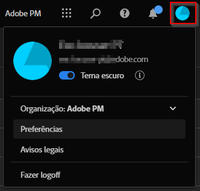

# Preferências do usuário

Você pode gerenciar as configurações ou preferências do usuário do Analysis Workspace e os componentes relacionados de todos os novos projetos ou painéis que criar. Os projetos e painéis existentes não serão afetados.

## Editar preferências

Você pode atualizar suas preferências das seguintes maneiras:

- Selecione  **[!UICONTROL Editar preferências]** na interface principal do espaço de trabalho.
- Selecione **[!UICONTROL Projeto]** > **[!UICONTROL Preferências do usuário]** no menu ao trabalhar em um projeto do espaço de trabalho.
- Selecione **[!UICONTROL Componentes]** > **[!UICONTROL Preferências]** na barra de menu superior no Customer Journey Analytics (disponível somente para admins de produtos).

## Configurar preferências

Você pode configurar as seguintes preferências:

### Preferências gerais

As preferências gerais se aplicam à experiência do Customer Journey Analytics no navegador. Para obter informações sobre como acessar essas preferências, consulte [Atualizar preferências](#update-preferences).

| Preferência | Opções |
| --- | --- |
| **[!UICONTROL Página de destino]** | Escolha qual página será exibida por padrão ao acessar o Customer Journey Analytics: <ul><li>Lista de projetos (padrão)</li><li>Projeto em branco</li><li>Análise guiada de tendências em branco</li><li>Projeto específico selecionado em uma lista</li></ul> |
| **[!UICONTROL Dicas]** | Exibe dicas em uma caixa azul na área inferior direita do Analysis Workspace. 
Essa opção está ativada por padrão.
 |
| **[!UICONTROL Componentes exibidos em grupos do painel esquerdo]** | Escolha quantos de cada grupo de componentes serão exibidos no menu Componentes no painel esquerdo. 
Se você escolher 0 para um grupo de componentes, esse grupo não estará mais acessível no painel esquerdo.

Por padrão, 5 componentes são exibidos para cada um dos seguintes grupos de componentes:
 <ul><li>Dimensões</li><li>Métricas</li><li>Segmentos</li><li>Intervalos de datas</li></ul> 
Para obter mais informações sobre Componentes no Analysis Workspace, consulte [Visão geral dos componentes](/help/components/overview.md).
 |

### Preferências da organização IMS {#ims-organization-preferences}

>[!CONTEXTUALHELP]
>id="workspace_prefs_shareonlyworkspace"
>title="Permitir compartilhamento apenas com usuários do espaço de trabalho"
>abstract="Quando habilitada, a opção **[!UICONTROL Compartilhar com qualquer pessoa]** não fica mais disponível para usuários que compartilham um projeto do Analysis Workspace. As pessoas que anteriormente receberam acesso a um projeto por meio dessa opção de compartilhamento não podem mais acessar o projeto."

>[!CONTEXTUALHELP]
>id="workspace_prefs_requireexperiencecloudauth"
>title="Exige autenticação da Experience Cloud"
>abstract="Quando habilitada, as pessoas que recebem acesso a um projeto pela opção **[!UICONTROL Compartilhar com qualquer pessoa]** do Analysis Workspace devem se autenticar usando as credenciais da Experience Cloud."

<!-- markdownlint-enable MD034 -->

>[!CONTEXTUALHELP]
>id="workspace_prefs_projectcommenting"
>title="Permitir comentários em projetos"
>abstract="Quando habilitada, uma área de comentários fica disponível no painel direito de cada projeto no Analysis Workspace."

<!-- markdownlint-enable MD034 -->

Você pode atualizar as preferências da empresa que se aplicam a todos os usuários e projetos em sua organização. Para obter informações sobre como acessar essas preferências, consulte [Atualizar preferências](#update-preferences).

| Seção | Preferência | Opções |
| --- | --- | --- |
| **Guia modelos** | | |
|  | Ocultar guia de modelos | Oculta a guia Modelos para todos os usuários da organização. |
| **Compartilhamento de projeto** | | |
| | Permitir compartilhamento apenas com usuários do espaço de trabalho | Quando esta opção está habilitada, os usuários da sua organização não podem ver a opção **[!UICONTROL Compartilhar com qualquer pessoa]** no menu **[!UICONTROL Compartilhar]**. Isso significa que os usuários não podem compartilhar projetos com pessoas que não têm uma conta do Analysis Workspace em sua organização, conforme descrito em [Compartilhar um projeto com qualquer pessoa (não exigir logon)](/help/analysis-workspace/curate-share/share-projects.md#share-public-link) em [Compartilhar projetos](/help/analysis-workspace/curate-share/share-projects.md). Esta opção está desabilitada por padrão para todas as organizações (o que significa que os usuários podem compartilhar projetos com pessoas de fora da organização), exceto para clientes que tenham uma licença do Healthcare Shield. 
Considere o seguinte ao habilitar ou desabilitar essa opção:<ul><li>Ao habilitá-la, as pessoas que anteriormente receberam acesso a um projeto por meio da opção [!UICONTROL Compartilhar com qualquer pessoa] não poderão mais acessar o projeto.</li><li>Se esta opção for habilitada (para permitir o compartilhamento somente com usuários do espaço de trabalho) e depois desabilitada (para permitir o compartilhamento com qualquer pessoa), as pessoas que receberam acesso a um projeto anteriormente por meio da opção [!UICONTROL Compartilhar com qualquer pessoa] não recuperarão automaticamente o acesso ao projeto. Neste caso, o usuário que compartilhou o projeto deve habilitar a opção [!UICONTROL **Manter o link ativo**] ao compartilhar um projeto com qualquer pessoa **([!UICONTROL Compartilhar]** > **[!UICONTROL Compartilhar com qualquer pessoa]**), conforme descrito em [Compartilhar um projeto com qualquer pessoa (não exigir logon)](/help/analysis-workspace/curate-share/share-projects.md#share-public-link) em [Compartilhar projetos](/help/analysis-workspace/curate-share/share-projects.md).</li><li>**Para clientes com uma licença do Healthcare Shield:** essa opção está habilitada por padrão e não pode ser desabilitada. Antes de desabilitar esta opção para que os usuários possam usar a opção [!UICONTROL Compartilhar com qualquer pessoa], você primeiro precisa adicionar a permissão [!UICONTROL Compartilhar links de projeto com qualquer pessoa] (localizada em [!UICONTROL Ferramentas de relatórios]) no Adobe Admin Console. Após adicionar a permissão, você poderá desabilitar essa opção e, em seguida, aceitar o aviso legal resultante. Para obter informações sobre como adicionar uma permissão no Admin Console, consulte [Gerenciar permissões de produto no Admin Console](https://helpx.adobe.com/br/enterprise/using/manage-permissions-and-roles.html).</li></ul> |
| | Exige autenticação da Experience Cloud | Quando essa opção estiver habilitada, as pessoas que receberem acesso a um projeto pela opção **[!UICONTROL Compartilhar com qualquer pessoa]** no Analysis Workspace deverão se autenticar usando suas credenciais da Experience Cloud.
Após habilitar essa opção, sempre que um usuário compartilhar um projeto usando [!UICONTROL Compartilhar com qualquer pessoa], a opção [!UICONTROL Exigir autenticação da Experience Cloud] será habilitada na caixa de diálogo de compartilhamento e não poderá ser desabilitada pelo usuário que está compartilhando o projeto. Para obter informações sobre como compartilhar projetos com qualquer pessoa, consulte [Compartilhar um projeto com qualquer pessoa (não exigir logon)](/help/analysis-workspace/curate-share/share-projects.md#share-public-link) em [Compartilhar projetos](/help/analysis-workspace/curate-share/share-projects.md). 
 
Considere o seguinte ao habilitar essa opção: <ul><li>Ao habilitar esta opção, todos os projetos que foram compartilhados anteriormente com a opção [!UICONTROL Compartilhar com qualquer pessoa] sem habilitar [!UICONTROL Exigir autenticação da Experience Cloud] serão desativados.
Se esta opção for habilitada (para exigir autenticação da Experience Cloud) e depois desabilitada (para permitir que qualquer pessoa com o link acesse o projeto), as pessoas que receberam acesso a um projeto anteriormente por meio da opção [!UICONTROL Compartilhar com qualquer pessoa] não recuperarão automaticamente o acesso ao projeto. Neste caso, o usuário que compartilhou o projeto deve habilitar a opção [!UICONTROL O link está ativo] disponível ao compartilhar um projeto com qualquer pessoa **([!UICONTROL Compartilhar]** > **[!UICONTROL Compartilhar com qualquer pessoa]** > **[!UICONTROL O link está ativo]**), conforme descrito em [Compartilhar um projeto com qualquer pessoa (sem exigência de logon)](/help/analysis-workspace/curate-share/share-projects.md#share-public-link) em [Compartilhar projetos](/help/analysis-workspace/curate-share/share-projects.md).</li><li>Essa opção só estará disponível se o recurso de logon único (SSO) estiver implementado em sua organização. Para obter informações sobre como admins de sistema podem habilitar o SSO na sua organização, consulte [Configuração de identidade e logon único](https://helpx.adobe.com/br/enterprise/using/set-up-identity.html).

Se o SSO estiver configurado na sua organização, verifique se há algum tipo de criação automática de contas implementado no console. Normalmente, isso é configurado por um(a) admin de sistema, conforme descrito em [Habilitar criação automática de conta](https://helpx.adobe.com/br/enterprise/using/automatic-account-creation.html).</li><li>Se sua organização tiver uma licença do Healthcare Shield, essa opção será habilitada por padrão e não poderá ser desabilitada.</li></ul> |
| Comentários do projeto | Permitir comentários em projetos | Quando esta opção está habilitada, uma área de comentários fica disponível no painel direito de cada projeto no Analysis Workspace. 
Proprietários de projeto podem desabilitar a área de comentários de um determinado projeto, conforme descrito em [Criar projetos](/help/analysis-workspace/build-workspace-project/create-projects.md).
 
Para obter mais informações sobre comentários em projetos do Analysis Workspace, consulte [Adicionar e gerenciar comentários em projetos](/help/analysis-workspace/build-workspace-project/comment-projects.md).
 |

{style="table-layout:auto"}

### Preferências de projetos e análises {#project-and-analysis-preferences}

>[!CONTEXTUALHELP]
>id="workspace_prefs_categoricalpalette"
>title="Paleta categórica"
>abstract="Aplicado a muitas visualizações no Analysis Workspace e em análises guiadas. Cada cor representa um valor categórico diferente."

>[!CONTEXTUALHELP]
>id="workspace_prefs_divergingpalette"
>title="Paleta divergente"
>abstract="Aplicado à tabela de coorte no Analysis Workspace e em análises guiadas de crescimento de usuários. Esta paleta possui um significado numérico com dois extremos e uma linha de base no meio."

>[!CONTEXTUALHELP]
>id="workspace_prefs_sequentialpalette"
>title="Paleta sequencial"
>abstract="Aplicado à análise guiada de tendências de frequência (barras empilhadas). Esta paleta possui um significado numérico que vai do claro ao escuro."

É possível personalizar essas preferências para todos os novos projetos e painéis do Analysis Workspace, bem como para novas análises guiadas. Para obter informações sobre como acessar essas preferências, consulte [Atualizar preferências](#update-preferences).

Algumas dessas mesmas preferências também podem ser personalizadas para projetos individuais no Analysis Workspace, conforme descrito em [Visão geral do projeto](/help/analysis-workspace/build-workspace-project/freeform-overview.md).

| Seção | Preferência | Opções |
| --- | --- | --- |
| **Exibir** | | |
|  | [Densidade da exibição](/help/analysis-workspace/build-workspace-project/view-density.md) | Escolha a quantidade de conteúdo a ser exibido na tela reduzindo o preenchimento vertical do painel à esquerda, das tabelas de forma livre e tabelas de coorte. <ul><li>Compacto</li><li>Confortável</li><li>Expandido (padrão)</li></ul> |
| | [Paleta de cores](/help/analysis-workspace/build-workspace-project/color-palettes.md) | Escolha as paletas de cores de visualização que serão usadas no Analysis Workspace e na análise guiada. <ul><li> Paleta categórica: aplicada a muitas visualizações no Analysis Workspace e na análise guiada. Cada cor representa um valor categórico distinto. Escolha entre as opções fornecidas pela Adobe ou insira uma paleta personalizada definida por valores hexadecimais delimitados por vírgulas.</li><li> Paleta divergente: aplicada à tabela de coorte no Analysis Workspace e na análise guiada de crescimento de usuários. Esta paleta contém um significado numérico com dois extremos e uma linha de base no meio.<li> Paleta sequencial: aplicada à análise guiada de tendências de frequência (barra empilhada). Esta paleta contém um significado numérico do claro para o escuro.</li></ul> |
| **Dados** | | |
|  | [Visualização de dados](/help/analysis-workspace/c-panels/panels.md#data-view) | Escolha de onde as tabelas e as visualizações derivam seus dados. <ul><li>Mais recente (padrão)</li><li>Visualização de dados específica selecionada em uma lista</li></ul> |
|  | [Calendário](/help/analysis-workspace/c-panels/panels.md#calendar) | Selecione de uma lista de: <ul><li>Intervalos fornecidos pela Adobe (o padrão é Este mês)</li><li>Você pode habilitar a opção [!UICONTROL Tornar os componentes de intervalo de datas relativos ao calendário do painel por padrão].</li></ul> |
|  | [Tipo de painel](/help/analysis-workspace/c-panels/panels.md#panel-types) | <ul><li>Forma livre (padrão)</li><li>Em branco</li><li>Insights rápidos</li></ul> |
|  | Contagem de instâncias | Habilite a opção [!UICONTROL Contar instâncias repetidas] para especificar se as instâncias repetidas devem ser contadas em relatórios. Por exemplo, quando essa opção está habilitada, várias visualizações de página consecutivas na mesma página são tratadas como várias visualizações de página. Quando desabilitada, as várias visualizações de página consecutivas na mesma página contam como uma única visualização de página. 
**Observação:** essa configuração afeta apenas determinadas métricas (como Sessões) e não se aplica a visualizações de fluxo ou fallout.
 |
|  | Formato de número | <ul><li>1.000,00 (padrão)</li><li>1.000,00</li><li>1 000,00</li></ul> |
|  | Caractere separador do CSV | <ul><li>Vírgula (padrão)</li><li>Ponto e vírgula</li><li>Dois-pontos</li><li>Estágio</li><li>Ponto</li><li>Espaço</li><li>Tabulação</li></ul> |
|  | Mostrar anotações | Escolha se as anotações estão visíveis em seus projetos. Para obter mais informações sobre anotações, consulte [Visão geral de anotações](/help/components/annotations/overview.md). |

### Preferências da tabela de forma livre {#freeform-table-preferences}

>[!CONTEXTUALHELP]
>id="workspace_prefs_showanomalies"
>title="Mostrar anomalias"
>abstract="Selecionar a opção **[!UICONTROL Mostrar anomalias]** executará automaticamente a detecção de anomalias na primeira coluna de métrica adicionada a uma visualização de tabela de forma livre de série temporal."

>[!CONTEXTUALHELP]
>id="workspace_prefs_showforecast"
>title="Mostrar previsão"
>abstract="Selecionar **[!UICONTROL Mostrar previsão]** preverá automaticamente a primeira coluna de métrica adicionada a uma visualização de tabela de forma livre de série temporal."

>[!CONTEXTUALHELP]
>id="workspace_prefs_defaulttablemetric"
>title="Métrica de tabela padrão"
>abstract="Selecione a métrica padrão para usar em tabelas de forma livre. Se a visualização de dados selecionada não contiver a métrica padrão selecionada, a tabela alternará automaticamente para outra métrica primária."

Você pode personalizar as preferências da tabela de forma livre para todos os novos projetos criados no Analysis Workspace. Para obter informações sobre como acessar essas preferências, consulte [Atualizar preferências](#update-preferences).

Algumas dessas mesmas preferências também podem ser personalizadas para tabelas individuais.

Selecione os títulos da seção vinculada para obter mais informações e contexto sobre as preferências disponíveis.

| Seção | Preferência | Opções |
| --- | --- | --- |
| **Tabela** | | |
| | Tipo de tabela | <ul><li>Forma livre</li><li>Construtor de tabelas</li></ul> |
| | Métrica de tabela padrão | <ul><li>Eventos</li><li>Sessões</li><li>Pessoas</li></ul> |
| | Dimensão padrão da tabela | Escolha de Minuto, Hora, Dia, Semana, Mês, Trimestre ou Ano. |
| | Alinhar datas | Selecione essa opção para alinhar as datas de cada coluna para que todas iniciem na mesma linha. |
| **[Coluna](/help/analysis-workspace/visualizations/freeform-table/column-row-settings/column-settings.md)** | | |
| | Quebrar linha do texto do cabeçalho | Permite quebrar o texto de cabeçalho em tabelas de forma livre para tornar os cabeçalhos mais legíveis e as tabelas mais compartilháveis. Essa opção é útil para renderização de .pdf e para métricas com nomes compridos. Habilitado por padrão. |
| | Exibir totais | Este número total geralmente é igual a ou um subconjunto do [!UICONTROL Total geral]. Ele reflete todos os segmentos de tabela aplicados dentro da tabela de forma livre, incluindo a opção [!UICONTROL Incluir nenhum]. |
| | Mostrar totais gerais | Este número total representa todos os eventos que foram coletados, às vezes chamado de *total da visualização de dados*. Quando um segmento é aplicado no nível do painel ou na tabela de forma livre, esse total é ajustado para refletir todos os eventos que correspondem aos critérios do segmento. O total geral não é compatível com tabelas e detalhamentos com [linhas estáticas](/help/analysis-workspace/visualizations/freeform-table/workspace-totals.md). |
| | Mostrar minigráfico | Mostrar ou ocultar gráficos de linha na parte inferior do gráfico. Quando oculta, a legenda será alterada para não mais fazer referência visual às linhas. |
| | Número | Determina se uma célula exibe ou oculta o valor numérico da métrica. Por exemplo, se a métrica for Exibições de página, o valor numérico será o número de exibições de página para o item da linha. |
| | Porcentagem | Determina se uma célula exibe ou oculta o valor percentual para a métrica. Por exemplo, se a métrica for “visualizações de página”, o valor percentual será o número de visualizações de página do item da linha dividido pelo total de visualizações de página da coluna.  Observação: é possível exibir porcentagens maiores que 100% para aumentar a precisão. Você também pode mover o limite superior para 1.000% para garantir que as colunas possam aumentar em largura. |
| | Mostrar anomalias <!-- This setting was moved from the "Project" tab. this is already in the tool/docs under "Freeform table, But the doc doesn't give a definition. --> | Determina se a detecção de anomalias é executada nos valores desta coluna. |
| | Mostrar previsão | Determina se os valores de previsão aparecem automaticamente na primeira coluna da métrica em qualquer tabela de forma livre de série temporal que você criou. |
| | Interpretar o zero como valor inexistente | Para células com valor 0, determina se exibirá um 0 ou uma célula em branco. Isso é útil para observar dados diários de um mês que ainda não tenha terminado.  Em vez de mostrar 0 para as datas futuras, pode-se exibir células em branco. Os gráficos também respeitam essa configuração (por exemplo, eles não mostram uma linha ou barra com valores 0 quando essa configuração está marcada). |
| | Histórico | Determina se uma célula exibe ou oculta todas as formatações de célula, incluindo o gráfico de barras e a formatação condicional <ul><li>Gráfico de barras</li> Exibe um gráfico de barras horizontal que representa o valor da célula relativo ao total da coluna. <li>Formatação condicional</li>Para obter mais informações sobre formatação condicional, consulte “Formatação condicional” em [Configurações de coluna](/help/analysis-workspace/visualizations/freeform-table/column-row-settings/column-settings.md)</ul> |
| | Visualização da célula | Mostra uma visualização de como cada célula é exibida com a aplicação das opções de formatação atuais selecionadas. |
| **[Linha](/help/analysis-workspace/visualizations/freeform-table/column-row-settings/table-settings.md)** | | |
| | Detalhamento por posição | Selecione essa opção se desejar que o detalhamento permaneça com a posição do item em vez do próprio item. Para obter mais informações sobre detalhamentos, consulte [Analisar dimensões](/help/components/dimensions/t-breakdown-fa.md). |
| | Cálculo percentual | <ul><li>Coluna</li><li>Linha</li></ul> |
| | Totais de coluna (somente linhas estáticas) | <ul><li>Exibir soma das linhas: mostra a soma dos itens de linha individuais </li><li>Exibir total geral: mostra a soma de linhas desduplicadas.</li></ul> |

### Preferências de visualizações {#visalization-preferences}

>[!CONTEXTUALHELP]
>id="workspace_prefs_defaultflowcontainer"
>title="Container padrão"
>abstract="Selecione o container padrão a ser usado para visualizações de [!UICONTROL fluxo]. Se a visualização de dados selecionada não contiver o container padrão selecionado, a visualização de [!UICONTROL fluxo] alternará automaticamente para outro container primário."

>[!CONTEXTUALHELP]
>id="workspace_prefs_defaultfalloutcontainer"
>title="Container padrão"
>abstract="Selecione o container padrão a ser usado para as visualizações de [!UICONTROL fallout]. Se a visualização de dados selecionada não contiver o container padrão selecionado, a visualização de [!UICONTROL fallout] alternará automaticamente para outro container primário."

>[!CONTEXTUALHELP]
>id="workspace_prefs_defaulthistogramcountingmethod"
>title="Método de contagem padrão"
>abstract="Selecione o método de contagem padrão a ser usado para visualizações de [!UICONTROL histograma]. Se a visualização de dados selecionada não contiver o método de contagem padrão selecionado, a visualização de [!UICONTROL histograma] alternará automaticamente para outro método de contagem primário."

>[!CONTEXTUALHELP]
>id="workspace_prefs_defaultjourneycanvascontainer"
>title="Container padrão"
>abstract="Selecione o container padrão a ser usado para visualizações de [!UICONTROL tela da jornada]. Se a visualização de dados selecionada não contiver o container padrão selecionado, a visualização de [!UICONTROL tela da jornada] alternará automaticamente para outro container primário."

Você pode atualizar as preferências de visualização para todos os novos projetos criados no Analysis Workspace. Para obter informações sobre como acessar essas preferências, consulte [Atualizar preferências](#update-preferences).

Algumas dessas mesmas preferências também podem ser personalizadas para visualizações individuais.

Selecione os títulos da seção vinculada para obter mais informações e contexto sobre as preferências disponíveis.

| Seção | Preferência | Opções |
| --- | --- | --- |
| **Padrões gerais** | | |
| | Porcentagens | Exibe valores em porcentagens para todas as visualizações. |
| | Legenda visível | Permite ocultar o texto detalhado da legenda para todas as visualizações. |
| | Limite máximo de itens | Reduz o número de itens no eixo X para todas as visualizações. Essa preferência pode ser útil se você tiver um grande conjunto de dados. |
| | Exibir eixo duplo (quando aplicável) | Aplica-se somente se você tiver duas métricas: você pode ter um eixo y à esquerda (para uma métrica) e à direita (para a outra métrica). Essa preferência é útil quando as métricas representadas são de magnitudes muito diferentes. |
| | Normalização (quando aplicável) | Força as métricas em proporções iguais. Essa preferência é útil quando as métricas representadas são de magnitudes muito diferentes. |
| | Ancorar o eixo Y em zero | Se todos os valores representados no gráfico estiverem consideravelmente acima de zero, o gráfico padrão atualiza a parte inferior do eixo y para um valor DIFERENTE DE ZERO. Se você marcar esta caixa, o eixo y será reduzido a zero (e o gráfico será redesenhado). |
| | Ancorar anomalias para dimensionar o eixo Y | O eixo y será dimensionado usando valores de anomalia. |
| **[Linha](/help/analysis-workspace/visualizations/line.md)** | | |
| | Porcentagens | Exibe valores em porcentagens para as visualizações de linha. |
| | Legenda visível | Permite ocultar o texto detalhado da legenda para a visualização de linha. |
| | Limite máximo de itens | Reduz o número de itens no eixo X na visualização de linha. Essa preferência pode ser útil se você tiver um grande conjunto de dados. |
| | Exibir eixo duplo (quando aplicável) | Aplica-se somente se você tiver duas métricas: você pode ter um eixo y à esquerda (para uma métrica) e à direita (para a outra métrica). Essa preferência é útil quando as métricas representadas são de magnitudes muito diferentes. |
| | Normalização (quando aplicável) | Força as métricas em proporções iguais. Essa preferência é útil quando as métricas representadas são de magnitudes muito diferentes. |
| | Mostrar eixo X | Exibe o eixo x no gráfico de linha. |
| | Mostrar eixo Y | Exibe o eixo y no gráfico de linha. |
| | Âncora do eixo Y | Se todos os valores representados no gráfico estiverem consideravelmente acima de zero, por padrão, o gráfico renderizará a parte inferior do eixo y com um valor DIFERENTE DE ZERO. Se você marcar esta caixa, o eixo y será reduzido a zero (e o gráfico será redesenhado). |
| | Permitir que as anomalias dimensionem o eixo Y | Se você tiver várias métricas em um gráfico, é necessário passar o mouse sobre cada anomalia para ver a faixa de confiança para essa métrica. Para tornar a visualização mais legível, o intervalo de confiança da Detecção de anomalias não dimensiona automaticamente o eixo y. Esta configuração permite que o intervalo de confiança dimensione a visualização. 
Para obter mais informações, consulte [Exibir anomalias no Analysis Workspace](/help/analysis-workspace/c-anomaly-detection/view-anomalies.md).
 |
| | Permitir que a previsão mude a escala do eixo Y | Se você tiver valores previstos que estejam fora dos limites superior e inferior dos valores históricos, o eixo y não dimensionará automaticamente esses valores previstos. Quando ativada, esta opção dimensiona corretamente o eixo y para os valores previstos. |
| | Mostrar mín. | Sobrepõe um rótulo de valor mínimo para destacar rapidamente os vales em uma métrica. Observação: os valores mín. são derivados dos pontos de dados visíveis na visualização, não do conjunto completo de valores em uma dimensão. |
| | Mostrar máx. | Sobrepõe um rótulo de valor máximo para destacar rapidamente os picos em uma métrica. Observação: os valores máx. são derivados dos pontos de dados visíveis na visualização, não do conjunto completo de valores em uma dimensão. |
| | Mostrar linha de tendência | Mostrar uma regressão ou uma linha de tendência média móvel para a sua série de linhas. As linhas de tendência ajudam a descrever um padrão mais claro nos dados. |
| **[Coorte](/help/analysis-workspace/visualizations/cohort-table/t-cohort.md)** | | |
| | [!BADGE B2B Edition]{type=Informative url="https://experienceleague.adobe.com/pt-br/docs/analytics-platform/using/cja-overview/cja-b2b/cja-b2b-edition" newtab=true tooltip="Customer Journey Analytics B2B Edition"} Container | Selecione o container preferencial para análise de coorte no caso de uma conexão [!BADGE B2B Edition]{type=Informative url="https://experienceleague.adobe.com/pt-br/docs/analytics-platform/using/cja-overview/cja-b2b/cja-b2b-edition" newtab=true tooltip="Customer Journey Analytics B2B Edition"} baseada em conta. 
As seguintes opções estão disponíveis:
 <ul><li>Contas globais [!BADGE B2B edition]{type=Informative url="https://experienceleague.adobe.com/pt-br/docs/analytics-platform/using/cja-overview/cja-b2b/cja-b2b-edition" newtab=true tooltip="Customer Journey Analytics B2B Edition"}</li><li>Contas [!BADGE B2B Edition]{type=Informative url="https://experienceleague.adobe.com/pt-br/docs/analytics-platform/using/cja-overview/cja-b2b/cja-b2b-edition" newtab=true tooltip="Customer Journey Analytics B2B Edition"}</li><li>Grupos de compra [!BADGE B2B Edition]{type=Informative url="https://experienceleague.adobe.com/pt-br/docs/analytics-platform/using/cja-overview/cja-b2b/cja-b2b-edition" newtab=true tooltip="Customer Journey Analytics B2B Edition"}</li><li>Oportunidades [!BADGE B2B Edition]{type=Informative url="https://experienceleague.adobe.com/pt-br/docs/analytics-platform/using/cja-overview/cja-b2b/cja-b2b-edition" newtab=true tooltip="Customer Journey Analytics B2B Edition"}</li><li>Pessoa</li></ul> |
| | Granularidade | Para visualizações de tendências, você pode alterar a granularidade de tempo (dia, semana, mês, trimestre ou ano). Essa alteração também se aplica à tabela de fontes de dados. |
| | Mostrar somente a porcentagem | Remove o valor do número e mostra somente a porcentagem. |
| | Arredondar porcentagem ao inteiro mais próximo | Arredonda o valor percentual para o inteiro mais próximo em vez de mostrar o valor decimal. |
| | Mostrar linha de porcentagem média | Insere uma nova linha na parte superior da tabela e adiciona a média para os valores dentro de cada coluna. |
| **[Gráficos de combinação](/help/analysis-workspace/visualizations/combo-charts.md)** | | |
| | Mostrar eixo X | Exibe o eixo x no gráfico de combinação. |
| | Mostrar eixo Y | Exibe o eixo y no gráfico de combinação. |
| | Exibir barras nas linhas | Mostrar barras em linhas nos gráficos de combinação. |
| **[Resumo da métrica principal](/help/analysis-workspace/visualizations/key-metric.md)** | | |
| | Tipo de exibição de resumo | <ul><li>Enfatizar a variação percentual</li><li>Enfatizar o valor do número</li></ul> |
| | Mostrar linhas cintilantes | Mostrar ou ocultar gráficos de linha na parte inferior do gráfico. Quando oculta, a legenda será alterada para não mais fazer referência visual às linhas. |
| | Mostrar máximo e mínimo em sparklines | Mostrar valores mínimos e máximos em gráficos de linha primários e de comparação. |
| | Mostrar comparação | Mostrar dados de comparação. Quando ocultos, o gráfico de linhas de comparação e os objetos de alteração de resumo não aparecem na visualização. |
| | Opções de valor numérico | Na seção [!UICONTROL **Resumo das métricas principais**] <ul><li>Mostrar variação percentual</li><li>Mostrar diferença bruta</li>Diferença bruta entre o valor total da métrica no intervalo de datas principal e o intervalo de datas secundário</ul> |
| **[Fallout](/help/analysis-workspace/visualizations/fallout/configuring-fallout.md)** | | |
| | Container | Selecione seu container de preferência para analisar a definição de caminho. O container preferencial ajuda você a entender o engajamento da conta em vários níveis de container B2B [!BADGE B2B Edition]{type=Informative url="https://experienceleague.adobe.com/pt-br/docs/analytics-platform/using/cja-overview/cja-b2b/cja-b2b-edition" newtab=true tooltip="Customer Journey Analytics B2B Edition"}, o engajamento de pessoas no nível da pessoa (entre sessões) ou a restringir a análise a uma única sessão. 
As seguintes opções estão disponíveis:
 <ul><li>Contas globais [!BADGE B2B edition]{type=Informative url="https://experienceleague.adobe.com/pt-br/docs/analytics-platform/using/cja-overview/cja-b2b/cja-b2b-edition" newtab=true tooltip="Customer Journey Analytics B2B Edition"}</li><li>Contas [!BADGE B2B Edition]{type=Informative url="https://experienceleague.adobe.com/pt-br/docs/analytics-platform/using/cja-overview/cja-b2b/cja-b2b-edition" newtab=true tooltip="Customer Journey Analytics B2B Edition"}</li><li>Grupos de compra [!BADGE B2B Edition]{type=Informative url="https://experienceleague.adobe.com/pt-br/docs/analytics-platform/using/cja-overview/cja-b2b/cja-b2b-edition" newtab=true tooltip="Customer Journey Analytics B2B Edition"}</li><li>Oportunidades [!BADGE B2B Edition]{type=Informative url="https://experienceleague.adobe.com/pt-br/docs/analytics-platform/using/cja-overview/cja-b2b/cja-b2b-edition" newtab=true tooltip="Customer Journey Analytics B2B Edition"}</li><li>Sessão</li><li>Pessoa</li></ul> |
| **[Fluxo](/help/analysis-workspace/visualizations/c-flow/create-flow.md)** | | |
| | Container | Selecione seu container de preferência para analisar. O container preferencial ajuda você a entender o engajamento da conta em vários níveis de container B2B [!BADGE B2B Edition]{type=Informative url="https://experienceleague.adobe.com/pt-br/docs/analytics-platform/using/cja-overview/cja-b2b/cja-b2b-edition" newtab=true tooltip="Customer Journey Analytics B2B Edition"}, o engajamento de pessoas no nível da pessoa (entre sessões) ou a restringir a análise a uma única sessão. 
As seguintes opções estão disponíveis:
 <ul><li>Contas globais [!BADGE B2B edition]{type=Informative url="https://experienceleague.adobe.com/pt-br/docs/analytics-platform/using/cja-overview/cja-b2b/cja-b2b-edition" newtab=true tooltip="Customer Journey Analytics B2B Edition"}</li><li>Contas [!BADGE B2B Edition]{type=Informative url="https://experienceleague.adobe.com/pt-br/docs/analytics-platform/using/cja-overview/cja-b2b/cja-b2b-edition" newtab=true tooltip="Customer Journey Analytics B2B Edition"}</li><li>Grupos de compra [!BADGE B2B Edition]{type=Informative url="https://experienceleague.adobe.com/pt-br/docs/analytics-platform/using/cja-overview/cja-b2b/cja-b2b-edition" newtab=true tooltip="Customer Journey Analytics B2B Edition"}</li><li>Oportunidades [!BADGE B2B Edition]{type=Informative url="https://experienceleague.adobe.com/pt-br/docs/analytics-platform/using/cja-overview/cja-b2b/cja-b2b-edition" newtab=true tooltip="Customer Journey Analytics B2B Edition"}</li><li>Sessão</li><li>Pessoa</li></ul> |
| | Rótulos de quebra de linha | Normalmente, os rótulos nos Elementos de fluxo são truncados para não poluir visualmente a tela, mas é possível tornar todos os rótulos visíveis ao selecionar esta caixa. Padrão = desmarcado. |
| | Incluir instâncias repetidas | As visualizações de fluxo são baseadas em instâncias de uma dimensão. Essa configuração oferece a opção de incluir ou excluir instâncias repetidas, por exemplo, recarregamentos de página. No entanto, as repetições não podem ser removidas das Visualizações de fluxo que incluem dimensões com vários valores, como listVars, listProps, s.product, eVars de merchandising etc. Padrão = desmarcado. |
| | Mostrar dicas de ferramentas | Determina se as dicas de ferramentas, que contêm dados de nós, são exibidas ao passar o mouse sobre nós individuais em uma visualização de fluxo. |
| | Número de colunas | Determina quantas colunas você deseja incluir no diagrama de Fluxo. |
| | Itens expandidos por coluna | Quantos itens você deseja em cada coluna. |
| **[Tela da jornada](/help/analysis-workspace/visualizations/journey-canvas/journey-canvas.md)** | | |
| | Container | Selecione seu container de preferência para analisar a definição de caminho. O container preferencial ajuda você a entender o engajamento da conta em vários níveis de container B2B [!BADGE B2B Edition]{type=Informative url="https://experienceleague.adobe.com/pt-br/docs/analytics-platform/using/cja-overview/cja-b2b/cja-b2b-edition" newtab=true tooltip="Customer Journey Analytics B2B Edition"}, o engajamento de pessoas no nível da pessoa (entre sessões) ou a restringir a análise a uma única sessão. 
As seguintes opções estão disponíveis:
 <ul><li>Contas globais [!BADGE B2B edition]{type=Informative url="https://experienceleague.adobe.com/pt-br/docs/analytics-platform/using/cja-overview/cja-b2b/cja-b2b-edition" newtab=true tooltip="Customer Journey Analytics B2B Edition"}</li><li>Contas [!BADGE B2B Edition]{type=Informative url="https://experienceleague.adobe.com/pt-br/docs/analytics-platform/using/cja-overview/cja-b2b/cja-b2b-edition" newtab=true tooltip="Customer Journey Analytics B2B Edition"}</li><li>Grupos de compra [!BADGE B2B Edition]{type=Informative url="https://experienceleague.adobe.com/pt-br/docs/analytics-platform/using/cja-overview/cja-b2b/cja-b2b-edition" newtab=true tooltip="Customer Journey Analytics B2B Edition"}</li><li>Oportunidades [!BADGE B2B Edition]{type=Informative url="https://experienceleague.adobe.com/pt-br/docs/analytics-platform/using/cja-overview/cja-b2b/cja-b2b-edition" newtab=true tooltip="Customer Journey Analytics B2B Edition"}</li><li>Sessão</li><li>Pessoa</li></ul> |
| **Gráficos empilhados** | | |
| | 100% empilhada | Essa configuração de visualizações de área empilhada, barra empilhada ou barra horizontal empilhada transforma o gráfico em uma visualização “100% empilhada”.  
Para obter mais informações, consulte [Barra e barras empilhadas](/help/analysis-workspace/visualizations/bar.md).
 |
| **[Histograma](/help/analysis-workspace/visualizations/histogram.md)** | | |
| | Número de grupos | Escolha o número de intervalos de datas (compartimentos) na visualização. O número máximo de grupos é 50. 
Para obter mais informações, consulte [Histograma](/help/analysis-workspace/visualizations/histogram.md).
 |
| | Método de contagem | Escolha entre as seguintes opções: <ul><li>Ocorrência</li><li>Sessão</li><li>Pessoa</li></ul> 
Por exemplo, quando usado com visualizações de página, é possível escolher visualizações de página por pessoa, por visita ou por evento. Para ocorrências, “Ocorrências” é usada como a métrica do eixo “y” na tabela de forma livre.
 |
| **[Alteração de resumo](/help/analysis-workspace/visualizations/summary-number-change.md)** | | |
| | Valor | <!-- Seem to be basically the same options as in "Number value options" --> <ul><li>Mudança percentual</li><li>Diferença bruta</li></ul> |
| | Porcentagens | Exibe valores em porcentagens para as visualizações do Resumo de alterações. |
| | Legenda visível | Permite ocultar o texto detalhado da legenda para a visualização Resumo da alteração. |
| **[Número do resumo](/help/analysis-workspace/visualizations/summary-number-change.md)** | | |
| | Porcentagens | Exibe valores em porcentagens para as visualizações do Número de resumo. |
| | Legenda visível | Permite ocultar o texto detalhado da legenda para a visualização Número de resumo. |
| | Valor de resumo por | Escolha entre Máx., Mín., Média, Mediana e Soma. |
| | Abreviar valor | Na seção **[!UICONTROL Número de resumo]** |
| **[Mapas de árvore](/help/analysis-workspace/visualizations/treemap.md)** | | |
| | Porcentagens | Exibe valores em porcentagens para as visualizações do Mapa de árvore. |
| | Limite máximo de itens | Reduz o número de itens no eixo X na visualização do Mapa de árvore. Essa preferência pode ser útil se você tiver um grande conjunto de dados. |
| **[Venn](/help/analysis-workspace/visualizations/venn.md)** | | |
| | Legenda visível | Permite ocultar o texto detalhado da legenda para a visualização de Venn. |
| **[Dispersão](/help/analysis-workspace/visualizations/scatterplot.md)** | | |
| | Porcentagens | Exibe valores em porcentagens para as visualizações de dispersão. |
| | Legenda visível | Permite ocultar o texto detalhado da legenda para a visualização de dispersão. |
| | Limite máximo de itens | Reduz o número de itens no eixo X da visualização de dispersão.  Essa preferência pode ser útil se você tiver um grande conjunto de dados. |
| | Ancorar o eixo Y em zero | Se todos os valores representados no gráfico estiverem consideravelmente acima de zero, por padrão, o gráfico renderizará a parte inferior do eixo y com um valor DIFERENTE DE ZERO. Se você marcar esta caixa, o eixo y será reduzido a zero (e o gráfico será redesenhado). |

## Restaurar preferências padrão

Você pode restaurar todas as preferências do usuário para os padrões do sistema. Esta preferência não afeta as preferências de admin na guia Empresa.

Esta ação não pode ser desfeita.

1. No Customer Journey Analytics, selecione [!UICONTROL **Componentes**] **>** [!UICONTROL **Preferências**] no menu superior. Ou selecione **[!UICONTROL Projeto]** > **[!UICONTROL Configurações de usuário]** no menu do espaço de trabalho.

1. No canto superior direito, selecione **[!UICONTROL Restaurar padrões]**.

1. Selecione **[!UICONTROL Restaurar padrões]** em **[!UICONTROL Restaurar configurações padrão do sistema]**.

## [!UICONTROL Tema escuro]

Se preferir ter um fundo escuro para a interface de usuário do Customer Journey Analytics, é possível alternar para [!UICONTROL Tema escuro].

1. Clique no ícone de usuário da Experience Cloud na parte superior direita.

   

1. Habilite o **[!UICONTROL Tema escuro]**.

