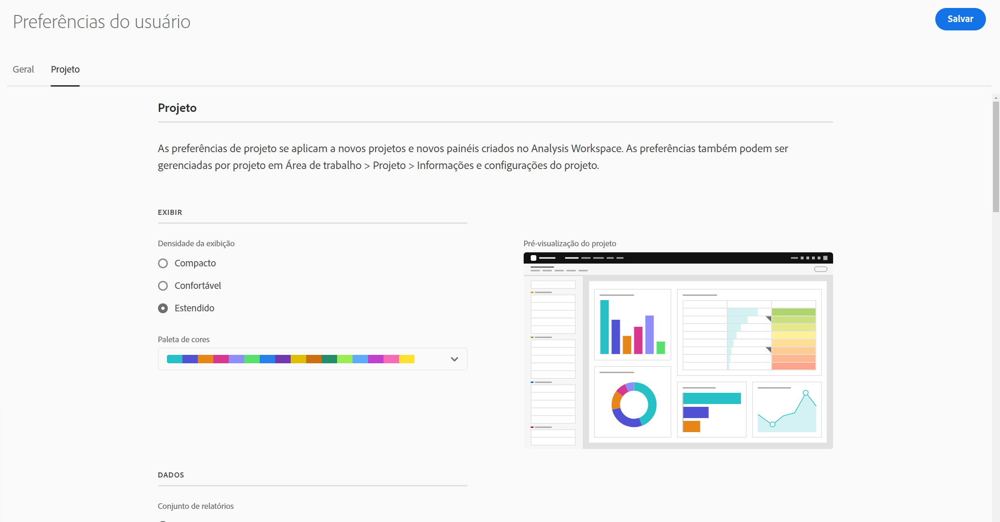

# Preferências do usuário

>[!NOTE]
>
>Esse recurso será adicionado em breve. A Disponibilidade Geral é em 25 de março de 2021.

A página [!UICONTROL Componentes] > [!UICONTROL Preferências do usuário] permite gerenciar as configurações do Analysis Workspace e seus componentes relacionados para os usuários. As preferências do usuário se aplicam a *todos* novos projetos ou painéis.

## Preferências gerais

As preferências gerais se aplicam à experiência do CJA no navegador.

| Preferência | Opções |
| --- | --- |
| Landing page | <ul><li>Lista de projetos (padrão)</li><li>Projeto em branco</li><li>Projeto específico</li></ul> |
| Dicas | <ul><li>Ativado (padrão)</li><li>Desativado</li></ul> |

## Preferências do projeto

As preferências de projeto se aplicam a novos projetos e novos painéis criados no Analysis Workspace. As preferências também podem ser gerenciadas por projeto em Workspace > Projeto > Informações e configurações do projeto.

| Seção | Preferência | Opções |
| --- | --- | --- |
| **Exibir** |  |  |
|  | [Densidade da exibição](https://experienceleague.adobe.com/docs/analytics-platform/using/cja-workspace/build-workspace-project/view-density.html?lang=pt-BR) | <ul><li>Compacto</li><li>Confortável</li><li>Expandido (padrão)</li></ul> |
|  | [Paleta de cores](https://experienceleague.adobe.com/docs/analytics-platform/using/cja-workspace/build-workspace-project/color-palettes.html?lang=pt-BR) | <ul><li>Paletas fornecidas pela Adobe (padrão)</li><li>Paletas definidas pelo cliente</li></ul> |
| **Dados** |  |  |
|  | [Calendário](https://experienceleague.adobe.com/docs/analytics-platform/using/cja-workspace/panels/panels.html?lang=pt-BR#calendar) | Lista de intervalos de datas prontos para uso, incluindo **[!UICONTROL Este mês]** (padrão) |
|  | [Tipo de painel](https://experienceleague.adobe.com/docs/analytics-platform/using/cja-workspace/panels/panels.html?lang=pt-BR) | <ul><li>Forma livre (padrão)</li><li>Em branco</li><li>Insights rápidos</li></ul> |
|  | Formato de número | <ul><li>1.000,00 (padrão)</li><li>1.000,00</li><li>1 000,00</li></ul> |
|  | Separador CSV | <ul><li>Vírgula (padrão)</li><li>Ponto e vírgula</li><li>Dois-pontos</li><li>Estágio</li><li>Ponto</li><li>Espaço</li><li>Tabulação</li></ul> |
