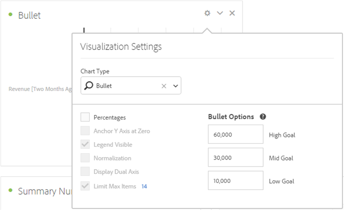

# Gráfico de marcadores

Permite ver a comparação ou a medição de um valor em relação a outros intervalos de desempenho (metas).

O gráfico de marcadores apresenta uma só medida principal (por exemplo, receita acumulada no ano atual) e permite que você informe intervalos qualitativos de desempenho (por exemplo, em comparação com uma receita alvo). Você pode especificar alto, médio e baixo. É possível especificar intervalos de meta em [!UICONTROL Configurações de visualização].
