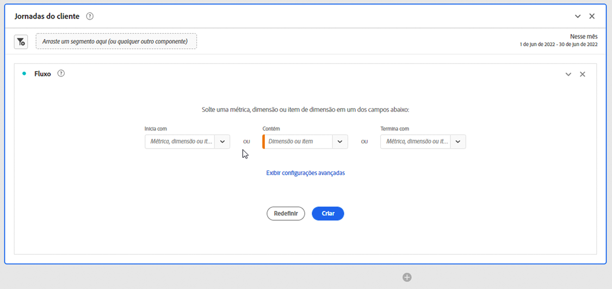

# Configurar uma visualização de fluxo

As visualizações de fluxo ajudam você a entender a jornada originada de um evento de conversão específico em seu site ou aplicativo. Ou que leva a um evento de conversão específico. A visualização rastreia um caminho pelas suas dimensões (e itens de dimensão) ou métricas.

Você pode configurar o início ou o fim do caminho em que está interessado. Ou analisar todos os caminhos que fluem por uma dimensão ou item de dimensão.

## Use 

1. Adicione uma visualização de  **[!UICONTROL Flow]**. Consulte [Adicionar uma visualização a um painel](../freeform-analysis-visualizations.md#add-visualizations-to-a-panel).

1. Crie uma âncora para a visualização de fluxo usando uma das seguintes opções:

   * [!UICONTROL **Começa com**] (métricas, dimensões ou itens) ou
   * [!UICONTROL **Contém**] (dimensões ou itens), ou
   * [!UICONTROL **Termina com**] (métricas, dimensões ou itens)

   Cada uma dessas categorias é mostrada na tela como uma *zona de lançamento*. É possível preencher a área de lançamento de 3 maneiras:

   * Use o menu suspenso para selecionar métricas ou dimensões.
   * Arraste dimensões ou métricas do painel esquerdo.
   * Comece a digitar o nome de uma dimensão ou métrica e selecione-a quando aparecer na lista suspensa.

   >[!IMPORTANT]
   >
   >Métricas calculadas não podem ser usadas nos campos **[!UICONTROL Começa com]** ou **[!UICONTROL Termina com]**.

1. Se você escolher uma métrica, também precisará fornecer um [!UICONTROL **Dimension de definição de caminho**] para usar como caminho conduzindo ou vindo do componente selecionado, como mostrado aqui. O padrão é [!UICONTROL **Página**].

   

1. (Opcional) Selecione **[!UICONTROL Mostrar configurações avançadas]** para configurar qualquer uma das seguintes opções:

   | Configuração | Descrição |
   | --- | --- |
   | **[!UICONTROL Rótulos de quebra de linha]** | Normalmente, os rótulos nos Elementos de fluxo são truncados para não poluir visualmente a tela, mas é possível tornar todos os rótulos visíveis ao selecionar esta caixa.  Padrão = desmarcado. |
   | **[!UICONTROL Incluir instâncias repetidas]** | As visualizações de fluxo são baseadas em instâncias de uma dimensão. Essa configuração oferece a opção de incluir ou excluir instâncias repetidas, por exemplo, recarregamentos de página. No entanto, as repetições não podem ser removidas das Visualizações de fluxo que incluem dimensões com vários valores, como listVars, listProps, s.product, eVars de merchandising etc. 
Essa opção está desabilitada por padrão.
 |
   | **[!UICONTROL Limitar à primeira/última ocorrência]** | Limitar caminhos a caminhos que começam ou terminam com a primeira ou a última ocorrência de uma dimensão, item ou métrica. Consulte [Limitar à primeira/última ocorrência](#example-scenario-for-limit-to-firstlast-occurrence) para obter uma explicação mais detalhada. |
   | **[!UICONTROL Número de colunas]** | O número de colunas que você deseja no diagrama de fluxo. É possível especificar um máximo de cinco colunas. |
   | **[!UICONTROL Itens expandidos por coluna]** | O número de itens que você deseja em cada coluna. É possível especificar no máximo 10 itens expandidos por coluna. |
   | **[!UICONTROL Container de fluxo]** | Você pode alternar entre **[!UICONTROL Sessões]** e **[!UICONTROL Pessoa]** para analisar a definição de caminho. Essas configurações ajudam você a entender o envolvimento de uma pessoa no nível da pessoa (em várias sessões) ou restringir a análise a uma única sessão. |

   >[!IMPORTANT]
   >
   >A combinação de **[!UICONTROL Número de colunas]** e **[!UICONTROL Itens expandidos por coluna]** determina o número de solicitações subjacentes necessárias para criar a visualização de fluxo. Quanto mais altos esses números, mais tempo leva para renderizar uma visualização.

1. Selecione **[!UICONTROL Criar]**.

### Exemplo

Suponha que você queira rastrear o caminho que os usuários tomaram para e das páginas mais populares do site.

1. Crie uma visualização de fluxo conforme descrito acima.
1. Arraste a dimensão [!UICONTROL **Página**] para o campo **[!UICONTROL Contém]** e selecione [!UICONTROL **Criar**].
1. A visualização de Fluxo é criada, com a página mais visualizada visível no nó de foco, no centro da visualização. Você também pode ver as principais páginas que entram nessa página (à esquerda do nó de foco), bem como as principais páginas que saem dessa página (à direita do nó de foco).
1. Analisar dados no fluxo, conforme descrito em [Configurar](#configure).

## Configurar

Um resumo da configuração de Fluxo é exibido na parte superior das visualizações. Os caminhos no diagrama são proporcionais. Caminhos com maior atividade aparecem mais grossos.

Para detalhar ainda mais os dados, você tem várias opções:

* O diagrama de fluxo é interativo. Passe o mouse sobre o diagrama para alterar os detalhes exibidos.

* Ao clicar em um nó no diagrama, os detalhes dele são exibidos. Selecione o nó novamente para recolhê-lo.

  

* É possível filtrar uma coluna para exibir apenas determinados resultados, como incluir e excluir, especificar critérios etc.

* Selecione  no lado esquerdo ou direito para expandir uma coluna.

* Para personalizar a saída, use as opções do [menu de contexto](#context-menu).

* Para editar o fluxo ou recriá-lo com opções diferentes, selecione  ao lado do resumo da configuração.

## Filtro

Acima de cada coluna, um filtro  é exibido quando você passa o mouse sobre ele. Ao selecionar o filtro, você obtém a mesma caixa de diálogo de filtro que existe na tabela de Forma livre. Consulte [Filtrar e classificar](freeform-table/../../freeform-table/filter-and-sort.md).

* Use **[!UICONTROL Mostrar avançadas]** para definir as configurações avançadas para incluir ou excluir determinados critérios com uma lista de operadores. Consulte [Filtros e classificação](../freeform-table/filter-and-sort.md) para obter mais informações.
* Depois de filtrar uma coluna, essa coluna específica reflete a filtragem. Um  azul indica que a coluna está filtrada.  O filtro reduz a coluna para mostrar somente o item permitido no filtro. Ou remove todos os itens, exceto o item que você deseja no filtro.
* Todas as colunas downstream e upstream persistem, desde que haja dados fluindo para os nós restantes.
* Para remover um filtro, selecione  para abrir o menu de filtro. Remova os filtros aplicados e clique em **[!UICONTROL Salvar]**. O fluxo deve retornar ao estado anterior e não filtrado.

## Menu de contexto

Use um menu de contexto em qualquer nó na visualização de fluxo com as seguintes opções:

| Opção | Descrição |
|--- |--- |
| **[!UICONTROL Concentre-se neste nó]** | Altere o foco para o nó selecionado. O nó de foco é exibido no centro do diagrama de fluxo. |
| **[!UICONTROL Começar de novo]** | Retorne ao criador de diagrama de forma livre, onde é possível criar um novo diagrama de Fluxo. |
| **[!UICONTROL Criar um filtro para este caminho]** | Criar um filtro. Essa seleção leva você ao Construtor de filtros, onde é possível configurar o novo filtro. |
| **[!UICONTROL Detalhamento]** | Detalhe o nó por Dimensões, Métricas ou Tempo disponíveis. |
| **[!UICONTROL Filtrar coluna]** | As mesmas opções de filtro são exibidas conforme disponíveis na tabela de Forma livre. Para obter mais informações sobre as opções disponíveis, consulte a seção &quot;Aplicar um filtro simples ou avançado a uma tabela&quot; em [Filtrar e classificar tabelas](/help/analysis-workspace/visualizations/freeform-table/filter-and-sort.md). |
| **[!UICONTROL Excluir item]** ou **[!UICONTROL Restaurar itens excluídos]** | Remove um nó específico da coluna e o cria automaticamente como filtro na parte superior da coluna. Para restaurar o item excluído, no menu de contexto, selecione **[!UICONTROL Restaurar Item Excluído]**. Você também pode abrir o filtro na parte superior da coluna e remover a caixa de seleção com o item que acabou de excluir. |
| **[!UICONTROL Tendência]** | Crie um diagrama de tendências para o nó. |
| **[!UICONTROL Mostrar próxima coluna]** / **[!UICONTROL Mostrar coluna anterior]** | Revela a próxima coluna (direita) ou a coluna anterior (esquerda) da visualização. |
| **[!UICONTROL Ocultar coluna]**n | Oculta a coluna selecionada da visualização. |
| **[!UICONTROL Expandir toda a coluna]** | Expanda uma coluna para exibir todos os nós. Por padrão, somente os cinco principais nós são exibidos. |
| **[!UICONTROL Criar público a partir da seleção]** | Cria um público-alvo com base na coluna selecionada. |
| **[!UICONTROL Recolher toda a coluna]** | Ocultar todos os nós em uma coluna. |

## Limite para a primeira/última ocorrência

Ao usar essa opção, lembre-se de que:

* **[!UICONTROL Limitar à primeira/última ocorrência]** conta somente a primeira/última ocorrências na série. Todas as outras ocorrências dos critérios **[!UICONTROL Começa com]** ou **[!UICONTROL Termina com]** são descartados.
* Se usada com um fluxo **[!UICONTROL Começa com]**, somente a primeira ocorrência que corresponde aos critérios de início será incluída.
No exemplo abaixo, **todas** as ocorrências de *Adicionar ao carrinho* e *Categoria principal do produto* em cada etapa do fluxo são incluídas.
  

  No exemplo abaixo, apenas as **primeiras** ocorrências de *Adicionar ao carrinho* e *Categoria principal do produto* em cada etapa do fluxo são incluídas.
  
* Se usada com um fluxo **[!UICONTROL Termina com]**, somente a última ocorrência que corresponde aos critérios finais será incluída.
No exemplo abaixo, **todas** as ocorrências de *Categoria principal do produto* e *Adicionar ao carrinho* em cada etapa do fluxo são incluídas.
  

  No exemplo abaixo, apenas as **últimas** ocorrências da *categoria principal do produto* e da *Adicionar ao carrinho* em cada etapa do fluxo são incluídas.
  
* As séries utilizadas diferem de acordo com o container. Se estiver usando o contêiner **[!UICONTROL Pessoa]**, a série de eventos será a sessão. Se estiver usando o contêiner **[!UICONTROL Sessão]**, a série de eventos será todos os eventos de um determinado usuário no intervalo de datas fornecido.
* A opção **[!UICONTROL Limitar à primeira/última ocorrência]** pode ser definida nas configurações avançadas ao usar uma Métrica ou Item Dimension nos campos **[!UICONTROL Inicia com]** ou **[!UICONTROL Termina com]**.

>[!MORELIKETHIS]
>
>[Adicionar uma visualização a um painel](/help/analysis-workspace/visualizations/freeform-analysis-visualizations.md#add-visualizations-to-a-panel)
>[Configurações de visualização](/help/analysis-workspace/visualizations/freeform-analysis-visualizations.md#settings)
>[Menu de contexto de visualização](/help/analysis-workspace/visualizations/freeform-analysis-visualizations.md#context-menu)
>

