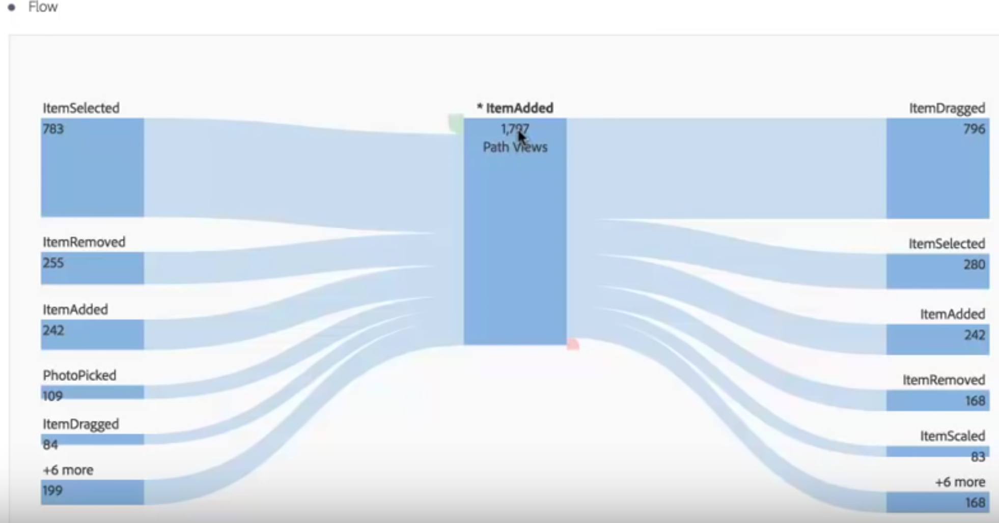
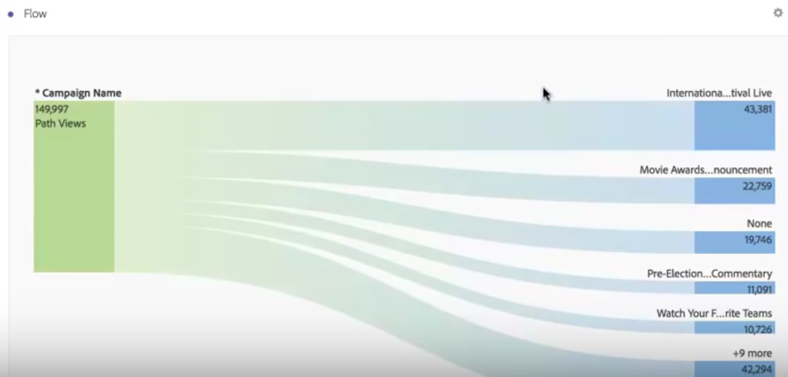

# Fluxos interdimensionais

Um fluxo interdimensional permite analisar os caminhos do usuário em várias dimensões.

Um rótulo de dimensão na parte superior de cada coluna de Fluxo torna mais intuitivo o uso de várias dimensões em uma visualização de fluxo:

Vamos analisar dois casos de uso: um de aplicativo e um da web.

## Caso de uso 1: aplicativo

A dimensão de [!UICONTROL Nome da ação] foi adicionada ao fluxo, com os principais itens retornados sendo [!UICONTROL ItemAdded]:

Para explorar a interação entre telas/páginas e ações neste aplicativo, você pode arrastar a dimensão de página a diferentes locais, dependendo do que você deseja explorar:

* Arraste-o para uma área (dentro do retângulo com margens pretas exibido) para **substituir** os resultados principais nos finais:

   

* Arraste para o espaço branco no final (observe o colchete preto) para **adicionar à** visualização:

  

Aqui está o resultado se você decidir substituir o item ItemScaled na coluna da direita com a dimensão de Página. Os principais resultados são substituídos para os principais resultados para a dimensão de Página:

Agora você pode ver como os clientes se movem pelas ações e páginas. Você pode explorar o fluxo, clicando em diferentes nós:

É isso que acontece ao adicionar outra dimensão de Nome de ação no final da visualização:

Isso permitirá insights aprofundados e possíveis alterações ao aplicativo que você está analisando.

## Caso de uso 2: web

Este caso de uso mostra como você pode analisar quais campanhas impulsionam a maioria das entradas em um site.

Arraste a dimensão de Nome da campanha para um novo fluxo:

Agora, quero saber para quais páginas essas campanhas estão impulsionando tráfego, então, arrasto a dimensão de Página à direita dos resultados de fluxo para adicionar à visualização:

