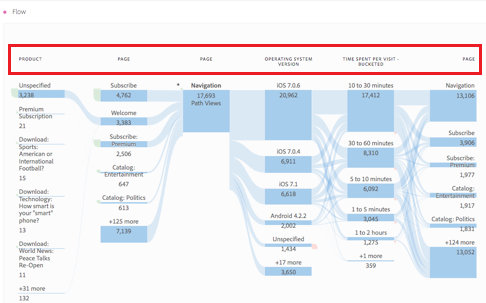
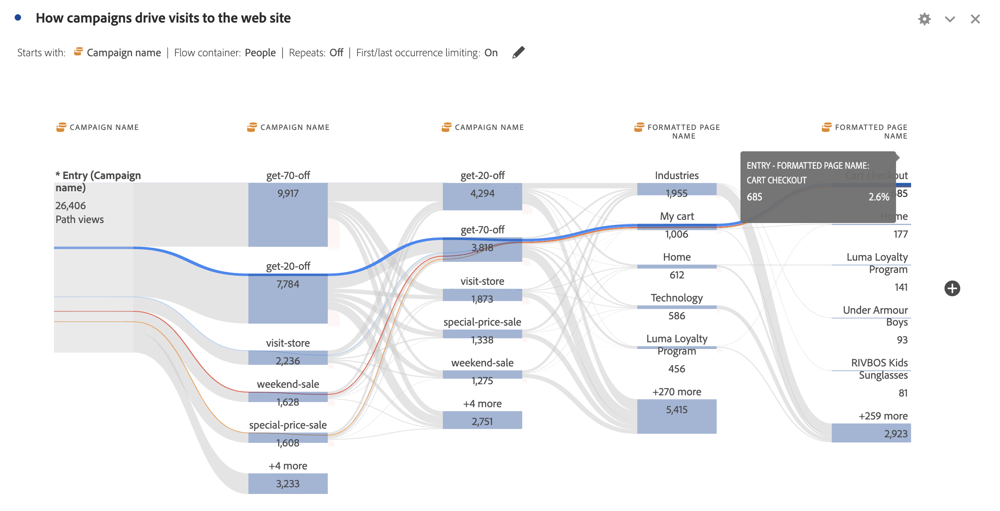

# Fluxos interdimensionais

Um fluxo interdimensional permite examinar os caminhos do usuário em várias dimensões. Este artigo mostra como usar esse fluxo para dois casos de uso: interações e eventos de aplicativos móveis e como campanhas direcionam visitas da Web

<!--
A dimension label at the top of each Flow column makes using multiple dimensions in a flow visualization more intuitive:

-->

## Interações e eventos de aplicativos móveis

A dimensão [!UICONTROL Nome da tela] é usada neste fluxo de exemplo para ver como os usuários utilizam as várias telas (cenas) no aplicativo. A tela superior retornada é **[!UICONTROL luma: content: ios: en: home]**, que é a página inicial do aplicativo:

Para observar a interação entre telas e tipos de evento (como adições ao carrinho, compras e outros) neste aplicativo, arraste e solte a dimensão **[!UICONTROL Tipos de evento]**:

* Sobre qualquer etapa disponível no fluxo, para substituir essa dimensão:

  

* Fora da visualização de fluxo atual, para adicionar a dimensão:

  

A visualização de fluxo abaixo mostra o resultado de adicionar a dimensão **[!UICONTROL Tipos de evento]**. A visualização fornece informações sobre a navegação de usuários de aplicativos móveis pelas telas do aplicativo antes de adicionar produtos ao carrinho, fechar o aplicativo, receber uma oferta e mais.

## Como as campanhas impulsionam visitas da web

Você deseja analisar quais campanhas impulsionam visitas para o site. Para isso, você cria uma visualização de fluxo com o **[!UICONTROL Nome da campanha]** como a dimensão

Você substitui a última dimensão **[!UICONTROL Nome da campanha]** pela dimensão **[!UICONTROL Nome da página formatada]** e adiciona outra dimensão **[!UICONTROL Nome da página formatada]** ao final da visualização de fluxo.

É possível passar o mouse sobre qualquer um dos fluxos para ver mais detalhes. Por exemplo, quais campanhas resultaram em um check-out do carrinho.

