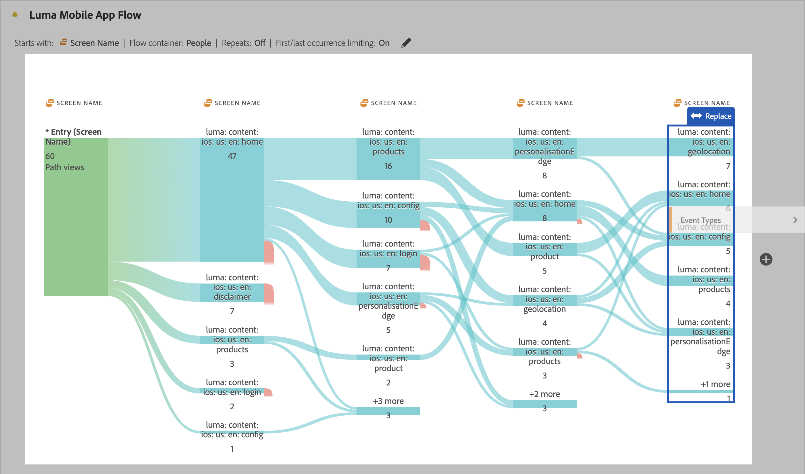

# Fluxos interdimensionais

Um fluxo interdimensional permite examinar os caminhos do usuário em várias dimensões. Este artigo mostra como usar esse fluxo para dois casos de uso: interações e eventos de aplicativos móveis e como campanhas direcionam visitas da Web

<!--
A dimension label at the top of each Flow column makes using multiple dimensions in a flow visualization more intuitive:

-->

## Interações e eventos do aplicativo móvel

A dimensão [!UICONTROL Nome da tela] é usada neste fluxo de exemplo para ver como os usuários usam as várias telas (cenas) no aplicativo. A tela superior retornada é **[!UICONTROL luma: content: ios: en: home]**, que é a página inicial do aplicativo:

Para explorar a interação entre telas e tipos de evento (como adicionar ao carrinho, compras e outros) neste aplicativo, arraste e solte a dimensão **[!UICONTROL Tipos de evento]**:

* Sobre qualquer etapa disponível no fluxo, para substituir essa dimensão:

  

* Fora da visualização de fluxo atual, para adicionar a dimensão:

  

A visualização de fluxo abaixo mostra o resultado da adição da dimensão **[!UICONTROL Tipos de evento]**. A visualização fornece insights sobre como os usuários de aplicativos móveis se movem por várias telas no aplicativo antes de adicionar produtos ao carrinho, fechar o aplicativo, receber uma oferta e muito mais.

## Como as campanhas impulsionam as visitas da Web

Você deseja analisar quais campanhas direcionam visitas ao site. Você cria uma visualização de fluxo com o **[!UICONTROL Nome da campanha]** como a dimensão

Substitua a última dimensão **[!UICONTROL Nome da Campanha]** pela dimensão **[!UICONTROL Nome da Página Formatada]** e adicione outra dimensão **[!UICONTROL Nome da Página Formatada]** ao final da visualização de fluxo.

Você pode passar o mouse sobre qualquer um dos fluxos para ver mais detalhes. Por exemplo, quais campanhas resultaram em um check-out no carrinho.

