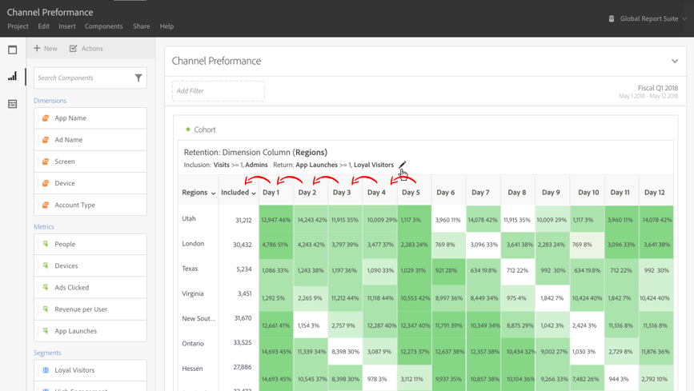
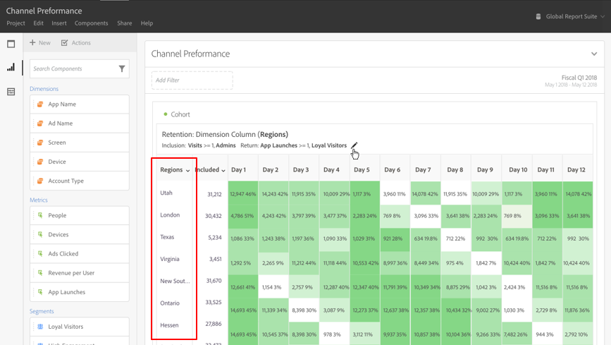

# O que é a [!UICONTROL análise de coorte]?

A *`cohort`* é um grupo de pessoas com características comuns em um período específico. A [!UICONTROL análise de coorte] é útil, por exemplo, quando você deseja saber como uma coorte interage com uma marca. Você pode detectar facilmente as mudanças nas tendências e atuar de acordo com elas. (Há explicações sobre a [!UICONTROL análise de coorte] disponíveis na Web, por exemplo, em [Análise de coorte 101](https://pt.wikipedia.org/wiki/Análise_de_coorte).)

Após criar um relatório de coorte, você pode preparar seus componentes (dimensões, métricas e filtros específicos) e, em seguida, compartilhá-lo com qualquer pessoa. Consulte [Preparar e compartilhar](/help/analysis-workspace/curate-share/curate.md).

Exemplos do que você pode fazer com a [!UICONTROL análise de coorte]:

* Lançar campanhas projetadas para estimular uma ação desejada.
* Deslocar o orçamento de marketing no momento certo do ciclo de vida do cliente.
* Reconhecer quando finalizar uma avaliação ou uma oferta para maximizar o valor.
* Obter ideias para o teste A/B em áreas como o estabelecimento de preços, o caminho de atualização, etc.

A [!UICONTROL Análise de coorte] está disponível a todos os clientes do Customer Journey Analytics com direitos de acesso ao [!UICONTROL Analysis Workspace].

[Tutorial em vídeo da Análise de coorte](https://experienceleague.adobe.com/docs/analytics-learn/tutorials/analysis-workspace/cohort-analysis/cohort-analysis-workspace.html?lang=pt-BR) (4:36)

>[!IMPORTANT]
>
>[!UICONTROL Análise de coorte] não aceita métricas não filtráveis (incluindo métricas calculadas), métricas não inteiras (como Receita) ou Ocorrências. Somente as métricas que podem ser usadas em filtros podem ser usadas na [!UICONTROL Análise de coorte], e só podem ser aumentados 1 de cada vez.

## Recursos da análise de coorte

Os seguintes recursos permitem o controle ajustado dos coortes que você está criando:

### Tabela de [!UICONTROL retenção]

A [!UICONTROL Retenção] o relatório de coorte retorna pessoas: cada célula de dados mostra o número bruto e a porcentagem de pessoas na coorte que realizaram a ação durante esse período. É possível incluir até 3 métricas e 10 filtros.

### [!UICONTROL Tabela de abandono]

A [!UICONTROL Churn] a coorte é o inverso da tabela de retenção e mostra as pessoas que abandonaram ou que nunca atenderam aos critérios de retorno da sua coorte ao longo do tempo. É possível incluir até 3 métricas e 10 filtros.

### [!UICONTROL Cálculo contínuo]

Permite calcular a retenção ou o abandono com base na coluna anterior em vez da coluna incluída.

### [!UICONTROL Tabela de latência]

Mede o tempo decorrido antes e depois da ocorrência do evento de inclusão. Essa é uma ferramenta excelente para ser usada antes ou depois da análise. Uma coluna **[!UICONTROL Incluída]** encontra-se no centro da tabela e períodos de tempo anteriores e posteriores ao evento de inclusão são exibidos em ambos os lados.

### Coorte de [!UICONTROL dimensão personalizada]

Crie coortes com base em uma dimensão selecionada, em vez de coortes com base em tempo, que são o padrão. Use dimensões como [!UICONTROL canal de marketing], [!UICONTROL campanha], [!UICONTROL produto], [!UICONTROL página], [!UICONTROL região] ou qualquer outra dimensão no Customer Journey Analytics para mostrar como a retenção é alterada com base nos diferentes valores dessas dimensões.

Para obter instruções sobre como configurar e executar um relatório de coorte, acesse [Configurar um relatório de análise de coorte](/help/analysis-workspace/visualizations/cohort-table/t-cohort.md).
