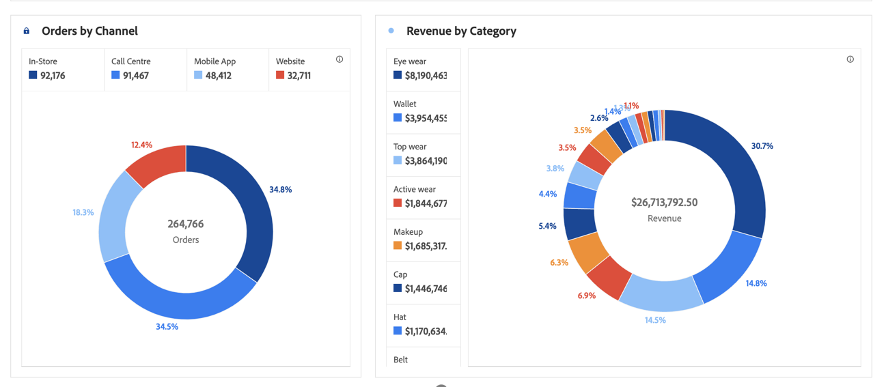

# Rosca {#donut}

<!-- markdownlint-disable MD034 -->

>[!CONTEXTUALHELP]
>id="workspace_donut_button"
>title="Rosca"
>abstract="Crie uma visualização de donut para comparar porcentagens de um total, normalmente com um pequeno número de itens."

<!-- markdownlint-enable MD034 -->

>[!BEGINSHADEBOX]

_Este artigo documenta a visualização de Rosca no_  _**Customer Journey Analytics**._ _Consulte [Rosca](https://experienceleague.adobe.com/pt-br/docs/analytics/analyze/analysis-workspace/visualizations/donut) para a versão_  _**Adobe Analytics** deste artigo._

>[!ENDSHADEBOX]

Semelhante a um gráfico de pizza, a visualização de  **[!UICONTROL rosca]** mostra dados como partes ou segmentos de um todo. Use uma visualização de rosca ao comparar porcentagens de um total, normalmente com um pequeno número de itens.

>[!BEGINSHADEBOX]

Consulte  [Adicionar uma visualização de rosca](https://experienceleague.adobe.com/en/docs/customer-journey-analytics-learn/tutorials/analysis-workspace/visualizations/add-donut-visualizations){target="_blank"} para ver um vídeo de demonstração.

{{videoaa}}

>[!ENDSHADEBOX]

>[!MORELIKETHIS]
>
>[Adicionar uma visualização a um painel](/help/analysis-workspace/visualizations/freeform-analysis-visualizations.md#add-visualizations-to-a-panel)
>[Configurações de visualização](/help/analysis-workspace/visualizations/freeform-analysis-visualizations.md#settings)
>[Menu de contexto da visualização](/help/analysis-workspace/visualizations/freeform-analysis-visualizations.md#context-menu)
>

