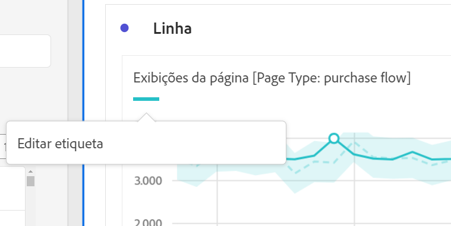
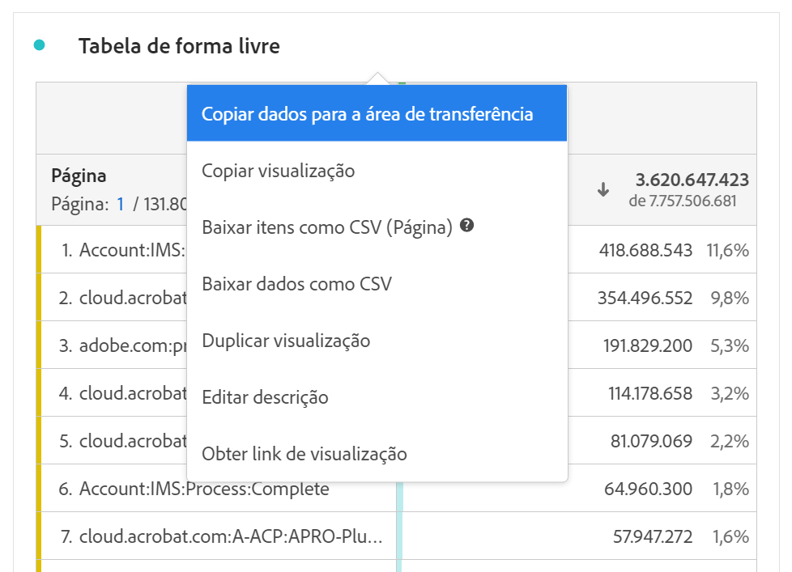
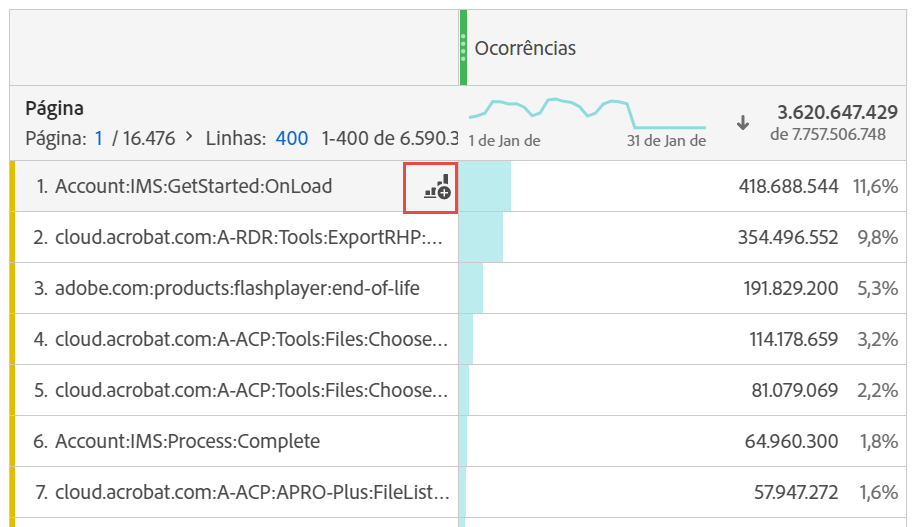

# Visão geral das visualizações

O Workspace oferece várias visualizações que permitem criar representações visuais dos seus dados. Como gráficos de barras, gráficos de rosca, histogramas, gráficos de linhas, mapas, gráficos de dispersão, entre outros.

##  Tipos

Os seguintes tipos de visualização estão disponíveis no Analysis Workspace:

| Ícone | Nome | Descrição |
| :---: | --- | ---| 
|  | [Área](/help/analysis-workspace/visualizations/area.md) | Uma visualização de gráfico de área. Semelhante a um gráfico de linhas, mas apresenta uma área colorida abaixo da linha. Use um gráfico de área quando você tiver diversas métricas e desejar visualizar a área expressa pela interseção de duas ou mais métricas. |
|  | [Barra](/help/analysis-workspace/visualizations/bar.md) | A visualização de gráfico de barras mostra barras verticais que representam vários valores em uma ou mais métricas. |
|  | [Barra empilhada](/help/analysis-workspace/visualizations/bar.md) | A visualização de gráfico de barras empilhadas mostra barras verticais que representam vários valores em uma ou mais métricas. |
| 
 | [Marcador](/help/analysis-workspace/visualizations/bullet-graph.md) | Uma visualização de gráfico de marcadores que mostra uma comparação ou medição de um valor em relação a outros intervalos de desempenho (metas). |
|  | [Tabela de coorte](/help/analysis-workspace/visualizations/cohort-table/cohort-analysis.md) | Uma coorte é um grupo de pessoas com características em comum por um período específico. A tabela de coorte é útil para análise de retenção, churn ou latência. |
|  | [Combo](combo-charts.md) | Um gráfico de combinação acelera a criação de uma visualização de comparação sem precisar criar uma tabela primeiro.  |
|  | [Rosca](/help/analysis-workspace/visualizations/donut.md) | Semelhante ao gráfico de pizza, a visualização de rosca mostra os dados como partes ou segmentos de um todo. |
|  | [Fallout](/help/analysis-workspace/visualizations/fallout/fallout-flow.md) | Uma visualização de fallout mostra onde os visitantes saíram e onde continuaram em uma sequência predefinida de páginas. |
|  | [Fluxo](/help/analysis-workspace/visualizations/c-flow/flow.md) | Uma visualização de fluxo mostra os caminhos percorridos pelos clientes nos seus sites e aplicativos. |
| 
 | [Tabela de forma livre](/help/analysis-workspace/visualizations/freeform-table/freeform-table.md) | Uma visualização de tabela de forma livre é uma visualização interativa. A visualização de tabela de forma livre é a base para a análise de dados no Workspace. |
|  | [Histograma](/help/analysis-workspace/visualizations/histogram.md) | Uma visualização de histograma agrupa pessoas, visitas ou eventos em compartimentos com base no volume de uma métrica. |
|  | [Barra horizontal](/help/analysis-workspace/visualizations/horizontal-bar.md) | Uma visualização de barras horizontais mostra barras horizontais que representam vários valores de uma ou mais métricas. |
|  | [Barra horizontal empilhada](/help/analysis-workspace/visualizations/horizontal-bar.md) | Uma visualização de barras horizontais empilhadas mostra barras horizontais que representam vários valores de uma ou mais métricas. |
|  | [Tela da jornada](/help/analysis-workspace/visualizations/journey-canvas/journey-canvas.md) | Uma visualização da tela da jornada ajuda a analisar e obter insights sobre as jornadas que você fornece aos usuários e clientes. |
|  | [Resumo das métricas principais](/help/analysis-workspace/visualizations/key-metric.md) | Uma visualização de resumo das métricas principais combina as visualizações de linha, alteração do resumo e número do resumo. |
|  | [Linha](/help/analysis-workspace/visualizations/line.md) | Uma visualização de linha representa as métricas que usam uma linha para mostrar como os valores são alterados no decorrer de um período. Um gráfico de linhas usa o tempo no eixo x. |
|  | [Dispersão](/help/analysis-workspace/visualizations/scatterplot.md) | Uma visualização de gráfico de dispersão mostra a relação entre itens de dimensão e até três métricas.  |
|  | [Cabeçalho de seção](section-header.md) | Para identificar e articular as seções de um painel. |
|  | [Alteração de resumo](/help/analysis-workspace/visualizations/summary-number-change.md) | Uma visualização de alteração do resumo mostra a alteração entre as células selecionadas como um número grande ou uma porcentagem. |
| 
 | [Número do resumo](/help/analysis-workspace/visualizations/summary-number-change.md) | Uma visualização de número do resumo mostra a célula selecionada como um número grande. |
|  | [Texto](/help/analysis-workspace/visualizations/text.md) | Uma visualização de texto permite adicionar textos definidos pelo usuário ao Workspace. Útil para adicionar contexto à análise e aos insights, além de aproveitar as descrições do painel/da visualização |
|  | [Mapas de árvore](/help/analysis-workspace/visualizations/treemap.md)
 | Uma visualização de mapa de árvore exibe dados hierárquicos (estruturados em formato de árvore) como um conjunto de retângulos aninhados. |
|  | [Venn](/help/analysis-workspace/visualizations/venn.md) | Uma visualização de Venn usa círculos para descrever a sobreposição de métricas de até 3 segmentos. |

<!-- Add beneath Horizontal bar in the table above: | [Journey canvas](/help/analysis-workspace/visualizations/journey-canvas/journey-canvas.md) | Similar to Fallout, Journey canvas shows where persons left (fell out) and continued through (fell through) a predefined sequence of pages. 
Unlike Fallout, Journey canvas supports not only linear journeys, but any number of entry points and paths. Furthermore, journeys can be created in Adobe Journey Optimizer and then analyzed in Journey canvas.
 | -->

## Adicionar visualizações a um painel

1. Abra o projeto do Workspace ao qual deseja adicionar uma visualização.

1. Use qualquer um dos métodos a seguir para adicionar a visualização:

   

   * No painel esquerdo, selecione **Visualizações** de  e arraste uma visualização até o painel ao qual deseja adicionar a visualização.

   * No painel ao qual você deseja adicionar a visualização, selecione  e escolha o ícone que representa a visualização que você deseja adicionar. Passe o mouse sobre o ícone de cada visualização para ver seu nome.

   * Adicione um [painel em branco](/help/analysis-workspace/c-panels/blank-panel.md) e selecione a visualização que deseja adicionar.

   * No menu de contexto de uma visualização existente no seu projeto do Analysis Workspace, selecione **[!UICONTROL Duplicar visualização]** ou **[!UICONTROL Copiar visualização]**.

   * Use o menu **[!UICONTROL Inserir]** do Workspace para inserir uma visualização.

   * No menu de contexto de uma tabela de forma livre, selecione **[!UICONTROL Visualizar]**. Em seguida, selecione a visualização no submenu. Com base na seleção atual na tabela, o Workspace determina qual visualização oferecer e interpreta os dados para criar a visualização solicitada.

## Legenda

Uma legenda de visualização ajuda a relacionar a data em uma tabela de origem com a série plotada na visualização. A legenda é interativa: é possível selecionar um item de legenda para mostrar/ocultar uma série na visualização, o que é útil se você quiser simplificar os dados que estão sendo visualizados.

Além disso, é possível renomear rótulos de legenda para ajudá-lo a tornar as exibições mais atraentes. Observação: a edição de legendas **não** se aplica a: Treemap, Marcador, Alteração ou Número do resumo, Texto, Forma livre, Histograma, Coorte ou Visualizações de fluxo.

Para editar um rótulo de legenda:

1. Clique com o botão direito do mouse em uma das etiquetas de legenda.
1. Clique em **[!UICONTROL Editar rótulo]**.

   

1. Digite o texto do novo rótulo.
1. Pressione **[!UICONTROL Enter]** para salvar.

## Configurações 

Cada visualização tem suas próprias configurações. Para acessar as configurações de visualização, selecione  **[!UICONTROL Configurações]** no cabeçalho da visualização para mostrar uma janela pop-up.

Dependendo da visualização, você pode configurar

* detalhes da fonte de dados da visualização por meio da guia [**[!UICONTROL Fonte de dados]**](#data-source) e
* configurações da visualização por meio da guia [**[!UICONTROL Configurações]**](#settings-1).

### Fonte de dados

É possível controlar qual fonte de dados e itens ou posições dessa fonte de dados correspondem a uma visualização. Consulte [Gerenciar fontes de dados](t-sync-visualization.md) para mais informações.

### Configurações 

As configurações de visualização disponíveis dependem da visualização. A tabela abaixo resume as configurações mais comuns. Algumas visualizações têm configurações específicas. Consulte a documentação referente às visualizações para mais detalhes.

| Opção | Descrição |
| --- | --- |
| **[!UICONTROL Tipo de visualização]** | Alterar o tipo de visual usado para visualizar os dados. |
| **[!UICONTROL Granularidade]** | Alterar a granularidade de tempo para visualizações de tendências. Essa alteração também se aplica à tabela de fontes de dados. |
| **[!UICONTROL Porcentagens]** | Exibir os valores em porcentagens. |
| **[!UICONTROL 100% empilhada]** | Transformar o gráfico em uma visualização 100% empilhada.  Aplicável somente a uma visualização de área, barras e barras horizontais empilhadas. |
| **[!UICONTROL Legenda visível]** | Mostrar o texto da legenda. |
| **[!UICONTROL Limite máximo de itens]** | Permite limitar a quantidade de itens exibidos em uma visualização. Quando selecionado, define a quantidade máxima de itens. |
| **[!UICONTROL Mostrar anotações]** | Mostrar as anotações feitas nesta visualização. |
| **[!UICONTROL Ocultar título]** | Ocultar o título da visualização. |
| **[!UICONTROL Ancorar o eixo Y em zero]** | Forçar a parte inferior do eixo Y a zero. Se todos os valores exibidos no gráfico forem consideravelmente superiores a zero, o padrão do gráfico tornará a parte inferior do eixo Y diferente de zero. Se esta opção for habilitada, o eixo Y será forçado a zero (e o gráfico será redesenhado). |
| **[!UICONTROL Exibir eixo duplo]** | Exibir os eixos Y esquerdo e direito para duas métricas diferentes. Esta opção só se aplica se você tiver duas métricas. Eixos duplos são úteis quando métricas projetadas têm magnitudes diferentes. |
| **[!UICONTROL Mostrar eixo X]** | Mostrar o eixo X na visualização. |
| **[!UICONTROL Mostrar eixo Y]** | Mostrar o eixo Y na visualização. |
| **[!UICONTROL Mostrar barras nas linhas]** | Mostrar barras na visualização de linha em uma visualização de gráfico de combinação. |
| **[!UICONTROL Normalização]** | Forçar as métricas a proporções iguais. Proporções iguais são úteis quando métricas projetadas têm magnitudes diferentes. |
| **[!UICONTROL Mostrar anomalias]** | Aprimorar os gráficos de linha e tabelas de forma livre, exibindo a detecção de anomalias. A detecção de anomalias em visualizações de linha inclui um valor esperado (linha tracejada) e um intervalo esperado (faixa sombreada). |
| **[!UICONTROL Mostrar previsão]** | Aprimorar os gráficos de linha e tabelas de forma livre, exibindo os valores de previsão.  |
| **[!UICONTROL Mostrar mín.]** | Mostrar o valor mínimo na visualização. |
| **[!UICONTROL Mostrar máx.]** | Mostrar o valor máximo na visualização. |
| **[!UICONTROL Mostrar linha de tendências]** | Mostrar uma linha de tendências na visualização. Quando selecionada, você pode selecionar o tipo de linha de tendência no menu suspenso. |

É possível personalizar as configurações de todas as visualizações criadas. Para obter mais informações, consulte [Preferências do usuário](/help/analysis-workspace/user-preferences.md).

## Menu de contexto {#right-click}

Use o menu de contexto (disponível por meio da seleção alternativa, como, por exemplo, ao clicar com o botão direito do mouse) em um cabeçalho de visualização para acessar funcionalidades adicionais de uma visualização. Nem todas as opções estão disponíveis para todas as visualizações.

| Opção | Descrição |
| --- | --- |
| **[!UICONTROL Inserir visualização copiada]** | Colar (inserir) uma visualização copiada em outro lugar dentro do projeto ou em um projeto totalmente diferente. |
| **[!UICONTROL Copiar dados para a área de transferência]** | Copiar dados da visualização para a área de transferência. |
| **[!UICONTROL Copiar seleção para a área de transferência]** | Copiar a seleção da visualização para a área de transferência. |
| **[!UICONTROL Baixar itens como CSV (*nome da dimensão*)]** | Baixar os itens de dimensão (até, no máximo, 50 mil) da visualização para o seu dispositivo local. Até 50 mil itens de dimensão para a dimensão selecionada. |
| **[!UICONTROL Copiar visualização]** | Copiar a visualização, para que você possa inseri-la em outro lugar dentro do projeto ou em um projeto totalmente diferente. |
| **[!UICONTROL Baixar dados como CSV]** | Baixar os dados exibidos da visualização para o seu dispositivo local. |
| **[!UICONTROL Exportar tabela completa]** | Exportar a tabela completa para locais designados na nuvem. Consulte [Exportar relatórios do Customer Journey Analytics para a nuvem](../export/export-cloud.md) |
| **[!UICONTROL Duplicar visualização]** | Fazer uma duplicata exata da visualização. |
| **[!UICONTROL Editar descrição]** | Adicionar (ou editar) uma descrição em texto para a visualização. Consulte [Texto](text.md). |
| **[!UICONTROL Obter link da visualização]** | Copiar e compartilhar um link diretamente para a visualização. Uma caixa de diálogo “Compartilhar link” exibe o link. Selecione “Copiar” para copiar o link para a área de transferência. |
| **[!UICONTROL Começar de novo]** | Excluir a configuração da visualização atual, para que você possa reconfigurá-la do zero. |

## Configuração

Algumas visualizações (como tabela de coorte, fallout, fluxo e outras) contêm uma caixa de diálogo de configuração para ajudar a criar a visualização. Use a opção  na parte superior da visualização para acessar e alterar a configuração.

## Visualizar

Se não tiver certeza de qual visualização selecionar, clique em **[!UICONTROL Visualizar]**   em qualquer linha da tabela de forma livre (disponível ao passar o cursor do mouse). Essa seleção é a maneira mais rápida de adicionar uma visualização. O Analysis Workspace dá um palpite informado de qual visualização se adequaria melhor aso seus dados. Por exemplo, se você tiver uma linha selecionada, ela criará um [gráfico de linhas](line.md) de tendências. Se você tiver três linhas de segmento selecionadas, será criado um diagrama de [Venn](venn.md).

