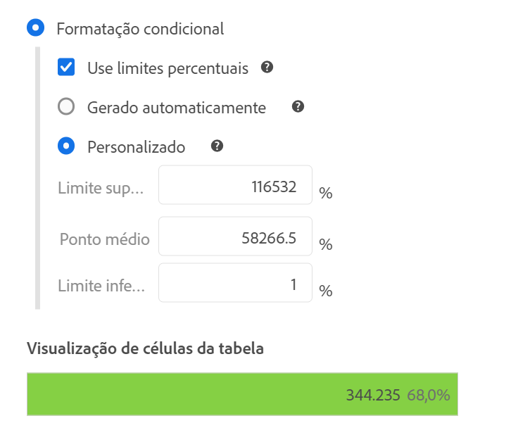
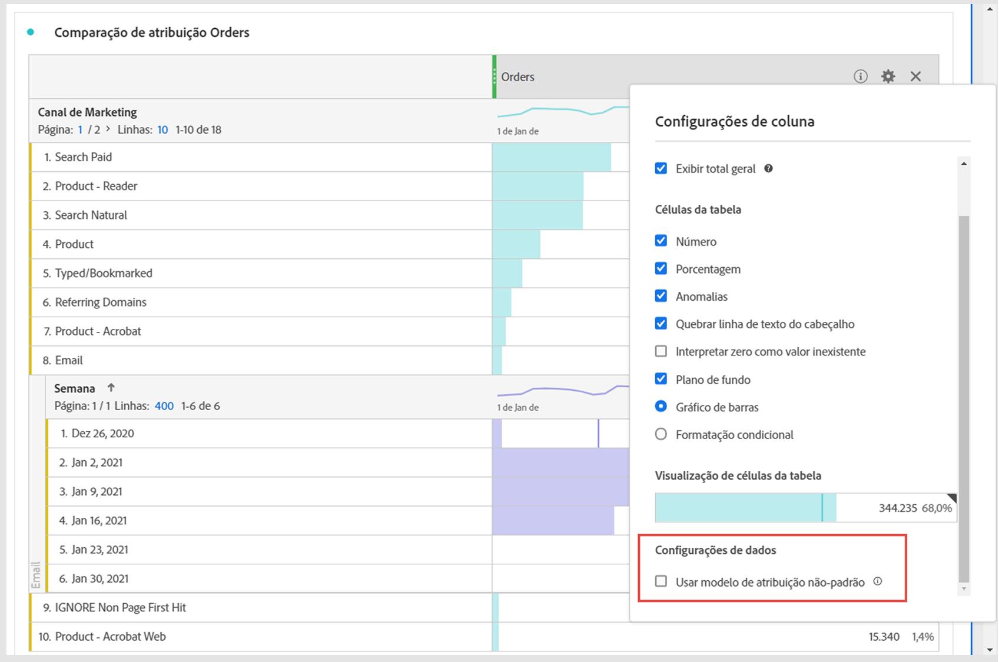
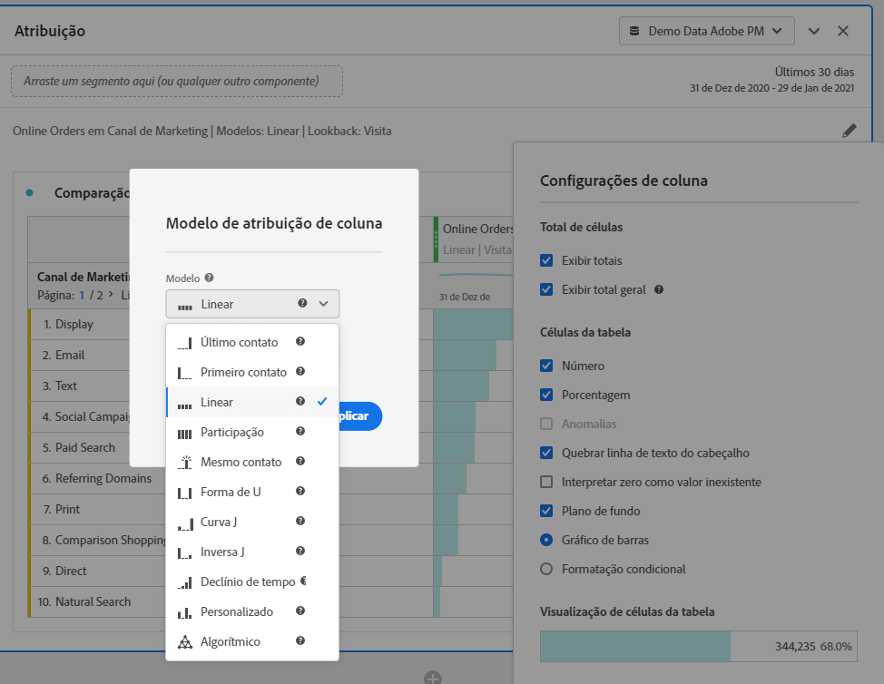

# Configurações de coluna

As [!UICONTROL configurações de coluna] permitem definir a formatação da coluna, e alguns elementos podem ser condicionais.

>[!BEGINSHADEBOX]

Consulte  [Configurações de linha e coluna em uma tabela de forma livre](https://video.tv.adobe.com/v/328504/?captions=por_br&quality=12&learn=on){target="_blank"} para assistir a um vídeo de demonstração.

{{videoaa}}

>[!ENDSHADEBOX]

Para acessar essas [!UICONTROL configurações], selecione  no cabeçalho da coluna.

É possível editar as configurações de diversas colunas de uma só vez. Selecione várias colunas e clique em  em qualquer uma delas. As alterações feitas serão aplicadas a todas as colunas com as células selecionadas. 

| Opção | Descrição |
| --- | --- |
| **[!UICONTROL Mostrar total]** | Mostra uma soma da coluna do lado do cliente. Este total **não** remove a duplicação de métricas, como sessões ou pessoas. |
| **[!UICONTROL Exibir total geral]** | Mostra uma soma da coluna do lado do servidor. O total geral remove a duplicação de métricas, como sessões ou pessoas. |
| **[!UICONTROL Mostrar minigráfico]** | Mostra um gráfico de linhas no cabeçalho da coluna. |
| **[!UICONTROL Número]** | Determina se uma célula exibe ou oculta o valor numérico da métrica. Por exemplo, se a métrica for Exibições de página, o valor numérico será o número de exibições de página para o item da linha. |
| **[!UICONTROL Percentual]** | Determina se uma célula exibe ou oculta o valor porcentual da métrica. Por exemplo, se a métrica for Exibições de página, o valor porcentual será o número de exibições de página referente ao item da linha dividido pelo total de exibições de página da coluna.  Observação: é possível obter porcentagens maiores que 100% para garantir a precisão. O limite superior pode ser movido para 1.000%, a fim de evitar que a largura das colunas fique muito grande. |
| **[!UICONTROL Mostrar anomalias]** | Determina se a detecção de anomalias é executada nos valores desta coluna. |
| **[!UICONTROL Mostrar previsão]** | Determine se os valores de previsão são exibidos nessa coluna. |
| **[!UICONTROL Quebrar linha do texto de cabeçalho]** | Permite a quebra de linha do texto de cabeçalho em tabelas de forma livre para torná-lo mais legível e facilitar o compartilhamento de tabelas. Essa quebra de linha é útil para renderização de PDF e para métricas com nomes longos. Habilitado por padrão. |
| **[!UICONTROL Interpretar zero como nenhum valor]** | Para células com um valor 0, determina se exibirá um 0 ou uma célula em branco. Isso é útil quando você precisar observar os dados de cada dia do mês e alguns dias estiverem no futuro.  Em vez de mostrar 0 para as datas futuras, células em branco serão exibidas. Os gráficos também respeitam essa configuração (ou seja, os gráficos não mostram linhas ou barras com valores 0). |
| **[!UICONTROL Histórico]** | Determina se uma célula mostra ou oculta todas as formatações de célula, incluindo o gráfico de barras e a formatação condicional. |
| **[!UICONTROL Gráfico de barras]** | Exibe um gráfico de barras horizontal que representa o valor da célula relativo ao total da coluna. |
| **[!UICONTROL Formatação condicional]** | Usar formatação condicional. Consulte a [seção](#conditional-formatting) abaixo. |
| **[!UICONTROL Visualização de célula de tabela]** | Uma visualização de como cada célula é exibida com as opções de formatação atualmente selecionadas aplicadas. |
| **[!UICONTROL Usar modelo de atribuição não padrão]** | Usa um modelo de atribuição não padrão. Consulte a [seção](#use-non-default-attribution-model) abaixo. |

## Formatação condicional {#conditional-formatting}

A formatação condicional aplica formatação a limites superiores, intermediários e inferiores que você pode definir. A aplicação da formatação condicional em tabelas de forma livre também é habilitada automaticamente em detalhamentos, a menos que os limites [!UICONTROL personalizados] estejam selecionados.

| Opções de formatação condicional | Descrição |
| --- | --- |
| **[!UICONTROL Usar limites de porcentagem]** | Altera o intervalo limite para se basear em porcentagens em vez de valores absolutos. O intervalo limite de porcentagem funciona com métricas exclusivamente baseadas em porcentagem (como a Taxa de rejeição) e com métricas que possuem uma contagem e uma porcentagem (como Exibições de página). |
| **[!UICONTROL Geração automática]** | Calcular limites superior/médio/inferior automaticamente de acordo com os dados. O limite superior é o maior valor nesta coluna. O limite inferior é o mais baixo e o ponto médio é a média dos limites superior e inferior. |
| **[!UICONTROL Personalizado]** | Permite atribuir manualmente o **[!UICONTROL Limite superior]**, o **[!UICONTROL Ponto médio]** e o **[!UICONTROL Limite inferior]**. Os limites oferecem a flexibilidade de determinar quando o valor de uma coluna se torna bom, médio ou ruim. |
| **[!UICONTROL Paleta de formatação condicional]** | Aplica um conjunto de cores pré-configurado às células. Dependendo de qual dos quatro esquemas de cores disponíveis você selecionar, cores diferentes serão atribuídas a valores altos, valores médios e valores baixos.   Substituir uma dimensão na tabela redefine os limites da formatação condicional. Substituir uma métrica recalcula os limites da coluna (na qual haja uma métrica no eixo X e uma dimensão no eixo Y). |

## Usar modelo de atribuição não padrão {#use-non-default-attribution-model}

<!-- markdownlint-disable MD034 -->

>[!CONTEXTUALHELP]
>id="workspace_freeformtable_column_usenondefaultattributionmodel"
>title="Usar modelo de atribuição não padrão"
>abstract="Habilite um modelo de atribuição não padrão para as colunas selecionadas."

<!-- markdownlint-enable MD034 -->

<!-- markdownlint-disable MD034 -->

>[!CONTEXTUALHELP]
>id="workspace_freeformtable_column_usenondefaultattributionmodel_disabled"
>title="Usar modelo de atribuição não padrão"
>abstract="O modo de atribuição não padrão não está disponível para esta métrica."

<!-- markdownlint-enable MD034 -->

Você pode substituir o modelo de atribuição padrão configurado em [Visualizações de dados](/help/data-views/component-settings/attribution.md).

>[!NOTE]
>
>Considere o seguinte ao ativar um modelo de atribuição não padrão em uma métrica:
>
>* **Ao usar a métrica em um relatório com *uma única dimensão*:** a atribuição da métrica substitui o conjunto de modelos de alocação na dimensão. Por exemplo, uma métrica com uma atribuição &quot;primeiro contato&quot; substitui uma alocação de dimensão &quot;mais recente&quot;.
>
>* **Ao usar a métrica em um relatório com *várias dimensões*:** a atribuição da métrica é aplicada sobre o modelo de alocação para cada dimensão. Por exemplo, uma métrica com uma atribuição &quot;primeiro contato&quot; é aplicada sobre uma alocação de dimensão &quot;mais recente&quot;.
>
> Para mais informações sobre alocação, consulte [Configurações do componente de persistência](/help/data-views/component-settings/persistence.md).

Para usar um modelo de atribuição não padrão para uma métrica em uma Analysis Workspace:

1. Clique em **[!UICONTROL Usar modelo de atribuição não padrão]**. Se ele já tiver sido selecionado, use **[!UICONTROL Editar]** para editar o modelo de atribuição. Ou desmarque a opção para retornar ao modelo de atribuição padrão.

   

2. Em **[!UICONTROL Modelo de atribuição de coluna]**, selecione um **[!UICONTROL Modelo]** e uma **[!UICONTROL Janela de retrospectiva]**. Essa configuração determina a janela de atribuição de dados que será aplicada a cada conversão.

   

### Modelos de atribuição

{{attribution-models-details}}

### Container

{{attribution-container}}

### Janela de retrospectiva

{{attribution-lookback-window}}

### Exemplo

{{attribution-example}}

>[!MORELIKETHIS]
>
>* [Gerenciar fontes de dados](/help/analysis-workspace/visualizations/t-sync-visualization.md)
