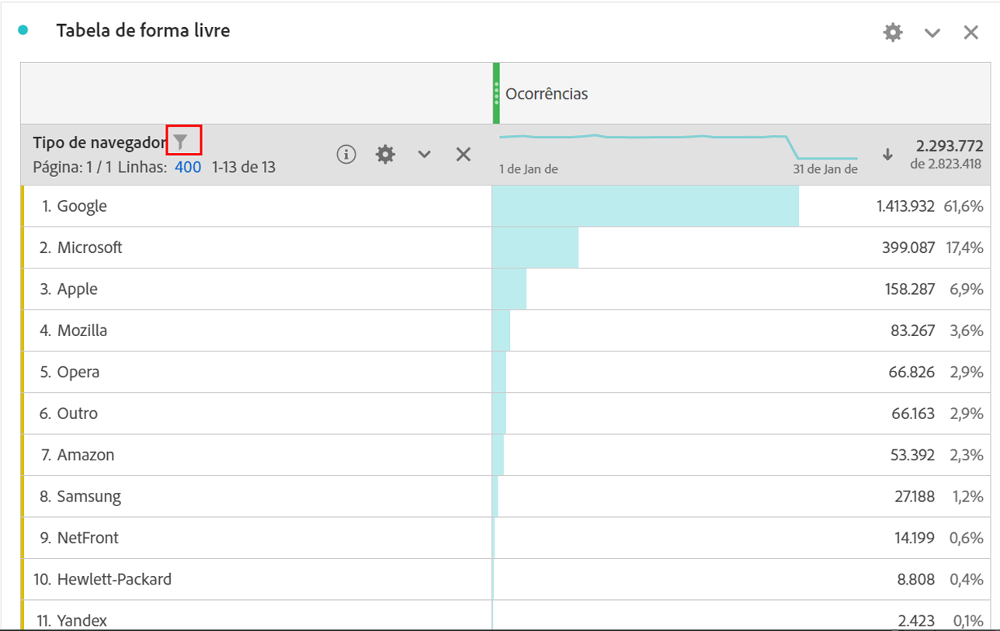
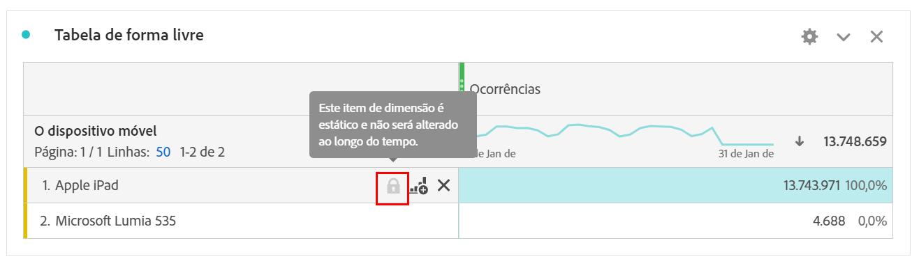
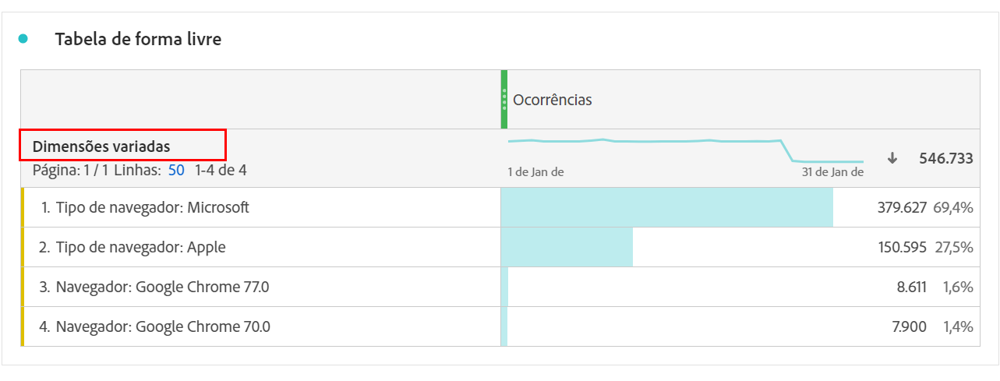

# Itens de dimensão dinâmicos e estáticos

Nas tabelas de forma livre, as linhas e colunas podem conter vários valores de componentes. Esses valores podem ser dinâmicos (mudam com o tempo) ou estáticos (não mudam com o tempo), dependendo da análise que você deseja criar.

## Itens de dimensão dinâmicos

Os itens de dimensão dinâmicos mudam com o tempo e dependem da métrica que está sendo classificada na tabela de forma livre. Os itens de dimensão dinâmicos são usados quando você deseja analisar os itens principais de um determinado período.

Ao soltar uma dimensão em uma tabela de forma livre, linhas dinâmicas são retornadas. As linhas dinâmicas representam os principais itens correspondentes à dimensão de uma determinada métrica e período. Também é possível soltar uma dimensão em colunas de tabela de forma livre. A dimensão se expande automaticamente para os 5 itens de dimensão principais.

Por exemplo, ao arrastar a dimensão Tipo de navegador para a tabela, os principais itens de dimensão Tipo de navegador (por exemplo, Microsoft, Apple, Google etc.) retornam dinamicamente às linhas da tabela. Se forem soltos em uma coluna, os 5 principais itens da dimensão Tipo de navegador retornarão dinamicamente.

Os itens de dimensão dinâmicos têm a opção de filtro de linha  e um , e **não** têm um bloqueio  presente. <!--do they have the lock icon? --> Ao clicar em  ao lado de um item de dimensão dinâmico, um filtro é aplicado automaticamente. Para obter mais informações sobre como aplicar filtros a tabelas, consulte [Filtrar e classificar tabelas](/help/analysis-workspace/visualizations/freeform-table/filter-and-sort.md).

## Itens de dimensão estáticos

Os itens de dimensão estáticos não mudam com o tempo; são componentes fixos que são sempre retornados em uma tabela de forma livre. Os itens de dimensão estáticos são usados quando você deseja sempre analisar o mesmo item, sejam campanhas específicas ou dias específicos da semana.

Sempre que você selecionar e soltar manualmente valores de componentes específicos (dimensão, métrica, segmento, intervalo de datas) em uma tabela, o resultado será uma lista estática de linhas ou colunas.

Por exemplo, ao arrastar sobre itens específicos de Tipo de navegador, como Microsoft e Apple, esses 2 itens específicos sempre são puxados para a tabela.

Também é possível criar itens de dimensão estáticos por selecionar a opção **[!UICONTROL Exibir somente linhas selecionadas]** no menu de contexto das linhas selecionadas.

Os itens de dimensão estáticos **não** têm a opção de filtro para linhas. Em vez disso, um  e  estão presentes em cada item. Selecione  para remover esse item de dimensão da tabela.

## Itens de dimensão mistos

Itens de dimensão de diferentes dimensões podem ser adicionados à mesma tabela. Nesses casos, o cabeçalho da linha indica **[!UICONTROL Dimensões mistas]**. Esses itens de dimensão são estáticos. Por exemplo, adicionar itens específicos da dimensão Grupo do navegador e outros itens da dimensão Nome do navegador.

## Total de linhas de forma livre

As linhas dinâmicas e estáticas se comportam de maneira diferente na linha total de forma livre. Por padrão:

* As linhas dinâmicas são somadas no lado do servidor e removem a duplicação de métricas, como sessões ou pessoas.
* As linhas estáticas são somadas no lado do cliente e **não** deduplicam as métricas. Para calcular o total de linhas do lado do servidor, altere a configuração de linha para **Mostrar total geral**. [Saiba mais](/help/analysis-workspace/visualizations/freeform-table/workspace-totals.md)
