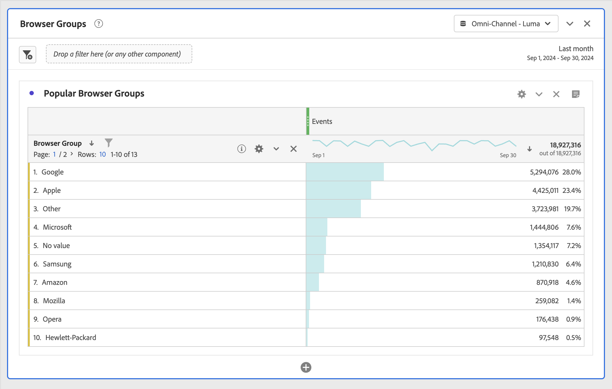

# Itens de dimensão dinâmicos vs estáticos em tabelas de forma livre

Nas tabelas de forma livre, as linhas e colunas podem conter vários valores de componentes. Esses valores podem ser dinâmicos (mudam com o tempo) ou estáticos (não mudam com o tempo), dependendo da análise que você deseja criar.

## Itens de dimensão dinâmicos

Os itens de dimensão dinâmicos mudam com o tempo e dependem da métrica que está sendo classificada na tabela de forma livre. Os itens de dimensão dinâmicos são usados quando você deseja analisar os itens principais de um determinado período.

Ao soltar uma dimensão em uma tabela de forma livre, linhas dinâmicas são retornadas. Elas representam os itens principais que correspondem à dimensão de uma determinada métrica e período. Também é possível soltar uma dimensão em colunas de tabela de forma livre. A dimensão se expande automaticamente para os 5 itens de dimensão principais.

Por exemplo, ao arrastar a dimensão Tipo de navegador para a tabela, os principais itens de dimensão Tipo de navegador (por exemplo, Microsoft, Apple, Google etc.) retornam dinamicamente às linhas da tabela. Se forem soltos em uma coluna, os 5 principais itens de dimensão Tipo de navegador retornarão dinamicamente.

Os itens de dimensão dinâmicos têm a opção de filtro de linha e os ícones X, e **não** tem um ícone de cadeado presente. <!--do they have the lock icon? --> Ao clicar no x ao lado de um item de dimensão dinâmico, um filtro é aplicado automaticamente. Para obter mais informações sobre como aplicar filtros a tabelas, consulte [Filtrar e classificar tabelas](/help/analysis-workspace/visualizations/freeform-table/filter-and-sort.md).

## Itens de dimensão estáticos

Os itens de dimensão estáticos não mudam com o tempo; são componentes fixos que são sempre retornados em uma tabela de forma livre. Os itens de dimensão estáticos são usados quando você deseja sempre analisar o mesmo item, sejam campanhas específicas ou dias específicos da semana.

Sempre que você selecionar e soltar manualmente valores de componentes específicos (dimensão, métrica, filtro, intervalo de datas) em uma tabela, o resultado será uma lista estática de linhas ou colunas. Os itens de dimensão estáticos também podem ser criados se você optar por:

* Nas linhas, clique com o botão direito do mouse em > [!UICONTROL Exibir somente linhas selecionadas]
* Nas colunas, clique com o botão direito do mouse em > [!UICONTROL Tornar o item estático]

Por exemplo, ao arrastar sobre itens específicos Tipo de navegador, como Microsoft e Apple, esses 2 itens específicos sempre são puxados para a tabela.

Os itens de dimensão estáticos **não** têm a opção de filtro de linha. Em vez disso, os ícones de bloqueio e X estão presentes em cada item. Clique no ícone X para remover esse item de dimensão da tabela.

## Itens de dimensão mistos

Itens de dimensão de diferentes dimensões podem ser adicionados à mesma tabela. Nesses casos, o cabeçalho da linha indica “Dimensões mistas”. Esses itens de dimensão são estáticos. Por exemplo, adicionar itens de dimensão específicos da dimensão Tipo de navegador e outros itens de dimensão da dimensão Navegador.

## Total de linhas de forma livre

As linhas dinâmicas e estáticas se comportam de maneira diferente na linha total de forma livre. Por padrão:

* As linhas dinâmicas são somadas no lado do servidor e deduplicam métricas como visitas ou pessoas
* As linhas estáticas são somadas no lado do cliente e **não** deduplicam as métricas. Para calcular o total de linhas do lado do servidor, altere a configuração de linha para **Mostrar total geral**. [Saiba mais](https://experienceleague.adobe.com/docs/analytics/analyze/analysis-workspace/visualizations/freeform-table/workspace-totals.html?lang=pt-BR)
