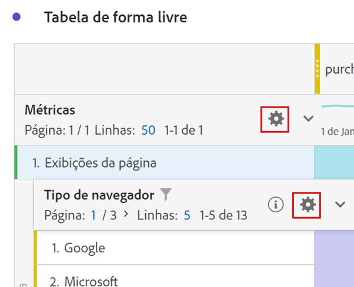

# Configurações de linha

Assista a um vídeo sobre as configurações de linha e coluna aqui:

>[!VIDEO](https://video.tv.adobe.com/v/40382/?quality=12)

As configurações de linha variam de acordo com qual componente foi arrastado para a tabela. Para acessar as configurações de linha da tabela, clique no ícone de [!UICONTROL Configurações] próximo a uma dimensão, um filtro, uma métrica, um período ou um detalhamento em cada um destes itens:

| Configuração | Descrição |
| --- | --- |
| Alinhar datas | Esta é uma configuração em nível de tabela que alinha as datas de cada coluna para que todas comecem na mesma linha. O alinhamento de datas é ativado por padrão quando uma dimensão de tempo é usada nas linhas da tabela e intervalos de datas diferentes são aplicados nas colunas. Por exemplo, em uma tabela diária com outubro e setembro aplicados às colunas, a coluna da esquerda começa com 1º de outubro e a coluna da direita começa com 1º de setembro. |
| Detalhamento por posição | Por padrão, essa configuração é desativada e os detalhamentos são corrigidos em itens de linha estáticos. Por exemplo, vamos supor que você detalhe os 3 principais itens de dimensão de Página (Página inicial, Resultados de pesquisa, Check-out) por Canal de marketing. Você sai do projeto e retorna duas semanas depois. Ao abrir o projeto novamente, as 3 principais páginas foram alteradas e, agora, a Página inicial, os Resultados da pesquisa e o Check-out são as 4 a 6 principais páginas. Por padrão, os detalhamentos do Canal de marketing ainda aparecerão em Página inicial, Resultados de pesquisa e Check-out, mesmo que agora estejam nas linhas 4 a 6.   Por outro lado, o **Detalhamento por posição** sempre detalha os três primeiros itens, independentemente do que sejam. Voltando ao nosso exemplo, quando você reabrir o projeto, os detalhamentos do Canal de marketing serão vinculados às 3 principais páginas da tabela, não à Página inicial, aos Resultados de pesquisa e ao Check-out que estão agora nas linhas 4 a 6. |
| Porcentagens | **Calcular porcentagens por coluna** é a configuração padrão; as porcentagens visíveis em uma coluna são calculadas com base no total da coluna.  **Calcular porcentagem por linha** força a tabela de forma livre a calcular as porcentagens de células na linha e não na coluna, com o total geral como denominador. Essa configuração é útil para porcentagens de tendência. Essa configuração é ativada por padrão ao usar o ícone Visualizar. |
| Totais de colunas | Essas configurações estão disponíveis somente para [linhas estáticas](/help/analysis-workspace/visualizations/freeform-table/column-row-settings/manual-vs-dynamic-rows.md).   **Mostrar como soma das linhas atuais** mostra uma soma das linhas do lado do cliente na tabela, o que significa que o total *não* remove a duplicação de métricas como visitas ou pessoas.   **Mostrar total geral** mostra uma soma do lado do servidor, o que significa que o total deduplicará as métricas. |

## Alterar contagem de linhas

Para alterar o número de linhas exibidas:

1. Clique no número ao lado das [!UICONTROL Linhas] na parte superior da tabela.

   

1. Na lista suspensa, selecione o número de linhas que deseja que a tabela exiba.