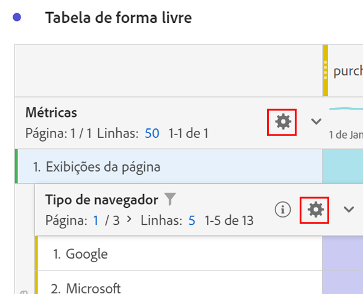

# Configurações de linha

As configurações de linha variam de acordo com qual componente foi arrastado para a tabela. Para acessar as configurações de linha da tabela, selecione  **[!UICONTROL Configurações]** próximo a uma dimensão, segmento, métrica, período ou um detalhamento em cada um desses objetos.

| Configuração | Descrição |
| --- | --- |
| **[!UICONTROL Detalhamento por posição]** | Por padrão, essa configuração é desativada e os detalhamentos são corrigidos em itens de linha estáticos. Por exemplo, imagine que você detalhou os três principais itens de dimensão de página (Página inicial, Resultados de pesquisa, Check-out) por canal de marketing. Você sai do projeto e retorna duas semanas depois. Ao abrir o projeto novamente, as 3 principais páginas foram alteradas e, agora, a Página inicial, os Resultados da pesquisa e o Check-out são as 4 a 6 principais páginas. Por padrão, os detalhamentos do Canal de marketing ainda aparecem em Página inicial, Resultados de pesquisa e Check-out, mesmo que agora estejam nas linhas 4 a 6.   Por outro lado, o **Detalhamento por posição** sempre detalha os três primeiros itens, independentemente de quais eles sejam. Voltando ao exemplo, ao reabrir o projeto, os detalhamentos do canal de marketing são vinculados às três principais páginas da tabela. E não a Página inicial, Resultados de pesquisa e Check-out, que agora estão nas linhas 4-6. |
| **[!UICONTROL Porcentagens]** | **Calcular porcentagens por coluna** (padrão): as porcentagens visíveis em uma célula são calculadas com base no total da coluna.  **Calcular porcentagens por linha**: as porcentagens em células são calculadas pela linha, em vez de ao longo da coluna, com o Total geral como o denominador. Esse cálculo é útil para criar uma tendência de porcentagens. |
| **[!UICONTROL Totais de colunas]** | Essas configurações estão disponíveis somente para [linhas estáticas](/help/analysis-workspace/visualizations/freeform-table/column-row-settings/manual-vs-dynamic-rows.md).   **Mostrar como soma das linhas atuais** exibe uma soma das linhas da tabela do lado do cliente, o que significa que o total *não* removerá a duplicação de métricas, como visitas ou pessoas.   **Mostrar total geral** exibe uma soma do lado do servidor, que representa o total das métricas desduplicadas. |

>[!BEGINSHADEBOX]

Consulte  [Configurações de linha e coluna em uma tabela de forma livre](https://experienceleague.adobe.com/en/docs/analytics-learn/tutorials/analysis-workspace/building-freeform-tables/row-and-column-settings-in-freeform-tables){target="_blank"} para assistir a um vídeo de demonstração.

{{videoaa}}

>[!ENDSHADEBOX]

## Alterar contagem de linhas

Para alterar o número de linhas exibidas:

1. Clique no número ao lado de **[!UICONTROL Linhas]** na parte superior da primeira coluna da tabela.

   

1. No menu suspenso, selecione o número de linhas que deseja que a tabela exiba.

## Menu de contexto

As opções de menu de contexto a seguir estão disponíveis ao selecionar o cabeçalho da dimensão.

| Opção | Descrição |
| --- | --- |
| **[!UICONTROL Copiar seleção para a área de transferência]** | Copiar a seleção da visualização para a área de transferência. |
| **[!UICONTROL Baixar itens como CSV (*nome da dimensão*)]** | Baixe imediatamente os itens de dimensão (até um máximo de 50.000) da visualização no dispositivo local. Até 50 mil itens de dimensão para a dimensão selecionada. |
| **[!UICONTROL Baixar seleção como CSV]** | Baixe imediatamente os itens de dimensão da visualização para o dispositivo local. |
| **[!UICONTROL Criar hiperlinks para todos os itens de dimensão]** | Cria hiperlinks para todos os itens de dimensão. Consulte [Hiperlinks para dimensões em uma tabela de forma livre](../freeform-table-hyperlinks.md) |
| **[!UICONTROL Editar hiperlinks de todos os itens de dimensão]** | Edita hiperlinks em todos os itens de dimensão. Consulte [Hiperlinks para dimensões em uma tabela de forma livre](../freeform-table-hyperlinks.md) |
| **[!UICONTROL Remover hiperlinks de todos os itens de dimensão]** | Remove hiperlinks de todos os itens de dimensão. Consulte [Hiperlinks para dimensões em uma tabela de forma livre](../freeform-table-hyperlinks.md) |
| **[!UICONTROL Excluir]** | Exclui a dimensão da tabela. |
| **[!UICONTROL Visualizar]** | Visualize a dimensão usando qualquer uma das visualizações disponíveis. |
| **[!UICONTROL Exibir somente as linhas selecionadas]** | Exibe somente os itens selecionados na visualização. |
| **[!UICONTROL Criar anotação a partir da seleção]** | Abre os **[!UICONTROL detalhes da anotação]** para adicionar uma anotação. |

As opções adicionais de menu de contexto a seguir estão disponíveis ao selecionar um ou mais itens de dimensão (primeira coluna) ou uma ou mais células individuais na tabela de forma livre.

| Opção | Descrição |
| --- | --- |
| **[!UICONTROL Copiar seleção para a área de transferência]** | Copie as informações nas células selecionadas da tabela de forma livre. |
| **[!UICONTROL Baixar itens como CSV (*nome da dimensão*)]** | Baixe imediatamente os itens de dimensão (até um máximo de 50.000) da visualização no dispositivo local. Até 50 mil itens de dimensão para a dimensão selecionada. |
| **[!UICONTROL Criar hiperlink]** | Cria um hiperlink para o item. Consulte [Hiperlinks para dimensões em uma tabela de forma livre](../freeform-table-hyperlinks.md) |
| **[!UICONTROL Editar hiperlink]** | Edita um hiperlink do item. Consulte [Hiperlinks para dimensões em uma tabela de forma livre](../freeform-table-hyperlinks.md) |
| **[!UICONTROL Remover hiperlink]** | Remove um hiperlink do item. Consulte [Hiperlinks para dimensões em uma tabela de forma livre](../freeform-table-hyperlinks.md) |
| **[!UICONTROL Baixar seleção como CSV]** | Baixe imediatamente os itens de dimensão da visualização para o dispositivo local. |
| **[!UICONTROL Excluir selecionados]** | Excluir linhas selecionadas. |
| **[!UICONTROL Criar alerta a partir da seleção]** | Abra o [Criador de alertas](/help/components/c-intelligent-alerts/alert-builder.md) para criar um alerta a partir da seleção. |
| **[!UICONTROL Detalhamento]** | Detalha o item de dimensão. Selecione na lista de **[!UICONTROL Dimensões]**, **[!UICONTROL Métricas]**, **[!UICONTROL Segmentos]** ou **[!UICONTROL Intervalos de datas]**. Para realizar uma pesquisa alternativa de um componente, utilize *Pesquisa*. |
| **[!UICONTROL Visualizar]** | Visualize a seleção usando qualquer uma das visualizações disponíveis. |
| **[!UICONTROL Seleção de tendências]** | Cria uma visualização de gráfico de linhas de tendência para a seleção. |
| **[!UICONTROL Exibir somente as linhas selecionadas]** | Exibe somente as linhas selecionadas na visualização. |
| **[!UICONTROL Exibir todas as linhas]** | Exibe todas as linhas na visualização. |
| **[!UICONTROL Renomear linha selecionada]** | Renomeie a linha selecionada. Insira um **[!UICONTROL Nome]** na caixa de diálogo **[!UICONTROL Renomear linha selecionada]**. Selecione **[!UICONTROL OK]** para confirmar ou **[!UICONTROL Cancelar]** para cancelar. Depois que uma linha em uma tabela de forma livre é renomeada, o nome da dimensão na coluna de cabeçalho é anexado com **[!UICONTROL (modificado)]** e um ícone de  está disponível para redefinir linhas renomeadas na coluna de cabeçalho de dimensão. Consulte [Exemplo de classificação embutida](#inline-classifications-example). |
| **[!UICONTROL Combinar linhas selecionadas]** | Combinar as linhas selecionadas. Insira um **[!UICONTROL Nome]** na caixa de diálogo **[!UICONTROL Combinar linhas selecionadas]**. Selecione **[!UICONTROL OK]** para confirmar ou **[!UICONTROL Cancelar]** para cancelar. Uma vez que as linhas em uma tabela de forma livre são combinadas, o nome da dimensão na coluna de cabeçalho é anexado com **[!UICONTROL (modificado)]** e um ícone de  está disponível para redefinir linhas renomeadas na coluna de cabeçalho de dimensão. Consulte [Exemplo de classificação embutida](#inline-classifications-example). |
| **[!UICONTROL Criar como campo derivado]** | *Você deve ser um administrador de produto do Customer Journey Analytics para ver esta opção do menu de contexto.*  Disponível em qualquer linha selecionada de uma tabela de forma livre que é modificada como resultado da renomeação ou combinação de linhas. Quando selecionada, a [Interface de campo derivada](/help/data-views/derived-fields/derived-fields.md#create-a-derived-field) é aberta com as modificações feitas na tabela de forma livre já preenchidas previamente. Consulte [Exemplo de classificação embutida](#inline-classifications-example). |
| **[!UICONTROL Criar anotação a partir da seleção]** | Abra o [Construtor de anotações](/help/components/annotations/create-annotations.md#annotation-builder) para criar uma anotação para a seleção. |
| **[!UICONTROL Criar segmento a partir da seleção]** | Abra o [Construtor de segmentos](/help/components/segments/seg-builder.md) para criar um segmento a partir da seleção. |
| **[!UICONTROL Criar público-alvo a partir da seleção]** | Abra o [Construtor de público-alvo](/help/components/audiences/publish.md#audience-builder) para criar um público a partir da seleção. |

As opções adicionais de menu de contexto a seguir estão disponíveis ao selecionar um cabeçalho de coluna de métrica.

| Opção | Descrição |
|---|---|
| **[!UICONTROL Criar métrica a partir da seleção]** | Cria uma nova métrica a partir da métrica selecionada. A métrica pode ser Média, Mídia, Máximo da coluna, Mínimo da coluna, Soma da coluna. Também é possível selecionar Abrir no criador de métricas calculadas para criar uma métrica calculada. |
| **[!UICONTROL Adicionar coluna de período]** | Adiciona uma coluna de período. Há várias opções disponíveis, e o intervalo do calendário do painel determina o *intervalo de datas*: <ul><li>**[!UICONTROL *Intervalo de datas* anterior até este intervalo de datas]**</li><li>**[!UICONTROL Esses *intervalos de datas* até este intervalo de datas]**.</li><li>**[!UICONTROL Intervalo de datas personalizado até este intervalo de datas]**. Abre o **[!UICONTROL Construtor de intervalos de datas]** para especificar o intervalo de datas.</li></ul>Consulte [Comparação de datas](/help/components/date-ranges/time-comparison.md) para obter mais informações. |
| **[!UICONTROL Comparar períodos]** | Adiciona colunas de comparação de períodos. Disponível somente quando a dimensão não é baseada em tempo. São oferecidas várias opções que determinam o *intervalo de datas*: <ul><li>**[!UICONTROL *Intervalo de datas* anterior até este intervalo de datas]**</li><li>**[!UICONTROL Intervalo de datas personalizado até este intervalo de datas]**. Abre o **[!UICONTROL Construtor de intervalos de datas]** para especificar o intervalo de datas.</li></ul>Consulte [Comparação de datas](/help/components/date-ranges/time-comparison.md) para obter mais informações. |
| **[!UICONTROL Modificar modelos de atribuição]** | Permite modificar o modelo de atribuição da coluna. |
| **[!UICONTROL Comparar modelo de atribuição]** | Permite especificar um novo modelo de atribuição e compará-lo ao modelo de atribuição da coluna selecionada. Uma nova coluna é adicionada com as métricas do novo modelo de atribuição. Além disso, uma coluna de Variação porcentual é adicionada para comparação. |
| **[!UICONTROL Redefinir larguras de coluna]** | Redefine as larguras das colunas para a largura padrão. |
| **[!UICONTROL Criar anotação a partir da seleção]** | Abre os **[!UICONTROL detalhes da anotação]** para adicionar uma anotação. |
| **[!UICONTROL Criar segmento a partir da seleção]** | Abra o **[!UICONTROL Construtor de segmentos]** para criar um segmento a partir da seleção. |
| **[!UICONTROL Criar público-alvo a partir da seleção]** | Abre a caixa de diálogo **[!UICONTROL Criar público-alvo]** para criar um público-alvo a partir da seleção. |

## Modificar altura da linha

Você pode definir a [densidade da exibição](https://experienceleague.adobe.com/en/docs/analytics-platform/using/cja-workspace/build-workspace-project/view-density) de um projeto como **[!UICONTROL Compacto]**, **[!UICONTROL Confortável]** e **[!UICONTROL Expandido]**.

## Exemplo de classificações embutidas

Este exemplo ilustra como usar as opções de menu de contexto **[!UICONTROL Renomear linha selecionada]**, **[!UICONTROL Combinar linhas selecionadas]** e **[!UICONTROL Criar como campo derivado]**. E como redefinir a tabela de forma livre modificada.

* Renomeie a linha **[!UICONTROL Nenhum valor]** para **[!UICONTROL Outros]**.

   1. Selecione **[!UICONTROL Renomear linha selecionada]** no menu de contexto na linha **[!UICONTROL Nenhum valor]** selecionada.

      

   1. Na caixa de diálogo **[!UICONTROL Renomear linha selecionada]**:

      

      1. Inserir <code>Outros</code> para **[!UICONTROL Nome]**.
      1. Selecione **[!UICONTROL OK]**.

* Combine **[!UICONTROL Homens]** e **[!UICONTROL Mulheres]** linhas em uma linha **[!UICONTROL Adultos]**.

   1. Selecione a linha **[!UICONTROL Homens]** e **[!UICONTROL Mulheres]**.
   1. Selecione **[!UICONTROL Combinar linhas selecionadas]** no menu de contexto de qualquer uma das linhas selecionadas.

      

   1. Na caixa de diálogo **[!UICONTROL Combinar linhas selecionadas]**:

      

      1. Inserir <code>Adultos</code> para **[!UICONTROL Nome]**.
      1. Selecione **[!UICONTROL OK]**.

* Crie um campo derivado a partir das modificações na tabela de forma livre.

   1. Selecione **[!UICONTROL Criar como campo derivado]** no menu de contexto para qualquer linha selecionada na tabela modificada.

      

   1. Inspecione, modifique opcionalmente e salve a definição do campo derivado com base em todas as modificações feitas na tabela.

      

* Redefinir a tabela de forma livre para o estado anterior às modificações.

   1. Selecione  próximo a **[!UICONTROL _nome da dimensão _(modificado)]**.
   1. Selecione **[!UICONTROL Redefinir linhas renomeadas]** no pop-up **[!UICONTROL Linhas renomeadas]**.

      

