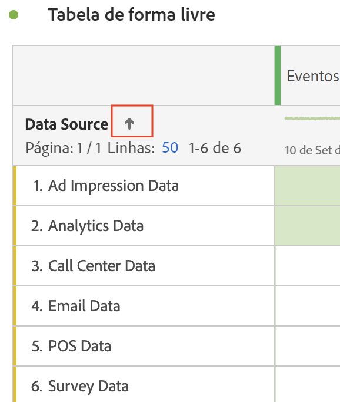

# Filtrar e classificar tabelas de forma livre

As tabelas de forma livre do Analysis Workspace são a base para a análise interativa de dados. Sendo assim, elas podem conter milhares de linhas de informação. Filtrar e classificar os dados pode ser essencial para encontrar as informações mais importantes de maneira eficiente.

<!--The following video covers filter and sort options in Analysis Workspace, in addition to pagination options:

>[!VIDEO](https://video.tv.adobe.com/v/23968)-->

## Filtrar tabelas

Os filtros do Analysis Workspace ajudam você a encontrar as informações mais importantes.

>[!NOTE]
>
> Somente itens de dimensão dinâmicos podem ser filtrados conforme descrito nesta seção. Itens de dimensão estáticos não podem ser filtrados. Para obter mais informações, consulte [Itens de dimensão dinâmicos vs estáticos em tabelas de forma livre](/help/analysis-workspace/visualizations/freeform-table/column-row-settings/manual-vs-dynamic-rows.md).

## Filtrar linhas da tabela de forma livre

Você pode usar vários métodos para filtrar linhas de uma tabela de forma livre. 

- Clique no X na linha
- Filtros de tabela
- Segmentação

Certifique-se de ler como cada método afeta [Totais de tabelas de forma livre](/help/analysis-workspace/visualizations/freeform-table/workspace-totals.md).

### Excluir rapidamente linhas específicas de uma tabela

Você pode excluir rapidamente linhas específicas da tabela sem precisar abrir a caixa de diálogo Filtro.

>[!NOTE]
>
>Quando você exclui linhas conforme descrito nesta seção, uma [!UICONTROL **Sempre excluir itens**] A regra é aplicada automaticamente na caixa de diálogo de filtro avançado. (É possível exibir a regra aplicada selecionando o ícone Filtrar e, em seguida, [**[!UICONTROL Mostrar avançado]**](#apply-a-simple-or-advanced-filter-to-a-table).)

Para excluir rapidamente linhas específicas de uma tabela de forma livre:

1. Passe o mouse sobre a linha que deseja excluir e selecione o ícone x.

   Mantenha pressionada a tecla Shift para selecionar um intervalo de linhas, ou mantenha pressionada a tecla Command (no Mac) ou a tecla Ctrl (no Windows) para selecionar várias linhas.

<!--### Right-click > Delete selected rows

Note: this option does not seem to work. AN-338422

1. Select 1 or more rows. 
1. Right-click and select **[!UICONTROL Delete Selected Rows]**. 

   This action will remove the rows from the table and apply a table filter.-->

### Aplicar um filtro simples ou avançado a uma tabela

Para filtrar dados em tabelas de forma livre:

1. Passe o mouse sobre a coluna que contém os dados que você deseja filtrar. <!--only some types of columns show the filter... Which? Just Dimensions?-->

1. Selecione o ícone **Filtro** quando for exibido.

   

   As opções disponíveis são as seguintes:

   | Opção | Função |
   |---------|----------|
   | [!UICONTROL **Pesquisar palavra ou frase**] | Especifique uma palavra ou frase pela qual deseja filtrar. Somente as linhas que contêm a palavra ou a frase exata especificada são mostradas. |
   | [!UICONTROL **Incluir não especificado (nenhum)**] | Selecione essa opção para mostrar dados na tabela que não se enquadram em nenhuma das dimensões da tabela. <!--what is this?--> |

1. (Opcional) Para filtrar por critérios diferentes ou por vários critérios, selecione [!UICONTROL **Mostrar avançado**].

   As seguintes opções de filtro avançado estão disponíveis:

   | Opção | Função |
   |---------|----------|
   | [!UICONTROL **Incluir não especificado (nenhum)**] | Selecione essa opção para mostrar dados na tabela que não se enquadram em nenhuma das dimensões da tabela. <!--what is this?--> |
   | [!UICONTROL **Corresponder**] | 
Selecione [!UICONTROL **Se todos os critérios forem atendidos**] para mostrar apenas os dados que atendem a todos os critérios especificados. Essa opção normalmente resulta em dados mais refinados.
 
Selecione [!UICONTROL **Se algum critério for atendido**] para mostrar dados que atendem a qualquer um dos critérios de filtro especificados. Essa opção normalmente resulta em dados menos refinados.
 |
   | [!UICONTROL **Critérios**] | 
Selecione dentre as seguintes opções de filtro:

(Selecione [!UICONTROL **Adicionar linha**] para adicionar vários critérios de filtro. A opção selecionada na seção [!UICONTROL **Corresponder**] determina se todos ou qualquer um dos critérios adicionados devem ser atendidos.)
<ul><li>
[!UICONTROL **Contém a frase**]: somente os dados que contêm a frase exata especificada são incluídos nos resultados filtrados. As palavras devem estar na ordem especificada no campo [!UICONTROL **Pesquisar palavra ou frase**].
Essa é a configuração padrão ao fazer uma pesquisa simples.

</li><li>
[!UICONTROL **Contém qualquer termo**]: somente os dados que contêm uma ou mais palavras da frase especificada são incluídos nos resultados filtrados. 
</li><li>
[!UICONTROL **Contém todos os termos**]: somente os dados que contêm todas as palavras da frase especificada são incluídos nos resultados filtrados. As palavras não precisam estar na ordem especificada no campo [!UICONTROL **Pesquisar palavra ou frase**].
</li><li>
[!UICONTROL **Não contém nenhum termo**]: somente os dados que não contêm nenhuma das palavras da frase especificada são incluídos nos resultados filtrados. 
</li><li>
[!UICONTROL **Não contém a frase**]: somente os dados que não contêm a frase exata especificada são incluídos nos resultados filtrados. As palavras devem estar na ordem especificada no campo [!UICONTROL **Pesquisar palavra ou frase**].
</li><li>
[!UICONTROL **Igual**]: somente os dados que correspondem exatamente à frase especificada são incluídos nos resultados filtrados. 
</li><li>
[!UICONTROL **Não é igual**]: somente os dados que não correspondem exatamente à frase especificada são incluídos nos resultados filtrados. 
</li><li>
[!UICONTROL **Começa com**]: somente os dados que começam com a palavra ou frase exata especificada são incluídos nos resultados filtrados. 
</li><li>
[!UICONTROL **Termina com**]: somente os dados que terminam com a palavra ou frase exata especificada são incluídos nos resultados filtrados. 
</li></ul> |
   | [!UICONTROL **Sempre excluir itens**] | Especifique o nome de qualquer item que deseja excluir dos dados filtrados. |

1. Selecione [!UICONTROL **Aplicar**] para filtrar os dados.

   O ícone de **Filtro**  fica azul quando um filtro é aplicado à tabela.

### Filtros

Consulte nossa [Filtrar documentação](/help/components/filters/filters-overview.md) para obter mais detalhes.

## Classificar tabelas

Você pode classificar os dados de uma tabela de forma livre por qualquer coluna no Analysis Workspace que seja uma dimensão ou uma métrica.

Um ícone de seta para baixo  é visível no cabeçalho da coluna pela qual os dados estão sendo classificados no momento.

1. Em qualquer tabela de Forma livre no Analysis Workspace, clique na seta ao lado do nome da dimensão ou métrica.

   Considere o seguinte ao classificar:

   - A seta para baixo classifica em ordem decrescente e a seta para cima (padrão), em ordem crescente.
   - É possível classificar dimensões em ordem alfabética ou numérica. Por exemplo, pode ser que você tenha etapas numeradas em um fluxo de trabalho e deseje classificar pelo número da etapa. É possível classificar uma dimensão por data. Ou você pode classificar as fontes de dados em ordem alfabética, como na imagem a seguir.

   

