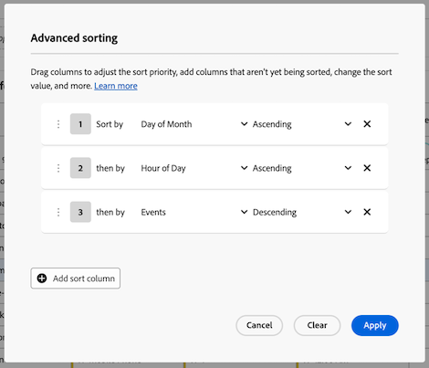

# Incluir várias colunas de dimensão em uma tabela de forma livre

{{release-limited-testing}}

É possível incluir até 5 colunas de dimensão em uma tabela de forma livre, permitindo visualizar vários itens de dimensão lado a lado. Cada linha de itens de dimensão se comporta como um único item de dimensão concatenado.

Aplique filtros, classificações, detalhamentos e muito mais a tabelas de forma livre com várias colunas de dimensão para criar uma análise mais profunda e personalizada.

## Itens de dimensão concatenados

Quando você [adiciona várias colunas de dimensão a uma tabela de forma livre](#add-multiple-dimension-columns), cada linha de itens de dimensão se comporta como um único item de dimensão concatenado. Essa funcionalidade permite visualizar dados de métrica para combinações específicas de dimensões.

Por exemplo, considere uma tabela de forma livre onde as colunas da dimensão são _Cidade_, _Tipo de Dispositivo_ e _Dia do Mês_ e a métrica é _Eventos_. Os três itens de dimensão na primeira linha desta tabela se tornam um único item de dimensão concatenado mostrando que houve 2.056 eventos que ocorreram em Mumbai a partir de telefones celulares no 30º dia do mês.

| Dimension: cidade | Dimension: Tipo de dispositivo | Dimension: Dia do mês | Métrica: Eventos |
|---------|----------|---------|---------|
| Mumbai | Celular | 30 | 2.056 |
| Nova York | Tablet | 31 | 1.761 |
| Bangalore | Área de trabalho | 1 | 1.666 |
| Délhi | Celular | 14 | 1.396 |

A seguir, veja como essa tabela aparece no Analysis Workspace:

## Adicionar várias colunas de dimensão

É possível adicionar várias colunas de dimensão, uma de cada vez ou em massa.

1. No Analysis Workspace, crie uma tabela de forma livre.

   Para obter mais informações, consulte [Adicionar visualizações a um painel](/help/analysis-workspace/visualizations/freeform-analysis-visualizations.md#add-visualizations-to-a-panel) em [Visão geral das visualizações](/help/analysis-workspace/visualizations/freeform-analysis-visualizations.md).

1. Adicionar dimensões à tabela de forma livre. É possível adicionar dimensões uma de cada vez ou adicionar várias dimensões de uma vez.

   * Arraste as dimensões, uma de cada vez, para a tabela de forma livre. Coloque colunas de dimensão adicionais à esquerda ou à direita de colunas de dimensão existentes na tabela. Uma linha azul vertical **[!UICONTROL Adicionar]** é exibida onde a nova coluna será criada.

     

   * Selecione até 5 dimensões no menu do componente e arraste-as para a tabela de forma livre. As dimensões são adicionadas à tabela da esquerda para a direita na ordem em que são selecionadas.

     Para selecionar várias dimensões, mantenha pressionada a tecla ***Command*** (no Mac) ou a tecla ***Ctrl*** (no Windows).

     

1. Exibir cada linha da tabela como um único item de dimensão. Para obter mais informações, consulte [Itens de dimensão concatenados](#view-concatenated-dimension-items).

## Filtrar tabelas

É possível aplicar filtros a uma ou mais colunas de dimensão em uma tabela de forma livre.

Para obter informações sobre como filtrar tabelas, consulte [Filtrar tabelas](/help/analysis-workspace/visualizations/freeform-table/filter-and-sort.md#filter-tables) em [Filtrar e classificar tabelas de forma livre](/help/analysis-workspace/visualizations/freeform-table/filter-and-sort.md).

## Classificar tabelas {#sort-tables}

<!--At GA, move this section into the "Filter and sort tables" article and replace the current "Sort tables" section. Change the "Filter tables" section above to "Filter and sort tables" and link to the other article. Also add row to Guardrails -->

Você pode classificar os dados de uma tabela de forma livre por qualquer coluna no Analysis Workspace, sejam dimensões ou métricas.

Por padrão, as dimensões são classificadas em ordem crescente e as métricas são classificadas em ordem decrescente.

### Classificar tabelas por uma única coluna

Ao classificar os dados de uma única coluna conforme descrito nesta seção, qualquer [classificação avançada](#sort-tables-by-multiple-columns-advanced-sorting) aplicada à tabela é removida.

Para classificar dados em tabelas por uma única coluna:

1. Passe o mouse sobre o cabeçalho da coluna que você deseja classificar, em seguida, selecione o ícone **Classificar**  quando ele aparecer.

   

1. Selecione **[!UICONTROL Crescente]** ou **[!UICONTROL Decrescente]**.

   O ícone de classificação permanece visível quando a classificação é aplicada à coluna. Uma seta indica como os dados são classificados ( para crescente ou  para decrescente).

### Classificar tabelas por várias colunas (Classificação avançada)

<!-- add this back in when move this section back to the filter and sort article: {{release-limited-testing-section}} -->

#### Aplicar classificação a várias colunas

Para classificar dados em tabelas por várias colunas:

1. Passe o mouse sobre o cabeçalho de qualquer coluna que você deseja classificar, em seguida, selecione o ícone **Classificar**  quando ele aparecer.

   

1. Selecione **[!UICONTROL Classificação avançada]**.

   

1. Na caixa de diálogo Classificação avançada, siga um destes procedimentos:

   * Adicione colunas que ainda não estão sendo classificadas selecionando o botão **[!UICONTROL Adicionar coluna de classificação]**.

   * Remova as colunas que você não deseja mais classificar selecionando o ícone **Remover** .

   * Arraste as colunas para cima ou para baixo na lista para ajustar a prioridade de classificação.

     Para obter mais informações, consulte [Prioridade de classificação](#sort-priority).

   * Altere o valor de classificação, selecionando **[!UICONTROL Crescente]** ou **[!UICONTROL Decrescente]** no menu suspenso.

   * Selecione uma coluna diferente selecionando o menu drop-down nome da coluna.

1. Selecione **[!UICONTROL Aplicar]**.

O ícone de classificação permanece visível quando a classificação é aplicada a uma coluna. Uma seta indica como os dados são classificados ( para crescente ou  para decrescente).

#### Prioridade de classificação

Quando você classifica dados para várias colunas, os dados são classificados de acordo com a prioridade atribuída a cada coluna. A numeração de prioridade é exibida ao lado do ícone de classificação .

A coluna com a prioridade primária decide a ordem principal; a coluna com a prioridade secundária decide a ordem quando as linhas têm o mesmo valor na coluna primária; a coluna com a prioridade terciária decide a ordem quando as linhas têm o mesmo valor nas colunas primária e secundária; e assim por diante.

Por exemplo, considere uma tabela com as seguintes colunas:

* Dia do mês (dimensão)

* Hora do dia (dimensão)

* Eventos (métrica)

Você pode atribuir uma prioridade de classificação a cada coluna, da seguinte maneira:

| Nome da coluna (componente) | Tipo de componente | Prioridade de classificação |
|---------|----------|---------|
| Dia do mês | Dimensão | 1 |
| Hora do dia | Dimensão | 2 |
| Eventos | Métrica | 3 |

Ao atribuir uma prioridade de classificação a cada coluna, é possível controlar exatamente como os dados são exibidos na tabela. Neste exemplo, as informações são classificadas primeiro por Dia do mês, em seguida por Hora do dia e finalmente por Eventos.

## Várias colunas e detalhamentos de dimensão

O Analysis Workspace fornece as seguintes maneiras de adicionar várias dimensões em uma tabela de forma livre:

* Incluir várias colunas de dimensão (conforme descrito neste artigo)

* [Adicionar detalhamentos](/help/components/dimensions/t-breakdown-fa.md)

Ambos os métodos permitem analisar dimensões em relação a outras dimensões. No entanto, há diferenças importantes e ambos os métodos podem ser usados na mesma tabela para uma análise ainda mais profunda.

### Diferenças entre colunas de dimensão e detalhamentos

Várias colunas de dimensão permitem:

* Concatene itens de dimensão em linhas distintas de dados em várias dimensões.

* Inclua itens de dimensão em linhas concatenadas somente quando os itens de dimensão se aplicarem a cada coluna de dimensão na tabela. Para fazer isso, use o filtro de coluna para desmarcar a configuração **[!UICONTROL Incluir &quot;Nenhum valor&quot;]** em cada coluna de dimensão.

  Para obter mais informações, consulte [Classificar tabelas por várias colunas (Classificação avançada)](#sort-tables-by-multiple-columns-advanced-sorting).

* Classifique dados por várias colunas de dimensão e métrica para ver dados mais personalizados.

  Para obter mais informações, consulte [Classificar tabelas por várias colunas (Classificação avançada)](#sort-tables-by-multiple-columns-advanced-sorting)

Os detalhamentos permitem:

* Detalhar um item de dimensão na tabela de forma livre por uma dimensão secundária. É possível exibir até 400 itens de dimensão para a dimensão secundária.

### Adicionar detalhamentos a uma tabela com várias colunas de dimensão

Quando você adiciona um detalhamento a uma tabela que tem várias colunas de dimensão, o detalhamento se aplica ao item de dimensão concatenado (em todas as colunas de dimensão) na linha em que você o adiciona.

Além disso, é possível adicionar várias colunas de dimensão em um detalhamento. Cada linha de itens de dimensão no detalhamento também se comporta como um único item de dimensão concatenado.

<!-- update screenshot to show the breakdown, and include this introductory sentence: "For example, you can break down the first dimension item in this table by a new concatenated dimension item that shows... " -->

Para obter mais informações sobre como adicionar um detalhamento, consulte [Detalhar dimensões](/help/components/dimensions/t-breakdown-fa.md).

## Crie um segmento com base em um item de dimensão que abrange várias colunas de dimensão

Quando você cria um segmento com base em um item de dimensão que abrange várias colunas de dimensão, cada item de dimensão é incluído na definição do segmento, com operadores And unindo-os.

Para obter informações sobre como criar um segmento, consulte [Criar segmentos](/help/components/segments/seg-create.md).

## Dimensões não suportadas {#unsupported}

As combinações de dimensão a seguir não são compatíveis, e o Analysis Workspace proíbe que elas sejam adicionadas ou mostra uma mensagem de erro após serem adicionadas:

* Várias dimensões que são de campos que fazem referência a diferentes [matrizes de objetos](/help/use-cases/object-arrays.md) usadas juntas na mesma tabela de forma livre.

  Várias dimensões são permitidas juntas na mesma tabela de forma livre se referenciarem a mesma matriz de objetos.