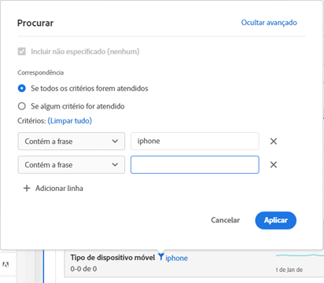

# Paginação, filtragem e classificação de tabelas

Para obter uma visão geral das tabelas de paginação, filtragem e classificação no Analysis Workspace, assista a este tutorial em vídeo:

>[!VIDEO](https://video.tv.adobe.com/v/23968)

## Opções de filtragem avançadas {#section_36E92E31442B4EBCB052073590C1F025}

Clicar no ícone de filtro e, em seguida, em **[!UICONTROL Mostrar avançado]** próximo a uma dimensão em uma tabela de forma livre permite filtrar usando os critérios a seguir. É possível aplicar várias regras de filtragem.

* Contém
* Não contém
* Contém todos os termos
* Contém qualquer termo
* Contém a frase
* Não contém nenhum termo
* Não contém a frase
* Igual a
* Não é igual
* Começa com
* Termina com

## Classificação de dimensões em tabelas de forma livre

>[!NOTE]
>
>A classificação de dimensões aplica-se somente às tabelas de forma livre no Customer Journey Analytics, não no Adobe Analytics tradicional. A classificação de métricas pode ser feita nas duas as versões do Analytics.

1. Em qualquer tabela de forma livre de um projeto, clique na seta ao lado do nome da dimensão:

* A seta para baixo classifica em ordem decrescente e a seta para cima (padrão), em ordem crescente.
* É possível classificar dimensões alfabeticamente ou numericamente. Por exemplo, pode ser que você tenha etapas numeradas em um fluxo de trabalho e deseje classificar pelo número da etapa. É possível classificar uma dimensão por data. Ou você pode classificar as fontes de dados em ordem alfabética, como na captura de tela acima.
