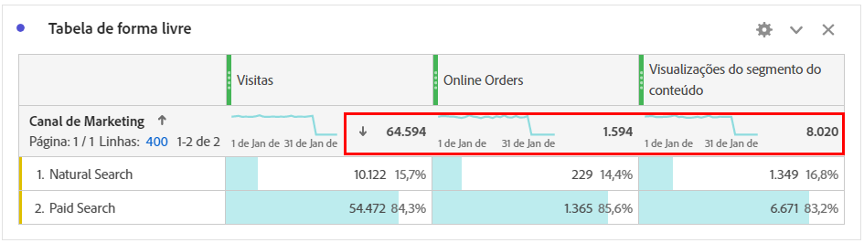

# Totais {#workspace-totals}

>[!CONTEXTUALHELP]
>id="workspace_freeformtable_grandtotal"
>title="Total geral"
>abstract="O total geral não é compatível com tabelas e detalhamentos com linhas estáticas."

Nas Tabelas de forma livre, aparece uma linha total em cada nível de detalhamento, que pode mostrar dois totais:

* **[!UICONTROL Total da tabela]** ➊ - Normalmente esse total é uma parte do [!UICONTROL Total geral] ou igual a ele. O total reflete todos os segmentos de tabela aplicados dentro da tabela de forma livre, incluindo a opção [!UICONTROL Incluir nenhum].
* **[!UICONTROL Total geral]** (**[!UICONTROL de]** *número*) ➋ - Esse total representa todos os eventos que foram coletados. Quando um segmento é aplicado no nível do painel ou na tabela de forma livre, esse total é ajustado para refletir todos os eventos que correspondem aos critérios do segmento.

## Exibir totais

Em  **[!UICONTROL Configurações de coluna]**, há opções para **[!UICONTROL Mostrar totais]** e **[!UICONTROL Mostrar total geral]**. Se essas configurações não estiverem marcadas, os totais serão removidos da tabela, o que pode ser desejado em casos em que os totais não fazem sentido.

Em uma tabela de forma livre que contém [linhas estáticas](/help/analysis-workspace/visualizations/freeform-table/column-row-settings/manual-vs-dynamic-rows.md), os totais se comportam de maneira diferente. E são controlados usando  **[!UICONTROL Configurações de Linha]**.

| Opção | Descrição |
|---|---|
| **[!UICONTROL Mostrar a soma das linhas atuais como total]** | Exibe uma soma do lado do cliente das linhas na tabela. Este total **não** elimina a duplicação de métricas como sessões ou pessoas. |
| **[!UICONTROL Exibir total geral]** | Mostrar uma soma do lado do servidor. Esse total remove a duplicação de métricas como sessões ou pessoas. |

Consulte [Itens de dimensão dinâmicos vs. estáticos em tabelas de forma livre](column-row-settings/manual-vs-dynamic-rows.md).

## Perguntas frequentes

| Perguntas | Resposta |
|---|---|
| Em qual *total* as porcentagens da coluna cinza se baseiam? | Este *total* depende da seleção da configuração de **[!UICONTROL Porcentagens]** em **[!UICONTROL Configurações de linha]**:<ul><li>Calcular porcentagens por coluna. Esta configuração é a padrão. As porcentagens são baseadas no total da tabela.</li><li>Calcular porcentagens por linha: as porcentagens são baseadas no total geral.</li></ul> |
| Como a configuração **[!UICONTROL Incluir “Nenhum valor”]** afeta os totais? | Se a configuração **[!UICONTROL Incluir “Nenhum valor”]** estiver desmarcada, a linha **[!UICONTROL Nenhum valor]** será removida da tabela, do total da tabela e será transferida para quaisquer métricas calculadas que usem tipos de métricas de [*Total*](/help/components/calc-metrics/cm-workflow/m-metric-type-alloc.md). |
| Quando segmentos de tabela personalizados são aplicados a uma tabela de forma livre, todas as minhas métricas calculadas e a formatação condicional são consideradas para o segmento? | No momento não. A opção **[!UICONTROL Incluir “Nenhum valor”]** é considerada, mas os segmentos de tabela personalizados não afetam o seguinte:<ul><li>O intervalo máximo/mínimo da coluna que a formatação condicional usa analisa todos os dados.</li><li>Métricas calculadas que alavancam os tipos de métricas **[!UICONTROL Total geral]**.</li><li>As métricas calculadas com funções que calculam várias linhas em uma tabela de forma livre: Soma da coluna, Máx. da coluna, Mín. da coluna, Contagem, Média, Mediana, Percentil, Quartil, Contagem de linhas, Desvio padrão, Variância, Cumulativo, Média cumulativa, Variantes de regressão, Pontuação T, Teste T, Pontuação Z e Teste Z.</li></ul> |
| Em Métricas calculadas, o que o tipo de métrica **[!UICONTROL Total geral]** reflete? | **[!UICONTROL Total geral]** continua a se referir ao **[!UICONTROL Total geral]** e não reflete segmentos aplicados a uma tabela ou ao **[!UICONTROL Total da tabela]**. |
| Qual total é mostrado quando os dados são copiados e colados de uma tabela de forma livre ou baixados via CSV? | A linha total reflete apenas o **[!UICONTROL Total da tabela]** e respeita a configuração da coluna **[!UICONTROL Mostrar totais]**. |
