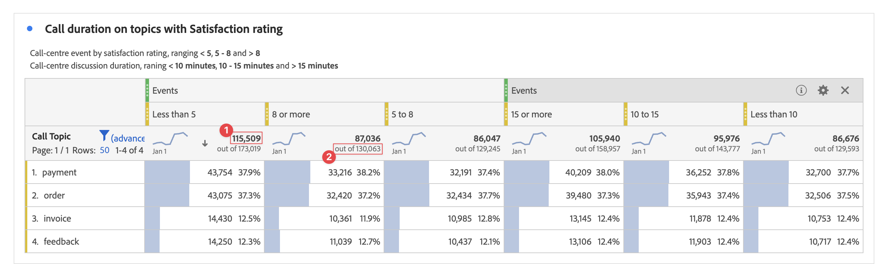

# Totais do Workspace {#workspace-totals}

<!-- markdownlint-disable MD034 -->

>[!CONTEXTUALHELP]
>id="cja_workspace_freeformtable_grandtotal"
>title="Total geral"
>abstract="O total geral não é compatível com tabelas e detalhamentos com linhas estáticas."

<!-- markdownlint-enable MD034 -->

Nas Tabelas de forma livre, aparece uma linha total em cada nível de detalhamento, que pode mostrar dois totais:

* **[!UICONTROL Total da tabela]** ➊ - Normalmente esse total é uma parte do [!UICONTROL Total geral] ou igual a ele. O total reflete todos os filtros de tabela aplicados na tabela de forma livre, incluindo a opção [!UICONTROL Não incluir].
* **[!UICONTROL Total geral]** (**[!UICONTROL de]** *número*) ➋ - Esse total representa todos os eventos que foram coletados. Quando um filtro é aplicado no nível do painel ou na tabela de forma livre, esse total é ajustado para refletir todos os eventos que correspondem aos critérios do filtro.

## Exibir totais

Em  **[!UICONTROL Configurações de coluna]**, há opções para **[!UICONTROL Mostrar totais]** e **[!UICONTROL Mostrar total geral]**. Se essas configurações estiverem desmarcadas, os totais serão removidos da tabela, o que pode ser desejado nos casos em que os totais não fazem sentido.

Os totais de [linhas estáticas](/help/analysis-workspace/visualizations/freeform-table/column-row-settings/manual-vs-dynamic-rows.md) se comportam de maneira diferente e são controlados usando  **[!UICONTROL Configurações de linha]**.

| Opção | Descrição |
|---|---|
| **[!UICONTROL Mostrar a soma das linhas atuais como total]** | Mostrar uma soma das linhas da tabela do lado do cliente. Este total **não** remove a duplicação de métricas como sessões ou pessoas. |
| **[!UICONTROL Mostrar total geral]** | Mostrar uma soma do lado do servidor. Esse total remove a duplicação de métricas como sessões ou pessoas. |

Consulte [Itens de dimensão dinâmicos vs estáticos em tabelas de forma livre](column-row-settings/manual-vs-dynamic-rows.md).

## Perguntas frequentes

| Perguntas | Resposta |
|---|---|
| Em quais *totais* as porcentagens da coluna cinza se baseiam? | Este *total* depende da seleção da configuração **[!UICONTROL Porcentagens]** em **[!UICONTROL Configurações de Linha]**:<ul><li>Calcular porcentagens por coluna: essa configuração é o padrão. As porcentagens se baseiam no total da Tabela.</li><li>Calcular porcentagens por linha: as porcentagens baseiam-se no total geral.</li></ul> |
| Como a configuração **[!UICONTROL Incluir &quot;Nenhum valor&quot;]** afeta os totais? | Se a configuração **[!UICONTROL Incluir &quot;Nenhum valor&quot;]** estiver desmarcada, a linha **[!UICONTROL Nenhum valor]** será removida da tabela, do Total da tabela, e continuará para qualquer métrica calculada que use [*Total* tipos de métrica](/help/components/calc-metrics/cm-workflow/m-metric-type-alloc.md). |
| Quando os filtros de tabela personalizados são aplicados a uma tabela de forma livre, todas as minhas métricas calculadas e minha formatação condicional são consideradas para o filtro? | No momento não. **[!UICONTROL Incluir &quot;Nenhum valor&quot;]** é a conta para, mas os filtros de tabela personalizados não afetam os seguintes:<ul><li>O intervalo máximo/mínimo da coluna que a formatação condicional usa pesquisa em todos os dados.</li><li>As métricas calculadas que usam o **[!UICONTROL Total geral]** tipos de métricas.</li><li>As métricas calculadas com funções que calculam várias linhas em uma tabela de forma livre: Soma da coluna, Máximo da coluna, Mín. da coluna, Contagem, Média, Mediana, Percentual, Quartil, Contagem de linhas, Desvio padrão, Variação, Cumulativo, Média Cumulativa, Variantes de regressão, Pontuação T, Teste T, Pontuação Z e Teste Z.</li></ul> |
| Em Métricas calculadas, o que o tipo de métrica **[!UICONTROL Total geral]** reflete? | **[!UICONTROL Total geral]** continua se referindo ao **[!UICONTROL Total geral]** e não reflete os filtros aplicados a uma tabela ou ao **[!UICONTROL Total da tabela]**. |
| Qual total é mostrado quando os dados são copiados e colados de uma tabela de forma livre ou baixados via CSV? | A linha total reflete somente o **[!UICONTROL Total da tabela]** e respeita a configuração da coluna **[!UICONTROL Mostrar totais]**. |
