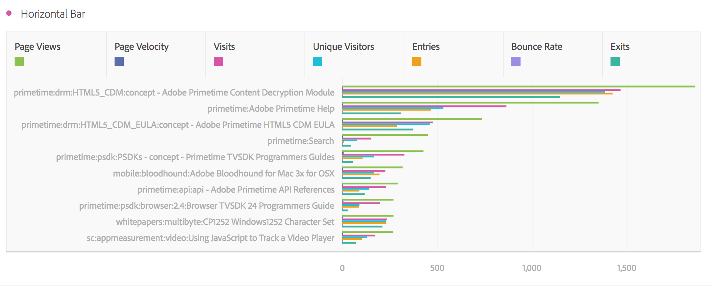

# Barra horizontal e Barra horizontal empilhada

## Barra horizontal {#section_73A4D6F6C8864045A97B0B32B5FFFEDB}

Esta visualização mostra barras horizontais que representam vários valores de uma ou mais métricas.

## Barra horizontal empilhada {#section_50C08E9E20A94024A6553BC352ADB597}

Esta visualização se parece com o [!UICONTROL Gráfico de barra horizontal], mas as barras de série aparecem empilhadas.

A configuração de visualização [!UICONTROL Barra horizontal empilhada] nas visualizações de barra empilhada transforma o gráfico em uma visualização 100% empilhada:

