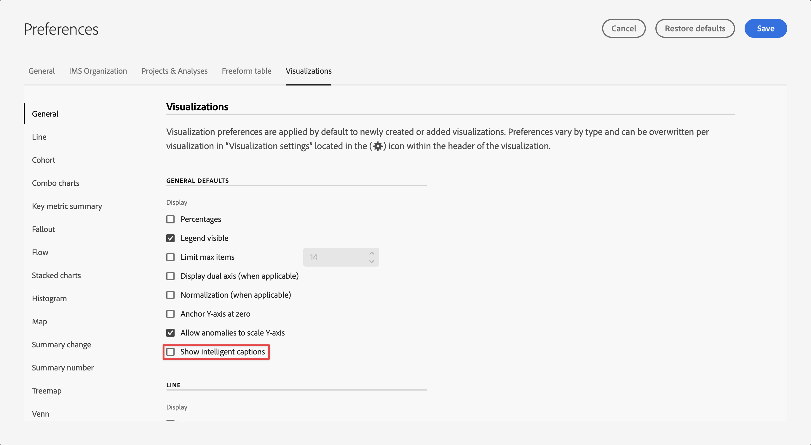

# Legendas inteligentes {#intelligent-captions}

<!-- markdownlint-disable MD034 -->

>[!CONTEXTUALHELP]
>id="workspace_intelligentcaptions_area"
>title="Legendas inteligentes: área"
>abstract="Gere insights em formato de linguagem natural para ajudar a entender e interpretar dados nessa visualização mais facilmente."

<!-- markdownlint-enable MD034 -->

<!-- markdownlint-disable MD034 -->

>[!CONTEXTUALHELP]
>id="workspace_intelligentcaptions_bar"
>title="Legendas inteligentes: barra"
>abstract="Gere insights em formato de linguagem natural para ajudar a entender e interpretar dados nessa visualização mais facilmente."

<!-- markdownlint-enable MD034 -->

<!-- markdownlint-disable MD034 -->

>[!CONTEXTUALHELP]
>id="workspace_intelligentcaptions_donut"
>title="Legendas inteligentes: rosquinha"
>abstract="Gere insights em formato de linguagem natural para ajudar a entender e interpretar dados nessa visualização mais facilmente."

<!-- markdownlint-enable MD034 -->

<!-- markdownlint-disable MD034 -->

>[!CONTEXTUALHELP]
>id="workspace_intelligentcaptions_horizontalbar"
>title="Legendas inteligentes: barra horizontal"
>abstract="Gere insights em formato de linguagem natural para ajudar a entender e interpretar dados nessa visualização mais facilmente."

<!-- markdownlint-enable MD034 -->

<!-- markdownlint-disable MD034 -->

>[!CONTEXTUALHELP]
>id="workspace_intelligentcaptions_line"
>title="Legendas inteligentes: linha"
>abstract="Gere insights em formato de linguagem natural para ajudar a entender e interpretar dados nessa visualização mais facilmente."

<!-- markdownlint-enable MD034 -->

<!-- markdownlint-disable MD034 -->

>[!CONTEXTUALHELP]
>id="workspace_intelligentcaptions_fallout"
>title="Legendas inteligentes: fallout"
>abstract="Gere insights em formato de linguagem natural para ajudar a entender e interpretar dados nessa visualização mais facilmente."

<!-- markdownlint-enable MD034 -->

<!-- markdownlint-disable MD034 -->

>[!CONTEXTUALHELP]
>id="workspace_intelligentcaptions_flow"
>title="Legendas inteligentes: fluxo"
>abstract="Gere insights em formato de linguagem natural para ajudar a entender e interpretar dados nessa visualização mais facilmente."

<!-- markdownlint-enable MD034 -->

A funcionalidade de Legendas inteligentes usa IA gerativa avançada para fornecer insights essenciais para as visualizações do Workspace usadas com mais frequência em linguagem natural.

As legendas inteligentes são voltadas para:

* Analistas, que precisam de narrativas para compartilhar com outros usuários. Os analistas precisam desses insights para fornecer contexto aos usuários.
* Usuários empresariais, que desejam descobrir rapidamente as soluções de alto nível.

>[!BEGINSHADEBOX]

Consulte  [Legendas inteligentes](https://video.tv.adobe.com/v/3420131/?quality=12&learn=on){target="_blank"} para ver um vídeo de demonstração.

>[!ENDSHADEBOX]

## Iniciar legendas inteligentes {#launch}

Para iniciar legendas inteligentes geradas automaticamente em uma visualização, selecione  na parte superior direita da visualização. Essa seleção gera insights de linguagem natural.

Lembre-se:

* Você precisa de no mínimo 3 pontos de dados para gerar legendas com êxito. Caso contrário, você poderá receber um erro como **[!UICONTROL Dados insuficientes para analisar]**.

* As legendas são geradas sempre que os dados subjacentes selecionados são alterados na tabela que habilita a visualização.

* Se houver várias métricas em uma tabela de forma livre associada, as legendas serão geradas apenas para a primeira métrica ou para a métrica selecionada no momento pelo usuário. No entanto, as legendas podem ser geradas para várias métricas para as visualizações de linha e área.

* Se você salvar o projeto em um ponto específico e recarregá-lo posteriormente, as legendas serão atualizadas automaticamente com novos dados. O mesmo se aplica a projetos agendados e arquivos de PDF exportados de um projeto.

## Visualizações {#visualizations}

As legendas inteligentes são compatíveis com as seguintes visualizações:

* [Linha](line.md) (incluindo várias linhas)
* [Barra](bar.md)
* [Barra horizontal](horizontal-bar.md)
* [Área](area.md) (incluindo várias linhas de Área)
* [Rosca](donut.md)
* [Fallout](fallout/fallout-flow.md)
* [Fluxo](c-flow/flow.md)

<!--
Here is an example of what intelligent captions could look like:

-->

## Ações

Você pode executar as seguintes ações em legendas inteligentes:

### Copiar para área de transferência {#copy}

Você pode copiar as legendas para uma área de transferência e colá-las em um PowerPoint ou outras ferramentas. É possível copiar legendas individuais na exibição uma por uma ou copiar todas as legendas de uma só vez na exibição de legenda expandida.

* Para copiar as legendas, selecione  na parte superior direita da caixa de diálogo de legendas.

### Mostrar todas as legendas ou legendas inteligentes individuais  {#show-all-or-individual}

É possível mostrar todas as legendas inteligentes de uma só vez em uma exibição expandida, ou mostrar legendas inteligentes individuais em uma exibição individual.

* Para mostrar todas as legendas inteligentes, selecione .
* Para mostrar legendas inteligentes individuais, uma por uma, selecione .

### Editar exibição {#edit}

É possível editar a exibição de legendas, como ocultar ou reexibir uma categoria específica de insights.

1. Selecione  na caixa de diálogo Legendas inteligentes.

1. Alterne entre  para exibir um insight específico (como **[!UICONTROL Min]**) ou  para ocultar um insight específico (como **[!UICONTROL Spike]**).

   

1. Selecione **[!UICONTROL Aplicar]**.

### Fornecer feedback

Você pode fornecer feedback sobre as legendas inteligentes geradas (feedback só pode ser fornecido na exibição de legenda expandida).

1. Selecione  na caixa de diálogo Legendas inteligentes.

1. Selecione  **[!UICONTROL Boa resposta]**,  **[!UICONTROL Resposta incorreta]** ou  **[!UICONTROL Relatório]**.

1. Na caixa de diálogo **[!UICONTROL Obrigado por seus comentários]**, forneça seus comentários e selecione **[!UICONTROL Enviar]** para enviar os comentários.

### Exportar {#export}

É possível exportar legendas inteligentes como parte de um PDF, desde que o projeto seja salvo com as legendas inteligentes geradas.

### Ativar/desativar {#toggle}

Se você preferir não mostrar legendas inteligentes, é possível desativar o recurso.

1. Vá para [Preferências de visualização](/help/analysis-workspace/user-preferences.md#visualizations-preferences).
1. Desmarque **[!UICONTROL Mostrar legendas inteligentes]**.

   

1. Selecione **[!UICONTROL Salvar]** para salvar a preferência.

## Legendas inteligentes em cartões de pontuação móveis

As legendas inteligentes também estão disponíveis nos [cartões de pontuação móveis](https://experienceleague.adobe.com/pt-br/docs/analytics-platform/using/cja-dashboards/manage-scorecard#captions) do Customer Journey Analytics.

## Acesso ao recurso

Os parâmetros a seguir controlam o acesso a legendas inteligentes:

* **Acesso à solução**: o recurso Legendas inteligentes está disponível no Customer Journey Analytics, mas não no Adobe Analytics.

* **Acesso contratual**: se você não puder usar as legendas inteligentes, entre em contato com o administrador da sua organização ou com o representante de conta do Adobe (Admin). Antes de usar legendas inteligentes em sua organização, você deve concordar com determinados termos legais relacionados à IA gerativa.

* **Permissões**: no [!UICONTROL Adobe Admin Console], a permissão [!UICONTROL Ferramentas de Relatório] **[!UICONTROL Legendas inteligentes]** determina o acesso. Um [administrador de perfil de produto](https://helpx.adobe.com/br/enterprise/using/manage-product-profiles.html) precisa seguir estas etapas no [!UICONTROL Admin Console]:
   1. Navegue até **[!UICONTROL Admin Console]** > **[!UICONTROL Produtos e serviços]** > **[!UICONTROL Customer Journey Analytics]** > **[!UICONTROL Perfis de Produtos]**.
   1. Selecione o título do perfil de produto para o qual você deseja fornecer acesso às legendas inteligentes.
   1. No perfil de produto específico, selecione **[!UICONTROL Permissões]**.
   1. Selecione  para editar as **[!UICONTROL Ferramentas de Relatório]**.
   1. Selecione  para adicionar **Legendas inteligentes** a **[!UICONTROL itens de permissão incluídos]**.

      

   1. Selecione **[!UICONTROL Salvar]** para salvar as permissões.

Consulte [Controle de acesso](/help/technotes/access-control.md#access-control) para obter mais informações.
