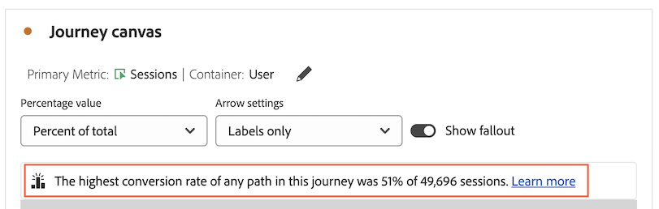
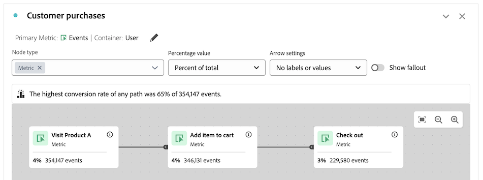

# Visão geral da tela da jornada {#journey-canvas-overview}

<!-- markdownlint-disable MD034 -->

>[!CONTEXTUALHELP]
>id="cja_journeycanvas_button"
>title="Tela de jornada"
>abstract="Mostra como as pessoas avançam ou abandonam uma série de pontos de contato. Use para jornadas com vários pontos de entrada e caminhos ou para analisar jornadas criadas no Journey Optimizer."

<!-- markdownlint-enable MD034 -->

<!-- markdownlint-disable MD034 -->

>[!CONTEXTUALHELP]
>id="cja_journeycanvas_panel"
>title="Tela de jornada"
>abstract="Analise como as pessoas avançam ou abandonam uma jornada definida. Crie análises de jornadas de usuários criando um gráfico flexível de nós e setas que represente qualquer combinação de eventos, itens de dimensão e segmentos. Arraste nós na tela para reorganizar os eventos e as condições da jornada. À medida que você faz isso, os dados são atualizados de acordo.   Os clientes com acesso ao Adobe Journey Optimizer podem analisar jornadas existentes do Journey Optimizer."

<!-- markdownlint-enable MD034 -->

<!-- markdownlint-disable MD034 -->

>[!CONTEXTUALHELP]
>id="journeycanvas_button"
>title="Tela de jornada"
>abstract="Mostra como as pessoas avançam ou abandonam uma série de pontos de contato. Use para jornadas com vários pontos de entrada e caminhos ou para analisar jornadas criadas no Journey Optimizer."

<!-- markdownlint-enable MD034 -->

<!-- markdownlint-disable MD034 -->

>[!CONTEXTUALHELP]
>id="journeycanvas_panel"
>title="Tela de jornada"
>abstract="Analise como as pessoas avançam ou abandonam uma jornada definida. Crie análises de jornadas de usuários criando um gráfico flexível de nós e setas que represente qualquer combinação de eventos, itens de dimensão e segmentos. Arraste nós na tela para reorganizar os eventos e as condições da jornada. À medida que você faz isso, os dados são atualizados de acordo.   Os clientes com acesso ao Adobe Journey Optimizer podem analisar jornadas existentes do Journey Optimizer."

<!-- markdownlint-enable MD034 -->

>[!BEGINSHADEBOX]

_Este artigo documenta a Visualização de tela da jornada no_  _**Customer Journey Analytics**. Não há visualização equivalente no **Adobe Analytics**._

>[!ENDSHADEBOX]

A Visualização de tela da jornada permite analisar e obter insights profundos sobre as jornadas fornecidas aos usuários e clientes. Ela permite definir uma jornada do zero ou visualizar uma no Journey Optimizer e então observar como as pessoas saíram ou continuaram na jornada.

Você pode [criar análises de jornadas do usuário](/help/analysis-workspace/visualizations/journey-canvas/configure-journey-canvas.md) usando qualquer combinação de eventos, itens de dimensão, segmentos e intervalos de datas para criar nós de jornada. Conecte os nós para criar o fluxo da jornada e incluir vários caminhos e pontos de decisão. Arraste nós na tela para reorganizar os eventos e as condições da jornada. Atualizações de dados em tempo real à medida que você faz alterações.

[Os nós estão conectados](/help/analysis-workspace/visualizations/journey-canvas/configure-journey-canvas.md#logic-when-connecting-nodes) como um &quot;caminho eventual&quot;, o que significa que os visitantes são contados enquanto eventualmente se movem de um nó para outro, independentemente de qualquer evento que ocorra entre os dois nós. O tempo alocado para que os usuários percorram o caminho é determinado pela configuração do container.

## Recursos principais

Os recursos principais da Visualização de tela da jornada incluem:

* Análise profunda de fallout e fallthrough que acomoda as jornadas de usuário mais complexas.

* Uma tela para mapear e visualizar os vários pontos de entrada, nós e caminhos de uma jornada de usuário.

* Interações de arrastar e soltar para adicionar componentes à tela e para reposicionar nós existentes.

* A opção de criar análises de jornadas do usuário na tela da jornada ou de criá-las automaticamente com base nas jornadas do Journey Optimizer.

## Possíveis insights

A tela da jornada fornece insights acionáveis para as jornadas mais complexas.

### Caminho com a taxa de conversão mais alta {#conversion-rate-caption}

O insight mais proeminente na tela da jornada é mostrado como uma legenda na parte superior da tela.

Esta legenda resume qual caminho, de todos os caminhos na jornada, tem a taxa de conversão mais alta.

Quando a jornada contém vários nós iniciais, a legenda tem esta aparência:

Quando a jornada contém um único nó inicial, a legenda tem esta aparência:

Considere o seguinte ao interpretar esta legenda:

* Um _caminho_ é definido como um nó inicial que é conectado por setas a um nó final, com qualquer número de nós conectados entre eles.

* O cálculo da taxa de conversão depende do tipo de jornada (o número de nós iniciais e finais contidos na jornada e se os caminhos se cruzam entre eles).

  A tabela a seguir descreve como as taxas de conversão são calculadas com base no tipo de jornada:

  | Tipo de jornada | Cálculo da taxa de conversão | Exemplo |
  |---------|----------|---------|
  | **Um único nó inicial e um único nó final** | A taxa de conversão é calculada dividindo o número do nó final pelo do nó inicial. |  |
  | **Um único nó inicial e vários nós finais** | A taxa de conversão é calculada localizando o nó final com o número mais alto e dividindo esse número pelo do nó inicial. |  |
  | **Vários caminhos independentes, com cada caminho contendo um único nó inicial e um único nó final** | A taxa de conversão é calculada dividindo o número do nó final pelo do nó inicial. O caminho com a taxa de conversão mais alta está descrito na legenda. |  |
  | **Vários nós iniciais que em qualquer ponto da jornada convergem em um nó comum** | A taxa de conversão é calculada localizando o nó final com o número mais alto e dividindo esse número pelo do nó inicial com o número mais baixo. |  |

### Fallthrough, Fallout e outros

A seguir estão alguns exemplos de outros insights que a tela da jornada pode ajudar a fornecer. É possível escolher se esses insights são baseados em todas as pessoas na exibição de dados, todas as pessoas que iniciaram a jornada ou todas as pessoas do nó anterior da jornada.

#### Falha

* O número e a porcentagem de pessoas que concluíram a jornada (chegou ao nó final)

* O número e a porcentagem de pessoas que chegaram a um determinado nó da jornada

* A etapa mais comum que veio antes ou após um determinado nó da jornada

#### Fallout

* Os nós da jornada em que mais frequentemente as pessoas a abandonam (nunca chegam a nenhum dos nós seguintes imediatos)

#### Dados adicionais para cada nó

* Adicione uma dimensão de detalhamento em qualquer nó da jornada para visualizar dados adicionais desse nó específico

## Escolha entre as Visualizações de tela da jornada, fallout ou fluxo.

A Visualização de tela da jornada é semelhante à [Visualização de fallout](/help/analysis-workspace/visualizations/fallout/fallout-flow.md) e à [Visualização de fluxo](/help/analysis-workspace/visualizations/c-flow/flow.md), mas possui diferenças importantes.

### Entenda as diferenças

<!-- Information in this snippet is shared between Journey canvas, Fallout, and Flow visualization docs -->

{{journey-visualization-comparisons}}

### Quando usar a tela da jornada

A tela da jornada é essencial para:

* Análise de fallout envolvendo jornadas com vários pontos de entrada e caminhos.

* Jornadas não lineares com vários pontos de entrada e caminhos, com uma sequência predefinida de páginas.

* Análise ad hoc exploratória baseada em uma jornada predefinida.

* Análise que requer uma métrica principal diferente de Sessão, Pessoa ou Ocorrências.

* Análise mais profunda das jornadas originadas no Adobe Journey Optimizer.

Use [a tabela acima](#understand-the-differences) para entender as diferenças entre as Visualizações de tela da jornada, fallout e fluxo.

## Analisar as jornadas do Journey Optimizer

>[!NOTE]
>
>Se sua organização não tem acesso ao Journey Optimizer, ainda é possível [criar análises na tela da jornada](#build-analyses-in-customer-journey-analytics).

A análise de jornadas do Journey Optimizer na tela da jornada fornece insights profundos e acionáveis sobre como as pessoas interagem com uma jornada.

Ao analisar uma jornada do Journey Optimizer na tela da jornada, ela é exibida com a mesma ordem, sequência e estrutura que possui no Journey Optimizer. Se você fizer alterações significativas em uma jornada na tela da jornada, [as alterações não serão mais sincronizadas a partir do Journey Optimizer](#synchronization-between-journey-optimizer-and-journey-canvas).

### Benefícios da análise de jornadas do Journey Optimizer com a tela da jornada

A tela da jornada fornece uma análise profunda e completa que não é possível no Journey Optimizer.

Usar a tela da jornada para analisar jornadas que foram criadas no Journey Optimizer oferece vários benefícios:

* Crie eventos usando qualquer dimensão, métrica, segmento ou intervalo de datas do Customer Journey Analytics.

  No Journey Optimizer, um usuário técnico deve criar um evento antes que ele possa ser adicionado a uma jornada.

* Crie públicos-alvo com base em um nó personalizado que você criou (inicia o construtor de públicos-alvo do Customer Journey Analytics).

  No Journey Optimizer, é possível criar públicos-alvo somente para atividades predefinidas.

* Analise fallthrough e fallout

* Detalhe eventos com qualquer dimensão

* Combine eventos

* Conecte eventos

* Renomeie e exclua eventos

* Muito mais

### Sincronização entre a tela do Journey Optimizer e do Journey

Considere os seguintes comportamentos para entender a sincronização entre o Journey Optimizer e a tela do Jornada:

* **A sincronização de dados é apenas unidirecional**

  Depois de criar uma análise de uma jornada do Journey Optimizer na tela do Journey, os dados são sincronizados em apenas uma direção, do Journey Optimizer para a tela do Journey. Isso significa que as alterações feitas em uma jornada na tela do Journey nunca são refletidas no Journey Optimizer.

* **A modificação de uma jornada na tela de Jornada interrompe a sincronização**

  As alterações feitas em uma jornada no Journey Optimizer são sincronizadas com a tela de Jornada [apenas se a jornada não tiver sido modificada significativamente na tela de Jornada](#differences-after-modifying-a-journey-in-journey-canvas). Depois de modificar uma jornada na tela do Journey, as alterações feitas na jornada no Journey Optimizer não são refletidas na tela do Journey. Para ver as alterações refletidas na tela do Journey, você pode excluir e [recriar a jornada na tela do Journey](/help/analysis-workspace/visualizations/journey-canvas/configure-journey-canvas.md).

* **O uso do link &quot;Compartilhar com qualquer pessoa&quot; exige que o projeto seja salvo no Customer Journey Analytics depois que as alterações forem feitas no Journey Optimizer**

  Ao usar um link &quot;Compartilhar com qualquer pessoa&quot;, as alterações feitas no Journey Optimizer não são refletidas na tela do Jornada até que o projeto seja salvo no Customer Journey Analytics.

  Para obter mais informações sobre os links &quot;Compartilhar com qualquer pessoa&quot;, consulte [Compartilhar um projeto com qualquer pessoa (não é mais necessário)](/help/analysis-workspace/curate-share/share-projects.md#share-a-project-with-anyone-no-login-required) em [Compartilhar projetos](/help/analysis-workspace/curate-share/share-projects.md).

### Diferenças após modificar uma jornada na tela do Journey {#differences-after-modifying}

Depois de modificar uma jornada do Journey Optimizer na tela do Journey, podem ocorrer alterações no processamento de dados, nos recursos disponíveis e no comportamento de sincronização.

Se você fizer uma modificação significativa em uma jornada do Journey Optimizer na tela do Journey, poderão ocorrer alterações no processamento de dados, nos recursos disponíveis e no comportamento da sincronização. Uma modificação significativa inclui qualquer uma das seguintes opções:

* Adicionar ou remover um nó

* Adicionar ou remover uma seta entre nós

* Alterar os componentes em um nó

Se você fizer outras alterações em uma jornada do Journey Optimizer na tela do Journey, como arrastar um nó ou adicionar um detalhamento, as diferenças descritas nas seções a seguir não se aplicam.

>[!NOTE]
>
>Para retornar a jornada ao estado original, pressione Ctrl+z depois de fazer a primeira alteração na tela do Journey. Ou você pode excluir e [recriar a jornada na tela do Journey](/help/analysis-workspace/visualizations/journey-canvas/configure-journey-canvas.md)

#### Diferenças no processamento de dados

Depois de modificar uma jornada do Journey Optimizer na tela do Journey, você pode notar alterações nos dados se a jornada contiver métricas que têm modelos de atribuição não padrão.

Isso ocorre porque, ao contrário do Journey Optimizer, a tela do Journey permite aplicar várias dimensões em uma única jornada. Este recurso significa que não há compatibilidade para a [atribuição de métrica](/help/data-views/component-settings/attribution.md).

#### Diferenças nos recursos

Depois de modificar uma jornada Journey Optimizer na tela de Jornada, as opções disponíveis no campo suspenso [!UICONTROL **Configurações de seta**] são alteradas, dependendo de suas modificações. Para mais informações, consulte [Ajustar configurações](/help/analysis-workspace/visualizations/journey-canvas/configure-journey-canvas.md).

O campo [!UICONTROL **Tipo de nó**] está disponível somente no Journey Optimizer. Ele não está disponível ao visualizar uma jornada do Journey Optimizer na tela de jornada, independentemente de você fazer modificações na jornada na tela de jornada.

#### Diferenças de sincronização

As alterações feitas em uma jornada no Journey Optimizer serão sincronizadas com a tela de jornada somente se a jornada permanecer inalterada nessa tela.

Depois de modificar uma jornada do Journey Optimizer na tela de jornada, as alterações feitas na jornada no Journey Optimizer não serão refletidas na tela de jornada. Para ver as alterações refletidas na tela de jornada, você pode excluir e [recriar a jornada na tela de jornada](/help/analysis-workspace/visualizations/journey-canvas/configure-journey-canvas.md).

### Diferenças de terminologia entre o Journey Optimizer e o Customer Journey Analytics

Certos termos que significam uma coisa no Journey Optimizer significam outra coisa no Customer Journey Analytics. Ao usar a tela de jornada, os termos do Customer Journey Analytics são usados.

| Termo | Tela de jornada | Journey Optimizer |
|---------|----------|---------|
| **Evento** | Uma das várias métricas padrão disponíveis no Customer Journey Analytics. Esta métrica conta itens como receita, assinaturas ou leads gerados.  | A categoria de atividade que aciona uma jornada personalizada, como uma compra online. |

### Analisar uma jornada do Journey Optimizer na tela de jornada

Para mais informações sobre como analisar uma jornada do Journey Optimizer na tela de jornada, consulte [Configurar uma visualização da tela de jornada](/help/analysis-workspace/visualizations/journey-canvas/configure-journey-canvas.md).

## Criar análises na tela de jornada

Você pode criar análises na tela de jornada com base em qualquer dimensão ou métrica disponível no Analysis Workspace. Ou você pode analisar jornadas que foram criadas no Journey Optimizer. Para  mais informações, consulte [Configurar uma visualização da tela de jornada](/help/analysis-workspace/visualizations/journey-canvas/configure-journey-canvas.md).

>[!MORELIKETHIS]
>
> * [Guia para Visualização da Tela de Jornada no Adobe Customer Journey Analytics](https://experienceleaguecommunities.adobe.com/t5/adobe-analytics-blogs/a-guide-to-journey-canvas-visualization-in-adobe-customer/ba-p/737857)

