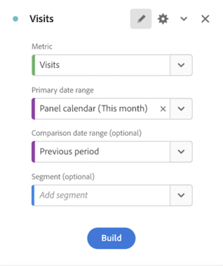

# Resumo da métrica principal

A visualização do [!UICONTROL Resumo da métrica principal] permite ver a tendência de uma métrica importante em um único período. Ela também permite comparar o desempenho da métrica em dois intervalos de tempo. Ela oferece os benefícios de várias visualizações combinadas em uma única visualização:

* Visualizações de **[!UICONTROL Linha]**, que mostram a tendência da métrica para os intervalos de datas principal e de comparação

* **[!UICONTROL Alteração percentual do resumo]**, que mostra o aumento ou a diminuição da métrica entre os intervalos de datas principal e de comparação

* Valor total atual ([!UICONTROL **número do resumo**]) para a métrica

## Casos de uso

Essa visualização aborda uma variedade de casos de uso comuns, incluindo:

* Um analista tentando entender como a criação de oportunidades parecia este mês em comparação com o mesmo período do ano passado.

* Um comerciante que explora como a geração de clientes potenciais para um tipo de cliente potencial específico mudou este mês em comparação com o mês anterior.

* Um executivo querendo entender como novas reservas mudaram este trimestre em comparação com o trimestre anterior.

## Configurar o resumo da métrica principal

1. Arraste a visualização do **[!UICONTROL Resumo da métrica principal]** do menu **[!UICONTROL Visualizações]** no painel à esquerda para um painel.

1. Configure a visualização selecionando uma métrica, um intervalo de datas principal, um intervalo de datas de comparação e um filtro (se desejar):

   

   | Configuração | Definição |
   | --- | --- |
   | **[!UICONTROL Métrica]** | Selecione a métrica que deseja examinar. Todas as métricas são compatíveis. |
   | **[!UICONTROL Intervalo de datas principal]** | O intervalo de datas atual da tabela de forma livre. |
   | **[!UICONTROL Intervalo de datas de comparação]** | O intervalo de datas no qual você deseja comparar o intervalo de datas principal. |
   | **[!UICONTROL Filtro (opcional)]** | Qualquer filtro em que você esteja interessado especificamente neste resumo. |

   {style="table-layout:auto"}

1. Clique em **[!UICONTROL Criar]**.

<!--## How the Key Metric Summary visualization handles the comparison date range

(This will probably release in January. Per Jaden Howell)

* If the primary date range is set to the panel date range, there are 2-6 options that are considered 'relative' to the primary date range. These usually include the previous period (same amount of time immediately proceeding the primary date range), and 52 weeks prior to that date range.

* If the comparison date range is set to one of the 'relative' options, upon updating the primary date range, the comparison date range updates to the period immediate preceding the panel date range.

* If your comparison date range is *not* set to a 'relative' option, then updating the panel date range changes your primary date range, but has no effect on the comparison date range.

**Example 1**

Primary date range is set to the panel's date range: 'Yesterday'
Comparison date range is set to a relative date range, one of: 'Previous day', 'Same day last week', 'Same day 4 weeks prior', 'Same day last month', 'Same day last year', or 'Same day 52 weeks prior'.
When I change the panel's date range to 'This month', the comparison date range will update to 'Previous month'.

**Example 2**
 
Primary date range is set to the panel's date range: 'Yesterday'
Comparison date range is set to a non-relative date range, such as 'Feb 2nd, 2022', 'Highest sales day', 'Last week', etc. 

>[!NOTE]
>
>Last week is relative to the day the project is opened on, but it is not based on the panel's date range of 'Yesterday'. In other cases, such as if the panel's date range was 'This week', it may be relative.

When you change the panel's date range to '4 days ago', the comparison date range remains at the previous selection. -->

## Visualizar a saída

Observe que:

* O gráfico de linhas do **[!UICONTROL Período anterior]** (sempre exibido em cinza) corresponde ao **[!UICONTROL Intervalo de datas de comparação]** na etapa de configuração.

* Se um intervalo de datas de comparação não for especificado durante a configuração ou estiver oculto nas configurações de visualização, somente o gráfico de linhas do intervalo de datas principal será exibido. A alteração do resumo ficará oculta.

* A partir daqui, você pode passar o mouse sobre os gráficos de linha para ver as estatísticas de dias individuais:

## Configurações de visualização

O resumo da métrica principal oferece várias configurações flexíveis para permitir gerar melhores relatórios e comunicações sobre métricas importantes. As configurações podem ser acessadas por meio do ícone de engrenagem no canto superior direito da visualização.

| Configuração | Descrição |
| --- | --- |
| **[!UICONTROL Enfatizar a variação percentual]** | Exibir a alteração de resumo em negrito de destaque no centro da visualização |
| **[!UICONTROL Enfatizar o valor do número]** | Exibir o número do resumo em negrito de destaque no centro da visualização |
| **[!UICONTROL Legenda visível]** | Mostrar ou ocultar a legenda na parte inferior da visualização |
| **[!UICONTROL Mostrar anotações]** | Mostrar ou ocultar anotações adicionadas por um administrador |
| **[!UICONTROL Mostrar linhas cintilantes]** | Mostrar ou ocultar gráficos de linha na parte inferior do gráfico. Quando ocultos, a legenda será alterada para não mais fazer referência visual às linhas |
| **[!UICONTROL Mostrar mínimo e máximo em gráficos sparkline]** | Mostrar ou ocultar valores mínimos e máximos em gráficos de linha primários e de comparação |
| **[!UICONTROL Mostrar comparação]** | Mostrar ou ocultar dados de comparação. Quando ocultos, o gráfico de linha de comparação e os objetos de alteração de resumo não serão exibidos. |
| **[!UICONTROL Mostrar número total]** | Mostrar ou ocultar o número do resumo |
| **[!UICONTROL Mostrar diferença bruta]** | Mostrar ou ocultar diferença bruta entre o valor total da métrica no intervalo de datas principal e o intervalo de datas secundário |
| **[!UICONTROL Abreviar valor]** | Abreviar valores de números para simplificar os insights comunicados (por exemplo, 20.000 -> 20K) |

## Editar visualização

Após criar a visualização, ainda é possível editar a configuração original.

1. Clique no ícone de lápis no canto superior direito da visualização (ao lado do ícone de engrenagem de configurações).

   

   Você será levado de volta à visualização da configuração original.

1. Altere a métrica, o intervalo de datas principal, o intervalo de datas de comparação ou o filtro, como preferir.
